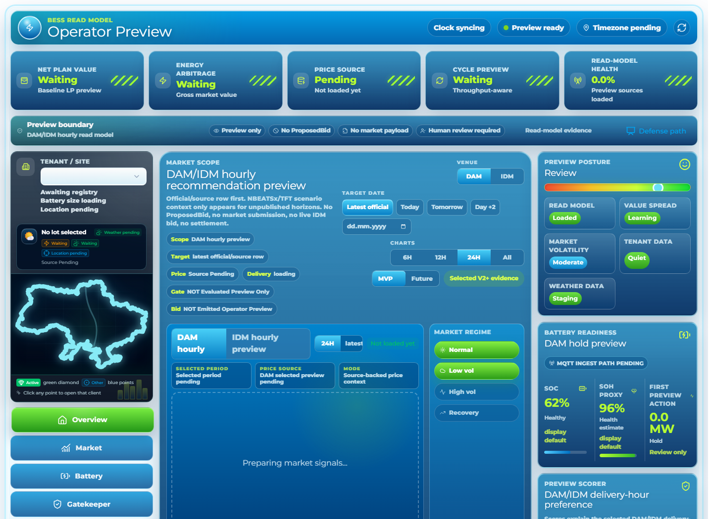
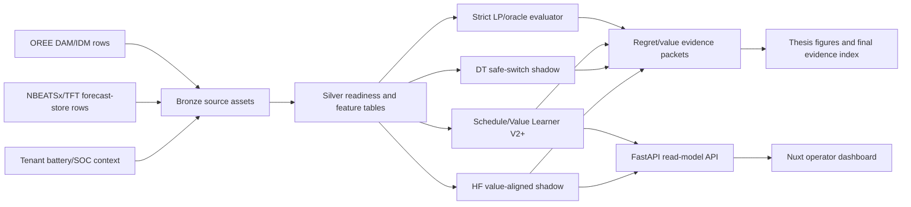

# Smart Energy Arbitrage 2026

Commission-ready operator-preview system for Ukrainian BESS energy arbitrage.

This repository implements a source-backed DAM/IDM hourly recommendation
preview for a human BESS operator. It combines a Dagster/FastAPI/Postgres
backend, a Nuxt operator dashboard, deterministic LP/V2+ evidence, and guarded
DT/HF shadow research. It is not a trading bot, not a market-submission engine,
and not production dispatch.



## What It Proves

The defendable product surface is an evidence system, not autonomous execution.

| Layer | Current result | Status |
| --- | ---: | --- |
| Strict LP/oracle comparator | 310.58 UAH mean regret | evaluator, not UI default |
| V2 forecast selector | 206.37 UAH mean regret | historical baseline |
| Schedule/Value Learner V2+ | 174.77 UAH mean regret | headline/default evidence |
| DT/V2+ safe-switch | 168.16 UAH mean regret, 4 switches / 86 abstentions | secondary shadow evidence |
| HF value-aligned shadow | 158.71 UAH frozen mean regret signal, 20/32 non-fallback days, 8/8 readiness | manual shadow/demo preview |

Boundary: `market_execution_enabled=false`, no `ProposedBid`, no market order
payload, no production LP replacement, and no V13 training claim.
The canonical scope document is
[docs/technical/CURRENT_GOAL_BOUNDARY_V13.md](docs/technical/CURRENT_GOAL_BOUNDARY_V13.md).

## Demo Path

1. Start the local stack.
2. Open `/operator`.
3. Select tenant `client_003_dnipro_factory`.
4. Select DAM or IDM.
5. Compare `latest official`, `today`, `tomorrow`, and `day+2`.
6. Point to the first-viewport boundary strip: preview only, no `ProposedBid`,
   no market payload, human review required.
7. Select `HF live safe-switch value-aligned shadow`.
8. Show one non-HOLD preview and one guarded HOLD/abstention.
9. End with the boundary: preview/read model only, no market execution.

The full defense runbook is in
[docs/technical/FINAL_DEFENSE_RUNBOOK.md](docs/technical/FINAL_DEFENSE_RUNBOOK.md).

## Architecture



The dashboard renders recommendations, strategy evidence, readiness state, and
guardrails. It does not emit market bids or dispatch commands.

## Evidence Visuals

### Regret Ladder


### Architecture Progression


### HF Readiness Matrix


Curated evidence is indexed in
[docs/technical/FINAL_EVIDENCE_INDEX.md](docs/technical/FINAL_EVIDENCE_INDEX.md).

Final review helpers:

- [Metrics atlas](docs/technical/FINAL_METRICS_ATLAS.md)
- [Repository review checklist](docs/technical/FINAL_REVIEW_CHECKLIST.md)
- [Business value note](docs/technical/BUSINESS_VALUE_NOTE.md)
- [Demo asset folder](docs/technical/final-demo-assets/README.md)

## Quickstart

### Prerequisites

- Windows PowerShell
- Docker Desktop
- Python dependencies managed by `uv`
- Node.js/npm for the Nuxt dashboard
- Optional CUDA-capable GPU for heavier research runs

### Install

```powershell
uv sync --extra dev
npm -C dashboard install
```

Use `uv sync --all-extras` only for full SOTA forecast adapter refreshes or
heavy research materializations.

### Start The Demo Stack

```powershell
.\scripts\start-local-project.ps1 -ApiPort 8000 -DashboardPort 64163
```

Open:

- API health: [http://127.0.0.1:8000/health](http://127.0.0.1:8000/health)
- Operator dashboard: [http://127.0.0.1:64163/operator](http://127.0.0.1:64163/operator)
- Defense dashboard: [http://127.0.0.1:64163/defense](http://127.0.0.1:64163/defense)
- FastAPI docs: [http://127.0.0.1:8000/docs](http://127.0.0.1:8000/docs)
- Dagster: [http://127.0.0.1:3001](http://127.0.0.1:3001)
- MLflow: [http://127.0.0.1:5000](http://127.0.0.1:5000)

If a fresh dashboard returns `404` or `502` for current backend routes, suspect a
stale API on `:8000` first:

```powershell
docker compose stop api
.\api\start-dev.ps1 -Port 8000
```

For container-based API testing after route changes:

```powershell
docker compose up -d --build api
```

### Seed Forecast-Store Rows

Use these only when unpublished DAM/IDM preview horizons are missing:

```powershell
.\.venv\Scripts\python.exe scripts\materialize_operator_preview_forecast_store.py --market-venue DAM --horizon-hours 72 --nbeatsx-max-steps 1 --tft-max-epochs 1
.\.venv\Scripts\python.exe scripts\materialize_operator_preview_forecast_store.py --market-venue IDM --horizon-hours 72 --nbeatsx-max-steps 1 --tft-max-epochs 1
```

These rows keep
`claim_boundary=operator_preview_forecast_rows_not_market_execution` and
`market_execution_enabled=false`.

## API Reference

Local base URL: `http://127.0.0.1:8000`.

| Group | Endpoint examples | Purpose |
| --- | --- | --- |
| System | `GET /health` | process liveness |
| Tenants/weather | `GET /tenants`, `POST /weather/run-config`, `POST /weather/materialize` | tenant registry and upstream weather/source materialization |
| Operator preview | `GET /dashboard/operator-recommendation`, `GET /dashboard/baseline-lp-preview`, `GET /dashboard/shadow-recommendation-preview` | DAM/IDM hourly preview and manual shadow read models |
| Battery/safety | `GET /dashboard/battery-state`, `POST /dashboard/projected-battery-state`, `GET /dashboard/gatekeeper-validation-status` | SOC/SOH/projection and deterministic guardrail evidence |
| Research read models | `GET /dashboard/future-stack-preview`, `GET /dashboard/academic-mvp-readiness`, `GET /dashboard/decision-policy-preview` | thesis and strategy evidence surfaces |

The full endpoint contract is in
[docs/technical/API_ENDPOINTS.md](docs/technical/API_ENDPOINTS.md).

Example HF value-aligned shadow request:

```powershell
Invoke-RestMethod "http://127.0.0.1:8000/dashboard/shadow-recommendation-preview?tenant_id=client_003_dnipro_factory&preview_source=hf_live_safe_switch_value_aligned_shadow&market_venue=DAM&target_delivery_date=2026-06-04"
```

Required response guarantees:

- `market_execution_enabled=false`
- `promotion_gate_passed=false`
- `dt_lava_ready=false`
- no `proposed_bid`
- no market order payload

## Verification

Focused backend checks:

```powershell
.\.venv\Scripts\python.exe -m pytest -q tests\dfl\test_hf_live_safe_switch_preview.py tests\dfl\test_hf_value_aligned_forecast_readiness_audit.py tests\dfl\test_hf_live_safe_switch_value_aligned_promotion_proof.py tests\api\test_main.py -k "hf_live_safe_switch or shadow_recommendation_preview or hf_value_aligned"
```

Dashboard checks:

```powershell
npm -C dashboard run typecheck
npm -C dashboard run test:unit
npm -C dashboard run smoke:hf-value-aligned
```

Final repository audit:

```powershell
.\scripts\final_repo_audit.ps1 -SkipFullVerify -SkipSmoke
```

Full wrapper when runtime permits:

```powershell
.\.venv\Scripts\Activate.ps1
.\scripts\verify.ps1
```

## Repository Map

| Path | Purpose |
| --- | --- |
| `api/` | FastAPI app and dashboard endpoints |
| `dashboard/` | Nuxt operator and defense UI |
| `src/smart_arbitrage/` | Core Python package: data, DFL, gatekeeper, services |
| `scripts/` | Materializers, audits, smoke runs, demo helpers |
| `configs/` | Benchmark, calibration, V13, and research configs |
| `docs/technical/` | API, demo, architecture, boundary, and final evidence docs |
| `docs/thesis/` | Thesis chapters, figures, appendices, weekly reports, defense assets |
| `tests/` | Python tests for API, DFL, gatekeeper, resources, and research slices |

Generated outputs, runtime caches, local data, and build artifacts are ignored.
Curated submission artifacts should live under `docs/`.

## Claim Boundaries

Use precise project language:

| Do say | Do not say |
| --- | --- |
| DAM/IDM hourly recommendation preview | live trading bot |
| source-backed official/forecast context | synthetic price fallback |
| HF value-aligned shadow/read-model challenger | production controller |
| V2+ fallback/comparator remains default | HF replaced V2+ in production |
| LP-free live shadow request path | full LP replacement |
| no `ProposedBid`, no market payload | market-submittable bid engine |
| V13 is source-readiness/acquisition | V13 training passed |

## Troubleshooting

### HF Shows Only HOLD

This can be correct. HF only shows non-HOLD when the selected candidate passes
the value guard, tail-risk cap, deterministic safety checks, and SOC feasibility.
If a guard fails, the selected preview abstains to HOLD/V2+ fallback.

### Dashboard Says Price Context Is Missing

Check whether the selected venue/date has official rows or forecast-store rows.
Run the forecast materializer for DAM/IDM, then refresh the dashboard.

### Far-Future Date Blocks

Expected. Unsupported future dates should block cleanly instead of rendering
synthetic prices.

### Port Already In Use

```powershell
.\scripts\start-local-project.ps1 -ApiPort 8010 -DashboardPort 64164
```

## License And Academic Use

Original code is licensed under MIT. Thesis text, third-party papers, external
datasets, and generated presentation/media assets are governed by their source
terms unless explicitly stated otherwise. See [NOTICE.md](NOTICE.md).
