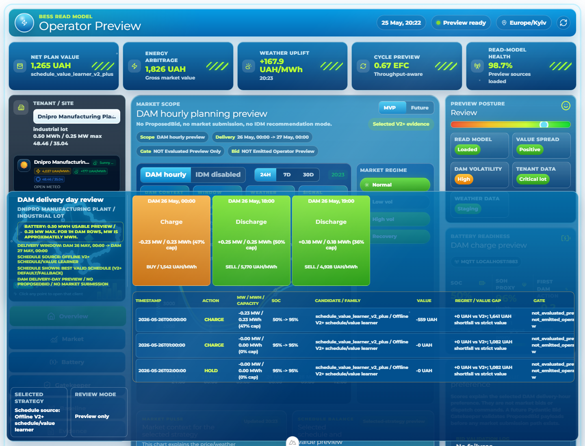
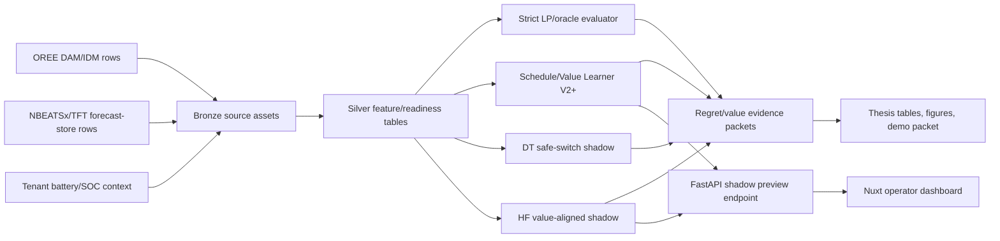
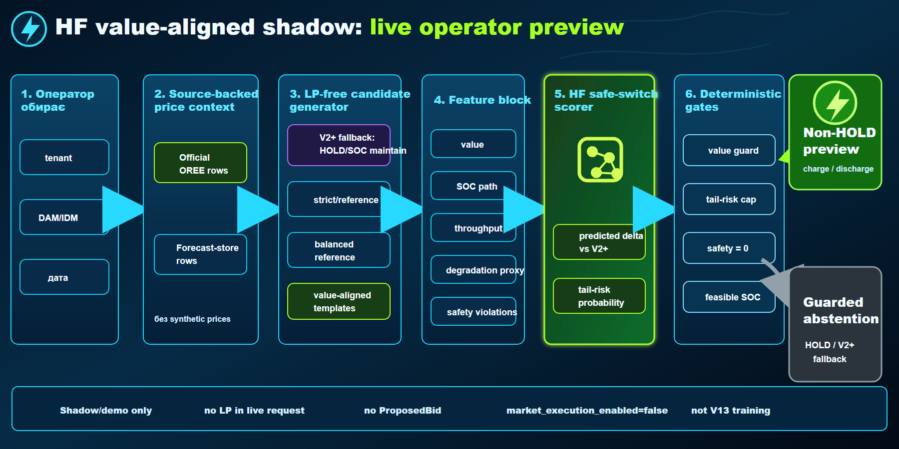
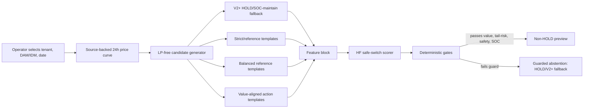
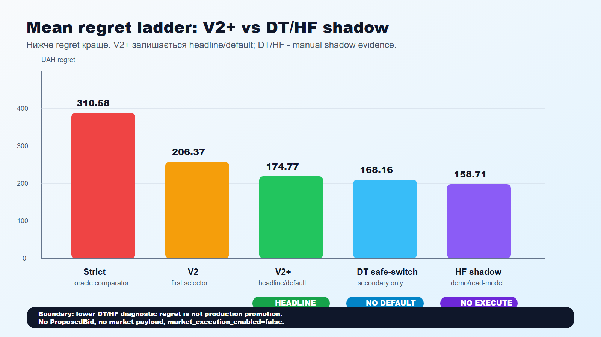
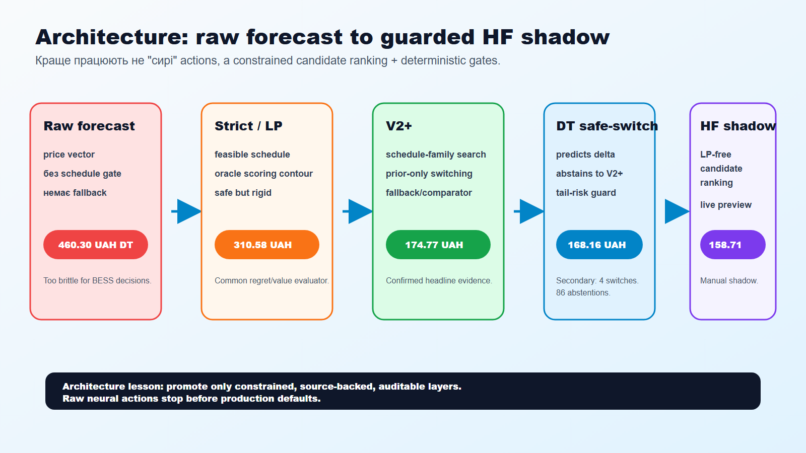
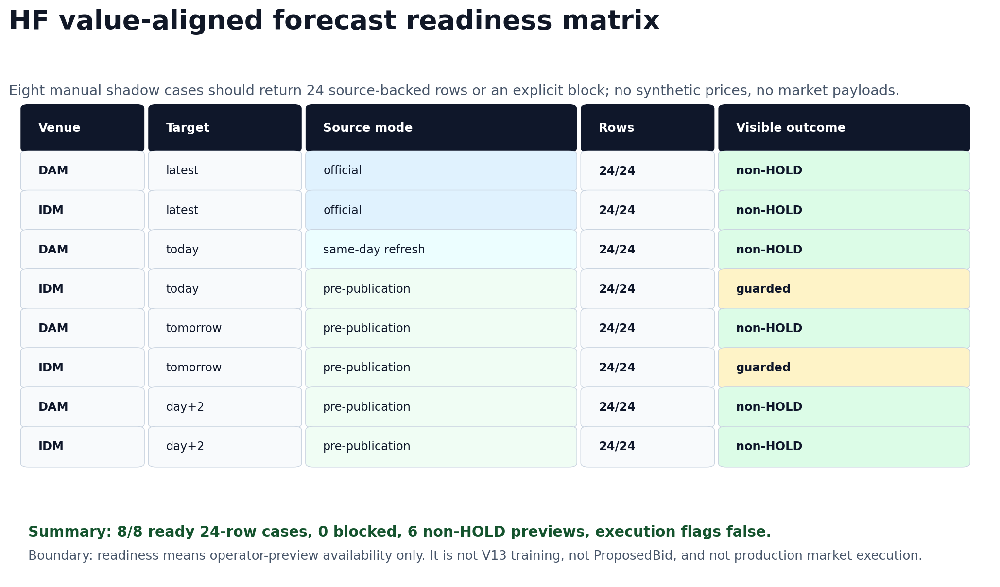

# Smart Energy Arbitrage 2026

Commission-ready operator-preview system for Ukrainian BESS energy arbitrage.

The repository combines a Dagster/FastAPI/Postgres/MLflow backend, a Nuxt
operator dashboard, deterministic LP/V2+ comparators, and guarded DT/HF
read-model evidence. The current product surface is a DAM/IDM hourly
recommendation preview. It is not a trading bot, not a market-submission engine,
and not production execution.



## Executive Summary

This project answers one practical question: can a BESS operator in Ukraine see a
clear, source-backed day-ahead or intraday charge/discharge/hold preview while
the research system measures whether newer strategy layers are actually better
than a safe baseline?

Current answer:

| Layer | Result | Status |
| --- | ---: | --- |
| Strict LP/oracle comparator | 310.58 UAH mean regret | evaluator, not UI default |
| V2 forecast selector | 206.37 UAH mean regret | historical baseline |
| Schedule/Value Learner V2+ | 174.77 UAH mean regret | headline/default evidence |
| DT/V2+ safe-switch | 168.16 UAH mean regret, 4 switches / 86 abstentions | secondary shadow evidence |
| HF value-aligned shadow | 158.71 UAH frozen mean regret signal, 20/32 non-fallback days, 8/8 readiness | manual shadow/demo preview |

Boundary: `market_execution_enabled=false`, no `ProposedBid`, no market order
payload, no production LP replacement, and no V13 training claim.

## What This Repository Proves

The implementation is evidence-oriented rather than claim-oriented:

- V2+ remains the validated headline/default strategy because it is robust,
  source-backed, and safe under the frozen evaluator.
- DT and HF improve research regret in selected packets, but stay behind manual
  shadow gates because they are not production controllers.
- HF value-aligned shadow can serve a live operator-preview flow for
  `latest official`, `today`, `tomorrow`, and `day+2` across DAM and IDM when
  source-backed official or forecast-store rows are available.
- The dashboard shows selected price context, recommendation rows, abstention
  reasons, strategy comparison, and non-execution boundaries.

It does not prove market execution readiness, autonomous bidding, V13 source
readiness, or a mathematically complete HF optimizer.

## Decision-Ready Report

### What Is Happening

The system has matured from a pure LP/forecast experiment into a layered
operator-preview product. The front office view now reads from source-backed
DAM/IDM context, applies deterministic safety checks, and can compare V2+, DT
safe-switch, and HF value-aligned shadow evidence on the same delivery window.

The best current demo path is:

1. Open `/operator`.
2. Select tenant `client_003_dnipro_factory`.
3. Select DAM or IDM and one of `latest official`, `today`, `tomorrow`, `day+2`.
4. Select `HF live safe-switch value-aligned shadow`.
5. Inspect whether the selected preview is a non-HOLD action schedule or a
   guarded abstention back to HOLD/V2+ fallback.

### Main Drivers

- Source governance: official OREE rows are used for published days; forecast
  store rows are used for unpublished horizons. Synthetic prices are blocked.
- Candidate design: HF does not emit arbitrary raw actions. It ranks a finite
  library of LP-free, safety-shaped schedule candidates.
- Deterministic gates: value guard, tail-risk cap, SOC feasibility, and safety
  violations decide whether a non-HOLD preview may be shown.
- Same-window evaluation: strategy comparison is meaningful only when V2+, DT,
  and HF are evaluated on the same market/date/window.
- MLOps readiness: Dagster assets, packet exports, browser smoke tests, and
  dashboard warnings make regressions visible.

### Recommended Focus

| Priority | Focus | Why |
| --- | --- | --- |
| 1 | Keep V2+ as the headline/default comparator | It has validated robustness and the cleanest production-adjacent evidence boundary. |
| 2 | Use HF value-aligned as the main shadow demo challenger | It has the strongest research signal and the cleanest live preview UX, but remains manual and non-executable. |
| 3 | Expand source-backed DAM/IDM forecast readiness | The live demo succeeds only when official or forecast-store rows are available. |
| 4 | Improve candidate libraries before lowering guards | Better candidates are safer than weakening the 100 UAH/tail-risk gates. |
| 5 | Keep V13 separate | V13 is a source-readiness/acquisition gate, not a modeling shortcut. |

## Core Architecture



The production-facing surface is intentionally conservative: it renders
recommendations and evidence, not market orders.

### HF Value-Aligned Shadow



HF value-aligned shadow is a live read-model challenger. It works as a guarded
candidate scorer:



The model scores candidate schedules; it does not directly control the battery.
If the selected candidate fails the guard, the correct output is HOLD/fallback.
That is an abstention decision, not a dashboard failure.

## Evidence Visuals

### Regret Ladder



Lower regret is better. V2+ is the headline/default evidence; DT/HF are
secondary/manual shadow challengers.

### Architecture Progression



The main lesson is architectural: raw forecasts and raw neural actions are too
brittle for operator defaults. The stronger pattern is source-backed context,
candidate ranking, deterministic safety, and explicit abstention.

### HF Readiness Matrix



The latest HF value-aligned readiness packet covers 8/8 operator-preview cases:
DAM/IDM x latest official/today/tomorrow/day+2. All execution flags remain false.

## Live Preview Modes

| Mode | Price context | Expected output |
| --- | --- | --- |
| Latest official | Published official OREE rows | 24 hourly source-backed rows or blocked reason |
| Today | Same-day forecast refresh when official row is not complete | 24 hourly forecast-backed rows or blocked reason |
| Tomorrow | Pre-publication forecast-store rows | 24 hourly forecast-backed rows or blocked reason |
| Day+2 | Pre-publication forecast-store rows | 24 hourly forecast-backed rows or blocked reason |
| Unsupported far future | No source-backed row or forecast materialization | Clear blocked state, no synthetic prices |

Blocked states are part of the design. The dashboard should never silently fall
back to stale proof dates, hidden LP calls, or fake prices.

## Quickstart

### Prerequisites

- Windows PowerShell
- Docker Desktop
- Python environment managed by `uv`
- Node.js/npm for the Nuxt dashboard
- Optional CUDA-capable GPU for heavier research runs

### Install Dependencies

```powershell
uv sync --all-extras
npm -C dashboard install
```

### Start The Local Stack

Fast path for the supervisor/demo stack:

```powershell
.\scripts\start-local-project.ps1 -ApiPort 8000 -DashboardPort 64163
```

Detached backend stack:

```powershell
docker compose up -d postgres mqtt mlflow dagster-webserver dagster-daemon api
npm -C dashboard run dev
```

Open:

- API health: [http://127.0.0.1:8000/health](http://127.0.0.1:8000/health)
- Operator dashboard: [http://127.0.0.1:64163/operator](http://127.0.0.1:64163/operator)
- Defense dashboard: [http://127.0.0.1:64163/defense](http://127.0.0.1:64163/defense)
- Dagster: [http://127.0.0.1:3001](http://127.0.0.1:3001)
- MLflow: [http://127.0.0.1:5000](http://127.0.0.1:5000)

### Seed Forecast-Store Rows For Preview

Use these when the dashboard needs unpublished DAM/IDM horizons:

```powershell
.\.venv\Scripts\python.exe scripts\materialize_operator_preview_forecast_store.py --market-venue DAM --horizon-hours 72 --nbeatsx-max-steps 1 --tft-max-epochs 1
.\.venv\Scripts\python.exe scripts\materialize_operator_preview_forecast_store.py --market-venue IDM --horizon-hours 72 --nbeatsx-max-steps 1 --tft-max-epochs 1
```

These rows are operator-preview forecast rows only:
`claim_boundary=operator_preview_forecast_rows_not_market_execution`.

## API Reference

Base URL in local dev: `http://127.0.0.1:8000`.

| Endpoint | Purpose |
| --- | --- |
| `GET /health` | Service liveness and basic dependency status |
| `GET /tenants` | Tenant/site options for the dashboard |
| `GET /dashboard/operator-status` | Operator surface status cards |
| `GET /dashboard/operator-recommendation` | Baseline/V2+ operator recommendation preview |
| `GET /dashboard/shadow-recommendation-preview` | Manual shadow preview sources, including HF value-aligned |
| `GET /dashboard/future-stack-preview` | Forecast/read-model stack for charts |
| `GET /dashboard/decision-policy-preview` | Research policy preview/read-model evidence |
| `GET /dashboard/gatekeeper-validation-status` | Pydantic gatekeeper status and validation failures |
| `GET /dashboard/projected-battery-state` | SOC/SOH/projection preview |
| `GET /dashboard/academic-mvp-readiness` | Thesis/MVP readiness cards |

Example HF value-aligned shadow request:

```powershell
Invoke-RestMethod "http://127.0.0.1:8000/dashboard/shadow-recommendation-preview?tenant_id=client_003_dnipro_factory&preview_source=hf_live_safe_switch_value_aligned_shadow&market_venue=DAM&target_delivery_date=2026-06-04"
```

Required response guarantees for HF shadow:

- nullable live `regret_uah`
- `market_execution_enabled=false`
- `promotion_gate_passed=false`
- `dt_lava_ready=false`
- no `proposed_bid`
- no market order payload

## Verification

Focused Python/API checks:

```powershell
.\.venv\Scripts\python.exe -m pytest -q tests\dfl\test_hf_live_safe_switch_preview.py tests\dfl\test_hf_value_aligned_shadow_readiness.py tests\api\test_main.py -k "hf_live_safe_switch or shadow_recommendation_preview or hf_value_aligned"
```

Dashboard checks:

```powershell
npm -C dashboard run typecheck
npm -C dashboard run test:unit
npm -C dashboard run smoke:hf-value-aligned
```

Full repo wrapper when runtime permits:

```powershell
.\.venv\Scripts\Activate.ps1
.\scripts\verify.ps1
```

Browser smoke output is written under `.tmp_runtime\hf_value_aligned_shadow_browser_smoke\`.

## Runtime Logs And Audit Trail

Useful commands during a demo or commission review:

```powershell
docker compose logs -f api
docker compose logs -f dagster-webserver dagster-daemon
docker compose logs -f mlflow
Get-ChildItem .tmp_runtime -Recurse | Select-Object -First 40
```

For a dashboard visual smoke, run:

```powershell
npm -C dashboard run smoke:hf-value-aligned
```

The browser smoke records screenshots and JSON summaries under
`.tmp_runtime\hf_value_aligned_shadow_browser_smoke\`. Treat these as UI
regression evidence, not training or market-execution evidence.

## Evidence Packets

| Artifact | What it is |
| --- | --- |
| [V2+ promotion evidence](docs/technical/DFL_SCHEDULE_VALUE_LEARNER_V2_PLUS.md) | Headline V2+ regret, improvement, and robustness packet |
| [DT/V2+ safe-switch evidence](docs/technical/DT_V2_PLUS_PROMOTION_EVIDENCE.md) | Secondary DT safe-switch comparison against V2+ |
| [HF robustness summary](data/research_runs/week5_hf_safe_switch_scorer_robustness_2026_06_01/robustness_summary.json) | HF frozen mean regret signal and non-execution flags |
| [HF value-aligned promotion proof](data/research_runs/hf_live_safe_switch_value_aligned_shadow_promotion_proof_2026_05_01_2026_06_01/promotion_gate.md) | Shadow/demo candidate-library proof gate |
| [HF demo packet](data/research_runs/hf_live_safe_switch_value_aligned_shadow_demo_packet_2026_06_01/demo_packet.md) | Four operator scenarios: official DAM, forecast DAM action, forecast DAM abstention, IDM abstention |
| [HF readiness matrix](data/research_runs/hf_value_aligned_forecast_readiness_2026-06-02/summary.json) | 8-case DAM/IDM readiness packet |
| [Current V13 boundary](docs/technical/CURRENT_GOAL_BOUNDARY_V13.md) | Scope and non-execution contract |
| [API endpoints](docs/technical/API_ENDPOINTS.md) | Backend endpoint reference |
| [Demo script](docs/technical/DAM_IDM_OPERATOR_PREVIEW_DEMO_SCRIPT_2026_06_01.md) | Supervisor/demo walkthrough |

## Presentation Materials

Use these for commission review and thesis defense preparation:

- Operator screenshot:
  [operator_desktop_after_8s.png](docs/technical/deep-research-reports/2026-05-25-full-project-review/assets/operator_desktop_after_8s.png)
- Defense screenshot:
  [defense_desktop.png](docs/technical/deep-research-reports/2026-05-25-full-project-review/assets/defense_desktop.png)
- Thesis figures:
  [docs/thesis/chapters/assets](docs/thesis/chapters/assets)
- Thesis chapters:
  [docs/thesis/chapters](docs/thesis/chapters)
- Weekly report and demo scripts:
  [docs/thesis/weekly-reports](docs/thesis/weekly-reports)

Recommended demo story:

1. Show V2+ as the validated default.
2. Show DT safe-switch as a cautious research challenger.
3. Show HF value-aligned shadow as the most advanced live operator-preview
   challenger.
4. Show a non-HOLD HF case.
5. Show a guarded HOLD/abstention case.
6. End with the boundary: no market execution and no production LP replacement.

## Repository Map

| Path | Purpose |
| --- | --- |
| `api/` | FastAPI app and dashboard endpoints |
| `dashboard/` | Nuxt operator and defense UI |
| `src/smart_arbitrage/` | Core Python package: data, DFL, gatekeeper, services |
| `scripts/` | Materializers, audits, smoke runs, demo helpers |
| `configs/` | Benchmark, calibration, V13, and research configs |
| `data/research_runs/` | Compact evidence packets and research outputs |
| `docs/technical/` | Technical boundary, API, demo, and evidence docs |
| `docs/thesis/` | Thesis chapters, figures, weekly reports, defense assets |
| `tests/` | Python tests for API, DFL, gatekeeper, and research slices |

## Claim Boundaries

Use the project language precisely:

| Do say | Do not say |
| --- | --- |
| DAM/IDM hourly recommendation preview | live trading bot |
| source-backed official/forecast context | synthetic price fallback |
| HF value-aligned shadow/read-model challenger | production controller |
| V2+ fallback/comparator remains default | HF replaced V2+ in production |
| LP-free live shadow request path | full LP replacement |
| no `ProposedBid`, no market payload | market-submittable bid engine |
| V13 is source-readiness/acquisition | V13 training passed |

## Troubleshooting

### HF Shows Only HOLD

This can be correct. HF only shows non-HOLD when the selected candidate passes
the value guard, tail-risk cap, deterministic safety checks, and SOC feasibility.
If a guard fails, the selected preview abstains to HOLD/V2+ fallback.

### Dashboard Says Price Context Is Missing

Check whether the selected venue/date has official rows or forecast-store rows.
Run the forecast materializer for DAM/IDM, then refresh the dashboard.

### Far-Future Date Blocks

Expected. Unsupported future dates should block cleanly instead of rendering
synthetic prices.

### Port Already In Use

Use the local helper with alternative ports:

```powershell
.\scripts\start-local-project.ps1 -ApiPort 8010 -DashboardPort 64164
```

### Full Dependency Sync Is Slow

Use `uv sync --extra dev` for most tests. Use `uv sync --all-extras` when running
official NBEATSx/TFT adapters, full local stack refreshes, or thesis evidence
materialization.

## License And Academic Use

This repository is a diploma/MVP research artifact for operator-preview and
strategy-evidence work. Treat all market-facing claims as read-model evidence
unless a future gate explicitly enables production execution.
