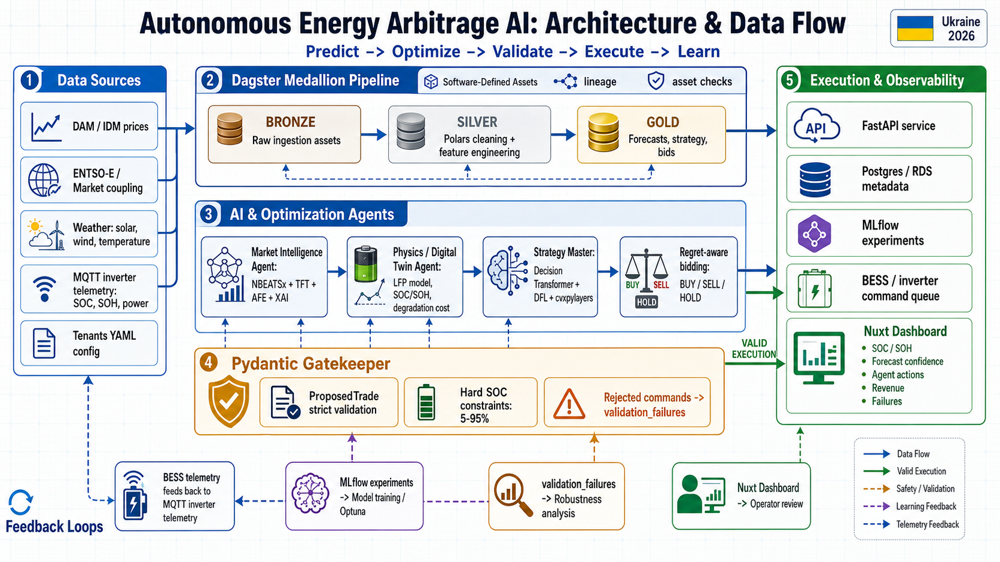

# Architecture and Data Flow

This page is the visual entry point for the current Smart Energy Arbitrage
architecture. It summarizes how tenant configuration, market/weather data,
MQTT battery telemetry, Dagster assets, ML research models, safety validation,
and operator-facing read models fit together.



## Reading The Diagram

The system is intentionally framed as a research-safe operator MVP, not a live
market-execution bot. Read the diagram with the project glossary in
[CONTEXT.md](../../CONTEXT.md): market-facing intent is a `Proposed Bid`, the
deterministic safety layer is the `Bid Gatekeeper`, and dashboard/API rows are
read models unless a later slice explicitly introduces a promoted market
contract.

The main flow is:

```text
Data sources
  -> Dagster Bronze/Silver/Gold assets
  -> NBEATSx/TFT forecast evidence and LP/DFL/DT research surfaces
  -> Pydantic-backed Bid Gatekeeper validation
  -> FastAPI/Postgres/MLflow read models
  -> Nuxt operator and defense dashboards
```

The feedback loops are as important as the forward path:

- MLflow captures experiment evidence for model comparison and retraining.
- `validation_failures` captures blocked Proposed Bid candidates for robustness
  analysis.
- MQTT telemetry feeds the battery state back into the next planning cycle.
- Dashboard review keeps the operator-facing claim boundary explicit.

## Terminology Note

The PNG is an architecture infographic, not a schema contract. Where the visual
uses older shorthand such as `ProposedTrade`, read it as the canonical
`Proposed Bid` vocabulary from [CONTEXT.md](../../CONTEXT.md). Likewise, the
operator-facing flow should be interpreted as evidence review and validation
readiness, not live exchange submission or physical dispatch.

## Evidence Registry

| Evidence package | Status | Scope | Claim boundary |
|---|---|---|---|
| Week 3 accepted benchmark | Verified Week 3 headline | `client_003_dnipro_factory`, observed OREE DAM + historical Open-Meteo, `2026-01-01` to `2026-04-30`, `max_anchors=30` | Thesis-grade rolling-origin benchmark; `strict_similar_day` is the strongest control on this slice. |
| Week 3 calibration preview | Prepared ahead for Week 4/demo 2 | Same Dnipro window with `max_anchors=90`; exported at `data/research_runs/week3_calibration_preview_dnipro_90` | Calibration/selector diagnostics only. Horizon-aware calibration improves neural candidates versus raw TFT/NBEATSx, but it is not full DFL and not market execution. |
| Aggregate/all-tenant research exports | Supporting context | Export scripts may aggregate latest persisted batches across tenants | Use only with explicit tenant/run scope. Do not let aggregate summaries replace the Week 3 Dnipro acceptance claim. |

## Claim Boundary

The infographic shows the target architecture and current data-flow contract.
It should be used alongside the implementation notes in
[BASELINE_LP_AND_DATA_PIPELINE.md](BASELINE_LP_AND_DATA_PIPELINE.md),
[BACKEND_TELEMETRY_AND_TRAINING_SLICE.md](BACKEND_TELEMETRY_AND_TRAINING_SLICE.md),
and [RESEARCH_INTEGRATION_PLAN.md](RESEARCH_INTEGRATION_PLAN.md).

Current thesis-safe wording:

- Baseline LP is the deterministic control group.
- NBEATSx and TFT are forecast candidates and evidence surfaces until they pass
  rolling-origin LP/oracle benchmarks.
- Decision Transformer and DFL components are scaffolded research lanes, not
  live market execution.
- The Pydantic-backed Bid Gatekeeper remains the deterministic safety boundary
  for future `Proposed Bid` contracts.
