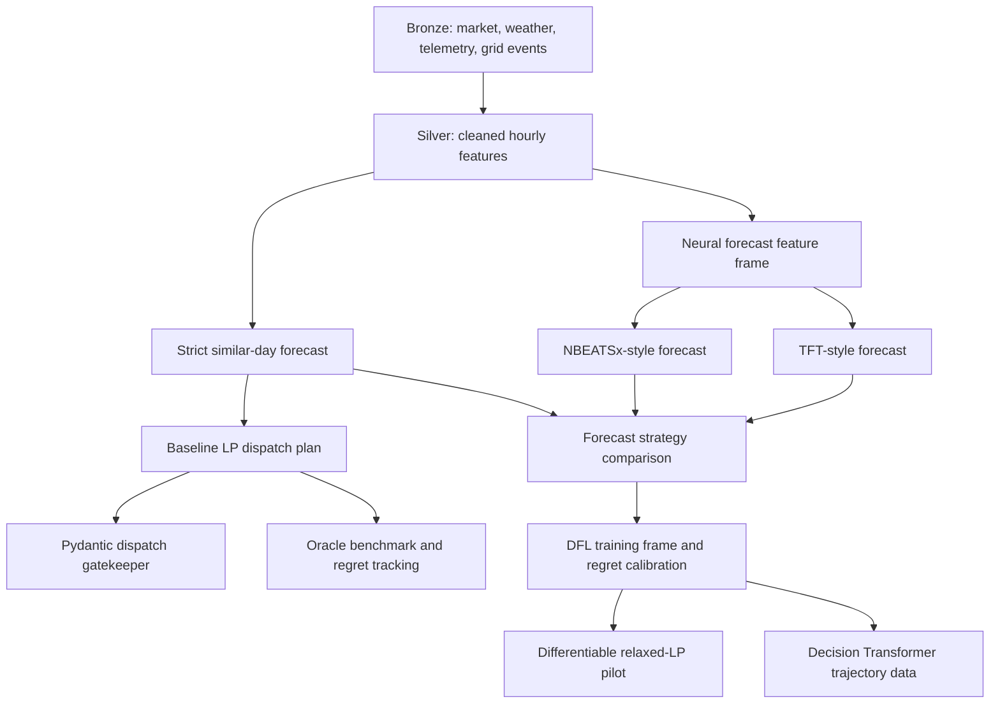

# Baseline LP and Current Data Pipeline

This note explains the current Level 1 decision pipeline, the linear programming
(LP) formula used by the baseline, and where machine learning is present or absent.
It is the canonical short explanation for supervisor reviews and README references.

## Current Pipeline

The current implementation is a Medallion pipeline with a deterministic LP control
core and separate research lanes for ML forecasts and future DFL.



## Where ML Exists

The operational decision authority is not ML. The LP baseline is deterministic.
ML exists only in forecast and research branches:

| Pipeline part | Asset or module | ML? | Purpose |
|---|---|---:|---|
| Market/weather/telemetry ingestion | `dam_price_history`, `battery_telemetry_bronze`, `weather_forecast_bronze` | No | Load or synthesize source data. |
| Hourly feature preparation | `battery_state_hourly_silver`, `neural_forecast_feature_frame` | No | Build model-ready and LP-ready features. |
| Baseline forecast | `strict_similar_day_forecast` | No | Copy an analogous historical hour using the strict similar-day rule. |
| Baseline dispatch | `baseline_dispatch_plan`, `HourlyDamBaselineSolver` | No | Solve a deterministic LP over the forecast horizon. |
| Forecast candidates | `nbeatsx_price_forecast`, `tft_price_forecast` | Yes | Train compact PyTorch research forecast candidates. |
| Forecast evaluation | `forecast_strategy_comparison_frame` | Mixed | Route ML and non-ML forecasts through the same LP and score regret. |
| DFL pilot | `dfl_relaxed_lp_pilot_frame` | ML-adjacent | Use `cvxpylayers` so a relaxed LP can support future gradient-based DFL. |
| DT preparation | `decision_transformer_trajectory_frame` | Training data only | Prepare offline trajectories; no live trained policy yet. |

## Baseline LP Formula

For each hourly horizon step `t = 0, ..., T - 1`, the LP chooses:

```text
c_t = charge power in MW
d_t = discharge power in MW
s_t = stored energy / SOC in MWh
```

Given:

```text
p_t = forecast DAM price in UAH/MWh
Delta t = 1 hour
C = battery capacity in MWh
P_max = max charge/discharge power in MW
eta_c = charge efficiency
eta_d = discharge efficiency
s_min = minimum SOC fraction
s_max = maximum SOC fraction
gamma = degradation cost per MWh throughput in UAH/MWh
```

The current code uses:

```text
eta_c = eta_d = sqrt(round_trip_efficiency)
gamma = degradation_cost_per_cycle_uah / (2 * C)
```

The objective maximizes degradation-adjusted market value:

```text
maximize sum_t [
  p_t * (d_t - c_t) * Delta t
  - gamma * (c_t + d_t) * Delta t
]
```

Subject to the linear battery constraints:

```text
s_0 = initial_soc_fraction * C

s_{t+1} = s_t
          + c_t * eta_c * Delta t
          - d_t * Delta t / eta_d

s_min * C <= s_t <= s_max * C

0 <= c_t <= P_max
0 <= d_t <= P_max
```

The signed dispatch shown to the operator is:

```text
net_power_t = d_t - c_t
```

Interpretation:

```text
net_power_t > 0  => discharge / sell energy
net_power_t < 0  => charge / buy energy
net_power_t = 0  => hold
```

The LP solves the full 24-hour horizon, but the baseline execution policy is
rolling horizon: commit only the first interval, then recompute later from newer
prices and newer SOC telemetry.

## SOC Handling

Tenant SOC is not hard-coded if telemetry is available. The baseline API resolves
starting SOC as follows:

```text
fresh hourly telemetry snapshot exists
  => use latest soc_close

no snapshot or stale snapshot
  => use tenant initial_soc_fraction from configuration
```

So there are three distinct SOC values:

| SOC concept | Static? | Meaning |
|---|---:|---|
| Tenant default SOC | Yes | Fallback planning assumption. |
| Telemetry SOC | No | Latest observed tenant battery state. |
| Projected SOC | No | LP/simulator forecast of future SOC across the schedule. |

## Why This LP Is Academically Defensible

The LP follows the standard price-taking storage-arbitrage structure: charge when
forecast prices are low, discharge when forecast prices are high, and enforce
energy balance, power limits, SOC limits, and efficiency losses.

This is supported by the short-term ESS scheduling literature. Lee et al. (2017)
show that short-term energy time-shift scheduling for ESS can be written as LP
models while retaining linear technical constraints such as SOC, charge/discharge
efficiency, output power range, and energy limits. That directly matches the
constraints in `HourlyDamBaselineSolver`.

The degradation penalty is intentionally a Level 1 economic proxy, not a full
electrochemical ageing model. The code uses a throughput/EFC cost:

```text
throughput_t = (c_t + d_t) * Delta t
EFC_t = throughput_t / (2 * C)
degradation_penalty_t = EFC_t * degradation_cost_per_cycle_uah
```

Kumtepeli et al. (2024) warn that depreciation-style degradation costs are only
proxies for future revenue lost to ageing, but also describe why rolling-horizon
storage optimization often includes an ageing cost in the objective. This supports
using the current proxy as a transparent baseline while avoiding a claim that it is
a full digital twin.

## Why LP Is Separate From ML

The LP is an optimizer, not a learner. It does not fit parameters or learn weights.
It consumes prices and constraints, then computes the best feasible schedule under
the linear objective.

The ML layer is upstream when NBEATSx or TFT predicts `p_t`. The same LP then
turns those predicted prices into a battery schedule. This separation is the
current predict-then-optimize baseline.

Decision-focused learning changes the training loop, not the physical meaning of
the LP. DFL trains a model against downstream decision quality instead of forecast
error alone. The current `dfl_relaxed_lp_pilot_frame` uses a relaxed differentiable
LP primitive for this future work, but final evaluation must still use the strict
LP/simulator path.

## Operator Weather Signal

The operator dashboard currently shows a weather line/bar series named
`weather_bias`. This is acceptable for the MVP as an explainable read model, but
it must be described narrowly: it is a calibrated weather-associated price uplift
in `UAH/MWh`, not a causal weather model and not the LP control input.

The dashboard signal-preview endpoint builds:

```text
price_after_weather_t = market_price_t + weather_bias_t
```

where `weather_bias_t` is estimated from tenant-location weather features:

```text
cloudcover
precipitation
humidity_excess = max(0, humidity - 65)
temperature_gap = abs(temperature - 18)
effective_solar
wind_speed
```

The derived solar feature is:

```text
effective_solar = solar_radiation * (100 - cloudcover) / 100
```

For the current read model, the calibration target is a positive hourly price
premium:

```text
weather_premium_target_t =
  max(0, market_price_t - mean_price_for_same_hour)
```

The API then fits a small ridge-style linear calibration:

```text
weather_bias_t =
  intercept
  + sum_i coefficient_i * ((feature_i,t - feature_mean_i) / feature_scale_i)
```

The prediction is clipped to non-negative values because the UI label is
currently an uplift. If the project later wants a signed weather correction,
the label and formula should change from `weather_bias` / `weather uplift` to a
validated `weather_adjusted_price_forecast` that can be positive or negative.

Current use:

| Surface | Uses `weather_bias`? | Meaning |
|---|---:|---|
| Operator market pulse chart | Yes | Explain how weather may shift the visible price curve. |
| Dashboard `charge_intent` preview | Yes | A simplified visual preview derived from the weather-adjusted curve. |
| Baseline LP endpoint | No | LP still consumes strict similar-day price forecasts only. |
| Gold forecast candidates | Indirect/future | Weather features belong upstream in NBEATSx/TFT/TimeXer-style forecast models. |

Recommendation: keep the current dashboard signal for supervisor demos, but keep
the LP unchanged. Weather should affect dispatch only through a validated forecast
model:

```text
weather + market history + calendar
  -> weather-aware price forecast
  -> strict LP dispatch
  -> realized-value / oracle-regret benchmark
```

This boundary is academically important. Electricity-price forecasting literature
supports exogenous inputs, but Lago et al. argue that EPF models must be compared
against strong simple baselines and evaluated rigorously across realistic test
windows. NBEATSx and TFT support weather/calendar variables as forecast inputs;
TimeXer is a newer reference for exogenous time-series modeling. None of these
papers justify feeding an unvalidated dashboard uplift directly into a dispatch
optimizer as if it were a proven price forecast.

## Research Support

- Lee, A.-R., Kim, S.-M., Park, S.-Y., et al. (2017). "Linear Formulation for Short-Term Operational Scheduling of Energy Storage Systems in Power Grids." Energies, 10(2), 207. https://doi.org/10.3390/en10020207
- Kumtepeli, V., Hesse, H., Morstyn, T., Nosratabadi, S. M., Aunedi, M., and Howey, D. A. (2024). "Depreciation Cost is a Poor Proxy for Revenue Lost to Aging in Grid Storage Optimization." ACC 2024. https://arxiv.org/abs/2403.10617
- Lago, J., Marcjasz, G., De Schutter, B., and Weron, R. (2021). "Forecasting day-ahead electricity prices: A review of state-of-the-art algorithms, best practices and an open-access benchmark." Applied Energy, 293, 116983. https://doi.org/10.1016/j.apenergy.2021.116983
- Olivares, K. G., Challu, C., Marcjasz, G., Weron, R., and Dubrawski, A. (2023). "Neural basis expansion analysis with exogenous variables: Forecasting electricity prices with NBEATSx." International Journal of Forecasting, 39(2), 884-900. https://doi.org/10.1016/j.ijforecast.2022.03.001
- Lim, B., Arik, S. O., Loeff, N., and Pfister, T. (2021). "Temporal Fusion Transformers for Interpretable Multi-horizon Time Series Forecasting." International Journal of Forecasting, 37(4), 1748-1764. https://doi.org/10.1016/j.ijforecast.2021.03.012
- Wang, Y., Wu, H., Dong, J., et al. (2024). "TimeXer: Empowering Transformers for Time Series Forecasting with Exogenous Variables." https://arxiv.org/abs/2402.19072
- Yu, R., Bunn, D. W., Lin, J., et al. (2026). "Deep Learning for Electricity Price Forecasting: A Review of Day-Ahead, Intraday, and Balancing Electricity Markets." https://arxiv.org/abs/2602.10071
- Agrawal, A., Amos, B., Barratt, S., Boyd, S., Diamond, S., and Kolter, J. Z. (2019). "Differentiable Convex Optimization Layers." NeurIPS 2019. https://papers.neurips.cc/paper/9152-differentiable-convex-optimization-layers
- Amos, B., and Kolter, J. Z. (2017). "OptNet: Differentiable Optimization as a Layer in Neural Networks." ICML 2017. https://proceedings.mlr.press/v70/amos17a.html
- Mandi, J., Kotary, J., Berden, S., Mulamba, M., Bucarey, V., Guns, T., and Fioretto, F. (2024). "Decision-Focused Learning: Foundations, State of the Art, Benchmark and Future Opportunities." Journal of Artificial Intelligence Research, 81, 1623-1701. https://doi.org/10.1613/jair.1.15320
- Yi, M., Wu, Y., Alghumayjan, S., Anderson, J., and Xu, B. (2025). "A Decision-Focused Predict-then-Bid Framework for Strategic Energy Storage." https://arxiv.org/abs/2505.01551

## Code References

- LP solver: `src/smart_arbitrage/assets/gold/baseline_solver.py`
- MVP Dagster pipeline: `src/smart_arbitrage/assets/mvp_demo.py`
- Neural forecast assets: `src/smart_arbitrage/assets/silver/neural_forecasts.py`
- DFL research assets: `src/smart_arbitrage/assets/gold/dfl_research.py`
- Telemetry aggregation: `src/smart_arbitrage/assets/telemetry/battery.py`
- API baseline preview: `api/main.py`
- Operator weather signal preview: `api/main.py`, `dashboard/app/utils/dashboardChartTheme.ts`
