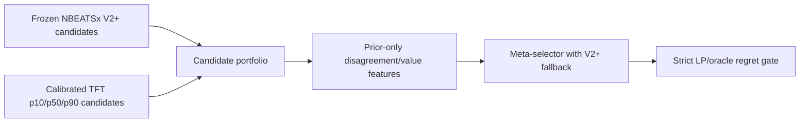
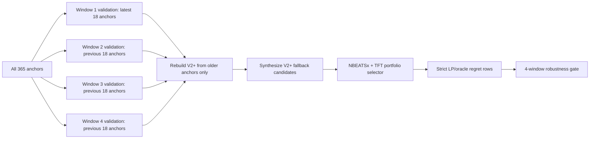

# NBEATSx + TFT Candidate-Portfolio Meta-Selector

## Purpose

This slice tests whether TFT helps as a complementary schedule source rather
than as a raw forecast replacement. The frozen comparator remains the
Ukrainian-only calibrated official global-panel NBEATSx Schedule/Value Learner
V2+ result:

| Metric | Frozen comparator |
| --- | ---: |
| Mean regret | 174.77 UAH |
| Median regret | 67.30 UAH |
| Rolling robustness | 4 / 4 windows |
| Market execution | false |

The claim boundary is unchanged: this is Offline Strategy Promotion evidence
only. It is not live market execution, not a dashboard/API default switch, not a
deployed Decision Transformer, and not EU/Poland feature training.

## Why A Portfolio Instead Of Averaging

The 365-anchor TFT evidence showed that TFT did not beat V2+ as a standalone
replacement. A stronger test is to ask whether TFT contributes schedule
diversity:



This follows the decision-focused direction of optimizing downstream arbitrage
value/regret rather than raw forecast error alone. TFT is used for its
multi-horizon and quantile diversity, NBEATSx remains the strong default expert,
and every candidate must become a feasible schedule before it is scored.

Relevant source anchors:

- Sang et al., decision-focused ESS arbitrage:
  <https://arxiv.org/abs/2305.00362>
- Temporal Fusion Transformer:
  <https://huggingface.co/papers/1912.09363>
- NBEATSx:
  <https://arxiv.org/abs/2104.05522>
- Forecast combination for electricity prices:
  <https://arxiv.org/abs/2601.02856>

## New Assets

| Asset | Role |
| --- | --- |
| `dfl_nbeatsx_tft_complementarity_audit_frame` | Per tenant/anchor audit of whether a TFT candidate beats V2+, whether no useful TFT candidate exists, or whether the current coarse selector missed an opportunity. |
| `dfl_nbeatsx_tft_candidate_portfolio_v1_frame` | Merges frozen V2+, strict fallback, calibrated TFT quantile schedules, and cross-model schedule candidates into one feasible schedule portfolio. |
| `dfl_nbeatsx_tft_candidate_value_meta_selector_v1_frame` | Prior-only candidate-level value selector. It chooses a candidate key only when prior/train evidence predicts improvement; otherwise it emits V2+ fallback. |
| `dfl_nbeatsx_tft_meta_selector_strict_lp_benchmark_frame` | Strict LP/oracle benchmark comparing frozen V2+ against the selected portfolio strategy. |
| `dfl_nbeatsx_tft_meta_selector_robustness_frame` | Latest-holdout robustness diagnostic over the non-rolling strict frame. It is not enough for replacement claims. |
| `dfl_nbeatsx_tft_meta_selector_rolling_strict_lp_benchmark_frame` | True rolling strict LP/oracle benchmark. Each window rebuilds V2+ from prior anchors, synthesizes V2+ fallback candidate rows, and then lets TFT candidates compete only through prior-window evidence. |
| `dfl_nbeatsx_tft_meta_selector_prior_rolling_robustness_frame` | Robustness summary from the true rolling strict frame. This is the gate that must be clean before DT/LAVA-style work can be treated as more than a research branch. |

## Materialized Result - 2026-05-19

The full-data portfolio path was materialized after bounding TFT candidate
expansion by prior forecast-objective rank per tenant, anchor, source, and
family. This keeps the run resumable on the local Docker stack and avoids
duplicating the full TFT candidate library into an unbounded cross-model table.
The bound is prior-safe because it uses forecast-side fields, not realized final
regret.

Observed result:

| Evidence item | Value |
| --- | ---: |
| Complementarity audit rows | 90 |
| TFT candidate beats V2+ on final holdout | 24 / 90 tenant-anchors |
| No useful TFT candidate | 66 / 90 tenant-anchors |
| Calibrated V2+ mean regret | 174.77 UAH |
| Best TFT candidate mean regret | 220.42 UAH |
| Candidate portfolio rows | 120,380 |
| Meta-selector mean regret | 174.77 UAH |
| Meta-selector median regret | 67.30 UAH |
| Selected rows using V2+ fallback | 90 / 90 |
| Strict evidence check | passed |
| Robustness check | blocked: only one latest-holdout window available in this strict frame |

Interpretation: TFT has local complementary opportunities, but the current
prior-only selector does not have enough train/prior evidence to choose them
without risking degradation. The correct thesis-safe result is therefore
negative: the combined portfolio does not replace Ukrainian-only calibrated
NBEATSx V2+.

## Rolling Selector Fix And Result

The first portfolio selector exposed a real issue: TFT produced useful
per-anchor candidates, but the selector could not safely exploit them because
the latest-holdout strict frame did not contain a rolling V2+ comparator for
train/prior windows. Without that comparator, the selector cannot estimate
whether a TFT candidate beats V2+ before the validation window. Falling back to
V2+ is therefore the correct behavior.

The fix is not to loosen the threshold. The fix is to replay the entire
portfolio through a true rolling strict frame:



The implementation is additive:

- `dfl_nbeatsx_tft_meta_selector_rolling_strict_lp_benchmark_frame`;
- `dfl_nbeatsx_tft_meta_selector_prior_rolling_robustness_frame`;
- asset checks for both rolling evidence artifacts.

The rolling implementation uses 30 prior anchors per window. This keeps the
selection point-in-time and avoids turning the replay into an all-history
selector that is too slow for local evidence iteration.

Materialized rolling result, Dagster run
`35c6ddcd-ce54-4ae8-b527-670a875faf3f`:

| Window | V2+ mean regret UAH | Portfolio mean regret UAH | Portfolio median regret UAH | Fallback rows | Rolling pass |
| ---: | ---: | ---: | ---: | ---: | --- |
| 0 | 174.77 | 174.77 | 67.30 | 90 / 90 | false |
| 1 | 226.12 | 226.12 | 157.35 | 90 / 90 | false |
| 2 | 393.82 | 1407.48 | 1070.69 | 0 / 90 | false |
| 3 | 981.62 | 1011.35 | 624.76 | 0 / 90 | false |

Rolling pass count: `0 / 4`. Both rolling asset checks passed structurally,
meaning coverage and claim-boundary evidence are valid, but the promotion
decision is negative. The latest two windows fall back to V2+; the older two
windows select TFT-derived candidates and degrade mean/median regret. This
closes the selector issue for the current portfolio: TFT has local opportunities,
but the present prior-only features are not reliable enough to exploit them
robustly.

The correct next step is not another small prior selector. It is a separately
bounded DT/LAVA-style research branch trained/evaluated against frozen V2+ with
the same strict LP/oracle gate.

## Selector Features

The selector uses `selector_feature_*` columns that are available before final
scoring:

- peak-hour disagreement between V2+ and TFT forecasts;
- trough-hour disagreement;
- TFT quantile/forecast spread;
- schedule distance from V2+ dispatch;
- charge/discharge overlap;
- terminal SOC delta;
- throughput delta;
- spread-volatility delta.

Realized regret and oracle gaps stay in `label_*` or `diagnostic_*` columns.
Mutating final-holdout actuals may change scores and labels, but not feature
generation or selected weights.

## Gate

The meta-selector can replace V2+ only if all conditions hold:

- mean regret improves over calibrated V2+ by at least 5%;
- median regret does not worsen versus calibrated V2+;
- rolling robustness passes 4 / 4 windows;
- safety violations are zero;
- `market_execution_enabled=false`.

If it fails, the correct evidence is a negative packet explaining whether the
blocker is no complementary TFT candidates, missed available candidates, or a
conservative V2+ fallback.

## Run

After the upstream official NBEATSx V2+ and calibrated TFT candidate rows exist:

```powershell
docker compose exec -T dagster-webserver uv run dagster asset materialize `
  -m smart_arbitrage.defs `
  --select dfl_nbeatsx_tft_complementarity_audit_frame,dfl_nbeatsx_tft_candidate_portfolio_v1_frame,dfl_nbeatsx_tft_candidate_value_meta_selector_v1_frame,dfl_nbeatsx_tft_meta_selector_strict_lp_benchmark_frame,dfl_nbeatsx_tft_meta_selector_robustness_frame `
  -c configs/real_data_dfl_nbeatsx_tft_combined_portfolio_week3.yaml
```

For the true rolling gate, run:

```powershell
docker compose exec -T dagster-webserver uv run dagster asset materialize `
  -m smart_arbitrage.defs `
  --select dfl_nbeatsx_tft_meta_selector_rolling_strict_lp_benchmark_frame,dfl_nbeatsx_tft_meta_selector_prior_rolling_robustness_frame `
  -c configs/real_data_dfl_nbeatsx_tft_combined_portfolio_week3.yaml
```

If the strict benchmark/check fails, preserve the result as negative evidence.
Do not weaken the V2+ gate to claim a combined result.
