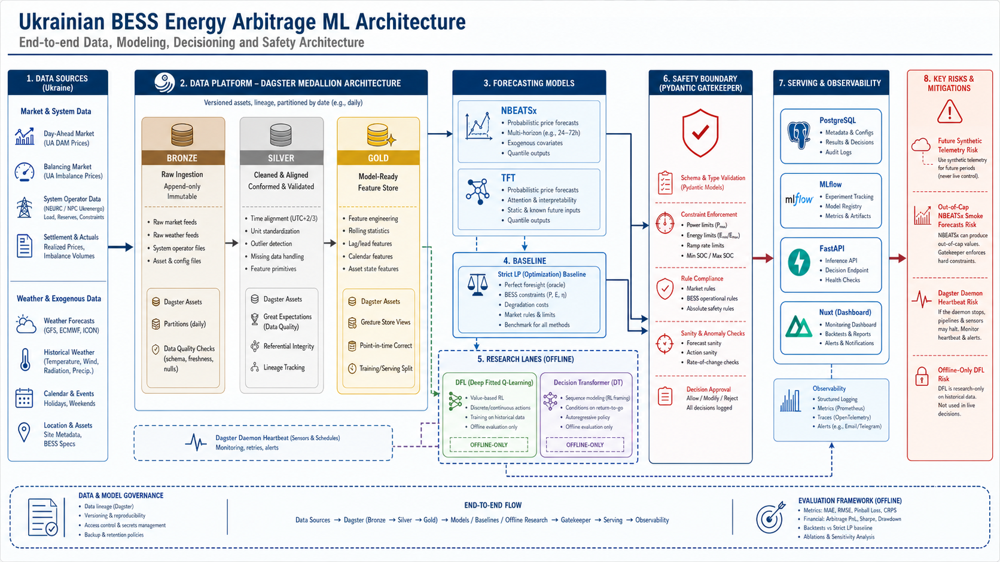

# Strategic Review: Dagster, ML Architecture, Docker, Data, and Thesis Direction

Date: 2026-05-11
Repository: `D:\School\GoIT\Courses\Diploma`
Review type: broad architecture and evidence review, documentation-only
Main code touched: none



## Executive Verdict

The architecture makes sense for the diploma if it is described precisely:

- Current strongest claim: a reproducible Dagster/FastAPI/Postgres/MLflow research stack for Ukrainian BESS arbitrage, with observed DAM prices, tenant weather, simulated battery telemetry, strict LP dispatch evaluation, forecast candidate comparison, and thesis-safe regret evidence.
- Current strongest control strategy: `strict_similar_day` plus Level 1 LP remains the operational baseline and fallback.
- Current strongest research signal: source-specific Schedule/Value Learner V2 passes the offline production/fallback gate for read-model strategy evidence only; it is still not market execution.
- Current highest-risk data issue: synthetic telemetry is being generated faster than real time and has future timestamps. The API can report a future synthetic row as latest "live" SOC.
- Current highest-risk model issue: persisted official NBEATSx smoke rows are wildly outside Ukrainian DAM price caps. Operator routing currently disables them, but the invalid rows should be blocked or quarantined earlier.
- Current highest-risk runtime issue: Compose services are mostly alive, but Dagster daemon logs repeated heartbeat shutdown warnings.

The project should continue as a layered evidence system:

```text
observed sources
  -> Dagster Bronze/Silver/Gold assets
  -> strict LP baseline and oracle/regret evaluation
  -> forecast candidate evidence
  -> offline DFL/DT research challengers
  -> Pydantic/FastAPI/Nuxt read-model surfaces
```

Do not collapse these layers into a claim that "the Decision Transformer trades energy" or "DFL is deployed." That would overstate the evidence.

## What I Reviewed

Repository and docs:

- Root `README.md`
- `docs/README.md`
- `docs/technical/ARCHITECTURE_AND_DATA_FLOW.md`
- `docs/technical/DATA_INGESTION_SOURCES.md`
- `docs/technical/DFL_READINESS_GATE.md`
- `docs/technical/DFL_SCHEDULE_VALUE_PRODUCTION_GATE.md`
- `docs/technical/OFFICIAL_FORECAST_ROLLING_ORIGIN_BENCHMARK.md`
- `docs/technical/DFL_FORECAST_PIPELINE_TRUTH_AUDIT.md`
- `docs/thesis/chapters/02-literature-review.md`
- `docs/thesis/weekly-reports/week4/report.md`

Runtime and configuration:

- `pyproject.toml`
- `docker-compose.yaml`
- `docker/backend.Dockerfile`
- `docker/dagster.yaml`
- `src/smart_arbitrage/defs/__init__.py`
- live `docker compose ps`
- live API smoke endpoints
- live Postgres summaries
- Dagster definition inventory via `uv run dg list defs --json`
- Docker config via `docker compose config --quiet`

Key source modules inspected:

- `src/smart_arbitrage/assets/bronze/market_weather.py`
- `src/smart_arbitrage/assets/telemetry/battery.py`
- `src/smart_arbitrage/forecasting/official_adapters.py`
- `src/smart_arbitrage/resources/battery_telemetry_store.py`
- `scripts/simulated_battery_mqtt_publisher.py`
- `scripts/battery_mqtt_ingestor.py`
- `tests/test_docker_compose_dagster.py`

External context:

- EU electricity market design and market coupling
- Ukrainian NEURC price caps and OREE tariff inputs
- Ukraine NECP / Energy Strategy 2050 context
- AI Act risk-based governance framing
- DFL, predict-then-bid, BESS degradation-aware optimization, NBEATSx, and TFT literature

## Dagster Architecture Review

Live definition inventory:

| Metric | Count |
|---|---:|
| Assets | 109 |
| Asset checks | 25 |
| Jobs | 2 |
| Schedules | 2 |
| Sensors | 0 |

Main asset groups:

| Layer / area | Groups |
|---|---|
| Bronze | market data, weather, battery telemetry, tenant load, grid events |
| Silver | forecast features, real-data benchmark features, battery state, DT context, simulated training |
| Gold | real-data benchmark, calibration, selector diagnostics, DFL training, DT policy preview, paper trading |

Tags are doing useful work:

| Tag family | Evidence |
|---|---|
| `medallion=bronze|silver|gold` | Explicit data lineage is visible and supervisor-friendly. |
| `evidence_scope=thesis_grade` | Clear separation from demos and research-only experiments. |
| `evidence_scope=research_only` | Keeps DFL/DT experiments away from execution claims. |
| `evidence_scope=not_market_execution` | Important safety and academic boundary. |

Schedule review:

| Schedule | Cron | Comment |
|---|---|---|
| `battery_telemetry_hourly_refresh_schedule` | `0 * * * *` | Reasonable for MVP snapshots, but raw MQTT feed still needs timestamp sanity. |
| `real_data_benchmark_daily_schedule` | `0 3 * * * *` | Good for repeatable daily benchmark refresh. |

No sensors are registered. That is acceptable for an MVP and for thesis repeatability, but the roadmap should say "scheduled batch refresh plus read models" rather than implying fully reactive event-driven orchestration.

### Dagster Strengths

- The definitions entrypoint is consolidated in `smart_arbitrage.defs`.
- The repo has a backward-compatible shim for older imports without making it the canonical entrypoint.
- Asset checks exist and are used for claim boundaries, not just data shape checks.
- Research paths are explicit Dagster evidence workflows instead of notebook-only artifacts.
- The DFL gate docs correctly distinguish accepted thesis evidence, calibration previews, negative DFL results, and offline read-model promotion.

### Dagster Risks

| Risk | Severity | Evidence | Recommendation |
|---|---|---|---|
| Repeated daemon heartbeat shutdowns | High | Compose logs show repeated "No heartbeat received in 20 seconds, shutting down" messages. | Add a daemon health section to the report and inspect workspace process load, DB locks, run queue, and daemon container resource limits. |
| No ingestion sensors | Medium | `dg list defs` reports 0 sensors. | Keep scheduled MVP language, or add sensors later for MQTT/source refresh after data sanity is fixed. |
| Large Gold surface | Medium | 65 assets in `gold_dfl_training`. | Keep the docs and registry strong; consider grouping docs by evidence maturity rather than by every experiment. |

## Docker and Local Runtime Review

Compose defines the right service stack for this thesis:

- Postgres
- MQTT
- MLflow
- FastAPI
- Dagster webserver
- Dagster daemon
- simulated telemetry publisher
- telemetry ingestor

Current live stack at review time:

| Service | Observed status |
|---|---|
| `api` | Running on port 8000; `/health` returns `ok`. |
| `dagster-webserver` | Running on port 3001. |
| `dagster-daemon` | Running, but heartbeat warnings appear in logs. |
| `mlflow` | Running on port 5000. |
| `postgres` | Running and healthy on port 5432. |
| `mqtt` | Defined, not present in current `docker compose ps` output. |
| `telemetry-ingestor` | Defined, not present in current `docker compose ps` output. |
| `telemetry-publisher` | Defined, not present in current `docker compose ps` output. |

Dockerfile review:

- Uses Python 3.12 slim.
- Installs `uv`.
- Runs `uv sync --frozen --no-dev --extra sota`.
- This matches the need to support optional official NBEATSx/TFT adapters in backend containers.

Compose smoke:

- `docker compose config --quiet` passed.
- `uv run dg list defs --json` loaded definitions successfully.

Runtime warning to investigate:

```text
Dagster daemon: No heartbeat received in 20 seconds, shutting down
```

This is not automatically a broken definition. The webserver and API can still be healthy while daemon loop reliability is degraded. For the diploma demo, it is enough to disclose it as an operational hardening item. For production-like claims, it must be fixed.

## Data Ingestion and Store Review

### Market Prices

Observed Postgres summary:

| Source kind | Rows | Range | Price range | Cap violations |
|---|---:|---|---|---:|
| observed OREE DAM IPS | 3,061 | 2026-01-01 to 2026-05-09 | 10 to 15,000 UAH/MWh | 0 |
| synthetic DAM IPS | 437 | 2026-04-20 to 2026-05-10 | 980 to 4,735 UAH/MWh | 0 |

Assessment:

- OREE observed price ingestion is currently credible for the thesis evidence lane.
- The price cap boundaries match the current NEURC Resolution No. 621 evidence: DAM/IDM max 15,000 UAH/MWh and min 10 UAH/MWh, effective 2026-04-30.
- Synthetic fallback is marked through `source_kind`, which is correct.

Remaining risk:

- Any benchmark that mixes observed and synthetic rows must surface that provenance in the report headline.
- Multi-market DAM/IDM/balancing expansion needs separate venue schemas and cap rules.

### Weather

Observed Postgres summary:

| Tenant | Source kind | Rows | Range |
|---|---|---:|---|
| `client_001_kyiv_mall` | observed | 3,144 | 2026-01-01 to 2026-05-12 |
| `client_002_lviv_office` | observed | 2,976 | 2026-01-01 to 2026-05-04 |
| `client_003_dnipro_factory` | observed | 3,168 | 2026-01-01 to 2026-05-12 |
| `client_004_kharkiv_hospital` | observed | 2,976 | 2026-01-01 to 2026-05-04 |
| `client_005_odesa_hotel` | observed | 2,976 | 2026-01-01 to 2026-05-04 |
| `__default__` | observed | 288 | 2026-05-04 to 2026-05-15 |

Assessment:

- Open-Meteo is a reasonable MVP weather source. Its API supports hourly weather variables, solar radiation variables, and historical weather endpoints.
- The tenant coverage is not aligned. Kyiv and Dnipro have newer data than Lviv, Kharkiv, and Odesa.

Recommendation:

- Add a latest-common-panel availability gate before any all-tenant result is described as comparable across the full panel.
- Preserve per-tenant availability in every benchmark manifest.

### Battery Telemetry

Observed Postgres summary:

| Table | Finding |
|---|---|
| `battery_telemetry_observations` | 288,725 rows, all `synthetic`; per tenant max `observed_at` is 2026-11-21, far beyond the current date 2026-05-11. |
| `battery_state_hourly_snapshots` | 127 rows per tenant; max snapshot hour 2026-05-11 03:00; no future snapshot rows. |

Root cause identified:

- `scripts/simulated_battery_mqtt_publisher.py` initializes `observed_at` once, then increments it by 5 minutes every loop.
- Compose sets `TELEMETRY_PUBLISH_SECONDS=5`, so the simulator advances 5 minutes of logical time every 5 seconds of wall time.
- `BatteryTelemetryStore.get_latest_battery_telemetry()` orders by `observed_at DESC LIMIT 1`, without filtering future timestamps.

Impact:

- `/dashboard/battery-state?tenant_id=client_003_dnipro_factory` can report latest raw telemetry from 2026-11-21 while the current date is 2026-05-11.
- `/dashboard/operator-recommendation` can say `soc_source=telemetry_live` even though the latest raw source is synthetic and future-dated.

This is the most important data integrity problem to fix before a polished demo.

Recommended future code change, subject to approval and TDD:

1. RED: add a test proving future synthetic telemetry is ignored by latest-state lookup.
2. GREEN: filter `observed_at <= now + tolerance` in the store/API read path.
3. GREEN: change simulator behavior to either wall-clock timestamps or an explicit accelerated-simulation mode label.
4. REFACTOR: expose `source_kind=synthetic` and `time_mode=accelerated` in operator text.

### Grid Events

Observed summary:

| Source kind | Rows | Range | Future rows |
|---|---:|---|---:|
| observed | 15 | 2026-04-29 to 2026-05-08 | 0 |

Assessment:

- Grid events are small but clean.
- This is useful context for AFE/AFL and semantic event analysis, but not enough yet for a reliable causal event model.

## Forecasting and Strategy Review

### Strategy Maturity

| Strategy / lane | Current status | Thesis-safe language |
|---|---|---|
| `strict_similar_day` | Strong deterministic baseline and current fallback. | "Frozen LP control comparator." |
| Compact `nbeatsx_silver_v0` / `tft_silver_v0` | Research forecast candidates; mixed regret performance. | "Forecast evidence surfaces." |
| Official NBEATSx/TFT adapters | Execute, but official NBEATSx persisted smoke rows are invalid/out-of-cap. | "Adapter readiness only until rolling-origin value tests pass." |
| Calibration / risk gates | Improve some candidates but do not universally beat strict. | "Selector diagnostics and calibration previews." |
| Schedule/Value Learner V2 | Offline read-model promotion gate passes for source-specific rows. | "Offline/read-model strategy evidence only." |
| Decision Transformer preview | Policy preview rows exist; market execution disabled. | "Offline return-conditioned policy scaffold." |
| Full DFL | Still blocked. | "Planned end-to-end objective, not current production controller." |

### Official NBEATSx Failure

Persisted forecast summary:

| Model | Rows | Min | Max | Out-of-cap rows |
|---|---:|---:|---:|---:|
| `nbeatsx_official_v0` | 72 | -2,165,061,376 | 2,804,523,520 | 72 |
| `tft_official_v0` | 48 | 1,697.66 | 4,653.82 | 0 |
| `nbeatsx_silver_v0` | 168 | 1.00 | 12,132.94 | 85 |
| `tft_silver_v0` | 168 | 1,517.35 | 4,260.82 | 0 |

The operator endpoint correctly disables `nbeatsx_official_v0` because the rows need calibration, but invalid rows should not be allowed to look like normal read-model rows. A better boundary is:

```text
raw official forecast
  -> forecast sanity gate
  -> persisted forecast store only if valid, else quarantined diagnostics table
  -> operator routing only after rolling-origin LP/oracle pass
```

Recommended future code change, subject to approval and TDD:

1. RED: official adapter or forecast-store test that out-of-cap DAM forecasts are flagged/quarantined.
2. GREEN: attach `quality_status=blocked_out_of_cap` or route rows to a diagnostics-only table.
3. REFACTOR: keep raw values for research forensics, but never present them as value-ready forecasts.

### Forecast Store Primary Key Risk

`price_forecast_observations` uses primary key `(run_id, forecast_timestamp)`. Since `model_name` is not part of the key, two models sharing a run id and timestamp could conflict.

Recommendation:

- Review write patterns before changing schema.
- If real conflict risk exists, migrate to `(run_id, model_name, forecast_timestamp)` with a migration note and tests.
- Do not change this silently because it is a persistence contract.

## API and Dashboard Read Models

Live checks:

| Endpoint | Result |
|---|---|
| `/health` | `status=ok` |
| `/tenants` | 5 canonical tenants |
| `/dashboard/real-data-benchmark?tenant_id=client_003_dnipro_factory` | 104 anchors, best model `strict_similar_day`, thesis-grade metadata |
| `/dashboard/dfl-schedule-value-production-gate` | 2 promoted offline/read-model rows; market execution false |
| `/dashboard/decision-policy-preview?tenant_id=client_003_dnipro_factory&limit=3` | DT preview rows; `market_execution_enabled=false`; accepted gatekeeper statuses |
| `/dashboard/operator-recommendation?tenant_id=client_003_dnipro_factory` | strict selected, official NBEATSx disabled, DT preview available |
| `/dashboard/battery-state?tenant_id=client_003_dnipro_factory` | exposes future raw synthetic telemetry issue |

Assessment:

- The read-model surface is strong for a defense demo because it exposes claim boundaries and model readiness, not only pretty charts.
- The biggest language issue is `telemetry_live` when all current rows are synthetic and some are future-dated.
- The strongest page narrative is "operator preview and defense evidence," not "autonomous trading."

## External Regulatory and Strategy Fit

### Ukraine DAM/IDM Price Caps

NEURC Resolution No. 621 from 2026-04-23 sets:

- DAM/IDM max: 15,000 UAH/MWh
- DAM/IDM min: 10 UAH/MWh
- Balancing max: 17,000 UAH/MWh
- Balancing min: 0.01 UAH/MWh
- Effective date: 2026-04-30

Fit to project:

- DAM forecast and operator-routing gates should enforce the 10..15,000 UAH/MWh range.
- Balancing-market work must not reuse DAM caps blindly.

### Market Operator Tariff

OREE states that from 2026-01-01 the transaction tariff is 6.88 UAH/MWh excluding VAT and the fixed software fee is 3,837.84 UAH excluding VAT.

Fit to project:

- Current LP economics are acceptable for thesis dispatch/regret work.
- If the thesis claims net market profit rather than schedule value, fees should be included in a "net settlement economics" layer.

### EU Electricity Market Design

The European Commission describes EU electricity market design as an integrated market built for affordability, energy security, renewables integration, transparency, and flexibility. The 2024 reform entered into force on 2024-07-16 through Directive (EU) 2024/1711 and Regulation (EU) 2024/1747. The Commission also states that day-ahead and intraday market coupling connects power exchanges and TSOs, and that EU day-ahead markets moved from hourly to 15-minute trading intervals on 2025-09-30.

Fit to project:

- The market-coupling roadmap is directionally right.
- The project must keep temporal-availability and no-leakage gates because 15-minute EU data and hourly Ukrainian DAM evidence are not interchangeable.
- ENTSO-E neighbor data should remain blocked from training until token, licensing, timezone, currency, market-rule, and publication-time checks pass.

### Ukraine NECP and Energy Strategy

Ukraine approved its National Energy and Climate Plan until 2030 on 2024-06-25. The official NECP references the Energy Strategy of Ukraine through 2050, approved by Cabinet order No. 373-r of 2023-04-21, and frames energy policy around European integration, climate alignment, and energy-system reconstruction.

Fit to project:

- BESS arbitrage, flexibility, and clean-energy integration are aligned with the strategic direction.
- The thesis should frame the system as decision support for flexibility and storage economics under Ukrainian/EU integration, not as a near-term autonomous market participant.

### AI Act Governance

The EU AI Act uses a risk-based framework. AI safety components in critical infrastructure can be high-risk, with obligations around risk mitigation, data quality, logging, documentation, human oversight, robustness, cybersecurity, and accuracy.

Fit to project:

- Pydantic Gatekeeper, explicit logging, claim boundaries, and market-execution-disabled flags are not just engineering hygiene; they are the right governance shape.
- The project should keep human review and deterministic constraints as first-class architecture, especially if it moves closer to real BESS operation.

## Scientific Literature Fit

The local literature review is already strong. The external search confirms the main research direction:

| Area | What literature supports | How it maps to this project |
|---|---|---|
| Decision-focused energy storage | DFL trains forecasts against downstream arbitrage regret/value, not only MAE/RMSE. | Supports the move from forecast accuracy to LP/oracle regret and offline DFL experiments. |
| Predict-then-bid | Energy storage bidding can be modeled as price prediction plus storage optimization and market clearing, with implicit differentiation and perturbation methods. | Supports target architecture, but also shows the current project is not yet at full predict-then-bid deployment. |
| SPO+/decision-aware optimization | Prediction models should be trained against decision quality when the decision layer is known. | Justifies regret-weighted calibration and schedule/value learner evidence. |
| NBEATSx/TFT | NBEATSx supports exogenous interpretable forecasting; TFT supports multi-horizon attention/variable selection style modeling. | Supports the forecast candidate lane, but current official NBEATSx evidence fails value/readiness checks. |
| Degradation-aware BESS optimization | Degradation costs and SOC/temperature/throughput constraints materially affect arbitrage profitability and lifetime. | Supports the degradation penalty and digital-twin roadmap, but current project should not claim a full P2D/SEI model. |
| Decision Transformer | Return-conditioned sequence models can express policy trajectories. | Supports the offline DT preview lane, not live control. |

## Architecture Deepening Opportunities

### 1. Telemetry Recency and Simulation-Time Boundary

Problem:

- Accelerated synthetic telemetry can become future telemetry.
- Latest-state queries trust the highest timestamp.

Target boundary:

```text
raw telemetry observation
  -> timestamp sanity + source_kind + time_mode
  -> hourly current-state snapshot
  -> operator SOC read model
```

Expected benefit:

- Removes the biggest demo integrity risk.
- Makes "live" vs "synthetic accelerated" language defensible.

### 2. Forecast Sanity Gate

Problem:

- Official NBEATSx smoke outputs are persisted despite all rows violating price caps.

Target boundary:

```text
model output
  -> units/caps/finite-values gate
  -> forecast store or diagnostics quarantine
  -> LP value scoring
  -> operator availability
```

Expected benefit:

- Prevents invalid scientific artifacts from entering user-facing read models as if they were normal forecasts.

### 3. Evidence Run Registry

Problem:

- Docs, API rows, Dagster run ids, exports, and MLflow runs are spread across many surfaces.

Target boundary:

```text
dagster run id + config + source windows + tenant/model metrics
  -> canonical evidence registry
  -> docs/API/report/deck references
```

Expected benefit:

- Makes supervisor review easier.
- Reduces stale metrics between Week 4 docs and current 104-anchor read model.

### 4. Latest Common Panel Gate

Problem:

- Weather and market coverage differ by tenant and date.

Target boundary:

```text
tenant source windows
  -> common availability intersection
  -> panel benchmark eligibility
```

Expected benefit:

- Prevents accidental comparison across uneven data coverage.

### 5. Dagster Daemon Health Probe

Problem:

- Definitions load, but daemon heartbeat reliability is questionable.

Target boundary:

```text
compose ps + daemon logs + schedule tick state + run queue
  -> health evidence card
```

Expected benefit:

- Makes local automation reliability visible before demo runs.

## Diploma Narrative

The best defense story is:

1. Ukraine's electricity market is moving toward deeper European integration, stronger transparency, and market coupling.
2. BESS flexibility is valuable, but autonomous dispatch must be constrained by data quality, physical safety, and market rules.
3. The project implements a reproducible data/decision architecture in Dagster: observed market/weather sources, medallion assets, strict LP control, regret/oracle scoring, and safety validation.
4. Forecast models are evaluated by decision value, not just forecasting error.
5. DFL and Decision Transformer components are built as offline research lanes with explicit promotion gates.
6. The system currently proves disciplined evidence engineering, not live trading.

## Roadmap

### Immediate, Before Next Demo

| Item | Why | Approval needed |
|---|---|---|
| Fix future synthetic telemetry handling | Prevents false live SOC claims. | Yes, production code/tests. |
| Quarantine out-of-cap official forecast rows | Prevents invalid model outputs from polluting read models. | Yes, production code/tests. |
| Add dashboard/report text for synthetic telemetry | Improves thesis honesty. | Yes if touching dashboard/API copy. |
| Investigate daemon heartbeat logs | Improves runtime reliability. | No for diagnosis; yes for code/config changes. |

### Next Engineering Slice

| Item | Why |
|---|---|
| Latest-common-panel gate | Makes all-tenant comparisons clean. |
| Forecast-store primary key review | Prevents possible multi-model row collisions. |
| Evidence registry consolidation | Keeps docs/API/MLflow/Dagster consistent. |
| Sensor vs schedule decision | Clarifies ingestion architecture maturity. |

### Research Roadmap

| Item | Why |
|---|---|
| Real net settlement economics with OREE fees | Moves from gross schedule value to realistic profit. |
| ENTSO-E neighbor market source gate | Enables no-leakage market-coupling features. |
| Official NBEATSx/TFT rolling-origin recovery | Needed before SOTA forecast claims. |
| DFL v2 objective after data gates | Needed for full DFL claim. |
| DT offline evaluation across tenants | Needed before DT can be anything more than preview. |
| Degradation-aware digital twin v2 | Needed before claiming P2D/SEI-grade asset protection. |

## Claim Boundaries to Preserve

Use these exact kinds of phrases:

- "strict LP baseline"
- "forecast candidate"
- "offline DFL research evidence"
- "read-model promotion gate"
- "operator preview"
- "market execution disabled"
- "synthetic telemetry"
- "adapter readiness"

Avoid these phrases until evidence changes:

- "live trading bot"
- "deployed Decision Transformer"
- "full differentiable DFL"
- "production BESS controller"
- "real-time autonomous market bidding"
- "full electrochemical digital twin"
- "SOTA forecast result" for current official NBEATSx/TFT smoke rows

## Source Links

Primary regulatory and data sources:

- European Commission, Electricity market design: <https://energy.ec.europa.eu/topics/markets-and-consumers/electricity-market-design_en>
- NEURC Resolution No. 621, 2026-04-23: <https://www.nerc.gov.ua/acts/pro-hranychni-tsiny-na-rynku-na-dobu-napered-vnutrishnodobovomu-rynku-ta-balansuiuchomu-rynku>
- OREE 2026 tariff notice: <https://www.oree.com.ua/index.php/newsctr/n/30795?lang=english>
- Open-Meteo forecast API docs: <https://open-meteo.com/en/docs>
- Open-Meteo historical weather API docs: <https://open-meteo.com/en/docs/historical-weather-api>
- Ukraine NECP approval notice: <https://me.gov.ua/News/Detail?id=2642aff1-2328-4bad-b03f-6f0f7dc292c8&lang=uk-UA>
- Ukraine NECP PDF: <https://me.gov.ua/download/2cad4803-661e-4ae9-9748-3006d6eb3e1c/file.pdf>
- ENTSO-E synchronization with Ukraine and Moldova: <https://www.entsoe.eu/news/2022/03/16/continental-europe-successful-synchronisation-with-ukraine-and-moldova-power-systems/>
- ACER market coupling integration plan for Energy Community: <https://www.acer.europa.eu/news/acer-will-decide-electricity-market-coupling-integration-plan-energy-community>
- European Commission AI Act overview: <https://digital-strategy.ec.europa.eu/en/policies/regulatory-framework-ai>

Scientific sources:

- Yi et al., Decision-Focused Predict-then-Bid for Strategic Energy Storage: <https://arxiv.org/abs/2505.01551>
- Sang et al., Electricity Price Prediction for ESS Arbitrage, Decision-Focused Approach: <https://doi.org/10.1109/TSG.2022.3166791>
- Yi et al., Perturbed Decision-Focused Learning for Strategic Energy Storage: <https://arxiv.org/abs/2406.17085>
- Mandi et al., Decision-Focused Learning survey: <https://arxiv.org/abs/2307.13565>
- Olivares et al., NBEATSx / NeuralForecast: <https://arxiv.org/abs/2201.12886>
- Lim et al., Temporal Fusion Transformers: <https://arxiv.org/abs/1912.09363>
- Agrawal et al., cvxpylayers: <https://arxiv.org/abs/1910.12430>
- Amos and Kolter, OptNet: <https://arxiv.org/abs/1703.00443>
- Kumtepeli et al., energy arbitrage with degradation-aware 3D-MILP: <https://doi.org/10.1109/ACCESS.2020.3035504>
- Cao et al., DRL energy storage arbitrage with degradation model: <https://doi.org/10.1109/TSG.2020.2986333>
