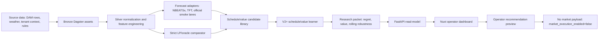
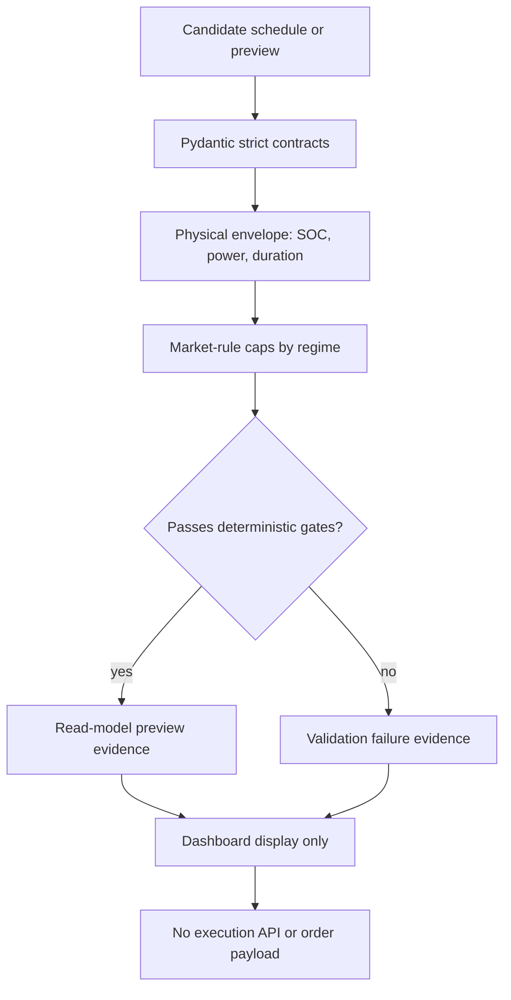
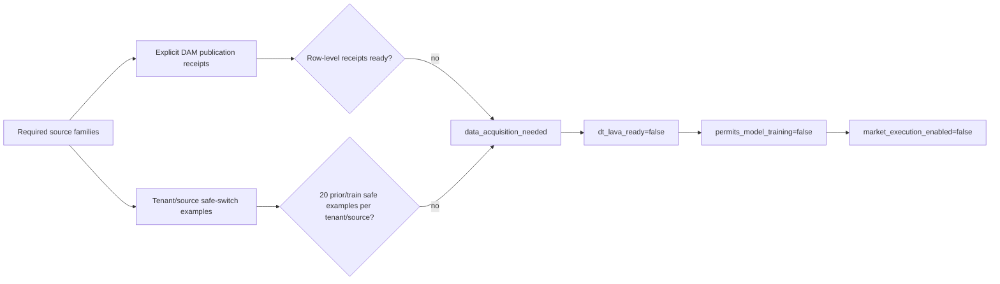
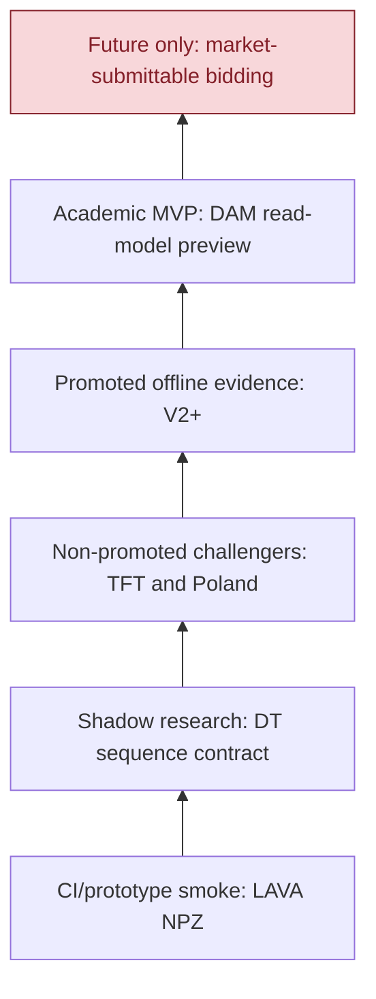

# Data Flow and Evidence Infographics

## Main System Flow

## Safety and Governance Lanes

## V13 Acquisition Gate

## Experiment Evidence Ladder

Interpretation:

- The project currently reaches the academic MVP/read-model level.
- It does not reach market-submittable bidding.
- The red future node is intentionally blocked by governance and source-readiness gates.

