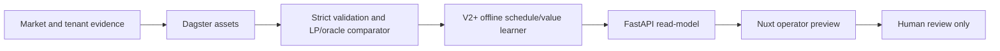
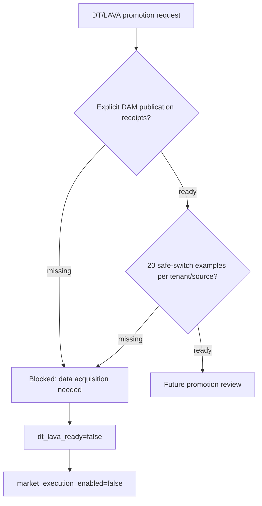
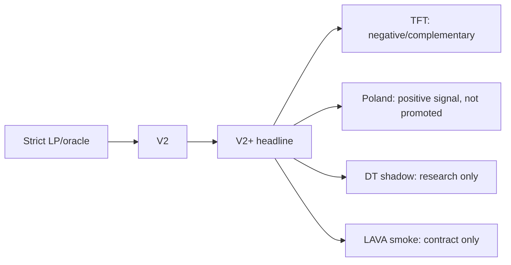

# Infographics Index

Use these visual blocks in the thesis, defense notes, or demo-day deck.

These are code-native Mermaid infographics. I kept them deterministic because the local `imagegen` skill explicitly says simple diagrams, wireframes, and repo-native visuals are better produced directly in SVG/HTML/CSS/Mermaid than as generated bitmap assets.

## 1. What the System Is

Caption:

> The MVP is a source-governed DAM recommendation preview. It produces read-model evidence for a human operator, not market-submittable bids.

## 2. What Is Blocked

Caption:

> V13 is an acquisition/source-readiness gate. It does not become a modeling result until receipt and safe-switch evidence is ready.

## 3. How to Explain Experiments

Caption:

> V2+ is the current defensible result. The other branches are useful because they show disciplined research, not because they replace the headline.
