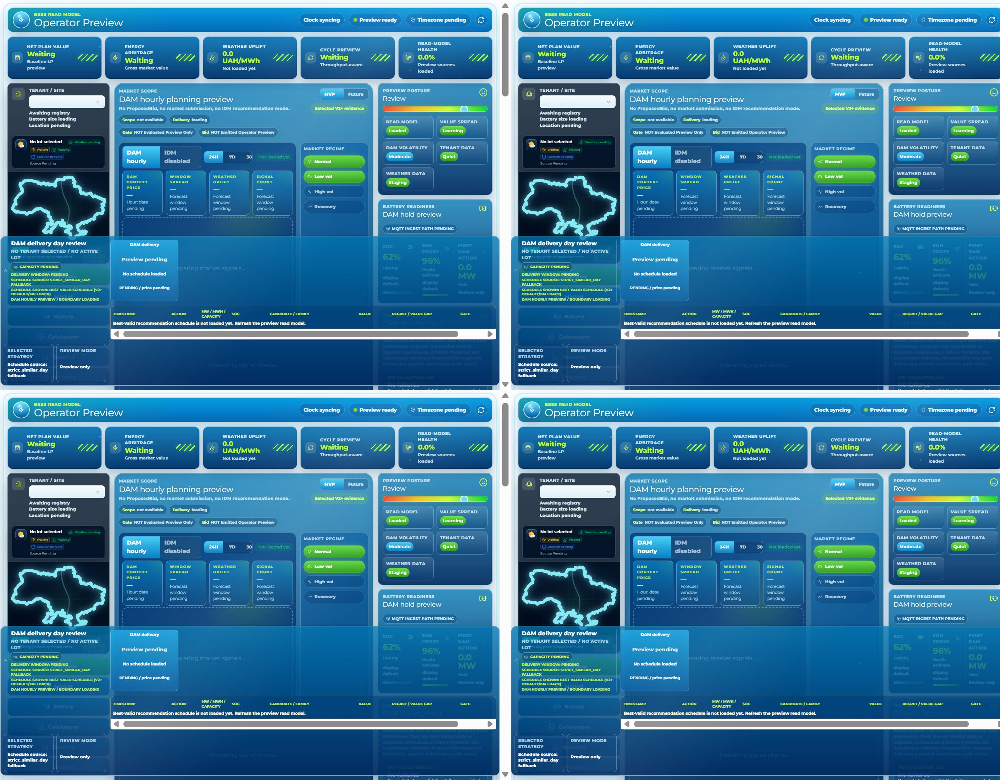
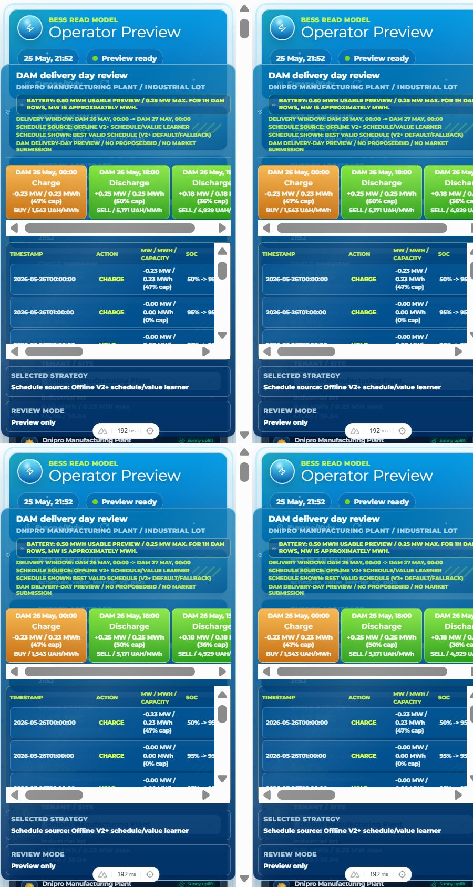

# Operator Dock C1/C2 Evidence

Date: 2026-05-25

Backlog item: C1 - Characterize current dock layout with browser evidence.

Browser path: Codex in-app Browser plugin.

Target: `http://localhost:64163/operator`

API health: `http://127.0.0.1:8010/health` returned `{"status":"ok"}`.

Dashboard route: `/operator` returned HTTP 200.

## Calibration Note

The Browser viewport capability produced CSS dimensions at about `2x` the requested width/height in the first pass. A calibrated second pass used half-size viewport requests to target desktop-like and mobile-like CSS dimensions.

Generated artifacts:

- `assets/operator_c1_measurements.json`
- `assets/operator_c1_measurements_calibrated.json`
- `assets/operator_c1_desktop_1440x1100.png`
- `assets/operator_c1_mobile_390x844.png`
- `assets/operator_c1_desktop_css_1440x1100.png`
- `assets/operator_c1_mobile_css_390x844.png`

## Desktop Result

Calibrated desktop target:

- reported viewport: `1440 x 1100`
- document client: `1410 x 1100`
- horizontal overflow: `false`
- console warnings/errors: none
- `.schedule-dock` height: `423.19px`
- `.operator-shell` bottom padding: `192px`
- dock exceeds reserved padding: `true`
- dock viewport coverage: `38.47%`
- no market-execution true wording detected
- no-market-execution/disabled wording detected

Interpretation:

The dock remains fixed and is substantially taller than the reserved bottom padding. It overlaps the underlying operator content; `elementsFromPoint` at the dock top returned `.schedule-dock` over `tenant-card`, `operator-sidebar`, `operator-body`, and `operator-frame`.

Screenshot:

## Mobile Result

Calibrated mobile-like target:

- reported viewport: `480 x 844`
- document client: `450 x 844`
- horizontal overflow: `false`
- console warnings/errors: none
- `.schedule-dock` height: `710.16px`
- `.operator-shell` bottom padding: `248px`
- dock exceeds reserved padding: `true`
- dock viewport coverage: `84.14%`
- no market-execution true wording detected
- no-market-execution/disabled wording detected

Interpretation:

At the mobile/min-width breakpoint, the dock consumes most of the visible viewport and overlays topbar/main content. This is more severe than the desktop case and should be treated as a demo-blocking layout defect.

Screenshot:

## C1 Verdict

C1 is complete. The defect is confirmed with fresh Browser evidence.

## C2 Post-Fix Evidence

Implementation:

- `.schedule-dock` now participates in normal document flow with `position: relative`.
- `.operator-shell` no longer reserves fixed bottom padding for an overlay.
- `dashboard/app/utils/operatorHudCss.test.ts` now asserts the normal-flow no-overlay contract.

Generated artifacts:

- `assets/operator-dock-browser-desktop-after.json`
- `assets/operator-dock-browser-desktop-after.png`
- `assets/operator-dock-playwright-desktop-1440x1100-after.json`
- `assets/operator-dock-playwright-desktop-1440x1100-after.png`
- `assets/operator-dock-playwright-mobile-390x844-after.json`
- `assets/operator-dock-playwright-mobile-390x844-after.png`

Post-fix checks:

- in-app Browser desktop: `.schedule-dock` is `position: relative`, `bodyBottomToDockTop=11.1873`, `horizontalOverflowPx=0`, no warning/error logs, and no forbidden market-execution wording;
- Playwright desktop `1440 x 1100`: `noDockOcclusion=true`, `noHorizontalOverflow=true`, no console/page errors;
- Playwright mobile `390 x 844`: `noDockOcclusion=true`, `noHorizontalOverflow=true`, no console/page errors.

Dashboard verification:

- `npm run typecheck` passed.
- `npm exec -- vitest run` passed: 12 files, 66 tests.

## C2 Verdict

C2 is complete. The fixed dock no longer overlays operator content on desktop or mobile evidence viewports.
