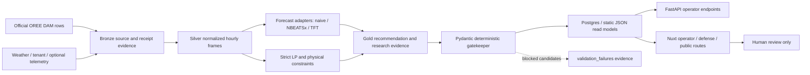

# Data flow

The control boundary ends at human-readable recommendations. The diagram does
not contain a market submission or hardware dispatch edge because the current
system does not implement one.

## Lineage expectations

- Every observed price series identifies source, delivery date, and freshness.
- Forecasts identify model, cutoff, generation timestamp, and quality boundary.
- Comparator metrics use the same frozen LP/oracle contour.
- Research artifacts identify configuration, input window, and promotion gate.
- Missing evidence stays visible as a blocker rather than falling back to a
  stronger claim.
