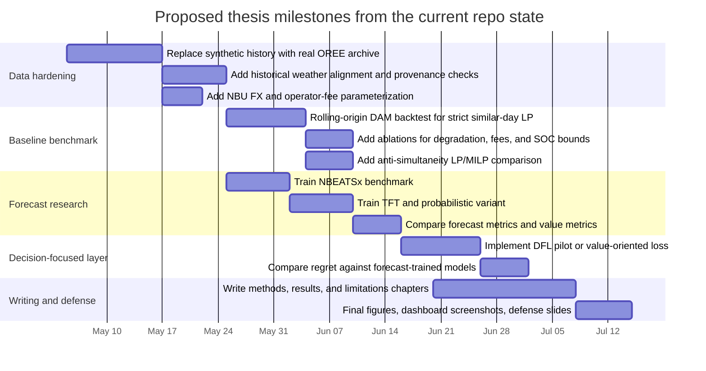
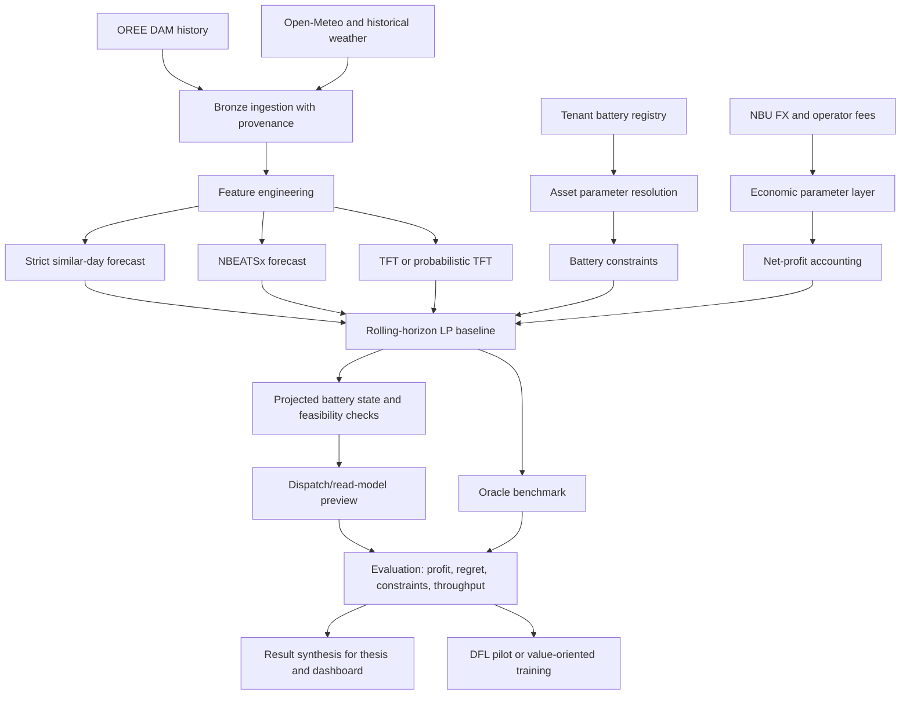

# Smart Energy Arbitrage Thesis Review for ilyafefelov/Diploma

## Executive summary

The repository `ilyafefelov/Diploma` is best understood as an **engineering-first master-thesis project on autonomous battery energy storage system automation for electricity arbitrage in Ukraine**, with a deliberately narrow initial scope: **hourly day-ahead market operation, UAH-native economics, a strict similar-day naive forecast, a rolling-horizon linear-program baseline, operator-facing API/dashboard surfaces, and oracle-regret benchmarking**. The repository’s own domain glossary and week-two report make two things explicit: the **implemented result is a Level 1 baseline MVP**, while the intended research contribution is the move toward **decision-focused learning, stronger forecasting, differentiable or surrogate clearing, and a richer digital-twin layer**. fileciteturn27file0L1-L1 fileciteturn28file0L1-L1

The strongest part of the project today is its **clear architecture and thesis narrative**. It has canonical domain schemas for bids, cleared trades, and dispatch semantics; a baseline solver using CVXPY; a projected battery-state simulator; Dagster assets spanning Bronze/Silver/Gold semantics; a FastAPI control plane; API tests; and a Nuxt dashboard surface for operator previews. The weakest part, academically, is that the current MVP still relies heavily on **synthetic historical market and weather data with only limited live overlays**, so the current system is already a convincing prototype but **not yet a claim-ready empirical study of the Ukrainian market**. fileciteturn19file0L1-L1 fileciteturn15file0L1-L1 fileciteturn17file0L1-L1 fileciteturn21file0L1-L1 fileciteturn22file0L1-L1 fileciteturn32file0L1-L1 fileciteturn16file0L1-L1

The literature strongly supports the repo’s strategic direction. For forecasting, **NBEATSx** and **TFT** are highly relevant, especially when exogenous and interpretable multi-horizon structure matter. For optimization and thesis novelty, **Smart Predict-then-Optimize** is a canonical foundation, and directly storage-specific work is now emerging in **decision-focused predict-then-bid** form. For battery economics, the repo’s current **throughput/EFC-based degradation proxy** is defensible as a first LP-ready approximation, but high-quality ageing-aware papers show exactly where a thesis should avoid overclaiming and where the next experimental step should go. citeturn0search1turn2search7turn0search0turn1search2turn1search0turn2search10turn2search1turn4search4turn4search7

The policy context is unusually important here because the repo is explicitly tied to **Ukraine 2026**. The current legal and market frame includes the Law of Ukraine “On the Electricity Market,” DAM/IDM Rules approved by NEURC Resolution No. 308, and newly updated 2026 price-cap rules under NEURC Resolution No. 621. Those external rules are not background detail; they should be treated as **thesis constraints and evaluation assumptions**. Notably, the repo’s code still encodes a **balancing-market cap of 16,000 UAH/MWh**, while the regulator’s April 2026 decision raised the balancing max cap to **17,000 UAH/MWh** effective April 30, 2026. That mismatch does not break the current DAM-only MVP, but it matters for any future multi-venue extension. citeturn6search1turn8search5turn6search0 fileciteturn19file0L1-L1

My bottom-line recommendation is to position the thesis around a **high-confidence empirical contribution**: build a **real-data Ukraine DAM benchmark** first, then compare **strict similar-day vs NBEATSx vs TFT** not only on forecast error, but on **realized net arbitrage value, oracle regret, feasibility, throughput, and degradation-adjusted profit**. That would give the thesis a clean contribution path, avoid overreach, and preserve the repo’s strongest asset: a very coherent product-and-research architecture. fileciteturn28file0L1-L1 fileciteturn21file0L1-L1 citeturn0search1turn2search7turn0search0

A brief connector audit before the external literature: GitHub was the primary evidence source; Google Drive was checked and contained at least one matching weekly thesis report plus unrelated academic materials; Network Solutions had no material effect on the academic conclusions; and **Alpaca was not exposed as a callable resource in `api_tool` discovery**, so it could not be used substantively in this environment.

## Repository-grounded thesis reconstruction

The repository’s own declared problem framing is unusually disciplined. The glossary in `CONTEXT.md` sets the system vocabulary around **Proposed Bid**, **Cleared Trade**, **Dispatch Command**, **Bid Gatekeeper**, **Projected Battery State**, **Baseline Strategy**, **Target Strategy**, and **Oracle Benchmark**. It explicitly fixes the **Level 1 Market Scope** to **hourly DAM**, requires **UAH as canonical currency**, and states that more complex work such as multi-venue bidding, finer granularity, richer forecasting, and DFL should be introduced only after the baseline is stable. That is a strong thesis architecture because it makes the MVP scientifically narrow and methodologically defendable. fileciteturn27file0L1-L1

The week-two thesis report clarifies the intended deliverable even further. It says the current project already has a **verified engineering result** in the form of a Level 1 baseline, but positions the real research goal as the transition from forecast-error-centric pipelines toward **decision-focused learning**, where the system is judged by **regret and economic outcome**, not forecast metrics alone. It also explicitly distinguishes three maturity layers: **implemented MVP baseline**, **demo-stage operator surface**, and **planned final research version**. That distinction is one of the repository’s biggest strengths and should be preserved in the written thesis. fileciteturn28file0L1-L1

The core technical spine of the codebase is compact and coherent. The following table condenses the highest-value files and modules I inspected from the repo. fileciteturn15file0L1-L1 fileciteturn16file0L1-L1 fileciteturn17file0L1-L1 fileciteturn19file0L1-L1 fileciteturn21file0L1-L1 fileciteturn22file0L1-L1 fileciteturn31file0L1-L1 fileciteturn32file0L1-L1 fileciteturn34file0L1-L1 fileciteturn35file0L1-L1 fileciteturn37file0L1-L1

| Repo area | Key files | What it does now | Thesis relevance |
|---|---|---|---|
| Domain contracts | `src/smart_arbitrage/gatekeeper/schemas.py` | Canonical market/battery/bid/dispatch schemas, venue-specific durations, price caps, validation rules | Gives the thesis a strong formal domain layer |
| Baseline optimizer | `src/smart_arbitrage/assets/gold/baseline_solver.py` | 24-hour rolling-horizon LP for hourly DAM, strict similar-day forecast, degradation-aware objective | Current baseline and natural control group |
| Battery simulator | `src/smart_arbitrage/optimization/projected_battery_state.py` | Feasible SOC trace and degradation accounting under power/SOC/efficiency constraints | Operator preview and future digital-twin seam |
| Bronze ingestion | `src/smart_arbitrage/assets/bronze/market_weather.py` | OREE DAM + Open-Meteo ingestion plus synthetic fallback and feature enrichment | Data-provenance layer, but still partly synthetic |
| MVP orchestration | `src/smart_arbitrage/assets/mvp_demo.py` | Dagster slice from DAM prices to forecast, LP, validation, oracle benchmark, MLflow logging | Most thesis-like executable artifact |
| API / dashboard | `api/main.py`, `docs/technical/API_ENDPOINTS.md`, dashboard files referenced in week-two report | Control-plane and operator-facing read models | Excellent for demonstration, secondary for core research |
| Tenant registry | `simulations/tenants.yml` | Multi-tenant battery/location assumptions for Kyiv, Lviv, Dnipro, Kharkiv, Odesa | Useful for scenario diversity, not equivalent to market participants |
| Tests | `tests/api/test_main.py`, `tests/optimization/test_degradation_accounting.py` | API contract validation and degradation-accounting consistency | Good software rigor, but limited backtesting rigor |

The baseline formulation itself is transparent and thesis-friendly. The solver requires at least **168 hourly observations**, forecasts each future hour by the **strict similar-day rule** (`t-24h` for Tue–Fri, `t-168h` for Mon/Sat/Sun), then solves a linear objective of gross market value minus degradation penalty under power and SOC constraints. It commits only the **first dispatch interval** from a full horizon, i.e. a proper rolling-horizon design. That is both explainable and easy to defend as a baseline. fileciteturn15file0L1-L1

The main academic weakness is the data path. The code currently constructs a **synthetic base market history** and overlays only limited live OREE rows for the current/next day window; similarly, the weather layer uses synthetic weather history with live forecast overlay. The repo’s own data-ingestion document is candid that OREE plus Open-Meteo with explicit provenance are enough for the first defensible Bronze layer, but the actual implementation still means much of the “history” seen by downstream models is synthetic. In practical terms, this makes the current system excellent for demo stability and architecture proof, but insufficient for strong empirical claims about Ukrainian market behavior unless the thesis upgrades the historical data layer first. fileciteturn16file0L1-L1 fileciteturn34file0L1-L1

Another important nuance is that the repo is already honest about the battery model: it is a **feasibility-and-economics preview model**, not a full digital twin. The degradation logic is a linear **throughput / equivalent-full-cycle proxy** derived from replacement cost, cycle lifetime, and battery size, and the tests verify consistent EFC accounting between the LP and simulator. That is exactly the right thing for a first benchmark, but it should be described in the thesis as a **tractable economic proxy**, not a physics-faithful ageing model. fileciteturn35file0L1-L1 fileciteturn33file0L1-L1

The repo also contains several subtle research gaps that are worth naming explicitly. The LP does **not** impose a hard binary or complementarity constraint forbidding simultaneous charge and discharge; instead, it relies on economics and efficiency losses to make such behavior unattractive. Transaction costs beyond degradation are also largely absent from the baseline objective, even though the official 2026 Market Operator tariff for DAM/IDM activity is **UAH 6.88 per MWh** plus a fixed software fee. Finally, the demo battery economics use a hard-coded **43.9129 UAH/USD** conversion rate, whereas official NBU April 2026 USD rates on the site were closer to **43.46–43.50 UAH/USD**, which is close enough for a demo but should become date-stamped or API-driven in a thesis-grade economic model. fileciteturn15file0L1-L1 fileciteturn21file0L1-L1 citeturn10search0turn11search3turn11search7

## Research literature and annotated bibliography

The literature supports a clean progression from this repository’s current MVP toward a publishable thesis. The most defensible structure is: **arbitrage economics and storage valuation** as the problem foundation, **ageing-aware optimization** as the operational realism layer, **price forecasting** as the predictive layer, and **predict-then-optimize / decision-focused learning** as the thesis novelty layer. citeturn2search1turn1search2turn1search0turn0search1turn2search7turn0search0

The following annotated bibliography prioritizes papers most directly useful for this project. Where full text is openly available, I indicate that; where it is paywalled, I say so. The directly repo-relevant preprint is included, but labeled as **not peer-reviewed**. fileciteturn30file0L1-L1

| Citation | Why it matters here | Full-text status |
|---|---|---|
| **Sioshansi, R., Denholm, P., Jenkin, T., & Weiss, J. (2009). _Estimating the value of electricity storage in PJM: Arbitrage and some welfare effects_. Energy Economics, 31(2), 269–277. DOI: 10.1016/j.eneco.2008.10.005.** | Seminal storage-arbitrage paper. It gives classic price-taking arbitrage framing and a benchmark way to think about storage value under market prices. Excellent for the thesis background chapter and for motivating why a baseline arbitrage solver is meaningful. citeturn2search1turn2search2 | Publisher page indexed; typically paywalled. |
| **Hesse, H. C., Kumtepeli, V., Schimpe, M., et al. (2019). _Ageing and Efficiency Aware Battery Dispatch for Arbitrage Markets Using Mixed Integer Linear Programming_. Energies, 12(6), 999. DOI: 10.3390/en12060999.** | Directly relevant to the repo’s degradation-aware LP. Supports the idea of embedding efficiency and ageing inside dispatch optimization, but also shows the next step beyond the current simplified proxy. citeturn1search2turn1search6 | Open access on publisher site. |
| **Maheshwari, A., Paterakis, N. G., Santarelli, M., & Gibescu, M. (2020). _Optimizing the operation of energy storage using a non-linear lithium-ion battery degradation model_. Applied Energy, 261, 114360. DOI: 10.1016/j.apenergy.2019.114360.** | Essential corrective to overclaiming. It shows nonlinear degradation effects matter materially, and therefore justifies presenting the repo’s current EFC cost as an approximation rather than a final battery model. citeturn1search0 | Open access on publisher site. |
| **Elmachtoub, A. N., & Grigas, P. (2022). _Smart “Predict, then Optimize”_. Management Science, 68(1), 9–26. DOI: 10.1287/mnsc.2020.3922.** | Foundational paper for the thesis’s move from pure forecast accuracy to decision quality. It gives the cleanest formal justification for measuring what forecast errors do to optimization outcomes. citeturn0search0 | Official publisher PDF accessible from source page. |
| **Olivares, K. G., Challu, C., Marcjasz, G., et al. (2023). _Neural basis expansion analysis with exogenous variables: Forecasting electricity prices with NBEATSx_. International Journal of Forecasting, 39(2), 884–900. DOI: 10.1016/j.ijforecast.2022.03.001.** | This is the strongest forecasting candidate already aligned with the repo. It is electricity-price-specific, uses exogenous variables, and is open access. It is the easiest serious replacement for the strict similar-day baseline. citeturn0search1 | Open access on publisher site. |
| **Lim, B., Arik, S. Ö., Loeff, N., & Pfister, T. (2021). _Temporal Fusion Transformers for interpretable multi-horizon time series forecasting_. International Journal of Forecasting, 37(4), 1748–1764. DOI: 10.1016/j.ijforecast.2021.03.012.** | Strong candidate for interpretable multi-horizon forecasting with known-future and observed exogenous features. Particularly useful if the thesis wants interpretability around weather and calendar drivers. citeturn2search7turn2search0 | Official publication metadata available; full text availability varies by access route. |
| **Jiang, H., Pan, S., Dong, Y., & Wang, J. (2024). _Probabilistic electricity price forecasting based on penalized temporal fusion transformer_. Journal of Forecasting, 43(5), 1465–1491. DOI: 10.1002/for.3084.** | Highly relevant if the thesis moves from point forecasts to uncertainty-aware bidding or robust optimization. It gives a natural bridge from pure forecasting to scenario/quantile-aware decision layers. citeturn2search10 fileciteturn30file0L1-L1 | Appears paywalled. |
| **Grimaldi, A., Minuto, F. D., Brouwer, J., & Lanzini, A. (2024). _Profitability of energy arbitrage net profit for grid-scale battery energy storage considering dynamic efficiency and degradation using a linear, mixed-integer linear, and mixed-integer non-linear optimization approach_. Journal of Energy Storage, 95, 112380. DOI: 10.1016/j.est.2024.112380.** | Especially useful for comparing linear vs MILP vs nonlinear approaches and for framing what your current LP baseline captures versus omits. This is one of the best directly adjacent papers to the repo’s optimization stack. fileciteturn30file0L1-L1 citeturn0search7 | Repo marks it as paywalled. |
| **Yi, M., Wu, Y., Alghumayjan, S., Anderson, J., & Xu, B. (2025). _A Decision-Focused Predict-then-Bid Framework for Strategic Energy Storage_. Preprint. DOI: 10.48550/arXiv.2505.01551.** | This is the closest direct match to the repo’s stated “Target Strategy.” It is not peer-reviewed, but it is the clearest blueprint for how to turn your future thesis work into a storage-specific DFL contribution. citeturn4search4turn4search7 fileciteturn30file0L1-L1 | Open preprint; not peer-reviewed. |

Taken together, these papers suggest a specific thesis pattern. **NBEATSx/TFT** should be treated as forecast candidates, **not** as the thesis contribution on their own. The contribution becomes sharper when those models are evaluated by **decision metrics** in the spirit of **Elmachtoub & Grigas**, under storage realism informed by **Hesse** and **Maheshwari**, and against a benchmark that starts with **Sioshansi-style** arbitrage logic and extends toward **Yi-style predict-then-bid** learning. citeturn0search1turn2search7turn0search0turn1search2turn1search0turn2search1turn4search4turn4search7

For the thesis, the most useful method comparison is this one. The table summarizes external literature and the repo’s current status together. fileciteturn15file0L1-L1 fileciteturn21file0L1-L1 citeturn2search1turn1search2turn1search0turn0search1turn2search7turn0search0turn4search4turn4search7

| Method family | Current repo status | Strength | Limitation | Best thesis use |
|---|---|---|---|---|
| Strict similar-day naive + LP | Implemented | Highly explainable, fast, strong baseline, low variance | Weak under structural breaks and unusual market events | Mandatory control group |
| NBEATSx + LP | Planned/research | Strong EPF performance with exogenous variables | Still forecast-centric unless evaluated by value | First serious forecast upgrade |
| TFT / penalized TFT + LP | Planned/research | Interpretable, probabilistic, multi-horizon | Heavier tuning burden, may overfit smaller histories | Uncertainty-aware candidate |
| Ageing-aware MILP / nonlinear dispatch | Not implemented | More realistic degradation and constraints | More complex and slower | Sensitivity study or “enhanced baseline” |
| SPO / DFL / predict-then-bid | Planned final target | Optimizes for decision quality, closer to thesis novelty | Highest implementation complexity and data requirements | Final contribution layer, only after benchmark is stable |

## Policy and market context

The repo is explicitly about **Ukraine 2026**, so the market and legal context should be part of the thesis core, not an appendix. The two most important official anchors are the **Law of Ukraine “On the Electricity Market”** and the **DAM/IDM Rules** approved by NEURC Resolution No. 308. The law is current in the legal database as of **15 April 2026**, and the legal terminology database explicitly includes both **“energy storage installation”** and **“energy storage system.”** The DAM/IDM Rules are current in the legal database as of **26 March 2026**. citeturn6search1turn7search1turn7search8turn8search5

The most important recent regulatory change for price-aware optimization is NEURC Resolution **No. 621 of 23 April 2026**, published on **24 April 2026** and effective **30 April 2026**. It sets DAM and IDM caps at **15,000 UAH/MWh max** and **10 UAH/MWh min**, and balancing-market caps at **17,000 UAH/MWh max** and **0.01 UAH/MWh min**. That is directly relevant for any thesis experiment involving clipping, bid validation, or benchmark normalization. citeturn6search0

This creates one concrete code-to-policy observation. The repo’s canonical schema currently sets **DAM = 15,000**, **IDM = 15,000**, and **BALANCING = 16,000 UAH/MWh**. For the current **DAM-only** implementation, that is acceptable because DAM/IDM match the live rule. But if the thesis later expands to balancing, the schema should be made **effective-date-aware**, because the regulator’s current balancing max is now **17,000**, not 16,000. fileciteturn19file0L1-L1 citeturn6search0

The repo’s own data-ingestion note also aligns well with the Ukrainian market structure. It explicitly states that for Level 1 scope, the academically correct Bronze dataset is **tenant/location-specific weather plus market-zone DAM price plus explicit provenance**, and warns against pretending that Kyiv, Lviv, Dnipro, Kharkiv, and Odesa have separate DAM prices unless later data introduce tariff, congestion, balancing, or settlement differences. That is methodologically sound, and it should be stated explicitly in the thesis because it protects the work from a common modeling mistake. fileciteturn34file0L1-L1

Recent official market-operator news is also highly relevant for thesis motivation. JSC “Market Operator” began testing its **Energy Storage Economic Dispatch Platform** on **7 October 2025**, described it as a tool for DAM/IDM arbitrage and SOC-aware simulation, and later reported that **more than 180 companies** were actively testing it by **20 March 2026**. On **29 April 2026**, the operator presented analytical work at **Energy Storage Day 2026** explicitly focused on the role of DAM arbitrage for storage development. This is strong evidence that the thesis topic is timely and not merely academic. citeturn10search2turn10search5turn10search3

There are also process and net-profit implications the repo does not yet fully model. The Market Operator announced that the 2026 tariff for DAM/IDM transaction services is **UAH 6.88 per MWh** effective **1 January 2026**, and announced a DAM/IDM settlement-mechanism update effective **1 February 2026** aimed at reducing financial risk. A thesis-grade net-profit calculation should therefore consider at least **degradation, operator fees, and any other explicit market participation costs**, rather than reporting only gross spread capture minus wear. citeturn10search0turn10search10

Finally, because the repo uses battery capital cost assumptions, it is reasonable to acknowledge adjacent EU policy. **Regulation (EU) 2023/1542** is now the EU’s governing battery sustainability framework, applies to industrial batteries, and introduces life-cycle obligations like labeling, recovery targets, and the battery passport. Separately, the EU electricity-market-design reform entered into force on **16 July 2024**. Those measures do not directly determine Ukrainian DAM arbitrage, but they matter for future alignment, storage procurement narratives, and lifecycle-cost assumptions if the thesis frames itself in an EU-integration context. citeturn9search0turn9search2turn9search3turn9search4

## Research gaps and thesis contribution design

The single largest research gap is the **historical data layer**. Right now, the repo’s most convincing artifacts are architectural and operational, but not yet empirical in a thesis-grade sense, because the “history” used for baseline and preview logic is substantially synthetic. The first concrete thesis contribution should therefore be to replace the demo data path with a **fully real OREE hourly DAM history** and a **fully real historical weather history** aligned by timestamp, while preserving provenance columns. Until that happens, any performance claim should be framed as a prototype result, not a market-study result. fileciteturn16file0L1-L1 fileciteturn34file0L1-L1

The second gap is that the current evaluation logic is still too narrow. The repo already contains an **oracle benchmark** and **regret** computation, which is exactly the right direction, but the tests mostly validate API contracts and degradation-accounting consistency rather than backtesting rigor. A thesis should therefore add a formal **rolling-origin evaluation protocol**: for each day in the backtest horizon, fit or update the forecast model on past data only, forecast the next 24 hours, solve the LP, record the schedule, and then score the result against actual realized prices. That keeps the engineering stack while turning it into publishable experimental evidence. fileciteturn21file0L1-L1 fileciteturn32file0L1-L1

The third gap is how “tenant-awareness” is being used. The tenant registry is valuable as a scenario-control device because it gives battery sizes, SOC windows, efficiencies, and site coordinates. But since Level 1 DAM price is explicitly market-zone-level, the thesis should not present tenant identity as if it were generating different historical DAM prices per city. Instead, the clean framing is: **same market-zone price, different asset parameters, different weather context, different economics**. That is a strong and defensible interpretation. fileciteturn37file0L1-L1 fileciteturn34file0L1-L1

The fourth gap is battery-model realism. The current throughput/EFC degradation proxy is good enough as a deterministic LP penalty, and the literature supports starting there, but the thesis should make a planned distinction between **baseline economics** and **enhanced ageing realism**. A good design is to keep the current proxy in the main benchmark and add one **sensitivity-analysis section** that varies capex, lifetime, cycle/day assumptions, and possibly compares the linear proxy with a more realistic ageing-aware dispatch approximation from the literature. That gives rigor without destabilizing the core benchmark. fileciteturn35file0L1-L1 citeturn1search2turn1search0

The fifth gap is that the thesis’s “future target strategy” is not yet pinned to a realistic experimental sequence. The correct sequence is not “jump to DFL immediately.” The repo itself warns against that, and the literature supports the same caution. The right flow is: **real data hardening → forecast benchmark → value benchmark → robust operational constraints → then DFL pilot**. In other words, your thesis novelty should sit on top of a credible benchmark, not substitute for the benchmark. fileciteturn27file0L1-L1 fileciteturn28file0L1-L1 citeturn0search0turn4search4turn4search7

A defensible contribution stack for the thesis would therefore look like this:

| Contribution layer | Concrete thesis question | Recommended outcome |
|---|---|---|
| Real-data baseline | Can a transparent daily rolling LP baseline earn degradation-adjusted value on Ukraine DAM? | Real-data benchmark with reproducible backtest |
| Forecast comparison | Do NBEATSx and TFT materially improve not just MAE, but net value and regret? | Forecast-vs-value comparison chapter |
| Operational realism | How sensitive are profits to degradation, fees, SOC windows, and anti-simultaneity constraints? | Robustness / ablation chapter |
| DFL pilot | Does decision-focused training reduce oracle regret relative to forecast-trained models? | Pilot contribution, even if limited in scope |

The most important metrics should be separated into forecast, decision, and operational layers. The repo already gives the seeds of this separation through its oracle/regret logic and degradation accounting, while the forecasting papers justify standard point and probabilistic metrics. fileciteturn21file0L1-L1 fileciteturn35file0L1-L1 citeturn0search1turn2search7turn2search10

| Metric family | Recommended metrics | Why it matters |
|---|---|---|
| Forecast quality | MAE, RMSE, sMAPE; Pinball loss for quantiles | Necessary, but not sufficient |
| Decision quality | Gross revenue, degradation-adjusted net revenue, oracle regret in UAH and relative terms | Core thesis metric |
| Operational feasibility | SOC violations, power-limit violations, simultaneous charge/discharge incidence, HOLD/blocked actions | Prevents “profitable but impossible” results |
| Asset stress | Throughput, EFC, degradation cost, average SOC band occupancy | Makes battery economics visible |
| Robustness | Event-day performance, outage-day performance, sensitivity to tariffs/FX/capex | Makes conclusions defendable |

## Proposed milestones and experimental workflow

The timeline below is the most realistic way to turn the existing repo into a thesis with a strong empirical core and a still-achievable research contribution. It assumes the current date of **May 4, 2026** and uses illustrative milestone dates that can be shifted as needed. The point is less the exact dates and more the **dependency order** implied by the repo and literature. fileciteturn28file0L1-L1

The experimental workflow should stay as close as possible to the repo’s clean architecture, because that is already one of its strongest assets. The diagram below converts that architecture into a thesis-grade experiment pipeline. fileciteturn21file0L1-L1 fileciteturn22file0L1-L1 fileciteturn34file0L1-L1

If I were narrowing this into three thesis experiments only, I would choose these. First, a **real-data benchmark** comparing strict similar-day vs an “always-flat” persistence baseline to show why shape-preservation matters. Second, a **forecast-upgrade study** comparing strict similar-day, NBEATSx, and TFT on both accuracy and value. Third, a **battery-economics robustness study** varying degradation assumptions, operator fees, FX rate, and SOC window. This combination would already be thesis-worthy even before a DFL pilot, and it would make a later DFL section much stronger. fileciteturn15file0L1-L1 fileciteturn21file0L1-L1 citeturn0search1turn2search7turn10search0turn11search7

## Open questions and limitations

This report is based on the **GitHub repository `ilyafefelov/Diploma` as the primary source of truth**, augmented by official market/legal sources and selected papers. I did **not** exhaustively inspect every file, and the Google Drive connector appeared to contain both matching thesis material and unrelated academic documents, so I treated the repo itself as authoritative for scope. fileciteturn28file0L1-L1

A few literature items named inside the repo’s bibliography are clearly relevant but appear paywalled in the currently inspected evidence, so I included them where title/DOI confidence was high and flagged them accordingly rather than overstating full-text availability. fileciteturn30file0L1-L1

The largest unresolved scientific question is simple: **how much of the thesis novelty should come from DFL versus from a high-quality Ukraine-specific real-data benchmark?** Based on the current state of the repo, the highest-confidence thesis path is to **land the benchmark first**, then add a modest but credible decision-focused extension. That sequencing matches both the repo’s own architecture and the strongest external literature. fileciteturn27file0L1-L1 fileciteturn28file0L1-L1 citeturn0search0turn4search4turn4search7