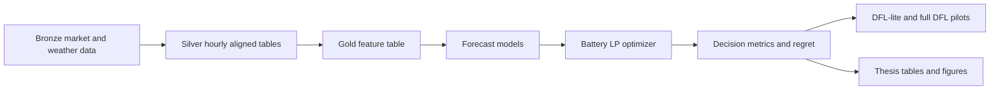
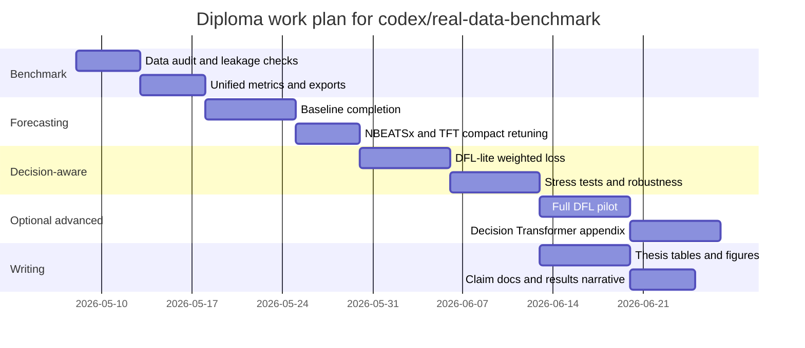

# Decision-Focused Learning and Decision-Aware Forecasting for the codex/real-data-benchmark Diploma Branch

## Executive summary

The current branch already contains the core ingredients of a strong diploma project: a reproducible medallion-style data pipeline, Ukrainian DAM arbitrage forecasting candidates, a deterministic battery dispatch optimizer, regret-based benchmarking, and research-layer scaffolding for DFL and Decision Transformer experiments. The visible repo documentation explicitly describes bronze/silver/gold layers, LP dispatch, forecast comparison, regret analysis, DFL-ready tables, relaxed-LP pilots, Decision Transformer trajectory rows, and paper-trading replay artifacts. The repo’s own technical note also makes the most important architectural choice clear: **the operational decision authority is deterministic LP**, while ML models are upstream forecast candidates and research extensions. fileciteturn5file0L1-L13 fileciteturn6file0L3-L45

The strongest current empirical result is also the most thesis-useful one: on the current thesis-grade 90-anchor benchmark, the existing `strict_similar_day` control beats the compact `nbeatsx_silver_v0` and `tft_silver_v0` candidates on downstream regret, despite the repo already having neural forecasting artifacts in place. The benchmark covers 5 tenants, 90 rolling-origin anchors, and 3 forecast candidates for 1,350 rows with observed coverage ratio `1.0`, which is a credible experimental base for a diploma. fileciteturn7file0L7-L18 fileciteturn7file0L55-L69

That means the right diploma claim is **not** “deep models beat the baseline” and **not** “I built a live trading bot.” The right claim is: **you built a reproducible decision-aware benchmark for battery arbitrage in entity["country","Ukraine","eastern europe"], showed that forecast accuracy and decision quality diverge, and demonstrated that DFL-inspired calibration can improve one important decision metric even when standard neural candidates underperform a strict operational control.** This framing is well aligned with the DFL literature, which explicitly argues that models should be judged by downstream decision quality rather than only by intermediate prediction error. fileciteturn5file0L192-L205 citeturn17search0turn0search5turn17search5

The most defensible implementation path for the diploma is therefore: **first harden the benchmark and evidence package; second add unified forecast-vs-decision diagnostics; third implement DFL-lite weighted losses; fourth, if time remains, add one full differentiable DFL or black-box PtO pilot; and only then keep Decision Transformer as an optional offline appendix.** This sequencing follows both the repo’s current architecture and the state of the literature on differentiable optimization layers, generic predict-then-optimize tooling, and offline sequence-model decision policies. citeturn10search0turn10search1turn19search0turn3search5

## Literature and research position

### Foundational DFL and predict-then-optimize

The foundational shift in this area is from **predict-then-optimize** to **decision-focused learning**. Wilder, Dilkina, and Tambe’s AAAI 2019 paper is the early canonical reference for “melding the data-decisions pipeline,” showing how to train predictive models against the quality of downstream combinatorial decisions rather than only against intermediate supervised losses. Elmachtoub and Grigas’ “Smart Predict, then Optimize” formalized a widely used regret-based surrogate perspective and helped make PtO/DFL analytically tractable for linear objective settings. The 2024 JAIR survey by Mandi and coauthors is now the best single reference for the field’s foundations, methods, benchmarks, and open problems. A particularly useful conceptual bridge for your thesis is Mandi et al.’s ICML 2022 result that frames DFL as a **learning-to-rank** problem: for many downstream objectives, the crucial issue is not pointwise accuracy everywhere, but whether the model ranks solutions or economically important time steps correctly. That is directly relevant for price arbitrage, where peaks, troughs, and their ordering matter more than flat-hour accuracy. citeturn13search24turn0search5turn17search0turn18search5turn17search5

### Forecast backbones for the diploma

NBEATSx and TFT are good forecasting backbones for this project for different reasons. NBEATSx was introduced specifically as an exogenous-variable extension of N-BEATS and was evaluated on electricity price forecasting, where the paper reports substantial gains over vanilla N-BEATS and other established methods in its benchmark study. That makes it a very defensible price-forecasting backbone for DAM data with calendar, weather, and market covariates. TFT, by contrast, is attractive because it was designed for **multi-horizon forecasting with static covariates, known future inputs, historical-only covariates, gating, feature selection, and interpretable attention**, which is exactly the structure of day-ahead arbitrage forecasting with calendar features and forecastable exogenous inputs. The modern implementation ecosystem also supports both models well: the official Nixtla documentation exposes NBEATSx with future, historical, and static exogenous inputs, while the PyTorch Forecasting documentation exposes TFT as a native multi-horizon time-series model. citeturn0search1turn20search5turn14search0turn14search3turn14search6

### Recent energy decision-aware forecasting

The energy literature is now strongly consistent with your thesis direction. Sang et al.’s 2023 preprint on electricity price prediction for ESS arbitrage is almost a direct template for your project: it proposes a decision-focused hybrid loss for price prediction, uses arbitrage regret as the downstream decision error, and reports better economic outcomes than prediction-only training. Zhang et al.’s 2024/2025 IEEE Transactions on Smart Grid paper on value-oriented renewable energy forecasting formulates forecasting for sequential dispatch as a bilevel, decision-aligned problem and shows cost improvements over accuracy-oriented point forecasting. Ellinas, Kekatos, and Tsaousoglou’s 2024 paper extends DFL to power systems with decision-dependent uncertainty. Peršak and Anjos’ 2024 work broadens the discussion from one-shot decisions to multistage decision-focused forecasting. Beichter et al.’s 2025 work is an important “future work” reference because it brings DFL-style fine-tuning to time-series foundation models in an energy optimization setting. Finally, the 2024 transformer-based energy-storage arbitrage paper in *Electric Power Systems Research* is useful because it shows that transformer-style price prediction for storage arbitrage is now a credible energy-systems research direction, even outside formal DFL. citeturn15search2turn5search8turn5search5turn15search1turn15search0turn4search0

### Optional sequential-decision methods

Decision Transformer belongs in your thesis as an **optional sequential-decision extension**, not as the main contribution. The original NeurIPS 2021 paper shows that offline RL can be reframed as conditional sequence modeling over returns, states, and actions. That is intellectually attractive for battery arbitrage, where the state is recent prices and SOC, the action is charge/discharge, and the reward is realized profit. But in your repo, the deterministic LP already serves as a transparent, auditable decision authority, which is exactly why DT should remain secondary unless you can produce a stable offline-policy evaluation section with strong controls. citeturn3search5turn6file0L3-L45

### Priority citation stack for the thesis body

If you have limited bibliography space, the sources to prioritize in the thesis body are these:

1. **Mandi et al., 2024, JAIR** for the DFL field overview and terminology. citeturn17search0turn17search5  
2. **Wilder et al., 2019, AAAI** for the foundational end-to-end DFL framing. citeturn13search24turn13search4  
3. **Elmachtoub and Grigas, 2021/2022, Management Science** for SPO and regret-based PtO framing. citeturn0search5  
4. **Olivares et al., 2023, International Journal of Forecasting** for NBEATSx in electricity price forecasting. citeturn0search1  
5. **Lim et al., 2021, International Journal of Forecasting** for TFT and multi-horizon interpretability. citeturn20search5turn3search5  
6. **Sang et al., 2023, arXiv** for the closest ESS-arbitrage DFL reference. citeturn15search2turn15search6  
7. **Zhang et al., 2024/2025, IEEE TSG** for value-oriented forecasting in energy dispatch. citeturn5search8  
8. **Agrawal et al., 2019, NeurIPS** and **CVXPYlayers docs** for differentiable optimization layers. citeturn10search0turn10search1  
9. **Tang and Khalil, 2024, Mathematical Programming Computation** for PyEPO and black-box/generic PtO tooling. citeturn19search0  
10. **Chen et al., 2021, NeurIPS** for Decision Transformer as future work. citeturn3search5

## Current repo assessment

Based on the visible README, technical note, and benchmark report, the branch is already much closer to a thesis-ready system than to a prototype. The documented architecture is a full data-to-decision pipeline: bronze market/weather/telemetry, silver hourly features, forecast candidates (`strict_similar_day`, `nbeatsx_silver_v0`, `tft_silver_v0`), LP battery dispatch, oracle/regret benchmarking, and research-layer artifacts for DFL and DT. The technical note explicitly separates **decision authority** from **research branches**, which is exactly the right discipline for an academic project in energy systems. fileciteturn5file0L1-L13 fileciteturn6file0L3-L45

The current benchmark evidence is already thesis-grade. The 90-anchor run covers five tenants, ninety rolling-origin anchors, and three forecast candidates for 1,350 evaluated rows with coverage ratio `1.0`. On this benchmark, `strict_similar_day` has the lowest mean and median regret among the three main candidates, while `tft_silver_v0` and `nbeatsx_silver_v0` both underperform it on downstream decision quality. This is not a weakness for the diploma; it is one of its cleanest scientific results. It demonstrates that plausible neural forecasters do not automatically yield better arbitrage decisions. fileciteturn7file0L7-L18 fileciteturn7file0L55-L69

The most promising existing research artifact is the horizon-aware regret calibration result. In the calibrated comparison reported in the repo, `tft_horizon_regret_weighted_calibrated_v0` beats `strict_similar_day` on **mean regret** but still loses on **median regret** and **win share**. That is exactly the kind of nuanced, publishable negative/partial-positive outcome that belongs in a master’s thesis. It says your DFL-inspired idea may help with large-value anchors or tails, but it has not yet produced a uniformly dominant operational model. fileciteturn7file0L248-L275

The repo also already contains a richer forecast-diagnostic layer than a normal forecasting project. The benchmark report says you have MAE, RMSE, sMAPE, directional accuracy, ranking quality, top-k recall, pinball loss, and price-cap diagnostics. This is excellent, because it means your next obligation is not to invent metrics but to **join forecast metrics to decision metrics in a single evidence package** and show where they agree or disagree. The report also states that `strict_similar_day` remains the dashboard default comparator, which is the correct control to preserve. fileciteturn7file0L155-L167 fileciteturn7file0L143-L150

What still needs to be closed for a diploma is mostly **not architecture**, but **thesis packaging, leakage control, and claim discipline**:

| Area | Already strong | Gap to close for diploma |
|---|---|---|
| Core pipeline | Medallion data assets, forecast candidates, LP, regret benchmarking | One reproducible “thesis evidence package” export |
| Experimental rigor | 90-anchor rolling-origin, multi-tenant, full coverage | Unified forecast-vs-decision tables and plots |
| Baselines | Strong `strict_similar_day` control already present | Add conventional ML baseline beside neural models in every final table |
| DFL contribution | Horizon-aware regret calibration is promising | One explicit DFL-lite experiment and one clearly labeled optional full-DFL pilot |
| Narrative | Claim boundaries already recognized in docs | A thesis-facing claim-boundary document and results narrative |
| Data realism | Real market/weather sources exist | Timezone, DST, and known-future leakage audit |

The most important hidden technical gap is **timestamp realism and known-future leakage**. The official site of entity["organization","Market Operator","kyiv ukraine"] exposes DAM/IDM results, hourly buying/selling prices, and price-cap information, and it explicitly notes that prices are displayed in **CET/CEST time zone**, not casually “local Ukrainian time.” That means the benchmark must explicitly test 23-hour and 25-hour DST days and distinguish raw market timestamps from normalized UTC. On the weather side, the official entity["organization","Open-Meteo","weather api provider"] Historical Weather API is ideal for reanalysis covariates, but its Historical Forecast API is even more important for a thesis because it lets you use **archived forecast-like weather inputs known at the time of decision**, which is the clean way to avoid look-ahead bias in known-future exogenous variables. citeturn9search0turn9search5turn9search7turn21search0turn21search1

## Experiment design and evaluation

Your experimental strategy should keep the current rolling-origin benchmark as the spine of the thesis. Reproduce the existing 90-anchor setup exactly for the “main results” table, then add new experiments on the same anchors or a clearly separate extension panel. That preserves comparability with the current repo evidence instead of creating a moving target. fileciteturn7file0L7-L18

### Forecast metrics

Forecast metrics should remain in the thesis, but they should be explicitly framed as **secondary diagnostics** rather than the final objective. The required set is:

| Metric | Why it stays |
|---|---|
| `MAE` | Robust average absolute error |
| `RMSE` | Peak-sensitive error; useful for spike mistakes |
| `sMAPE` | Scale-normalized error for comparability |
| `Pinball loss` at q10/q50/q90 | Needed if you produce quantiles or probabilistic forecasts |

Because the repo already computes decision-relevant forecast diagnostics, add these as **secondary supporting metrics** in an appendix or supplementary table: `directional_accuracy`, `topk_peak_recall`, `topk_trough_recall`, `ranking_quality`, and `price_cap_violation_rate`. Those are especially appropriate for arbitrage because dispatch quality depends heavily on ordering and extreme-hour identification, not just average point error. fileciteturn7file0L155-L167

### Decision metrics

Decision metrics should be the main scoreboard. Use the same battery specification across an anchor unless the stress test says otherwise, and compute realized value on **actual prices**, even when dispatch is chosen using predicted prices.

Let `c_t` be charging power, `d_t` discharging power, `p_t` realized market price, `τ` transaction cost per MWh throughput, and `κ` degradation penalty per MWh throughput. Then report

\[
\text{Profit} = \sum_t p_t (d_t - c_t) - \tau(c_t+d_t) - \kappa(c_t+d_t)
\]

\[
\text{Regret} = \text{Profit}_{oracle} - \text{Profit}_{model}
\]

\[
\text{ProfitCapture} = \frac{\text{Profit}_{model}}{\max(\text{Profit}_{oracle}, \varepsilon)}
\]

\[
\text{Throughput} = \sum_t (c_t + d_t), \qquad
\text{CycleCount} = \frac{\text{Throughput}}{2 \cdot E_{\max}}
\]

The required decision table should include:

| Metric | Interpretation |
|---|---|
| `profit_model` | Realized profit from model-based dispatch |
| `profit_oracle` | Realized profit from perfect-foresight dispatch |
| `regret` | Lost value versus oracle |
| `profit_capture` | Fraction of oracle value captured |
| `win_rate_vs_strict` | Share of anchors where candidate beats `strict_similar_day` |
| `rank1_share` | Share of anchors where candidate is best among all evaluated models |
| `cycle_count` | Full equivalent cycles; operational realism |
| `throughput_mwh` | Useful for degradation and aggressiveness |

A very important thesis correction is to **define win rate precisely**. Your current repo tables report a “win rate,” but for the thesis you should distinguish between “beats the operational control” and “best among all candidates.” Otherwise the reader cannot interpret whether 22% means “rarely best” or “rarely beats the baseline.”

### Stress tests

The stress-test matrix should be explicit and finite. Use one base battery configuration plus a small grid:

| Factor | Levels |
|---|---|
| Round-trip efficiency | 0.85, 0.90, 0.95 |
| Energy capacity | 1, 2, 5 MWh |
| Power rating | 0.5C, 1C |
| Transaction cost | 0, 25, 50, 100 UAH/MWh |
| Degradation penalty | 0, 50, 100, 200 UAH/MWh throughput |
| Terminal SOC rule | free, equal-to-initial, within band |
| Horizon | 12h, 24h, 48h |
| Regime split | cap-adjacent vs non-cap, DST windows, seasonal splits |

The official market site’s explicit publication of price caps and CET/CEST timing makes the `price_caps_flag` regime split and DST stress test non-negotiable for a thesis-quality Ukrainian DAM benchmark. citeturn9search0turn9search5

### Experiment matrix

Your experiment program should be compact and layered:

| Experiment | Main question | Expected output |
|---|---|---|
| Forecast benchmark | Which forecaster is best on MAE/RMSE/sMAPE/pinball? | `forecast_metrics_summary.csv` |
| Decision benchmark | Which forecaster is best after LP dispatch? | `decision_metrics_summary.csv` |
| Forecast-vs-decision join | Do lower errors imply lower regret? | `rmse_vs_regret.png`, `mae_vs_regret.png` |
| DFL-lite | Does weighted training reduce regret? | paired before/after tables |
| Stress tests | Are findings robust to battery and cost assumptions? | `stress_test_results.csv` |
| Optional full DFL | Can solver-aware training beat DFL-lite? | pilot appendix |
| Optional DT | Can offline trajectory modeling rival LP-based dispatch? | appendix only |

## Implementation specification for codex/real-data-benchmark

### The design principle

Do **not** rewrite the existing architecture. Extend it in place and expose a thin, thesis-friendly interface on top of it. The repo already has the right conceptual structure; what it needs is a stable benchmark entrypoint, cleaner output tables, stronger leakage checks, and one disciplined DFL path. fileciteturn5file0L1-L13 fileciteturn6file0L3-L45

### Recommended pipeline diagram



### Data pipeline tasks

The official market source already provides DAM/IDM result pages, hourly buying and selling prices, and price-cap information. The key implementation requirement is therefore not data-source discovery but **clean materialization and timestamp discipline**. Weather covariates should be split into **reanalysis** for descriptive experiments and **historical forecast** covariates for leakage-safe known-future experiments. citeturn9search5turn9search0turn21search0turn21search1

**Bronze layer** should preserve raw source files exactly:
- DAM hourly prices/results
- IDM hourly prices/results
- price caps / cap-change notices if available
- raw weather JSON/CSV from Open-Meteo
- ingestion metadata (`source`, `retrieved_at`, `raw_timezone`, `checksum`)

**Silver layer** should produce one canonical hourly table with these minimum fields:

```text
market_timestamp_raw
market_timezone_raw
timestamp_utc
delivery_date
delivery_hour_local
dam_price_uah_per_mwh
idm_price_uah_per_mwh
dam_volume_mwh
idm_volume_mwh
price_cap_upper
price_cap_lower
price_cap_flag
temperature_2m
cloud_cover
wind_speed_10m
precipitation
hour
day_of_week
month
is_weekend
holiday_flag
tenant_id
battery_capacity_mwh
battery_power_mw
eta_charge
eta_discharge
```

**Gold layer** should be leakage-safe and forecasting-ready:

```text
timestamp_utc
target_price
horizon
tenant_id

price_lag_1
price_lag_2
price_lag_24
price_lag_48
price_lag_168

rolling_mean_24
rolling_std_24
rolling_min_24
rolling_max_24
rolling_mean_168
rolling_std_168

dam_volume_lag_24
idm_price_lag_24
spread_dam_idm_lag_24

temperature_2m
cloud_cover
wind_speed_10m
precipitation

hour_sin
hour_cos
dow_sin
dow_cos
month_sin
month_cos
holiday_flag
is_weekend

known_future_calendar_features
known_future_weather_features_if_historical_forecast_available
```

The three tests that matter most here are:
- `test_no_duplicate_or_missing_hours.py`
- `test_dst_23_25_hour_days.py`
- `test_known_future_feature_leakage.py`

If historical load forecasts do not exist for the same decision timestamp, treat load as historical-only covariates, not known-future covariates.

### Baseline models and configurations

For the diploma, the final comparison set should be:

- `strict_similar_day`  
- `seasonal_naive_24`  
- `seasonal_naive_168`  
- `lightgbm` or `catboost`  
- `nbeatsx_silver_v0`  
- `tft_silver_v0`  
- `nbeatsx_dfl_lite_v0`  
- `tft_dfl_lite_v0`

Keep `strict_similar_day` as the official operational control because the repo’s current evidence shows it is genuinely strong and still the default comparator. fileciteturn7file0L143-L150

Recommended **NBEATSx** config for first-pass thesis experiments:
- horizon `h = 24`
- `input_size = 168` and `336`
- exogenous lists: calendar + weather + tenant static battery params
- loss: `MAE` first; optional quantile loss for probabilistic run
- one compact grid first, then one larger grid only if the model becomes competitive

This is realistic because NBEATSx natively supports future, historical, and static exogenous variables and is already positioned as an electricity-price-forecasting architecture. citeturn14search0turn0search1

Recommended **TFT** config for first-pass thesis experiments:
- `max_encoder_length = 168` or `336`
- `max_prediction_length = 24`
- hidden size `32` or `64`
- attention heads `4`
- dropout `0.1`
- loss: `MAE` or `QuantileLoss` if intervals are produced
- static covariates: tenant/battery characteristics
- known future covariates: calendar, and only forecast-available weather inputs

TFT is justified because the architecture is explicitly built for static features, known future inputs, and historical observed inputs, which matches DAM forecasting semantics. citeturn20search5turn14search3

### Battery LP specification

Keep the evaluation optimizer deterministic, transparent, and thesis-readable. A continuous LP is enough for the main benchmark.

Variables for each hour \( t \):
- \( c_t \ge 0 \): charge
- \( d_t \ge 0 \): discharge
- \( s_t \): state of charge

Constraints:
\[
0 \le s_t \le E_{\max}
\]
\[
0 \le c_t \le P^{ch}_{\max}
\]
\[
0 \le d_t \le P^{dis}_{\max}
\]
\[
s_t = s_{t-1} + \eta_{ch} c_t - \frac{d_t}{\eta_{dis}}
\]

Terminal condition:
- either \( s_T = s_0 \), or
- \( |s_T - s_0| \le \delta \)

Objective for planning on predicted prices \( \hat{p}_t \):
\[
\max \sum_t \hat{p}_t(d_t - c_t) - \tau(c_t+d_t) - \kappa(c_t+d_t)
\]

Evaluation must always use realized prices \( p_t \), not \( \hat{p}_t \), when computing final profit.

Implementation note: if you keep the LP continuous and convex, simultaneous charge/discharge is usually discouraged by efficiency losses and throughput penalties; if degeneracy remains, add a tiny throughput regularizer. This is especially important if you later differentiate through the optimization layer. That practice is consistent with differentiable convex optimization tooling such as CVXPYlayers. citeturn10search0turn10search1

### DFL-lite weighted-loss recipe

Your safest thesis contribution is a **DFL-lite** method that does not require full differentiable optimization.

For each rolling anchor on the training set:
1. Run **oracle dispatch** on true prices.
2. Extract an hourly importance weight from that dispatch.
3. Train the forecast model with a hybrid loss that emphasizes hours that matter most for arbitrage.

Recommended weight:
\[
w_t = 1
+ \lambda_a \cdot |c^{oracle}_t - d^{oracle}_t|
+ \lambda_e \cdot \mathbf{1}\{t \in \text{top/bottom-}k \text{ actual price ranks}\}
+ \lambda_c \cdot \mathbf{1}\{\text{near price cap}\}
\]

Recommended loss:
\[
L = \alpha \cdot \text{MAE}(y,\hat y)
+ \beta \cdot \frac{\sum_t w_t |y_t-\hat y_t|}{\sum_t w_t}
+ \gamma \cdot L_{rank}
\]

where \(L_{rank}\) is optional and can be a simple top-k peak/trough ranking consistency loss motivated by the DFL-as-learning-to-rank perspective. This recipe is directly aligned with your repo’s existing horizon-aware calibration direction and with the DFL literature’s emphasis on decision-aligned surrogates rather than uniform pointwise error. fileciteturn7file0L248-L275 citeturn18search5turn15search2

What to compare:
- `train_for_error`: MAE/RMSE objective only
- `train_for_decision`: weighted DFL-lite objective
- same model class, same anchor split, same LP evaluator

This is the cleanest ablation in the whole thesis.

### Path to full differentiable DFL

If time remains, implement **one** of these paths, not both fully.

**Path A: differentiable LP with CVXPYlayers**
- Keep the downstream optimizer a convex continuous LP.
- Use predicted price vector as the optimization parameter.
- Differentiate through the LP solution into the forecasting network.
- Preserve the standard, non-differentiable oracle evaluation for final metrics.

This path is elegant and academically strong, but it is numerically sensitive and requires a carefully DPP-compliant convex formulation. CVXPYlayers exists precisely for this use case. citeturn10search0turn10search1turn14search7

**Path B: black-box / surrogate PtO with PyEPO**
- Cast battery arbitrage as an LP whose objective coefficients are predicted prices.
- Use a PyTorch forecasting backbone and a PyEPO decision loss such as SPO+, differentiable black-box, PFYL, or perturbation-based methods.
- Keep evaluation with the repo’s standard LP dispatcher and realized profit/regret metrics.

This path is often faster to prototype if the project is already PyTorch-centric and you want generic PtO losses without hand-building a solver layer. PyEPO’s explicit support for surrogate decision losses and black-box methods makes it especially relevant here. citeturn19search0

For the thesis, label either one as **“full DFL pilot”** and keep DFL-lite as the main applied contribution unless the pilot clearly dominates.

### Decision Transformer optional plan

Only add this if the benchmark and DFL-lite sections are already complete.

Offline trajectory design:
- **State**: recent prices, forecast vector, SOC, tenant battery params, calendar, weather
- **Action**: charge, discharge, or signed power
- **Reward**: realized arbitrage profit minus costs
- **Trajectory sources**: oracle LP, strict baseline LP, calibrated LP

Evaluation:
- offline policy rollout on held-out anchors
- compare against `strict_similar_day` LP and calibrated LP
- no live trading claim

This remains an appendix-level contribution because the repo’s own architecture makes LP the primary decision authority. citeturn3search5turn6file0L3-L45

### Files, tests, and CLI to add

Under the current architecture, add or standardize thin wrappers at these stable paths:

```text
src/decision/battery_lp.py
src/decision/metrics.py
src/dfl/weighted_losses.py
src/dfl/oracle_weights.py
src/experiments/run_real_data_benchmark.py
scripts/run_full_benchmark.py
scripts/export_thesis_evidence.py
docs/thesis/CLAIM_BOUNDARIES.md
docs/thesis/RESULTS_NARRATIVE.md

tests/test_battery_lp.py
tests/test_decision_metrics.py
tests/test_oracle_weights.py
tests/test_dst_alignment.py
tests/test_known_future_leakage.py
tests/test_thesis_evidence_export.py
```

The command you want the thesis to rely on is:

```bash
uv run python scripts/run_full_benchmark.py --config configs/experiment_real_data.yaml
```

That wrapper should:
1. materialize or update the gold dataset,
2. run all selected forecast models,
3. run LP dispatch and regret evaluation,
4. run the stress-test grid,
5. export thesis tables and figures.

## Milestones and thesis deliverables

### Milestone plan

| Milestone | Scope | Effort | Deliverables |
|---|---|---|---|
| Benchmark hardening | timestamp audit, leakage checks, stable exports | Low–Medium | validated gold dataset, reproducible run |
| Unified metrics package | join forecast and decision metrics | Low | `model_comparison_main.csv`, `tenant_model_comparison.csv` |
| Baseline completion | strict + naive + LightGBM/CatBoost + NBEATSx/TFT | Medium | forecast and decision benchmark tables |
| DFL-lite | oracle-weighted losses and ablation | Medium | before/after regret comparison |
| Stress tests | efficiency/capacity/cost/regime grid | Medium | `stress_test_results.csv` |
| Full DFL pilot | CVXPYlayers or PyEPO | High | appendix method and pilot table |
| DT optional appendix | offline sequence-model policy | High | appendix only |
| Thesis evidence package | plots, claim docs, results narrative | Low | defense-ready materials |

### Timeline



### Required tables and figures

Use **matplotlib** for all static thesis figures and **mermaid** for timeline/system diagrams.

Required output tables:

```text
reports/thesis/tables/model_comparison_main.csv
reports/thesis/tables/tenant_model_comparison.csv
reports/thesis/tables/forecast_metrics_summary.csv
reports/thesis/tables/decision_metrics_summary.csv
reports/thesis/tables/stress_test_results.csv
reports/thesis/tables/claim_boundary_matrix.csv
```

Recommended columns for `model_comparison_main.csv`:

```text
model
rows
forecast_mae
forecast_rmse
forecast_smape
pinball_q10
pinball_q50
pinball_q90
directional_accuracy
topk_peak_recall
mean_profit_uah
mean_oracle_profit_uah
mean_regret_uah
median_regret_uah
profit_capture
win_rate_vs_strict
rank1_share
cycle_count
claim_status
```

Required figures:

```text
reports/thesis/figures/rmse_vs_regret.png
reports/thesis/figures/mae_vs_regret.png
reports/thesis/figures/directional_accuracy_vs_regret.png
reports/thesis/figures/profit_by_model.png
reports/thesis/figures/mean_regret_by_model.png
reports/thesis/figures/median_regret_by_model.png
reports/thesis/figures/soc_timeline_anchor_<id>.png
reports/thesis/figures/dispatch_overlay_anchor_<id>.png
reports/thesis/figures/price_vs_action_anchor_<id>.png
reports/thesis/figures/stress_test_heatmap_<factor>.png
```

The single most important plot in the thesis is **RMSE vs regret**. That figure visually demonstrates the central argument of DFL: better forecast error does not necessarily imply better downstream decisions.

## Risks, assumptions, and immediate next commits

The largest methodological risk is not model choice, but **evaluation realism**. If future realized weather or load variables leak into known-future covariates, the entire forecast benchmark becomes overly optimistic. If market timestamps are normalized incorrectly, especially around CET/CEST clock changes, your rolling horizons and dispatch windows are wrong. And if the thesis overclaims DFL or DT relative to the actual evidence, the defense becomes fragile. The good news is that the repo already seems aware of claim boundaries; you need to make that discipline even more explicit in the final evidence package. fileciteturn5file0L192-L205 citeturn9search0turn21search1

### Key assumptions and mitigations

| Assumption or unknown | Why it matters | Mitigation |
|---|---|---|
| Exact battery specs per tenant are not fixed in the prompt | decision metrics depend on capacity/power/efficiency | version battery specs in `configs/battery.yaml` and report them in every table |
| Exact dataset date range is not stated here | regime splits and sample size depend on it | add `dataset_version`, `train_start`, `train_end`, `test_start`, `test_end` to every export |
| Historical load forecasts may be unavailable | future load covariates can leak | treat load as historical-only unless archived forecasts exist |
| Raw OREE timezone may be misunderstood | DST and anchor alignment risk | store raw timezone plus normalized UTC; add DST tests |
| Neural candidates may continue losing to strict baseline | tempting to overfit or overclaim | frame negative result as a valid scientific finding |
| Full DFL may be numerically unstable | solver-layer training can fail late | keep DFL-lite as required contribution and full DFL as optional pilot |
| DT may need more trajectories than available | offline RL can underperform | keep DT in appendix unless evaluation is clearly competitive |

### Immediate next commit checklist

1. **Add the thesis evidence wrapper**: `scripts/run_full_benchmark.py` and `scripts/export_thesis_evidence.py`.  
2. **Freeze and document the main benchmark**: preserve the current 90-anchor rolling-origin setup as the official primary comparison.  
3. **Add the unified tables**: forecast metrics, decision metrics, and one merged model-comparison table.  
4. **Implement leakage and DST tests** before any new model runs.  
5. **Implement DFL-lite oracle-weighted loss** for one neural model first, preferably TFT because your repo already has a promising horizon-aware calibration direction.  
6. **Export the core thesis plots** with matplotlib.  
7. **Write `docs/thesis/CLAIM_BOUNDARIES.md` and `docs/thesis/RESULTS_NARRATIVE.md`** before writing the final thesis chapter text.  

### Reproducible full-benchmark command

```bash
uv run python scripts/run_full_benchmark.py --config configs/experiment_real_data.yaml
```

That command should become the single documented way to reproduce the full diploma benchmark on `codex/real-data-benchmark`: data materialization, forecasting, LP dispatch, regret evaluation, stress tests, and thesis evidence export.