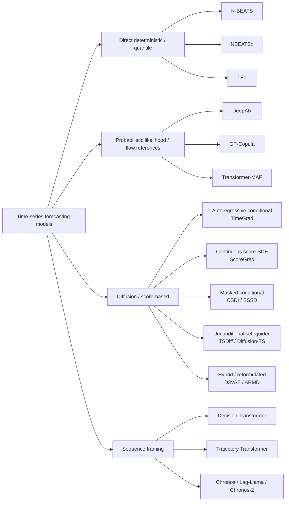
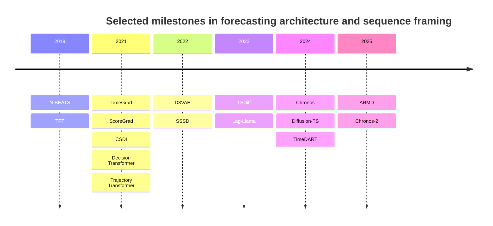

# Diffusion-Based Generative Modeling and Sequence Framing for Multivariate Time-Series Forecasting

## Executive summary

The current forecasting landscape splits into three practically distinct regimes. First, **strong direct baselines** such as N-BEATS/NBEATSx and TFT remain extremely competitive when the goal is accurate point or quantile forecasts with low-latency inference, especially when known-future covariates and static metadata matter. N-BEATS established a very strong residual-MLP baseline on competition benchmarks such as M3/M4/Tourism, while NBEATSx extended that design to exogenous variables and reported near-20% gains over original N-BEATS on electricity price forecasting tasks. TFT, in turn, combined variable selection, gated residual networks, recurrent local processing, and interpretable attention, and reported statistically significant q-risk improvements across Electricity, Traffic, Volatility, and Favorita. citeturn40search0turn39search3turn35search0turn38view0turn37view1

Second, **diffusion and score-based models** are strongest when the problem truly requires *multivariate trajectory uncertainty*, flexible non-Gaussian predictive distributions, or conditioning through masks/partial observations. TimeGrad introduced autoregressive conditional diffusion for multivariate probabilistic forecasting and achieved state-of-the-art CRPS-sum on most of its six benchmark datasets. ScoreGrad generalized this idea to continuous-time SDE score modeling and improved robustness to the diffusion discretization choice, while CSDI reframed forecasting as conditional masked imputation and was especially strong on Electricity and Traffic. TSDiff then pushed the field toward *task-agnostic unconditional diffusion* with self-guidance at inference, supporting forecasting, refinement, and synthetic-data generation from one model; ARMD is a newer attempt to reduce the inference burden and align diffusion dynamics more closely with time-series evolution, reporting large speedups over prior diffusion forecasters on ETTm1. citeturn12view0turn17view0turn21view0turn22search5turn25view0turn29view3

Third, **sequence framing** broadens what “forecasting” even means. Decision Transformer and Trajectory Transformer showed that sequential prediction can often be treated as conditional sequence generation rather than explicit dynamic programming. In time-series forecasting, foundation-style sequence models such as Chronos and Lag-Llama apply the same principle to forecast generation, and newer work such as Chronos-2 extends the idea toward multivariate and covariate-informed zero-shot forecasting. These models often sacrifice explicit structural interpretability in exchange for flexible conditioning and transfer. citeturn43search6turn34search0turn34search5turn34search2turn34search13

The most important practitioner takeaway is simple. If you need **fast, production-grade forecasting with rich known-future covariates and interpretability**, start with TFT and NBEATSx. If you need **well-calibrated multivariate uncertainty and can afford iterative generation**, diffusion models are justified. If you need **zero-shot or few-shot generalization across tasks**, sequence/foundation models are becoming compelling, but for strictly multivariate covariate-rich forecasting the strongest mature designs are still TFT on the direct side and CSDI/TimeGrad/TSDiff/ARMD on the diffusion side. citeturn35search0turn39search3turn12view0turn21view0turn25view0turn29view3turn34search13

## Scope and evaluation frame

The papers reviewed here use overlapping but not identical task definitions, datasets, and metrics. Direct forecasters such as TFT often report **quantile loss / q-Risk** because they output forecast quantiles directly. Diffusion papers often report **CRPS** or **CRPS-sum**, precisely because several competing generative baselines do not expose tractable likelihoods. Hybrid methods such as D3VAE frequently report **MSE** and **CRPS**, while newer long-term forecasting papers on ETT-style datasets often default to **MSE/MAE**. This fragmentation is one reason cross-paper comparisons are informative but not fully apples-to-apples. citeturn11view1turn15view2turn37view3turn33view2turn29view0

A useful way to think about the design space is the following taxonomy.

The short historical arc is equally revealing.

The datasets most relevant to this comparison are summarized below.

| Dataset | Typical role in these papers | Representative reported setups |
|---|---|---|
| **Electricity** | Multivariate probabilistic forecasting benchmark, also used by TFT | 370 hourly dimensions, 24-step horizon in TimeGrad/ScoreGrad/CSDI-family setups; TFT reports q-Risk on Electricity as a “simpler” dataset. citeturn12view1turn17view1turn21view0turn38view1turn38view0 |
| **Traffic** | Multivariate probabilistic forecasting benchmark, covariate-rich enough for TFT-style analysis | 963 hourly dimensions, 24-step horizon in TimeGrad/ScoreGrad/CSDI-family setups; TFT reports q-Risk on Traffic. citeturn12view1turn17view1turn21view0turn38view1turn38view0 |
| **M4** | Large univariate competition benchmark for direct models; also used in TSDiff | N-BEATS reported improvements over the M4 winner; TSDiff reports CRPS on M4 in its forecasting setup. citeturn40search0turn25view0 |
| **ETTh1 / ETTh2 / ETTm1 / ETTm2** | Long-term forecasting benchmarks emphasized by newer diffusion and transformer papers | ARMD compares diffusion models and non-diffusion long-sequence baselines on these datasets using MSE/MAE. citeturn29view0turn29view2 |
| **Taxi / Wikipedia / Exchange / Solar** | Common in multivariate probabilistic forecasting papers | Used heavily by TimeGrad, ScoreGrad, CSDI, and TSDiff. citeturn12view1turn17view1turn21view0turn25view0 |

## Strong deterministic and probabilistic baselines

The direct-model story is not just historical context; it is the control group that keeps newer diffusion claims honest. N-BEATS showed that a deep residual MLP with backward and forward residual links can outperform heavy statistical hybrids on heterogeneous forecasting competitions, without explicit recurrence or attention. NBEATSx kept that residual decomposition but inserted exogenous pathways. TFT solved a different problem class: multi-horizon forecasting with static features, observed history, and known future inputs, while also exposing interpretable variable selection and temporal attention. Together, these three models define the strongest non-diffusion baseline family for modern practice. citeturn40search0turn39search3turn35search0turn37view4turn37view1

### Baseline method cards

| Method | Core idea and schematic | Training objective | Conditioning strategy | Output type | Computational cost | Strengths / weaknesses | Reproducibility resources |
|---|---|---|---|---|---|---|---|
| **N-BEATS** | `history window -> deep FC block -> backcast + forecast`; forecasts from stacked residual blocks are summed. Two main variants: generic and interpretable trend/seasonality bases. | Supervised point-forecast loss; the original paper focuses on competition forecasting accuracy rather than full probabilistic likelihoods. | Past target window only in the original architecture. | Point forecasts; interpretable decomposition in the interpretable variant. | **Training/inference:** one forward pass through stacked MLP blocks; no iterative sampling. Relative latency is low. | Excellent baseline for point forecasting; surprisingly strong even without time-series-specific operators. Main limitation: original model is univariate and not designed around rich future covariates or joint multivariate uncertainty. | Original paper and official code from entity["organization","ServiceNow","software company"]. Repo: `servicenow/n-beats`. citeturn40search0turn39search0 |
| **NBEATSx** | `history + exogenous features -> residual MLP stacks with trend / seasonality / exogenous blocks -> summed forecast + decomposition`. | Supervised direct forecasting loss; official modern implementation defaults commonly use MAE. | Supports **future exogenous**, **historical exogenous**, and **static exogenous** inputs. | Point forecasts plus interpretable decomposition into trend, seasonality, and exogenous effects. | **Training/inference:** still single-pass MLP-style; latency remains attractive. | Strong when exogenous variables matter and you still want the simplicity and decomposition of N-BEATS. Weakness: uncertainty is not native in the original design. | Original EPF paper; official repo `cchallu/nbeatsx`; maintained implementation in NeuralForecast documents concrete parameters such as `stack_types`, `mlp_units`, `learning_rate=1e-3`, `batch_size=32`, and `max_steps=1000`. citeturn39search3turn41view0turn41view1 |
| **TFT** | `static / past observed / known future inputs -> variable selection networks -> LSTM local encoder/decoder -> interpretable multi-head attention -> quantile heads`. | Summed **quantile loss** across forecast horizons and quantiles. | Explicitly handles **static metadata**, **observed past inputs**, and **known future inputs**. | Quantile forecasts (e.g., P50/P90), hence interval forecasts directly. | **Training/inference:** one forward pass, but attention adds quadratic dependence on sequence length; typically far faster than diffusion sampling at inference. | Best-in-class when covariates are rich and interpretability matters. Weaknesses: heavier than N-BEATS and still not as flexible as fully generative diffusion models for multimodal uncertainty. | Primary source is the paper. In the reviewed sources, I did not identify a canonical paper-linked checkpoint release, but the architecture is widely implemented in open-source forecasting libraries. Paper-reported dataset splits and significance tests support reproducibility. citeturn35search0turn37view1turn37view4turn38view0turn38view1 |

TFT’s reported gains are best read as evidence that **conditioning design matters as much as backbone choice**. On Electricity and Traffic, the paper reports P50 losses of 0.055 and 0.095, respectively, and statistically significant improvements over the next best baseline; the same table shows similarly strong performance on Volatility and Favorita. What makes TFT operationally valuable is not just the q-Risk, but the fact that the model explicitly distinguishes variables by *availability in time* and *semantic role*. citeturn38view0turn37view1turn37view2turn37view4

## Diffusion and score-based forecasters

Time-series diffusion papers differ along three axes. The first is **autoregressive vs non-autoregressive generation**. TimeGrad is autoregressive over forecast time steps; CSDI is non-autoregressive over a masked target region; TSDiff is unconditional at training time but conditioned by guidance at inference time. The second is **discrete DDPM vs continuous SDE score modeling**. TimeGrad is DDPM-style; ScoreGrad makes the SDE formulation explicit. The third is **what the model is conditioned on**: hidden states from an encoder, observed masks, arbitrary partial trajectories, or even a base forecaster’s prediction. citeturn9view0turn14view0turn18view0turn23view0turn28view0

### Diffusion and score-based method cards

| Method | Core idea and schematic | Training objective | Conditioning strategy | Output type | Computational cost | Strengths / weaknesses | Reproducibility resources |
|---|---|---|---|---|---|---|---|
| **TimeGrad** | `past + covariates -> LSTM hidden state h_t -> conditional DDPM denoiser -> sample next x_t`; repeat autoregressively across horizon. | DDPM-style denoising objective / variational lower bound, implemented as noise-prediction MSE at sampled diffusion times. | Past history via RNN hidden state; known covariates available for all time points. | Samples from the full predictive distribution; evaluated with CRPS-sum. | In paper: `N=100` diffusion steps, `S=100` sampled trajectories, batch size `64`, context length = prediction length; sampling loops over the denoiser `N` times for each horizon step. citeturn10view0turn11view1 | Flexible multivariate uncertainty modeling, strong benchmark results. Weaknesses are slow inference and autoregressive error accumulation over long horizons. | Paper is primary source. Public implementations surfaced in the PyTorchTS ecosystem and community repos, but later diffusion papers and user reports suggest reproduction is less turnkey than for later official repos. citeturn12view0turn11view1turn8search0turn8search21turn8search17 |
| **ScoreGrad** | `past + covariates -> feature extractor F_t (e.g., GRU) -> conditional score network -> reverse SDE / ODE sampler`. | Conditional score matching on continuous-time SDEs. | Same broad conditioning logic as TimeGrad, but through a continuous-time score model. | Samples; CRPS-sum in the paper. | Training window = `2 × prediction length`; 2-layer GRU; hidden state size `40` on Exchange/Solar/Electricity and `128` on larger datasets. Fast sampling option in the official repo uses about `20` steps and claims up to `4.9×` speedup. citeturn17view1turn13search7 | More robust than TimeGrad to discretization length; stronger or tied on most shared CRPS-sum benchmarks. Still iterative at inference. | Official repo from authors. Repo: `yantijin/ScoreGradPred`. citeturn17view0turn17view1turn13search7 |
| **CSDI** | `observed values + mask + timestamps -> 2D temporal attention + feature attention -> conditional diffusion over missing/future targets`. | Conditional score-based diffusion; self-supervised masking splits observations into conditioning set and target set. | Conditions directly on observed values and masks; for forecasting, future time points are treated as masked targets using the **test-pattern strategy**. | Samples; CRPS / CRPS-sum depending task. | Diffusion step `T=50`; attention factorization over temporal and feature axes. Computationally non-autoregressive over the forecast region, but each reverse diffusion step still processes the full masked tensor. | Very elegant unification of imputation, interpolation, and forecasting; particularly strong on Electricity and Traffic. Weakness: transformer attention can be expensive for long/high-dimensional sequences. | Official repo from entity["organization","Stanford University","stanford ca us"] authors. Repo: `ermongroup/CSDI`. citeturn18view0turn20view1turn20view4turn21view0 |
| **SSSD** | `observed values + mask -> S4 / state-space denoiser -> conditional diffusion sampler`. | Conditional diffusion objective, replacing attention-heavy denoisers with structured state-space layers. | Same masked-conditioning idea as CSDI. | Samples for imputation and forecasting. | Designed specifically to mitigate quadratic attention costs in long sequences. | Best read as a *systems improvement* over CSDI-style modeling for long dependencies. | Official repo: `AI4HealthUOL/SSSD`. citeturn30search0turn30search1turn30search2 |
| **TSDiff** | `unconditional diffusion model p(y)`; at inference use **observation self-guidance** for forecasting or energy-style refinement of a base forecast. | Standard unconditional diffusion objective during training; guidance/refinement only at inference. | No conditional training required; conditioning enters through guidance on observed context or through refinement of another model’s forecast. | Samples; forecasting CRPS; also synthetic samples for data generation. | Observation self-guidance is slower than a matched conditional diffusion model because it requires gradient computation per step; on Exchange the paper reports `162.97s` for `TSDiff-Cond` vs `201.08s` for `TSDiff-MS` and `201.67s` for `TSDiff-Q`. Refinement uses a representative diffusion step and `20` refinement iterations. citeturn25view1 | Major conceptual advance: one unconditional model supports forecasting, refinement, and synthesis. Weakness: guidance adds inference overhead and requires tuning the guidance distribution/scale. | Official repo from entity["organization","Amazon Science","research division"]. Repo: `amazon-science/unconditional-time-series-diffusion`. Configs for training, guidance, refinement, and TSTR are included. citeturn22search5turn25view0turn25view1turn26view0 |
| **Diffusion-TS** | `sequence encoder -> interpretable decoder (trend + seasonal decomposition) -> direct x0 reconstruction + Fourier loss`; same architecture reused for unconditional and conditional generation. | Differs from many DDPM papers by reconstructing the **sample directly**, not only the noise, and adds a Fourier-domain loss. | Same model can be used for unconditional generation, imputation, or forecasting with mode switches. | Samples for generation, imputation, forecasting. | Transformer-based iterative diffusion; no standardized wall-clock table was identified in the reviewed sources. | Attractive because it blends diffusion with explicit decomposition and reuses one architecture across tasks. Weakness: evidence here is stronger for generation/conditional reuse than for a broad standardized forecasting benchmark. | Official repo: `Y-debug-sys/Diffusion-TS`, with configs and tutorials. citeturn31view0 |
| **D3VAE** | `coupled diffusion augmentation of input/target -> BVAE as reverse model -> denoising score-matching cleaner -> disentangled latent factors`. | VAE-style objective plus coupled diffusion augmentation, denoising score matching, and disentanglement regularization. | Conditioned on input history through the BVAE encoder; designed for forecasting rather than generic diffusion sampling. | Forecast distribution; papers report MSE and CRPS. | Potentially cheaper than full DDPM reverse sampling because BVAE substitutes for an explicit reverse chain. | Strong hybrid for short/noisy series; notable because it injects diffusion as *augmentation and regularization* rather than relying on a pure iterative generator. | Paper provides official implementation in PaddleSpatial. citeturn32view0turn33view2 |
| **ARMD** | `future series = diffusion initial state; history = terminal state; intermediate states from sliding windows; reverse “devolution” predicts evolution trend z_t`. | Predict the deterministic evolution trend associated with the sliding diffusion process. | History acts as terminal state rather than a conventional conditioning vector; effectively a reformulated sequential diffusion. | Point forecasts with multiple stochastic runs used for evaluation; reported using MSE/MAE. | Maximum diffusion steps equal forecast length. On ETTm1, the paper reports training/inference times of `11.872s / 31.650s` for ARMD versus `149.974s / 1183.593s` for Diffusion-TS and `449.792s / 1749.896s` for TimeGrad. citeturn29view3 | Promising because it attacks the biggest practical weakness of diffusion forecasters: sampling cost. Weakness: it is new, and claims need broader external replication. | Official implementation: `daxin007/ARMD`. citeturn28view0turn7search1turn29view3 |

### Reported benchmark snapshots

The next table mixes metrics from different papers and is therefore **not** a fair leaderboard. It is still useful because it shows where each family is strongest.

| Setting | Metric | Reported result snapshot | Interpretation |
|---|---|---|---|
| **M4 competition** | OWA / competition accuracy | N-BEATS reports ~3% improvement over the previous M4 winner; the paper’s abstract also describes state-of-the-art results across M3, M4, and Tourism. citeturn40search0turn40search4 | N-BEATS is the canonical direct-learning baseline for univariate competition forecasting. |
| **Electricity / Traffic / Volatility / Favorita** | P50 / P90 q-Risk | TFT reports Electricity `0.055 / 0.027`, Traffic `0.095 / 0.070`, Volatility `0.039 / 0.020`, Favorita `0.354 / 0.147`, with significant improvements over the next best method. citeturn38view0turn37view2 | TFT is strongest when the task is multi-horizon forecasting with structured covariates and quantiles. |
| **Solar / Electricity / Traffic / Taxi / Wikipedia** | CRPS-sum | TimeGrad: Solar `0.287`, Electricity `0.0206`, Traffic `0.044`, Taxi `0.114`, Wikipedia `0.0485`. citeturn12view0turn11view3 | Early evidence that conditional diffusion can beat flow/copula baselines on multivariate probabilistic forecasting. |
| **Same shared multivariate suite** | CRPS-sum | ScoreGrad (best sub-VP row): Solar `0.256`, Electricity `0.0194`, Traffic `0.041`, Taxi `0.101`, Wikipedia `0.043`. citeturn17view0 | ScoreGrad improved the TimeGrad-style family while reducing sensitivity to discrete diffusion-step tuning. |
| **Forecasting-as-imputation on Solar / Electricity / Traffic / Taxi / Wiki** | CRPS-sum | CSDI: Solar `0.298`, Electricity `0.017`, Traffic `0.020`, Taxi `0.123`, Wiki `0.047`. citeturn21view0 | CSDI is especially strong when masked conditioning and irregular/missing observations are central. |
| **Eight benchmark datasets including M4** | CRPS | TSDiff-Q is competitive against task-specific conditional models and achieves lowest or second-lowest CRPS on 5/8 datasets in Table 1. citeturn24view0turn25view0 | TSDiff’s value is breadth: forecasting, missing values, refinement, and synthesis from one unconditional model. |
| **Solar / ETTh1 / ETTh2 / ETTm1 / ETTm2 / Exchange / Stock** | MSE / MAE | ARMD reports best diffusion-model results in 12/14 settings, e.g. MSE `0.167` on Solar, `0.445` on ETTh1, `0.337` on ETTm1, `0.093` on Exchange. Diffusion-TS and TimeGrad are notably worse on most of these settings in the ARMD paper. citeturn29view0turn29view1 | Newer diffusion reformulations are increasingly targeting long-horizon benchmarks where vanilla iterative sampling is too slow. |

### Runtime and sampling comparison

| Method | Training-time pattern | Inference-time pattern | Concrete reported numbers |
|---|---|---|---|
| **N-BEATS / NBEATSx** | Standard supervised training, no iterative latent chain. | One forward pass. | No standardized runtime table in reviewed primary papers, but computational profile is clearly far lighter than diffusion samplers. citeturn40search0turn39search3 |
| **TFT** | Standard supervised training with LSTM + attention. | One forward pass for all quantiles. | Again, no standardized paper runtime table in the reviewed source, but inference is single-pass rather than iterative. citeturn35search0turn37view4 |
| **TimeGrad** | During training, a single diffusion step is sampled in the loss for each target time step. | At inference, the denoiser is run repeatedly across diffusion steps **and** autoregressively across forecast horizon. | Paper uses `N=100` diffusion steps and `S=100` trajectories; authors explicitly note that sampling loops `N` times over the EBM approximator. citeturn10view0turn11view1 |
| **ScoreGrad** | Continuous-time score training. | Reverse SDE/ODE solver; fast ODE option substantially reduces the number of reverse steps. | Official repo reports about `20` sampling steps and up to `4.9×` speedup without performance degradation. citeturn13search7 |
| **CSDI** | Conditional diffusion with masked self-supervision. | Iterative reverse diffusion over the whole masked tensor. | Paper uses `T=50` diffusion steps. No wall-clock table was reported in the reviewed paper. citeturn20view4turn20view3 |
| **TSDiff** | Unconditional diffusion training only once per dataset/task family. | Observation self-guidance requires extra gradients; refinement uses fewer iterations than reverse diffusion. | On Exchange: `TSDiff-Cond 162.97s`, `TSDiff-MS 201.08s`, `TSDiff-Q 201.67s`; refinement uses `20` iterations. citeturn25view1 |
| **ARMD** | Sliding-diffusion reformulation with simpler network. | Far fewer effective sampling/devolution steps and simpler updates. | On ETTm1: `11.872s / 31.650s` training/inference vs `149.974s / 1183.593s` for Diffusion-TS and `449.792s / 1749.896s` for TimeGrad. citeturn29view3 |

The runtime story is therefore unambiguous. **Diffusion’s main systems cost is inference, not training**, and newer work is increasingly about collapsing or avoiding that cost: continuous-time ODE sampling in ScoreGrad, representative-step refinement in TSDiff, S4-based denoisers in SSSD, or the fundamentally different sliding diffusion in ARMD. citeturn13search7turn30search0turn25view1turn29view3

## Sequence framing and conditional sequence models

Decision Transformer is not a forecaster in the narrow sense, but it changed the vocabulary of the field by showing that sequential control can be treated as **conditional sequence modeling**. The model uses return-to-go, states, and actions as tokens in a causal Transformer and predicts the next action conditioned on a desired future outcome. Trajectory Transformer made the sibling point that entire state-action-reward trajectories can be modeled autoregressively as token sequences, with planning performed as sequence search. The forecasting analog is immediate: instead of predicting future values with a bespoke decoder, you can model future trajectories as sequences conditioned on prompts, masks, covariates, objectives, or examples in context. citeturn43search6turn43search0turn34search0turn43search15

### Sequence-framing method cards

| Method | Core idea and schematic | Training objective | Conditioning strategy | Output type | Computational cost | Role in forecasting |
|---|---|---|---|---|---|---|
| **Decision Transformer** | `return-to-go, states, actions -> causal Transformer -> next action token/value`. | Sequence-modeling loss over trajectory tokens/actions, not Bellman backups. | Conditions on desired return plus past trajectory. | Action sequence / policy. | Standard autoregressive Transformer cost `O(L^2)` per layer; no diffusion chain. | Conceptual template for forecasting-as-conditional-generation and for conditioning predictions on downstream utility. citeturn43search6turn43search0 |
| **Trajectory Transformer** | `discretized states, actions, rewards -> Transformer -> autoregressive rollouts / beam search`. | Likelihood of trajectory token sequences. | Conditions on past tokens; planning emerges from sequence search. | Trajectory sequences. | Autoregressive generation plus beam search can be expensive, but still avoids diffusion reverse chains. | Useful conceptual bridge from forecasting to planning; suggests tokenized, search-based sequence prediction schemes. citeturn34search0turn43search15turn34search8 |
| **Chronos** | `history -> scaling + quantization -> token sequence -> T5-style LM -> sampled future tokens`. | Cross-entropy over quantized time-series tokens. | Original Chronos primarily conditions on past context; probabilistic forecasts come from sampling future trajectories. | Samples / quantiles. | LM-style inference; no iterative denoising. | Strong evidence that language-model-style tokenization can give useful zero-shot probabilistic forecasters, though original Chronos is mainly univariate. citeturn34search5turn34search9turn43search7 |
| **Lag-Llama** | `history + lag covariates + frequency features -> decoder-only Transformer -> probabilistic forecast head`. | Probabilistic forecasting objective in a foundation-model setting. | Conditioning is through lag covariates and context history. | Predictive distribution; zero-shot and fine-tuned forecasts. | Decoder-only Transformer autoregressive forecasting. | Important because it made *probabilistic* foundation forecasting practical, though again mostly univariate in the original paper. Open checkpoints are available. citeturn34search2turn34search6turn43search2turn43search8 |
| **Chronos-2** | `grouped related series / variates / covariates -> encoder with group attention -> multi-step quantile forecast`. | Sequence-model pretraining for zero-shot forecasting; multivariate and covariate-informed. | Conditions on grouped related series and covariates for in-context learning. | Quantile forecasts. | Encoder inference; avoids iterative diffusion. | This is the clearest sign that sequence framing is moving toward *multivariate, covariate-aware* zero-shot forecasting. It is newer than the core diffusion papers reviewed here and should be treated as an emerging direction. citeturn34search13turn43search13 |

The right interpretation is not that sequence models have already replaced dedicated forecasting architectures. They have not. Rather, they recast forecasting as **prompted conditional generation**. In practice, that means they are strongest where you want **transfer**, **zero-shot adaptation**, or **general-purpose deployment across many tasks**, while TFT and diffusion models remain more mature for well-defined multivariate forecasting with fixed training data and explicit covariates. citeturn34search5turn34search2turn34search13turn35search0turn21view0

## Hybrid and ensemble approaches

The most interesting recent work often avoids a pure architectural commitment and instead combines paradigms. N-BEATS already used this idea internally by showing that the ensemble of generic and interpretable variants can outperform either alone on M4-like benchmarks. D3VAE combines coupled diffusion augmentation, a bidirectional VAE, denoising score matching, and latent disentanglement. TSDiff combines unconditional diffusion training with forecast-time guidance and **post-hoc forecast refinement**. Diffusion-TS explicitly mixes decomposition structure with diffusion training. These hybrids exist because no single principle simultaneously gives the best **accuracy, uncertainty, interpretability, and runtime**. citeturn40search4turn32view0turn22search5turn31view0

| Hybrid / ensemble pattern | Mechanism | Why it matters | Evidence |
|---|---|---|---|
| **N-BEATS generic + interpretable ensemble** | Combine the generic and interpretable stack variants. | Improves robustness and competition accuracy while preserving an interpretable component. | N-BEATS reports the ensemble `N-BEATS-I+G` as its best M4-style configuration. citeturn40search4turn40search0 |
| **D3VAE** | Diffusion acts as coupled augmentation and denoising regularization around a BVAE backbone. | Avoids full DDPM-style reverse sampling while preserving generative regularization and uncertainty modeling. | D3VAE reports strong gains on several noisy short-series settings and uses BVAE as a substitute for explicit reverse diffusion. citeturn32view0turn33view2 |
| **TSDiff refine** | Use an unconditional diffusion model as an implicit prior to iteratively refine another forecaster’s prediction. | Converts diffusion from “primary forecaster” into “forecast corrector,” often a better systems trade-off. | TSDiff reports that at least one refinement method improves the base forecast on every dataset in its refinement table. citeturn24view2turn25view1 |
| **Diffusion-TS decomposition hybrid** | Encoder-decoder transformer plus explicit trend/seasonal decomposition and Fourier loss. | Makes diffusion forecasts more interpretable and reusable across conditional and unconditional tasks. | Official repo emphasizes direct sample reconstruction, decomposition, and reuse for forecasting/imputation without model changes. citeturn31view0 |
| **SSSD** | Conditional diffusion with state-space layers rather than attention-heavy denoisers. | A practical architecture hybrid aimed at long-range efficiency. | The paper and repo position SSSD as an answer to quadratic transformer scaling in diffusion. citeturn30search0turn30search1 |

A practical implication follows. If you already have a good deterministic forecaster—TFT, NBEATSx, even a linear long-horizon model—it may be more efficient to use diffusion as a **residual/refinement model** than as a full autoregressive generator. The literature already supports that pattern through TSDiff’s refinement mode, even if the exact “TFT + diffusion residual” combination is still more of an engineering recommendation than an established benchmark standard. citeturn24view2turn25view1

## Practical recommendations and open problems

### When to use what

If the deployment requirement is **low latency, known-future covariates, and interpretability**, TFT should usually be the first serious baseline. Its variable-selection networks, static covariate encoders, and interpretable attention answer exactly the questions that business and operations teams tend to ask after deployment: *which features mattered, which periods mattered, and why did the forecast move?* citeturn35search0turn37view1turn37view4

If the task is mainly **direct forecasting with exogenous regressors**—especially in energy or price settings—NBEATSx is a strong choice. It is simpler to train and serve than TFT, preserves a decomposition view of the forecast, and retains the favorable MLP-style latency profile of N-BEATS. When the problem is strictly univariate and point-forecast-centric, original N-BEATS remains a must-run baseline. citeturn39search3turn41view0turn40search0

If your real objective is **distributional fidelity over multivariate futures** rather than just point error, diffusion methods become compelling. Among them, TimeGrad is the canonical starting point for conditional multivariate diffusion, ScoreGrad is the cleaner continuous-time refinement, and CSDI is often the best choice when missingness, irregular observations, or forecast-as-mask structure are central. TSDiff is the right choice when you want **one model** that can forecast, refine, and synthesize, while ARMD is the most promising option when **runtime** is the binding constraint and ETT-style long-horizon forecasting is the target. citeturn12view0turn17view0turn21view0turn25view0turn29view3

If you need **zero-shot or few-shot forecasting across many tasks**, sequence foundation models deserve a parallel track. Original Chronos and Lag-Llama are more mature for univariate probabilistic forecasting; newer Chronos-2 is much closer to the multivariate covariate-aware future. For most enterprise multivariate panel problems today, however, foundation models should complement—not replace—TFT/NBEATSx/diffusion benchmarks until calibration and conditioning behavior are verified on the target domain. citeturn34search5turn34search2turn34search13

### Suggested evaluation protocol for a rigorous thesis or production comparison

The fairest comparison is to run **TFT, NBEATSx, TimeGrad, ScoreGrad, CSDI, TSDiff, and ARMD** on a shared set of datasets with aligned context lengths, forecast horizons, sample counts, and covariates. Electricity and Traffic are the best shared multivariate CRPS-style benchmarks from the classic diffusion papers; ETTh1/ETTm1 add long-horizon stress; M4 can remain as a strong univariate control for direct models; and an application dataset with genuine known-future covariates (for example price, weather, calendar, or planned operations) is important to expose TFT/NBEATSx advantages. citeturn12view1turn17view1turn21view0turn29view0turn40search0turn39search3

The metric suite should go beyond MAE/RMSE. For point accuracy, include **MAE** and **RMSE**. For probabilistic calibration, include **CRPS**, and for multivariate joint uncertainty include **CRPS-sum** or an energy-score variant if you implement it. For direct-quantile models, log **q-Risk / quantile loss** and empirical interval coverage. If any model exposes a tractable density, record **NLL** as well—but do not force NLL as the primary cross-model metric, because several compared diffusion and quantile methods do not expose comparable likelihoods. citeturn11view1turn15view2turn37view3turn33view2

The uncertainty study should explicitly test **calibration under conditioning ablations**: past-only, past + known future covariates, past + static features, and full-information settings. For diffusion models, vary the number of reverse steps and sample paths—e.g., `20`, `50`, `100`—to quantify the accuracy/latency frontier. For TSDiff and CSDI, test random missingness versus structured blackout windows; that is exactly where masked-conditioning designs should separate from plain autoregressive baselines. citeturn13search7turn21view0turn25view0turn30search0

Finally, evaluate **time-to-forecast** explicitly. Many papers still optimize only predictive quality, but production settings often care about total service latency per batch. Record wall-clock inference time, device memory, and the number of effective denoiser evaluations. This is where apparently similar CRPS results can translate into radically different engineering costs. The contrast between TSDiff guidance overhead and ARMD’s ETTm1 runtime table is especially instructive. citeturn25view1turn29view3

### Open questions and limitations

The biggest unresolved issue is **evaluation fragmentation**. N-BEATS talks in OWA and competition metrics, TFT in q-Risk, TimeGrad/ScoreGrad/CSDI in CRPS-sum, D3VAE in MSE/CRPS, and ARMD in MSE/MAE. This makes field-wide claims easy to overstate. A genuinely fair benchmark for multivariate forecasting with rich covariates and calibrated uncertainty is still missing. citeturn40search0turn38view0turn12view0turn17view0turn21view0turn33view2turn29view0

The second unresolved issue is **sampling efficiency**. Diffusion models remain attractive statistically, but the field is still searching for the best way to reduce reverse-step cost without sacrificing calibration. ScoreGrad’s fast ODE sampler, TSDiff’s representative-step refinement, SSSD’s S4 denoisers, and ARMD’s reformulated sliding diffusion are all partial answers rather than a settled solution. citeturn13search7turn25view1turn30search0turn29view3

The third issue is **multivariate foundation forecasting**. Sequence-framing models are clearly influential, but until very recently most foundation models were still mostly univariate or only weakly covariate-aware. Chronos-2 suggests that true multivariate and covariate-informed in-context forecasting is becoming feasible, but it is an emerging line rather than a stabilized practitioner default. citeturn34search5turn34search2turn34search13

The final limitation is **reproducibility variability across generations of papers**. Later diffusion papers increasingly ship official repositories, configs, and benchmark scripts; early papers such as TimeGrad have been highly influential, but practical reproduction can be less straightforward in the source materials reviewed here. For a serious comparison, code maturity should be treated as part of the evidence, not as an afterthought. citeturn39search0turn41view0turn13search7turn18view0turn26view0turn31view0turn7search1turn8search17turn8search21