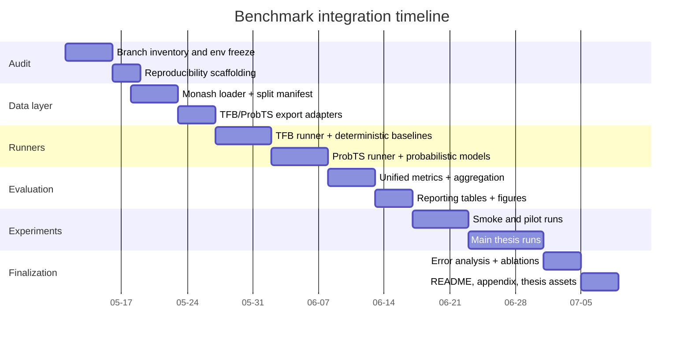

# Project specification for integrating ProbTS, TFB, and Monash datasets into `codex/real-data-benchmark`

## Executive summary

The most robust way to extend `codex/real-data-benchmark` is **not** to copy whole upstream frameworks into your branch, but to build a **thin benchmark orchestration layer** around three stable pieces: a **canonical Monash data layer**, a **ProbTS runner** for probabilistic and diffusion-style forecasting, and a **TFB runner** for fair baseline comparison and rolling-evaluation protocols. This keeps your branch thesis-friendly, reproducible, and easier to maintain than a fork-heavy integration. ProbTS already supports Monash `.tsf` datasets, exposes point and probabilistic model families, and is explicitly designed for unified evaluation across forecasting horizons; TFB provides a modular benchmark pipeline, custom method hooks, and documented support for evaluating user-defined datasets, but its built-in metric set is deterministic/regression-oriented, so probabilistic metrics should be computed in your branch post hoc from saved predictions. citeturn13search0turn14search0turn42view0turn9search0turn9search1turn12search0turn43search0

The highest-value thesis path is a **two-track benchmark**:  
first, a **deterministic track** for strong classical, ML, and deep point baselines; second, a **probabilistic track** centered on TFT-quantile, TimeGrad, and at least one diffusion model such as TSDiff or CSDI. Use **Monash datasets as the common data substrate**, **ProbTS for probabilistic runners**, **TFB for baseline breadth and rolling-origin robustness checks**, and a **single unified evaluator** in your branch for CRPS, pinball loss, interval coverage, calibration error, and consistent reporting. This also avoids a major environment trap: ProbTS documents a Python 3.10 setup, while TFB states it is fully tested under Python 3.8, so you should isolate them via separate lockfiles or containers rather than forcing a single environment. citeturn14search0turn41search1turn8search1turn7search4turn7search9

I could not inspect the actual contents of `codex/real-data-benchmark` from this environment, so the audit and file mappings below are a **target-state specification** that you can apply directly to the branch. Anything that already exists in your branch should be **merged into** rather than duplicated.

## Branch audit checklist

Run the audit first and freeze the state before adding frameworks. The checklist below is the minimum you should complete on `codex/real-data-benchmark`.

| Area | What to audit | What “good” looks like | Suggested commands |
|---|---|---|---|
| Code | Entrypoints, package layout, dataset loaders, trainer interfaces, evaluator interfaces, experiment runners | One clear training entrypoint, one evaluation entrypoint, no duplicated “ad hoc” scripts | `git ls-tree -r --name-only HEAD` `rg -n "forecast|trainer|evaluator|dataset|mlflow|dagster|hydra|optuna|quantile|crps"` |
| Data | Raw vs processed locations, downloader scripts, ignored files, DVC/LFS use, schema docs | Raw data not committed, processed artifacts versioned by manifest, dataset schema documented | `cat .gitignore` `find data -maxdepth 3 -type f | head -200` |
| CI | GitHub Actions / other CI, lint/test jobs, cache, artifact upload | PR smoke tests, benchmark smoke workflow, results artifact upload | `find .github -maxdepth 3 -type f` |
| Dependencies | Python version, lockfiles, extras, CUDA assumptions, conflicting libs | Separate `probts` and `tfb` env definitions or containers | `python --version` `pip freeze > freeze.txt` |
| Experiment configs | YAML/JSON/Hydra configs, naming conventions, seed handling | Config-driven runs, explicit seeds, no magic CLI defaults | `find configs -type f | sort` |
| Model implementations | Existing N-BEATSx, TFT, stats baselines, quantile support, prediction output format | Common forecast interface returning `mean`, optional `quantiles`, optional `samples` | `rg -n "NBEATSx|TFT|TimeGrad|CSDI|TSDiff|predict|quantile"` |
| License | Root license, third-party attributions, dataset redistribution policy | MIT/compatible code license, dataset download-not-commit policy | `ls LICENSE* NOTICE*` |
| README | Setup steps, benchmark usage, dataset instructions, reproducibility note | One benchmark-specific section with exact commands | `sed -n '1,250p' README*` |
| Tests | Unit, smoke, regression, deterministic seed tests | Parser/export/evaluator smoke tests and one end-to-end run | `pytest -q` |

**Audit actions to perform before coding**
- Save the current branch SHA into `docs/benchmark/audit.md`.
- Produce a one-page inventory file: `docs/benchmark/inventory.md`.
- Freeze today’s environments into `envs/` and **do not** retrofit upstream requirements into the root environment.
- Decide whether benchmark runs remain **standalone CLI tools** or are also exposed through your orchestration stack; unless you already need runtime scheduling, keep benchmark execution standalone first.

## Integration design and concrete file mapping

### Architectural decision

Use a **canonical panel schema in your branch**, and treat ProbTS and TFB as **external execution backends**.

Your branch should own:
- dataset registry and download metadata,
- Monash parsing and export,
- split manifests,
- unified metric computation,
- aggregation and reporting,
- CI and reproducibility artifacts.

ProbTS should own:
- its model training/inference internals,
- probabilistic model wrappers,
- native configs for TimeGrad, CSDI, TSDiff and reference point models. citeturn14search0turn13search36

TFB should own:
- deterministic baseline benchmark execution,
- rolling forecast strategy execution,
- custom-wrapper entrypoints for methods you want to compare inside its pipeline,
- raw prediction/actual value capture for later decoding in your branch. TFB’s documented dataset format is a three-column long table (`date`, `data`, `cols`), custom models inherit `ModelBase`, and saved predictions can be recovered from benchmark outputs with `--save-true-pred True`. citeturn9search0turn9search1turn11view0turn43search0

### Non-negotiable design rules

- **Do not** let TFB and ProbTS compute your final thesis metrics independently.
- **Do** export raw predictions/quantiles/samples to one schema and recompute final metrics centrally.
- **Do** keep dataset splits in a single manifest consumed by both backends.
- **Do** isolate environments because TFB and ProbTS document different Python baselines. citeturn14search0turn41search1

### Target files to add or modify in the branch

| Upstream source | Purpose | Add / modify in `codex/real-data-benchmark` | Notes |
|---|---|---|---|
| Monash `.tsf` format | Canonical dataset ingestion | `benchmark/data/monash_loader.py` | Preserve `@frequency`, `@horizon`, `@missing`, `@equallength` metadata from `.tsf`. citeturn27view0 |
| `sktime.datasets.load_forecastingdata` | Simplify Monash fetching/parsing | `benchmark/data/monash_fetch.py` | Prefer this over writing a parser from scratch for first implementation. citeturn39search9 |
| TFB long-table input format | Export to TFB | `benchmark/data/export_tfb.py` | Must emit `date`, `data`, `cols`. citeturn9search0 |
| ProbTS Monash dataset config | Export to ProbTS | `benchmark/data/export_probts.py` | Build dataset-specific CLI/config values: `dataset`, `data_path`, `freq`, `context_length`, `prediction_length`, `multivariate`. citeturn14search0 |
| Shared split control | Avoid leakage and inconsistent horizons | `benchmark/data/split_manifest.py` and `configs/datasets/monash/*.yaml` | One blocked split manifest used by both runners |
| TFB custom models | Add N-BEATSx / TFT / native wrappers if absent | `benchmark/tfb_wrappers/nbeatsx.py`, `benchmark/tfb_wrappers/tft.py` | Implement TFB `ModelBase` wrappers only if you want these models inside TFB’s loop. citeturn9search1 |
| ProbTS runner | Launch TimeGrad / CSDI / TSDiff / reference models | `benchmark/runners/probts_runner.py` | Execute upstream `run.py` with generated config/CLI. citeturn14search0 |
| TFB runner | Launch rolling / deterministic baselines | `benchmark/runners/tfb_runner.py` | Execute upstream `scripts/run_benchmark.py` and decode outputs. citeturn9search0turn43search0 |
| TFB decode helper | Recover saved predictions and truth | `benchmark/parsers/tfb_decode.py` | Decode `inference_data` and `actual_data` from result archives. citeturn43search0 |
| Unified metrics | Central thesis metrics | `benchmark/eval/prob_metrics.py`, `benchmark/eval/point_metrics.py` | Implement MAE/RMSE/sMAPE/MASE + CRPS/pinball/coverage/calibration |
| Aggregation | One results schema | `benchmark/eval/aggregate_runs.py` | Output `summary.parquet`, `per_series_metrics.parquet`, `leaderboard.csv` |
| Reporting | Tables and figures | `benchmark/report/build_tables.py`, `benchmark/report/build_figures.py` | Emit CSV/Parquet + LaTeX tables + PNG/SVG figures |
| Reproducibility | Lock environments | `envs/probts-py310.yml`, `envs/tfb-py38.yml`, optionally `docker/probts.Dockerfile`, `docker/tfb.Dockerfile` | ProbTS: Python 3.10; TFB: fully tested on Python 3.8. citeturn14search0turn41search1 |
| CI | Smoke and nightly runs | `.github/workflows/benchmark-smoke.yml`, `.github/workflows/benchmark-nightly.yml` | Smoke on small monthly datasets; nightly on core subset |
| Documentation | Thesis reproducibility | `docs/benchmark/README.md`, `docs/benchmark/licenses.md`, `docs/benchmark/reproducibility.md` | Include exact commands and dataset DOI manifest |

### What to change in your existing branch instead of adding new top-level layers

If your branch already has:
- a dataset module: add Monash/TFB/ProbTS adapters there;
- a trainer abstraction: add `backend: native|tfb|probts`;
- MLflow logging: attach metrics/artifacts in the unified evaluator, not in scattered model code;
- orchestration assets: wrap only the stable benchmark tasks, not every research trial.

### Why the unified evaluator matters

TFB’s documented built-in metrics are deterministic regression metrics such as MAE, RMSE, MAPE, SMAPE, MASE, WAPE, and related normalized variants. That is useful for point-forecast benchmarking, but it is not sufficient for your thesis if you want a defensible probabilistic comparison. Therefore:

- use TFB for **execution and standardized comparison flow**,
- use your branch for **probabilistic scoring**,
- and always retain **raw predictions or ensemble samples** to compute CRPS, average pinball loss, interval coverage, and calibration centrally. citeturn12search0turn12search1turn43search0

A recent paper also warns that common approximate CRPS estimators can bias model rankings, so do not rely on sparse-quantile approximations if you can compute CRPS directly from samples or exact model outputs. citeturn15search2turn15search5

## Recommended Monash dataset suite

### Selection principle

Choose a **core thesis suite** that is:
- small enough to run repeatedly,
- diverse across domains and frequencies,
- clearly citable,
- and representative of both “easy-to-compare” and “failure mode” settings.

The Monash archive documents dataset coverage and `.tsf` metadata; the selected dataset Zenodo records provide stable, citable DOIs and licensing pages. For non-competition datasets, the Monash paper uses 12-month horizons for monthly series, 30-day horizons for daily series, and one-week horizons for hourly series; for NN5 Weekly, the `.tsf` header exposes an `@horizon 8`. citeturn26view0turn27view0turn27view1turn31search2

### Thesis-friendly portfolio

| Dataset | DOI | Domain | Frequency | Series count | Suggested split | Why it belongs | Evidence |
|---|---|---:|---:|---:|---|---|---|
| Electricity Hourly | `10.5281/zenodo.4656140` | Energy | Hourly | 321 | train = all but last 336 points; val = last 168 before test; test = last 168 | Your most relevant benchmark: multivariate, equal-length, industrially plausible, directly aligned with energy forecasting | citeturn16view0turn27view1 |
| Traffic Hourly | `10.5281/zenodo.4656132` | Transport | Hourly | 862 | same as above: val 168, test 168 | High-dimensional correlated multivariate stress test; good for exposing scaling and memory issues | citeturn17view2turn17view3turn27view1 |
| Weather | `10.5281/zenodo.4654822` | Nature | Daily | 3010 | train = all but last 60 days; val = 30; test = 30 | Strong global-model benchmark with many related series and variable lengths; useful for calibration plots | citeturn18view1turn27view1 |
| NN5 Weekly | `10.5281/zenodo.4656125` | Banking | Weekly | 111 | train = all but last 16 weeks; val = 8; test = 8 | Short-horizon competition-style weekly benchmark; cheap and thesis-friendly | citeturn17view4turn17view5turn31search2 |
| FRED-MD | `10.5281/zenodo.4654833` | Economic | Monthly | 107 | train = all but last 24 months; val = 12; test = 12 | Low-compute macro benchmark; ideal for ablations and CI smoke tests | citeturn16view1turn27view1 |
| Hospital | `10.5281/zenodo.4656014` | Health | Monthly | 767 | train = all but last 24 months; val = 12; test = 12 | Hard short-series setting; excellent for detecting overfitting and weak seasonality assumptions | citeturn17view0turn17view1turn27view1 |

### Recommended usage modes

Use two dataset packs:

**Core pack for development and CI**
- FRED-MD
- Hospital
- Electricity Hourly
- Traffic Hourly

**Extended pack for final thesis experiments**
- Core pack plus Weather and NN5 Weekly

### Split rationale

Use a **blocked split with one validation horizon and one test horizon** as your primary protocol. Then add a **rolling-origin robustness check** through TFB on the core pack. This combination gives you:
- fixed, reproducible main results,
- fair model selection,
- and a second layer of robustness without exploding compute. TFB explicitly supports rolling forecast configurations and evaluation on your own datasets. citeturn9search0turn11view0

## Experimental protocol

### Preprocessing

Your preprocessing must be identical across runners.

**Required preprocessing**
- Parse Monash `.tsf` while preserving archive metadata and start timestamps.
- Convert to a canonical panel table:
  `dataset_id, series_id, timestamp, value, split, horizon, freq`.
- Fit any scaler **on train only**.
- Apply optional `log1p` only on strictly non-negative, heavily skewed series, and record it in the manifest.
- Preserve missingness information even if a selected dataset has no missing values.
- For variable-length series, align only by per-series timestamps; do not left-pad into a wide matrix unless the model specifically requires it.
- Generate two exports:
  - **TFB export:** long-table `date,data,cols`
  - **ProbTS export:** either original `.tsf` path or a copied local `.tsf` plus dataset CLI/config. citeturn9search0turn14search0turn27view0turn39search9

**Recommended context lengths**
- Monthly: `24` or `36`
- Weekly: `26` or `52`
- Daily: `60` or `90`
- Hourly: `336` or `504`

These are recommendations for your thesis, not archive defaults. The goal is to cover at least two seasonal cycles for stable models while keeping diffusion models tractable.

### Baselines

Use a **family-balanced benchmark**, not only deep models.

| Family | Models | Purpose |
|---|---|---|
| Statistical | Seasonal Naive, Theta, AutoETS, AutoARIMA; DHR-ARIMA or TBATS on tough seasonal/hourly settings | Essential lower and mid-level baselines |
| ML | Linear/Elastic Net with lags, LightGBM or XGBoost with lag + calendar features | Strong structured tabular baselines |
| Deep point | N-BEATSx, plus one reference model already present in TFB/ProbTS such as DLinear or PatchTST | Strong point forecast comparison |
| Deep probabilistic | TFT with quantile loss | Probabilistic baseline close to your thesis narrative |
| Diffusion / probabilistic generative | TimeGrad and one of TSDiff or CSDI | Required probabilistic depth |
| Optional foundation reference | One zero-shot model only if compute/time remain | Nice appendix, not core thesis necessity |

ProbTS currently documents support for models such as TimeGrad, CSDI, TSDiff, DLinear, PatchTST, iTransformer, and others, but it does **not** document N-BEATSx or TFT as native entries in the current README model table. Therefore keep N-BEATSx/TFT in your own branch or TFB/native wrappers, and use ProbTS especially for probabilistic and diffusion families. citeturn14search0

### Metrics

Use two metric tracks.

**Point track**
- MAE
- RMSE
- sMAPE
- MASE

**Probabilistic track**
- CRPS
- average pinball loss over quantiles, e.g. `0.1, 0.5, 0.9` for core tables and `0.05:0.95` for appendix or plots
- empirical coverage for 80% and 90% intervals
- calibration error or reliability gap

CRPS is the proper headline metric for probabilistic forecasts; pinball loss supports quantile interpretation. Recent work also shows that poor CRPS approximation can distort rankings, so prefer exact or sample-based CRPS computation where possible. citeturn15search2turn15search5

### Hyperparameter search

Use a **budgeted, family-specific search**, not a giant global sweep.

| Family | Search strategy | Budget |
|---|---|---|
| Statistical | fixed defaults + small seasonal options | none to tiny |
| ML | random/grid over lags, depth, learning rate | 10–20 trials |
| Deep point | Optuna/random search with early stopping | 15–25 trials |
| TFT | 10–20 trials on hidden size, dropout, LR, input size, quantiles | moderate |
| Diffusion | 8–12 trials max on hidden width, diffusion steps, LR, context length | expensive; keep small |

**Selection rule**
- Select hyperparameters on validation split.
- For point-only models: primary metric = MASE or sMAPE, tie-breaker = RMSE.
- For probabilistic models: primary metric = CRPS, tie-breaker = average pinball loss.
- After model selection, retrain on `train + val` and evaluate once on `test`.
- Final reported numbers: average over `2–3 seeds` for deep models; `1 seed` is acceptable for deterministic statistical methods.

### Compute estimates

Assume a single 24 GB GPU class device and ordinary workstation CPUs.

| Scope | Model mix | Approximate budget |
|---|---|---|
| Smoke | FRED-MD + Hospital, Naive/ETS/LightGBM + one small deep model | `< 2` CPU-hours + `< 1` GPU-hour |
| Pilot | Core pack, 1 seed, point + TFT + one diffusion model | `8–15` CPU-hours + `20–50` GPU-hours |
| Thesis main | Core pack, `2–3` seeds, full family-balanced comparison | `20–40` CPU-hours + `60–150` GPU-hours |
| Thesis extended | Add Weather + NN5 Weekly and one extra diffusion / appendix run | `+10–20` CPU-hours + `+20–80` GPU-hours |

The true variance comes mostly from diffusion sampling count and context length.

### Expected deliverables

At the end of the benchmark branch, you should have at minimum:

| Artifact | Path |
|---|---|
| Dataset registry and DOI manifest | `configs/datasets/monash_registry.yaml` |
| Processed canonical panels | `data/processed/*.parquet` |
| TFB exports | `data/tfb/*.csv` |
| ProbTS configs | `configs/probts/*.yaml` |
| TFB configs | `configs/tfb/*.json` or wrapper YAMLs |
| Raw prediction artifacts | `runs/**/predictions.parquet` |
| Unified metric tables | `reports/summary.parquet`, `reports/leaderboard.csv` |
| Thesis-ready tables | `reports/tables/*.tex` |
| Figures | `reports/figures/*.png` or `.svg` |
| Reproducibility manifests | `runs/**/run_manifest.json` |
| Benchmark README | `docs/benchmark/README.md` |

## Milestones, timeline, and CI automation

### Milestones

- **Freeze and audit** the branch.
- **Implement the Monash canonical data layer**.
- **Add TFB export + TFB runner** for deterministic and rolling-evaluation baselines.
- **Add ProbTS runner** for TimeGrad and one diffusion model.
- **Implement the unified evaluator** and common result schema.
- **Run a smoke benchmark**, then a pilot benchmark, then the thesis main runs.
- **Generate final tables/figures** and lock all configs for write-up.

### Timeline



### CI and automation steps

Create three CI layers.

**Push / PR layer**
- `ruff` / formatter / type-check
- unit tests for parser, exporters, evaluator
- tiny smoke benchmark on FRED-MD or Hospital
- artifact upload: `summary.json`, `run_manifest.json`

**Manual benchmark layer**
- triggered workflow for user-selected dataset/model matrix
- matrix over `backend = {tfb, probts}` and one or two datasets
- cache dataset downloads and model checkpoints where lawful

**Nightly layer**
- core pack only
- no hyperparameter sweep
- one seed
- publish artifacts and trend table

### Reproducibility checklist for every run

Each run must log:
- git SHA,
- uncommitted-diff flag,
- dataset DOI,
- dataset export hash,
- split manifest hash,
- backend (`tfb`, `probts`, `native`),
- full CLI/config blob,
- Python version,
- CUDA/PyTorch version,
- seed,
- wall-clock time and peak memory if available.

## Required code structure, templates, and commands

### Target structure

```text
codex/real-data-benchmark/
├─ benchmark/
│  ├─ data/
│  │  ├─ monash_fetch.py
│  │  ├─ monash_loader.py
│  │  ├─ split_manifest.py
│  │  ├─ export_tfb.py
│  │  └─ export_probts.py
│  ├─ runners/
│  │  ├─ tfb_runner.py
│  │  ├─ probts_runner.py
│  │  └─ native_runner.py
│  ├─ tfb_wrappers/
│  │  ├─ nbeatsx.py
│  │  └─ tft.py
│  ├─ parsers/
│  │  ├─ tfb_decode.py
│  │  └─ probts_parse.py
│  ├─ eval/
│  │  ├─ point_metrics.py
│  │  ├─ prob_metrics.py
│  │  └─ aggregate_runs.py
│  └─ report/
│     ├─ build_tables.py
│     └─ build_figures.py
├─ configs/
│  ├─ datasets/
│  │  └─ monash_registry.yaml
│  ├─ experiments/
│  │  ├─ electricity_hourly_tft.yaml
│  │  ├─ electricity_hourly_timegrad.yaml
│  │  └─ ...
│  ├─ probts/
│  └─ tfb/
├─ data/
│  ├─ raw/
│  ├─ processed/
│  ├─ tfb/
│  └─ manifests/
├─ envs/
│  ├─ probts-py310.yml
│  └─ tfb-py38.yml
├─ runs/
├─ reports/
└─ docs/benchmark/
```

### Example experiment config

```yaml
# configs/experiments/electricity_hourly_timegrad.yaml
dataset:
  name: electricity_hourly
  source: monash
  doi: 10.5281/zenodo.4656140
  freq: H
  val_horizon: 168
  test_horizon: 168
  context_length: 336
  multivariate: true

runner:
  backend: probts
  seed: 42
  output_dir: runs/electricity_hourly/timegrad/seed42

model:
  name: TimeGrad
  family: probabilistic
  params:
    lr: 0.001
    hidden_size: 64
    diffusion_steps: 100
    batch_size: 32

evaluation:
  point_metrics: [mae, rmse, smape, mase]
  prob_metrics: [crps, pinball, coverage_80, coverage_90]
  quantiles: [0.1, 0.5, 0.9]
```

### Example dataset adapter

```python
# benchmark/data/monash_loader.py
from __future__ import annotations

from dataclasses import dataclass
from pathlib import Path
import pandas as pd

from sktime.datasets import load_forecastingdata


@dataclass(frozen=True)
class MonashDataset:
    name: str
    freq: str
    doi: str
    equal_length: bool | None = None
    multivariate: bool | None = None


def load_monash_dataset(ds: MonashDataset, cache_dir: str | Path) -> pd.DataFrame:
    """Load a Monash dataset into a canonical long panel dataframe.

    Expected output columns:
        series_id, timestamp, value
    """
    cache_dir = Path(cache_dir)
    data = load_forecastingdata(
        name=ds.name,
        extract_path=str(cache_dir),
        value_column_name="value",
    )

    # `load_forecastingdata` returns the TSF content already parsed.
    # Normalize columns conservatively and keep only the fields we need.
    rename_map = {
        "series_name": "series_id",
        "start_timestamp": "timestamp_start",
        "series_value": "value",
    }
    data = data.rename(columns={k: v for k, v in rename_map.items() if k in data.columns})

    if "series_id" not in data.columns:
        raise ValueError(f"Missing 'series_id' for dataset={ds.name}")

    # Expand/listify if the loader returns per-series arrays.
    if "value" in data.columns and data["value"].apply(lambda x: isinstance(x, (list, tuple))).any():
        rows: list[dict] = []
        for _, row in data.iterrows():
            values = row["value"]
            start = pd.to_datetime(row.get("timestamp_start"))
            for i, v in enumerate(values):
                rows.append(
                    {
                        "series_id": row["series_id"],
                        "timestamp": start + pd.tseries.frequencies.to_offset(ds.freq) * i
                        if pd.notna(start) else i,
                        "value": float(v),
                    }
                )
        return pd.DataFrame(rows)

    return data
```

### Example runner abstraction

```python
# benchmark/runners/probts_runner.py
from __future__ import annotations

import json
import subprocess
from pathlib import Path


def run_probts(
    probts_root: str | Path,
    config_path: str | Path,
    dataset_path: str | Path,
    output_dir: str | Path,
    freq: str,
    context_length: int,
    prediction_length: int,
    multivariate: bool,
) -> None:
    probts_root = Path(probts_root)
    output_dir = Path(output_dir)
    output_dir.mkdir(parents=True, exist_ok=True)

    cmd = [
        "python",
        "run.py",
        "--config",
        str(config_path),
        "--data.data_manager.init_args.dataset",
        f"monash_{Path(dataset_path).stem}",
        "--data.data_manager.init_args.data_path",
        str(dataset_path),
        "--data.data_manager.init_args.freq",
        freq,
        "--data.data_manager.init_args.context_length",
        str(context_length),
        "--data.data_manager.init_args.prediction_length",
        str(prediction_length),
        "--data.data_manager.init_args.multivariate",
        str(multivariate).lower(),
        "--trainer.default_root_dir",
        str(output_dir),
    ]

    manifest = {"cmd": cmd, "runner": "probts"}
    (output_dir / "run_manifest.json").write_text(json.dumps(manifest, indent=2))

    subprocess.run(cmd, cwd=probts_root, check=True)
```

### Example evaluator

```python
# benchmark/eval/prob_metrics.py
from __future__ import annotations

import numpy as np
from properscoring import crps_ensemble


def pinball_loss(y_true: np.ndarray, y_pred_q: np.ndarray, q: float) -> float:
    diff = y_true - y_pred_q
    return float(np.mean(np.maximum(q * diff, (q - 1.0) * diff)))


def average_pinball(y_true: np.ndarray, quantile_preds: dict[float, np.ndarray]) -> float:
    scores = [pinball_loss(y_true, pred, q) for q, pred in quantile_preds.items()]
    return float(np.mean(scores))


def empirical_interval_coverage(
    y_true: np.ndarray,
    lower: np.ndarray,
    upper: np.ndarray,
) -> float:
    inside = (y_true >= lower) & (y_true <= upper)
    return float(np.mean(inside))


def crps_from_samples(y_true: np.ndarray, samples: np.ndarray) -> float:
    """samples shape: [n_obs, n_samples]"""
    return float(np.mean(crps_ensemble(y_true, samples)))
```

### Commands to run

**Step one: prepare data**
```bash
python -m benchmark.data.monash_fetch --dataset electricity_hourly --out data/raw/monash
python -m benchmark.data.export_tfb --dataset electricity_hourly --out data/tfb/electricity_hourly.csv
python -m benchmark.data.split_manifest --dataset electricity_hourly --out data/manifests/electricity_hourly.json
```

**Step two: run TFB baseline**
```bash
python -m benchmark.runners.tfb_runner \
  --config configs/experiments/electricity_hourly_tft.yaml \
  --tfb-root external/TFB
```

**Step three: run ProbTS probabilistic model**
```bash
python -m benchmark.runners.probts_runner \
  --config configs/experiments/electricity_hourly_timegrad.yaml \
  --probts-root external/ProbTS
```

**Step four: aggregate and report**
```bash
python -m benchmark.eval.aggregate_runs --runs-dir runs --out reports/summary.parquet
python -m benchmark.report.build_tables --summary reports/summary.parquet --out reports/tables
python -m benchmark.report.build_figures --summary reports/summary.parquet --out reports/figures
```

### Suggested smoke tests

Create the following tests before full experiments:
- `tests/data/test_monash_loader.py`
- `tests/data/test_tfb_export.py`
- `tests/runners/test_probts_command_build.py`
- `tests/runners/test_tfb_decode.py`
- `tests/eval/test_prob_metrics.py`
- `tests/e2e/test_smoke_fred_md_naive.py`

## Reporting, source list, and risk management

### How to report results

Your final thesis reporting should separate **headline tables** from **diagnostic figures**.

### Required tables

**Main leaderboard**
- rows = models
- columns = datasets
- cells = primary metric for the track:
  - point track: MASE or sMAPE
  - probabilistic track: CRPS

**Secondary metrics table**
- CRPS
- average pinball
- 80% coverage
- 90% coverage
- training/inference time

**Ablation table**
- context length
- normalization on/off
- quantile set size
- sample count for CRPS

**Stability table**
- mean ± std over seeds

### Required figures

**Forecast fan chart**
- one representative series per dataset
- actual vs median forecast
- 50/80/90% intervals
- best for TFT / TimeGrad / TSDiff

**CRPS by horizon**
- x-axis = horizon step
- y-axis = CRPS
- one panel per dataset family or one figure per dataset

**Calibration diagram**
- x-axis = nominal coverage
- y-axis = empirical coverage
- ideal 45° line
- plot 50%, 80%, 90%, 95%

**Rank heatmap**
- rows = models
- cols = datasets
- values = relative rank

**Compute-accuracy frontier**
- x-axis = GPU-hours or wall-clock
- y-axis = primary metric
- useful for thesis discussion of practical deployment

### Suggested figure mockups

**Calibration**
```text
empirical coverage
1.0 |                           *
0.9 |                      *         ideal
0.8 |                 *    /
0.7 |              /      /
0.6 |           /        /
0.5 |        *          /
    +--------------------------- nominal coverage
      0.5   0.6   0.7   0.8   0.9   1.0
```

**Fan chart**
```text
actual  ─────────╲__╱────╲____
median  ────────╱  ╲─────╱    ╲──
80% PI      ░░░░░░░░░░░░░░░░░░░░░
90% PI   ▒▒▒▒▒▒▒▒▒▒▒▒▒▒▒▒▒▒▒▒▒▒▒▒
```

For examples of probabilistic forecast visualizations and benchmark-style forecast plots, the TSDiff repository page is a useful reference. citeturn7search4

### Prioritized sources to consult while implementing

| Priority | Source | Why |
|---|---|---|
| Highest | ProbTS NeurIPS paper and repo | Core reference for unified point/probabilistic forecasting and Monash support. citeturn13search0turn14search0turn13search36 |
| Highest | TFB PVLDB paper, repo, and docs | Core reference for fair benchmarking, custom method integration, own-dataset evaluation, and result recording. citeturn42view0turn41search1turn9search0turn9search1turn43search0 |
| Highest | Monash archive paper and dataset pages | Dataset metadata, horizon conventions, `.tsf` semantics, and citable DOIs. citeturn26view0turn27view0turn27view1turn16view0turn18view1 |
| High | TimeGrad paper | Probabilistic diffusion baseline reference. citeturn8search1 |
| High | TSDiff paper/repo | Strong diffusion baseline and visual output examples. citeturn7search9turn7search4 |
| High | CRPS / quantile score references | Metric definitions and warning on biased approximations. citeturn15search2turn15search5 |
| Useful | `sktime` Monash loader docs | Simplest way to bootstrap Monash ingestion in Python. citeturn39search9 |

### Risks, assumptions, and mitigations

| Risk / assumption | Why it matters | Mitigation |
|---|---|---|
| The branch itself was not inspectable here | File mappings are a spec, not an exact diff | Start with the audit checklist and map onto existing files rather than creating duplicates |
| Compute budget unspecified | Diffusion models can dominate runtime | Use the core pack first; keep Weather and extra diffusion runs for the extended phase |
| Environment mismatch | ProbTS documents Python 3.10; TFB is fully tested on Python 3.8 | Two envs or two containers; never one forced root environment. citeturn14search0turn41search1 |
| Probabilistic metric inconsistency | Upstream frameworks may score differently | Centralize evaluation in your branch and store raw predictions/samples |
| CRPS approximation bias | Can change rankings | Prefer exact/sample-based CRPS, not sparse-quantile approximations. citeturn15search5 |
| License confusion | Code and datasets have different obligations | Keep code licenses documented; download data at runtime; do not commit raw benchmark datasets. ProbTS and TFB are MIT; dataset records should be logged individually with DOI/license notes. citeturn14search0turn41search1turn16view0turn18view1 |
| Short-series overfitting | Hospital-like data can make deep models unstable | Use blocked validation, early stopping, and report seed variance |
| Leakage from scaling or imputation | Invalidates thesis results | Fit transformations only on train; encode preprocessing in manifest |
| Too many models for thesis scope | Weakens conclusions | Keep the main table to 6–8 models; place extras in appendix |

### Open questions and limitations

- I could not inspect the actual contents of `codex/real-data-benchmark`, so exact paths in your branch may need to be mapped rather than created verbatim.
- I assumed you want a **reproducible benchmark subsystem** in the branch, not a full fork of ProbTS and TFB internals.
- I assumed no fixed compute budget. If you later specify hardware and deadlines, the model matrix and seed counts should be tightened accordingly.
- I assumed you want **probabilistic evaluation to be a first-class thesis objective**. If not, the TFB-only track can be simplified substantially, but that would weaken the comparison against diffusion models.