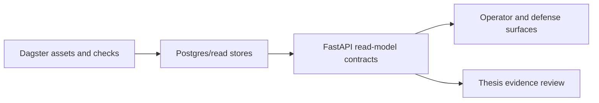

# Розділ 1. Загальна характеристика проєкту

## 1.1. Проблема та актуальність

Battery energy storage systems (BESS) стають ключовим елементом сучасної енергетики, оскільки дають змогу згладжувати піки навантаження, інтегрувати нестабільну генерацію та створювати додаткову економічну цінність через енергоарбітраж. Однак практична побудова автономної системи для арбітражу є складною інженерною задачею: необхідно одночасно враховувати волатильні ціни, фізичні обмеження батареї, ризик деградації, ринкові правила та вимогу до відтворюваного контуру обробки даних.

Для українського контексту 2026 року ця задача є особливо актуальною. Ринок має власні обмеження, прайс-кепи, часову структуру торгів і валютну специфіку, тому систему неможливо безпосередньо перенести з абстрактної дослідницької постановки в прикладний контур без локальної адаптації. Саме це робить тему диплома придатною як для інженерного проєкту, так і для дослідницького внеску.

Актуальність також підтверджується state of practice в Україні: АТ «Оператор ринку» у березні 2026 року повідомив, що понад 180 компаній тестують його Economic Dispatch Platform для BESS-арбітражу на DAM/IDM. Це означає, що тема не є лише академічною симуляцією; ринок уже потребує інструментів, які поєднують ціни, SOC-aware planning, обмеження батареї та зрозумілий operator workflow.

## 1.2. Що саме будується в межах диплома

Поточний дипломний проєкт будується як система автономного енергоарбітражу для BESS на ринку України 2026. Її завдання — перетворювати дані про ціни, погодні фактори, обмеження батареї та стан системи на operator-facing recommendation preview, а в цільовій версії — на market-aware decision pipeline.

У цьому контексті термін «автономний» не означає, що на поточному етапі система виконує повний цикл від прогнозу до фізичної dispatch-команди без участі оператора. Натомість він позначає архітектурну мету: система повинна бути здатною самостійно генерувати коректні рішення в межах формалізованих ринкових і safety-обмежень. Поточний демонстраційний етап реалізує operator-facing recommendation preview як перший контрольований крок до цієї повної автономії.

На рівні канонічної мови, зафіксованої в [CONTEXT.md](../../../CONTEXT.md), проєкт розрізняє кілька рівнів сутностей: baseline forecast, baseline strategy, target strategy, projected battery state, bid feasibility envelope, proposed bid, cleared trade та dispatch command. Це важливо, тому що диплом свідомо не змішує аналітичний preview, ринкову заявку і фізичне виконання в одну нечітку сутність.

## 1.3. Чому це інженерний диплом із дослідницькою траєкторією

Формально ця робота є інженерним проєктом, оскільки в центрі стоїть побудова працездатної системи з чіткими API, пайплайнами, dashboard-поверхнею, тестами та демонстраційними артефактами. Водночас проєкт має виражену дослідницьку траєкторію, бо його фінальна ціль не обмежується простим rule-based або LP-based scheduling. Він спрямований на перехід до Decision-Focused Learning (DFL), де система навчається не лише прогнозувати, а й оптимізувати фінансовий результат з урахуванням market response та degradation-aware objective.

Саме така комбінація і робить тему сильною для диплома: вже на ранньому етапі є перевірюваний інженерний результат, але водночас існує чітка research gap, яку не закриває поточний MVP.

## 1.4. Поточний підтверджений рівень: MVP baseline

Станом на поточний етап у репозиторії вже реалізовано MVP baseline для Level 1 сценарію. Його ключові характеристики:

- ринок обмежено погодинним DAM;
- канонічна валюта від початку зафіксована як UAH;
- базовий forecast реалізовано через strict similar-day rule;
- основна стратегія — детермінований LP baseline;
- економіка включає throughput-based degradation penalty;
- дані та проміжні результати оркеструються через Dagster assets;
- експериментальні результати й regret логуються в MLflow;
- контракти й safety semantics описано через strict Pydantic schemas.

Цей рівень є навмисно обмеженим. Його завдання — не продемонструвати найскладнішу модель, а створити стабільний контрольний контур, який можна тестувати, пояснювати і порівнювати з майбутньою цільовою стратегією.

Пізніший evidence-cycle змінив силу цього твердження. Початковий ризик synthetic або демонстраційно орієнтованого market-weather шару був коректним методологічним застереженням, але для основного дослідницького контуру вже сформовано source-backed Ukrainian DAM benchmark: observed OREE DAM, Open-Meteo/weather context, tenant configuration/load context, rolling-origin evaluation та strict LP/oracle scoring. На цьому шарі official global-panel NBEATSx Schedule/Value Learner V2+ пройшов вузьку **Offline Strategy Promotion** на 365-anchor Ukrainian panel: calibrated V2+ mean regret становить `174.77` UAH проти `310.58` UAH для `strict_similar_day`, rolling robustness проходить `4 / 4` windows, `strict_similar_day` залишається fallback, а ринкове виконання залишається вимкненим.

Отже, поточна академічна межа формулюється так: диплом уже має відтворюваний observed-data evidence path для offline/read-model strategy evidence, але ще не заявляє ринкову торгівлю в реальному часі, автоматичне перемикання dashboard/API на нову strategy, розгорнутий Decision Transformer або використання European market-coupling rows як training inputs.

## 1.5. Поточний демонстраційний етап: operator-facing MVP

Окрім baseline-контуру, у проєкті реалізовано демонстраційний operator surface. Це означає, що система має не лише backend-логіку, а й пояснюваний інтерфейс, через який можна продемонструвати контрольований сценарій роботи для наукового керівника та оператора.

На цьому рівні реалізовано:

- FastAPI control-plane з read models для operator-facing flows;
- backend-owned operator status для стабільного відображення стану в UI;
- same-origin Nuxt dashboard proxy;
- tenant-aware weather control flow;
- baseline LP recommendation preview з projected SOC та UAH economics.

На цьому етапі шар батареї коректніше описувати не як повноцінну фізичну симуляцію, а як feasibility-and-economics preview model. Поточний контур прогнозує допустимий стан батареї на погодинному горизонті, враховує SOC-вікно, ліміт потужності, спрощений round-trip efficiency та throughput-based degradation penalty. Такий рівень моделі достатній для operator-facing recommendation preview, baseline evaluation і regret-aware порівняння, але ще не є digital twin у строгому фізичному сенсі.

Для демонстраційного профілю цей штраф деградації параметризується як public-source capex-throughput proxy, а не як довільна локальна константа: `210 USD/kWh` з видимого capex anchor у Grimaldi et al., `15-year lifetime` і `~1 cycle/day` з NREL ATB та курс НБУ `43.9129 UAH/USD` на `04.05.2026`. Для демонстраційної батареї `10 MWh` це дає `16,843.3 UAH/cycle`, тобто `842.2 UAH/MWh throughput`.

Критично важливо, що демонстраційний етап не видається за повний механізм ринкового виконання. Поточна dashboard-поверхня демонструє recommendation preview та operator review, але не претендує на завершену реалізацію `Proposed Bid`, `Cleared Trade` або `Dispatch Command`.

## 1.6. Цільова архітектурна версія

Цільова версія системи виходить за межі поточного MVP і демонстраційного етапу. Вона передбачає:

- перехід від simple baseline forecast до сильнішого prediction layer на базі NBEATSx і TFT;
- перехід від Predict-then-Optimize baseline до predict-then-bid / Decision-Focused Learning;
- differentiable або surrogate-based market clearing як частину навчального контуру;
- learned strategy layer на кшталт Decision Transformer;
- глибший digital twin батареї з точнішим обліком фізичних процесів деградації;
- поступове розширення з DAM-only scope до venue-aware і, за потреби, multi-venue сценаріїв;
- зріліший контур збереження даних, аудиту та control-plane infrastructure.

Отже, цільова архітектурна версія не заперечує поточний MVP, а спирається на нього. Baseline тут виступає контрольним контуром, а не тимчасовим «чернетковим» рішенням без наукової цінності.

Усі перелічені елементи цільової версії слід читати як target/research trajectory: вони не означають поточного market execution, автоматичного перемикання dashboard/API на нову стратегію або розгорнутого Decision Transformer-контролера.

## 1.7. Роль Dagster, MLflow, FastAPI, dashboard і MCP-інструментів

Архітектурно проєкт поєднує кілька інфраструктурних шарів, кожен із яких виконує окрему функцію:

- Dagster відповідає за orchestration, lineage і керування asset graph;
- MLflow фіксує експерименти, метрики та regret-aware evaluation;
- FastAPI дає contract-first control plane для operator-facing read models;
- Nuxt dashboard забезпечує пояснювану демонстраційну поверхню для керівника та майбутнього користувача;
- MCP- та agent-based tooling використовується як допоміжний research workflow для пошуку джерел, навігації репозиторієм та пришвидшення документування.

В академічному позиціюванні важливо підкреслити, що предметом диплома є не сам MCP. MCP/agent tooling тут — допоміжна інженерна інфраструктура, яка підтримує процес розробки, але не становить головної наукової новизни роботи.

## 1.8. Роль FastAPI як read-model інтерфейсу

FastAPI-шар у цій роботі виконує роль інженерного інтерфейсу між
ML/Dagster pipeline та операторськими read models. Він не є окремим
стратегічним рушієм і не виконує ринкові заявки. Його завдання полягає в тому, щоб
надати перевірювані контракти для tenant context, weather/materialization
control, telemetry state, baseline LP preview, forecast evidence, DFL/DT
research evidence та operator recommendation preview.

У такій архітектурі API є способом подання результатів і стану системи, а не
джерелом нової стратегії. Рішення про якість ML/DFL-кандидатів приймається в
Dagster/Postgres/evidence pipeline через rolling-origin evaluation,
LP/oracle regret та promotion gates. API лише публікує ці результати у
контрольованій формі для operator-facing та defense-facing сценаріїв.

## 1.9. Як цей проєкт співвідноситься з дипломом

Для дипломної роботи цей проєкт цінний з кількох причин. По-перше, він має чітку прикладну проблему і реалістичний інженерний контур. По-друге, він містить природну дослідницьку прогалину між baseline-рішенням і decision-focused цільовою архітектурою. По-третє, він дозволяє поетапно демонструвати прогрес: спочатку концепцію і baseline, далі демонстраційний operator surface, а потім перехід до learned strategy.

Отже, диплом не зводиться до «дашборду для батареї» і не зводиться до «чергової ML-моделі». Його змістовне ядро - це побудова відтворюваної архітектури автономного енергоарбітражу, у якій baseline, operator preview і фінальна DFL-траєкторія пов'язані в один логічний контур.

## 1.10. Перехід до огляду літератури

Щоб обґрунтувати такий вибір архітектури, потрібно окремо розглянути state of the art у forecasting, optimization, degradation-aware economics, DFL та інженерній оркестрації. Саме це робиться в [02-literature-review.md](./02-literature-review.md), де пояснюється, чому поточна поетапна логіка розвитку системи є дослідницьки та інженерно виправданою.

З урахуванням оновленого огляду джерел ця поетапна логіка формулюється ще точніше: спочатку реальний історичний benchmark, потім порівняння strict similar-day, NBEATSx і TFT за decision value та oracle regret, далі robustness-аналіз деградації, fees і SOC assumptions, і лише після цього DFL-дослід.
