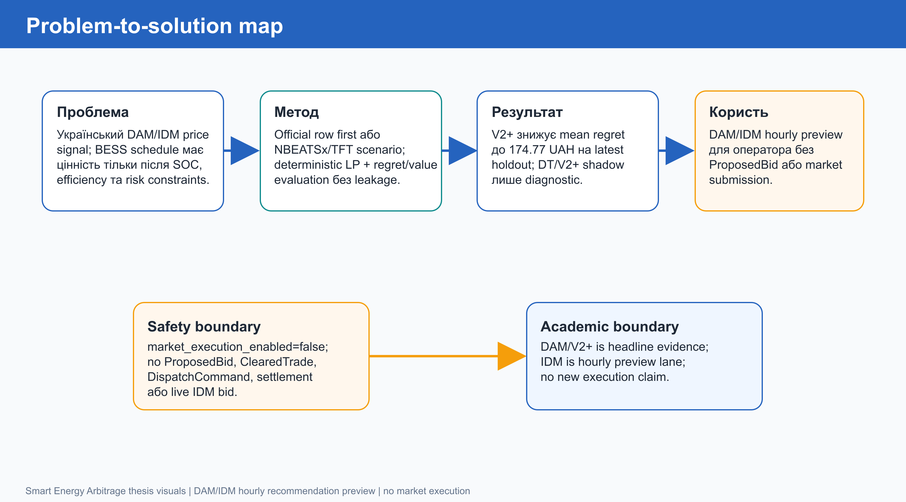
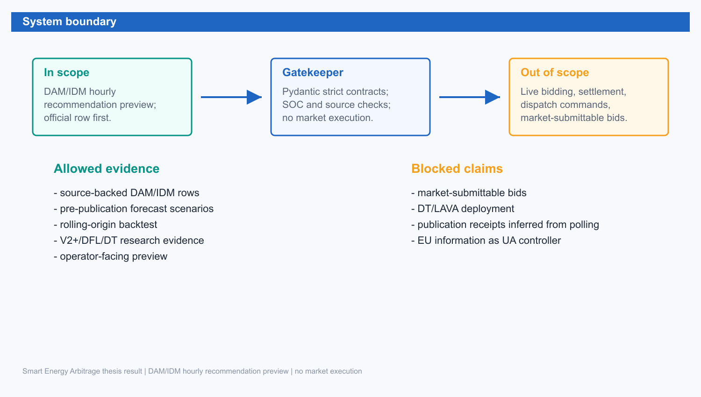

Розділ 1. Вступ

1.1. Актуальність теми

Українська енергосистема у 2026 році потребує інструментів, які допомагають працювати з волатильністю, дефіцитом маневровості та зростанням ролі систем накопичення енергії. BESS може переносити енергію між годинами з різною ціною, але практична цінність такого переносу виникає лише тоді, коли рішення одночасно враховує ринковий сигнал, фізичні обмеження батареї, часову доступність даних і операційну безпеку. Сам прогноз ціни не є достатнім результатом: модель може мати прийнятну forecast error, але створити schedule з поганим SOC timing або низькою економічною цінністю.

Тому в роботі розглянуто не задачу автономної ринкової торгівлі, а задачу побудови evidence system для DAM/IDM hourly recommendation preview. Така система пояснює оператору, чому певний hourly schedule є доцільним, які дані були доступні до моменту рішення, як результат порівнюється з conservative baseline і чому він не перетворюється автоматично на market-submittable bid. DAM залишається primary evaluated thesis scope, а IDM розглядається як такий самий operator-facing hourly preview/read-model lane без live intraday bidding. Ця межа важлива академічно й практично: без неї дипломний результат легко перебільшити до live trading або deployed Decision Transformer control, хоча наявна доказова база цього не дозволяє.

Ключове практичне правило таке: коли official OREE DAM/IDM hourly row для target date/hour уже опубліковано, саме цей row є price source для preview, а ML не переугадує опубліковану ціну. Коли target delivery horizon ще не має опублікованого row, NBEATSx/TFT можуть створювати scenario price context для deterministic LP. У двох випадках LP будує feasible hourly schedule, а V2+/DFL/DT layers можуть тільки ранжувати, пояснювати або abstain як evidence/advisor metadata. Окремий HF value-aligned shadow path є live read-model challenger поверх цієї логіки: він не викликає LP у live request path, генерує обмежений набір LP-free candidate schedules, оцінює їх safe-switch scorer-ом і показує лише manual shadow preview.

Логіку переходу від проблеми до рішення наведено на рисунку 1.1.

Рисунок 1.1. Карта переходу від українського DAM/IDM signal до operator preview

Рисунок 1.1 узагальнює центральну ідею роботи. Ціновий сигнал DAM/IDM стає корисним лише після deterministic optimization і strict evidence gate. Саме тому головний внесок полягає не в додаванні ще однієї нейронної моделі, а в побудові чесного контуру, де official rows, forecast scenarios, schedule optimization, regret evaluation і source-governance працюють разом.

1.2. Проблема, що вирішується

Проблема має три рівні. Перший рівень - ринковий: погодинні ціни DAM/IDM можуть створювати можливість арбітражу, але реальна можливість залежить від spread shape, local price regime, publication state і доступності source-backed evidence. Другий рівень - інженерний: BESS не можна розглядати як абстрактний фінансовий актив, бо schedule має проходити SOC, power, efficiency і degradation-aware обмеження. Третій рівень - науковий: оцінювати модель за MAE/RMSE недостатньо, якщо рішення використовується для storage arbitrage; потрібна decision-aware метрика, що вимірює regret або value після optimization.

У роботі ці три рівні зведено в один offline/read-model contour. Price forecasts та candidate schedules оцінюються через однаковий strict LP/oracle evaluator. Learned або heuristic candidates можуть бути корисними лише тоді, коли вони знижують regret проти frozen baseline, не погіршують median behavior, проходять rolling robustness і не порушують safety/source gates. Якщо challenger не проходить gate, це не приховується: негативна evidence залишається частиною наукового результату й пояснює, чому система не просуває слабший метод.

Межу системи наведено на рисунку 1.2.

Рисунок 1.2. Межа системи: evidence та preview без market execution

Рисунок 1.2 показує, що результат належить до allowed evidence: offline materialization, read-model dashboard, operator preview і reproducible packets. Заблокована зона містить ProposedBid, ClearedTrade, DispatchCommand, deployed DT/LAVA і будь-який claim, який потребує explicit market submission readiness. Така межа зберігає практичну корисність без переходу до невиправданого market execution.

1.3. Мета і завдання

Мета роботи - спроєктувати, реалізувати та оцінити evidence system для DAM/IDM hourly recommendation preview у задачі BESS-арбітражу в Україні, де якість моделей оцінюється за downstream decision value, а не лише за forecast-only метриками. Науковий headline залишається DAM/V2+ evidence, а практична read-model capability охоплює DAM і IDM як hourly recommendation preview. Практична мета полягає в тому, щоб оператор або власник BESS отримував зрозумілу картину: які hourly recommendations пропонуються, чим вони кращі або гірші за conservative baseline, які gates пройдено і чому система не подає заявку на ринок.

Для досягнення цієї мети виконано такі завдання: сформовано market/problem framing для українського DAM/IDM preview; побудовано pipeline source snapshots -> normalized panel -> official-row/forecast-scenario context -> strict LP/oracle scoring -> dashboard/read model; визначено метрики regret/value та rolling robustness; перевірено Schedule/Value Learner V2 і V2+ проти strict_similar_day; проаналізовано TFT, Poland lag24 / prior-only veto, DT/V2+ safe-switch shadow і HF value-aligned shadow як дослідницькі/manual preview гілки, але не default/execution гілки; перевірено live shadow-readiness для DAM/IDM latest/today/tomorrow/day+2 без LP у live HF path; зафіксовано V13 source-readiness blockers і прапорець market_execution_enabled=false.

1.4. Об'єкт, предмет і межі дослідження

Об'єктом є система прийняття рішень для BESS у primary DAM delivery-day planning scenario з окремою IDM hourly recommendation preview/read-model lane. Предметом є методологія побудови й оцінювання forecast-to-schedule candidates через strict LP/oracle contour та decision-aware regret/value metrics. У роботі не досліджується live market bidding, 15-minute IDM submission, settlement, balancing-market participation, physical inverter dispatch або юридична процедура участі на ринку. Такі елементи потребують окремих operational gates, credentials, signed submissions, explicit OREE DAM/IDM source/publication evidence for preview і market-submission receipts для execution contour.

Межа market_execution_enabled=false проходить через усю роботу. Вона означає, що навіть коли offline evidence показує кращий regret, система не створює market order payload. Це дає можливість академічно оцінити практичну придатність методу для України без небезпечного змішування демонстраційного preview з торговою системою.

1.5. Наукова новизна і практична цінність

Наукова новизна полягає у фокусі на decision-quality evidence для BESS arbitrage: forecast candidates оцінюються не ізольовано, а через LP schedule та regret відносно oracle value. Додатково робота демонструє, як negative evidence, corrected safe-switch shadow evidence або blocked V13 acquisition можуть бути академічно коректними artifacts, якщо вони запобігають overclaiming. Практична цінність для України полягає в тому, що system design може бути використаний як консервативний операторський preview: він показує економічну логіку рішення, залишає audit trail і не потребує market-submission credentials для academic MVP.

Додаткова практична новизна полягає у введенні HF value-aligned shadow як безпечного містка між offline Decision Transformer evidence і live operator preview. На відміну від raw DT controller, цей шар не емітить hourly action безпосередньо, а ранжує LP-free candidate schedules, застосовує value/tail-risk/safety gates і показує або non-HOLD preview, або guarded abstention до V2+/HOLD. Це дозволило показати transformer-based evidence у dashboard без зміни production/default strategy.

1.6. Структура роботи

Розділ 2 стисло розглядає ринковий та методологічний контекст, включно з constrained neural decision layers. Розділ 3 описує методологію, математичні вирази, evidence boundaries і архітектуру. Розділ 4 подає головні результати V2/V2+, robustness, DT/HF shadow evidence і live preview-readiness. Розділ 5 формулює висновки й рекомендації як аналіз архітектурних прийомів: fallback, abstention, source-backed context, deterministic gates і no-execution boundary. Детальні glossary, API traceability, довгі evidence manifests і shadow diagnostics винесено в додатки, щоб основна частина залишалася зосередженою на main story.

1.7. Практичний контекст для українського оператора

Практичний користувач такої системи не починає з питання, яка neural architecture є наймоднішою. Його перше питання простіше: чи можна довіряти рекомендації, коли ціна завтра може суттєво відрізнятися від історичного патерну, а батарея має реальні обмеження? Тому в роботі акцент зроблено на прозорості контуру. Оператор має бачити не лише "купити" або "продати", а й те, що recommendation прийшла з відтворюваного evidence packet, пройшла deterministic checks і не є ринковою заявкою.

Для України це особливо важливо через різницю між академічною демонстрацією та промисловою інтеграцією. У промисловому контурі потрібні credentials, юридична відповідальність, receipt evidence, settlement reconciliation і диспетчерські процедури. У дипломному контурі інженерний підхід демонструє чесне ставлення до таких меж: без explicit OREE DAM/IDM source/publication evidence система не маскує blocker красивим dashboard, а навіть corrected DT/V2+ shadow з кращим regret не називається контролером або default strategy без окремого promotion gate.

Таке формулювання робить роботу прикладною, але не ризиковою. Вона не обіцяє автономної торгівлі; вона показує, як можна прийти до неї поступово: спочатку offline evidence, потім operator trust, потім source readiness, і лише після цього execution gate. У цьому сенсі результат корисний не тільки як кодовий MVP, а як методологічний шаблон для подібних українських energy-tech систем.

1.8. Відмінність між науковим результатом і інженерним артефактом

Науковий результат у роботі - це не просто наявність dashboard або факт, що pipeline запускається. Науковий результат полягає в доведенні, що schedule/value selector може зменшити downstream regret у строгому порівнянні з baseline, а також у доведенні меж, де інші candidates не проходять gate. Інженерний артефакт підтримує цей результат: Dagster materialization, FastAPI read model, Pydantic contracts і dashboard роблять evidence відтворюваною та зрозумілою.

Це розмежування допомагає уникнути двох крайнощів. Перша крайність - описати роботу як чистий software project без наукової оцінки. Друга - описати її як research paper без практичного MVP. У роботі обрано середній шлях: практичний проєкт має науково обґрунтований evaluation contour, а дослідницька частина має робочий інженерний носій.
