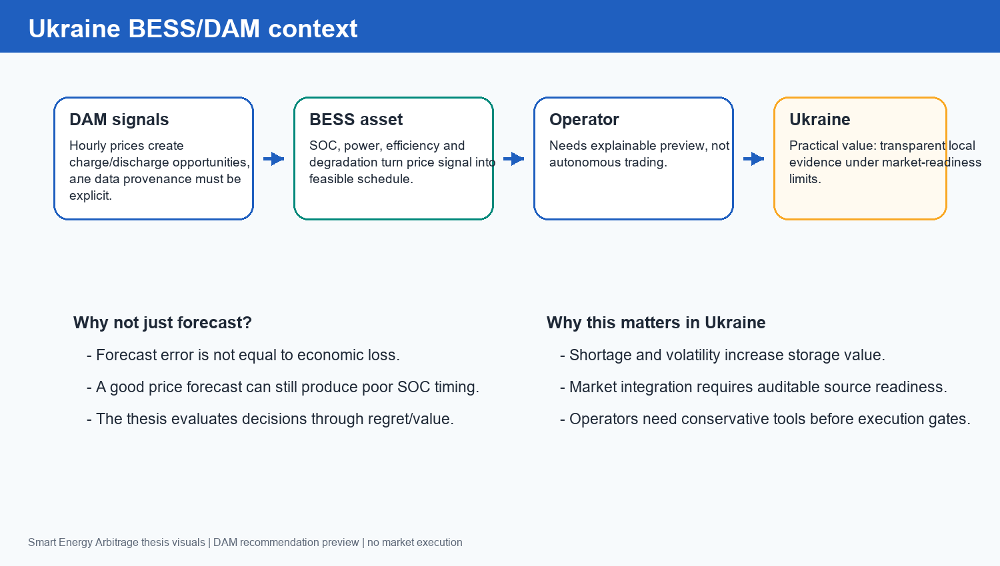
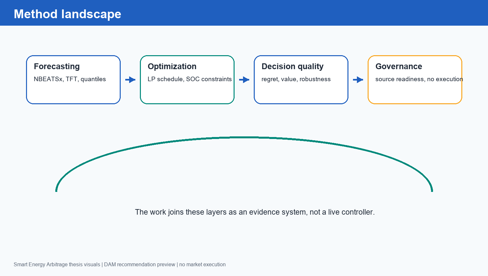

Розділ 2. Огляд предметної області та джерел

2.1. Український DAM і роль BESS

Ринок на добу наперед задає погодинні price signals, які можуть бути використані для планування заряду й розряду BESS. Для України така задача має практичну вагу через потребу в гнучкості, інтеграції відновлюваної генерації, локальному балансуванні та зменшенні вартості пікових годин. Ринкова специфіка описується не тільки загальноєвропейською логікою electricity market design, а й локальними правилами, price caps, тарифами та енергетичною політикою України (European Commission, 2026 [[34]](#source-34), [[35]](#source-35); NEURC, 2026 [[36]](#source-36); JSC Market Operator, 2026 [[37]](#source-37); Ministry of Economy of Ukraine, 2024 [[40]](#source-40), [[41]](#source-41)).

Водночас академічна модель має обережну межу: наявність historical price rows не перетворює систему на контур подання заявок і не означає, що timestamp publication evidence вже готовий для market-executable сценаріїв. Ця межа узгоджується з європейським контекстом синхронізації та майбутнього market-coupling, але не підміняє український DAM evidence layer (ENTSO-E, 2022 [[42]](#source-42); ACER, 2025 [[43]](#source-43)).

Європейські роботи про BESS utilization, revenue stacking і energy/reserve bidding корисні як ширший market-design контекст, однак у роботі вони не використовуються як доказ готовності українського live execution (Hu et al., 2022 [[12]](#source-12); Li et al., 2024 [[13]](#source-13)).

Контекст українського застосування наведено на рисунку 2.1.

Рисунок 2.1. Контекст BESS/DAM для українського застосування

Рисунок 2.1 показує, що практична цінність виникає на перетині DAM signal, BESS asset constraints і operator needs. Дипломний MVP охоплює рекомендаційний preview і відтворювану evidence chain; production trading потребує окремої юридичної, технічної і source-readiness інфраструктури.

2.2. Чому forecast-only оцінка недостатня

Класичні роботи з electricity price forecasting часто оцінюють моделі через MAE, RMSE, MAPE або quantile losses. Такі метрики корисні для порівняння прогнозів, але вони не відповідають безпосередньо на питання, чи кращим буде battery schedule. Lago et al. (2021) показують важливість строгих EPF-бенчмарків і сильних baseline, а Elmachtoub and Grigas (2022) демонструють, що статистична якість прогнозу не завжди збігається з якістю downstream optimization decision [[14]](#source-14), [[4]](#source-4).

У BESS arbitrage важливі не всі помилки однаково: помилка біля локального піку або провалу може коштувати значно більше, ніж така сама абсолютна похибка у стабільній середині доби. Крім того, schedule value залежить від SOC path, efficiency losses і обмеження потужності. Саме тому storage-specific DFL роботи Sang et al. (2022/2023) та Mandi et al. (2024) пропонують оцінювати моделі через regret/value або decision loss, а не лише через forecast-only loss [[29]](#source-29), [[28]](#source-28).

Тому в роботі forecast layer розглядається як джерело candidate schedules, а не як остаточна відповідь. NBEATSx і TFT мають сенс лише тоді, коли їхні сигнали після LP scoring зменшують regret. Це також пояснює, чому raw neural forecast може бути слабшим за conservative baseline, але calibrated або schedule/value selected variants можуть стати корисними.

2.3. Ландшафт методів

Ландшафт методів, використаних у роботі, наведено на рисунку 2.2.

Рисунок 2.2. Ландшафт методів: forecast, LP, regret і governance

Рисунок 2.2 групує методи у чотири шари. Forecasting дає price signal; optimization перетворює його на feasible schedule; decision-quality оцінює результат через regret/value; governance визначає, які source rows і claims можна використовувати. Така структура ближча до прикладної evidence system, ніж до традиційної таблиці forecast metrics.

2.4. Стислий literature/source matrix

Огляд джерел у роботі не подається як довгий paper-by-paper summary. Для практичної дипломної роботи важливіше показати, яка частина літератури і технічних джерел підтримує конкретний design choice. Матрицю напрямів наведено в таблиці 2.1.

Таблиця 2.1. Матриця літературних і технічних напрямів

| Напрям | В роботі | Поза scope |
| --- | --- | --- |
| EPF / time-series forecasting | NBEATSx/TFT; downstream regret [[2]](#source-2), [[6]](#source-6), [[14]](#source-14) | SOTA за MAE/RMSE без LP/regret |
| Storage optimization | LP schedule із SOC/power/efficiency [[51]](#source-51), [[10]](#source-10), [[5]](#source-5) | Settlement/live dispatch |
| DFL / predict-then-optimize | Regret/value як decision-quality criterion [[4]](#source-4), [[29]](#source-29), [[28]](#source-28) | Full differentiable controller |
| Offline RL / DT | Research-shadow sequence policy [[7]](#source-7), [[32]](#source-32) | DT/LAVA promotion/live policy |
| Ukrainian market governance | DAM preview і source-readiness blockers [[36]](#source-36), [[37]](#source-37), [[43]](#source-43) | Inferred receipts/submission claims |

Таблиця 2.1 показує, що робота поєднує electricity price forecasting, storage optimization, DFL/predict-then-optimize і market governance. Водночас вона свідомо не заявляє full settlement, deployed DT або full differentiable controller. Це скорочує текст і робить межі дослідження прозорими.

2.5. Storage optimization і LP як контрольний контур

Для BESS schedule LP є природним базовим інструментом: він може задати баланс енергії, обмеження SOC, потужність заряду/розряду, efficiency і простий економічний objective. Park et al. (2017) прямо формулюють short-term ESS scheduling через лінійні обмеження SOC, power range, energy limits та efficiency [[51]](#source-51). Hesse et al. (2019), Maheshwari et al. (2020), Kumtepeli et al. (2020) і Cao et al. (2020) показують, що storage dispatch може бути розширений degradation-aware або learning-based компонентами, але це підвищує вимоги до параметризації батареї та якості даних [[10]](#source-10), [[11]](#source-11), [[45]](#source-45), [[46]](#source-46).

У роботі LP використовується не як тема окремого математичного дослідження, а як deterministic evaluator, який дає однаковий scoring contour для всіх forecast і selector candidates. Це важливо, бо порівняння моделей без спільного optimization contour може бути несправедливим. Vykhodtsev et al. (2022) додатково пояснюють, що спрощене power-energy представлення батареї є придатним для techno-economic studies, але не замінює повний electrochemical digital twin [[9]](#source-9).

Strict LP/oracle evaluator виконує дві ролі. По-перше, він оцінює value вибраного schedule. По-друге, він обчислює oracle reference, тобто найкращу offline value при realized prices. Різниця між oracle value і selected value стає regret. Такий підхід дозволяє говорити не "модель має меншу похибку", а "schedule втрачає менше економічної цінності відносно oracle". Економічні припущення про storage cost/performance підтримуються NREL Storage Futures та NREL ATB матеріалами [[52]](#source-52), [[53]](#source-53).

2.6. NBEATSx, TFT і probabilistic forecasting

NBEATSx у роботі має статус forecast-layer choice/adaptor. Olivares et al. (2023) описують NBEATSx як neural basis expansion model з exogenous variables для electricity price forecasting [[2]](#source-2). Це релевантно для DAM/BESS, бо цінові ряди мають денні, тижневі, сезонні та регуляторні компоненти, а також реагують на погодні й системні фактори. Проте сам факт використання NBEATSx не є доказом кращого arbitrage result; його output перевіряється через LP/regret.

Temporal Fusion Transformer, запропонований Lim et al. (2021), є другим важливим forecast-layer напрямом [[6]](#source-6). TFT підтримує multi-horizon forecasting, static covariates, known future inputs, observed historical inputs, variable selection та attention-based interpretability. Probabilistic TFT та інші сучасні deep-learning EPF роботи розширюють цей напрям у бік uncertainty-aware forecasting, quantile loss і exogenous-aware transformer architectures (Jiang et al., 2024 [[3]](#source-3); Wang et al., 2024 [[15]](#source-15); Yu et al., 2026 [[16]](#source-16); Jin and Blanco-Encomienda, 2026 [[60]](#source-60)).

Окремий висновок із сучасної EPF-літератури стосується foundation models і temporal hierarchy. PriceFM, THieF, TSFM leakage studies, TFMAdapter і Reverso показують активний розвиток time-series foundation-model напряму, але ці джерела у роботі мають статус future/research context, а не підставу для зміни поточного headline result [[17]](#source-17), [[18]](#source-18), [[19]](#source-19), [[20]](#source-20), [[21]](#source-21). Current evidence залишається прив'язаною до українського DAM benchmark і V2/V2+ schedule/value selector.

2.7. Decision-focused learning і практична межа

Decision-Focused Learning у повному сенсі може означати навчання моделі через differentiable optimization layer або task-aware surrogate loss. Smart Predict-then-Optimize у Elmachtoub and Grigas (2022) формалізує проблему розриву між prediction loss і downstream objective [[4]](#source-4). Mandi et al. (2024) систематизують DFL як напрям, у якому learning model і constrained optimization problem поєднуються через decision loss, differentiable optimization, surrogate gradients або gradient-free methods [[28]](#source-28).

Для storage arbitrage ця логіка особливо важлива, бо рішення є multistage: charge/discharge у поточну годину змінює SOC і майбутні feasible actions. Sang et al. (2022/2023) безпосередньо пов'язують electricity price prediction з ESS arbitrage regret, Persak and Anjos (2024) підкреслюють multistage structure, а Yi, Alghumayjan, and Xu (2024) показують perturbed DFL для strategic energy storage [[29]](#source-29), [[30]](#source-30), [[31]](#source-31).

Distributional RL для energy arbitrage розглядається як risk-sensitive future context, а не як поточний production-facing метод рекомендаційного preview (Madahi et al., 2024 [[22]](#source-22)).

У роботі цей напрям використовується обережно. Головний результат є schedule/value selector з regret-aware evaluation, а не повний differentiable predict-then-bid stack. Диференційовані оптимізаційні шари Agrawal et al. (2019) та OptNet Amos and Kolter (2017) підтримують roadmap, але не доводять наявність deployed DFL controller [[8]](#source-8), [[54]](#source-54). Predict-then-bid framework Yi et al. (2025) також використовується як цільова дослідницька траєкторія, а не як опис поточного market-execution стану [[1]](#source-1).

2.8. Decision Transformer як research-shadow

Decision Transformer є привабливим напрямом для sequence-policy tasks, бо він може умовлювати дії на return-to-go та історію станів. Chen et al. (2021) формулюють Decision Transformer як return-conditioned sequence modeling для offline reinforcement learning [[7]](#source-7). Bhargava et al. (2023) додатково показують, що переваги DT залежать від якості, обсягу й структури offline trajectories [[32]](#source-32). Практичну implementation reference для майбутніх експериментів дає офіційна документація Hugging Face Transformers [[33]](#source-33).

У поточній роботі DT має тільки research-shadow статус. V13 source-readiness gate не дозволяє трактувати DT або LAVA як production-ready, доки немає explicit DAM publication receipts і достатньої кількості permitted training rows. Тому DT використовується для перевірки майбутньої архітектурної можливості, а не для headline result.

2.9. Роль українських джерел і source governance

Окремий аспект огляду - джерельна дисципліна. У задачах енергетичного арбітражу дані не є нейтральним фоном: timestamp, publication timing, timezone normalization і provenance визначають, чи має модель право бачити конкретну ознаку. Якщо зовнішній ряд доступний лише після decision time, його використання як train або selection feature створює leakage. Якщо publication receipt не підтверджено, не можна описувати систему як market-ready, навіть якщо локальний backtest виглядає переконливо.

У роботі тому використано обережний словник. DAM rows можуть бути частиною recommendation preview, але explicit DAM publication receipts потрібні для сильніших source-readiness claims. EU/Poland/ENTSO-E контексти можуть бути корисними як governance або shadow lanes, але вони не перетворюються автоматично на українські training targets. Такий підхід спирається на офіційні джерела про дані й ринкову інтеграцію: ENTSO-E Transparency Platform, OPSD, Nord Pool, Ember, ACER, European Commission і Ukrainian market/operator sources [[23]](#source-23), [[24]](#source-24), [[25]](#source-25), [[26]](#source-26), [[27]](#source-27), [[34]](#source-34), [[35]](#source-35), [[36]](#source-36), [[37]](#source-37), [[43]](#source-43).

Для forecast layer зовнішні ряди можуть бути корисними як exogenous covariates, але лише після licensing, timezone/DST, currency, market-rule, publication-time availability і domain-shift checks. Роботи Li and Becker (2021), Redhu and Bremdal (2023) та Mascarenhas et al. (2025) підтримують ідею neighboring-zone або cross-border features для EPF, а документація Nixtla пояснює технічну підтримку exogenous variables у NeuralForecast/NBEATSx [[47]](#source-47), [[48]](#source-48), [[49]](#source-49), [[50]](#source-50).

Погодні ознаки також потребують явного source contract: для цього релевантні документації Open-Meteo Forecast API та Historical Weather API, але ці джерела не скасовують вимоги перевіряти availability timing і leakage risk [[38]](#source-38), [[39]](#source-39).

2.10. Інженерна evidence system і MLOps-контекст

У прикладній роботі академічна якість залежить не лише від вибору моделі, а й від відтворюваності evidence pipeline. Dagster software-defined assets підтримують materialization, lineage і asset checks [[55]](#source-55). MLflow tracking використовується як джерело експериментальних run records і метрик [[56]](#source-56). FastAPI дає read-model surface для операторського preview, а не execution endpoint [[57]](#source-57). Pydantic strict mode підтримує deterministic validation і boundary discipline [[58]](#source-58). Medallion architecture використовується як термінологічна основа для Bronze/Silver/Gold data layers [[59]](#source-59).

Governance-контекст також включає AI Act regulatory framework як загальну рамку для data quality, human oversight, logging і risk management [[44]](#source-44). У роботі ці джерела не доводять market readiness, але підтримують engineering design: результати мають бути перевірюваними, відтворюваними й явно обмеженими.

2.11. Decision-aware evaluation як відповідь на слабкість forecast leaderboard

Forecast leaderboard зазвичай ранжує моделі за середньою помилкою. У storage arbitrage такий leaderboard може бути оманливим. Модель, що трохи краще передбачає середні години, може не давати кращого рішення, якщо вона помиляється в годинах з найбільшим arbitrage spread. Навпаки, модель із неідеальним MAE може мати корисний порядок піків і провалів, якщо LP schedule використовує саме цей порядок.

Тому decision-aware evaluation у роботі не є додатковою прикрасою. Вона є відповіддю на центральну слабкість forecast-only підходу, описану в EPF benchmarking, PTO і storage-specific DFL літературі (Lago et al., 2021 [[14]](#source-14); Elmachtoub and Grigas, 2022 [[4]](#source-4); Sang et al., 2022/2023 [[29]](#source-29)). Regret/value оцінка відповідає на питання, яке реально важить для BESS owner: скільки економічної цінності втрачено відносно oracle і чи стало рішення кращим за conservative fallback.

2.12. Висновок до розділу 2

Огляд показує, що науково коректна постановка задачі для BESS arbitrage не зводиться до forecast leaderboard. Найбільш релевантний шлях для дипломного MVP - це evidence-based contour, де прогноз, LP optimization, regret/value metrics і source governance перевіряються разом. EPF-моделі на кшталт NBEATSx і TFT є обґрунтованими forecast candidates, але їхня цінність має підтверджуватися через downstream LP scheduling, net value і regret (Olivares et al., 2023 [[2]](#source-2); Lim et al., 2021 [[6]](#source-6); Lago et al., 2021 [[14]](#source-14)).

Для роботи з цього випливають три методологічні вимоги. Перша: forecast candidates оцінюються через downstream LP/regret. Друга: source governance є явною, особливо для V13 і зовнішніх джерел. Третя: negative evidence залишається в тексті, бо саме вона показує, що система не просуває weak challengers. Ці вимоги формують методологію розділу 3 (Mandi et al., 2024 [[28]](#source-28); Yi et al., 2025 [[1]](#source-1); Chen et al., 2021 [[7]](#source-7)).

2.13. Джерела, використані в поточній версії розділу

1. Yi et al. A Decision-Focused Predict-then-Bid Framework for Strategic Energy Storage. DOI: 10.48550/arXiv.2505.01551. [https://arxiv.org/abs/2505.01551](https://arxiv.org/abs/2505.01551)
2. Olivares et al. Neural basis expansion analysis with exogenous variables: Forecasting electricity prices with NBEATSx. DOI: 10.1016/j.ijforecast.2022.03.001. [https://arxiv.org/abs/2104.05522](https://arxiv.org/abs/2104.05522)
3. Jiang et al. Probabilistic electricity price forecasting based on penalized temporal fusion transformer. DOI: 10.1002/for.3084. [https://doi.org/10.1002/for.3084](https://doi.org/10.1002/for.3084)
4. Elmachtoub and Grigas. Smart "Predict, then Optimize". DOI: 10.1287/mnsc.2020.3922. [https://doi.org/10.1287/mnsc.2020.3922](https://doi.org/10.1287/mnsc.2020.3922)
5. Grimaldi et al. Profitability of energy arbitrage net profit for grid-scale battery energy storage considering dynamic efficiency and degradation using a linear, mixed-integer linear, and mixed-integer non-linear optimization approach. DOI: 10.1016/j.est.2024.112380. [https://doi.org/10.1016/j.est.2024.112380](https://doi.org/10.1016/j.est.2024.112380)
6. Lim et al. Temporal Fusion Transformers for Interpretable Multi-horizon Time Series Forecasting. DOI: 10.48550/arXiv.1912.09363. [https://arxiv.org/abs/1912.09363](https://arxiv.org/abs/1912.09363)
7. Chen et al. Decision Transformer: Reinforcement Learning via Sequence Modeling. DOI: 10.48550/arXiv.2106.01345. [https://arxiv.org/abs/2106.01345](https://arxiv.org/abs/2106.01345)
8. Agrawal et al. Differentiable Convex Optimization Layers. DOI: 10.48550/arXiv.1910.12430. [https://arxiv.org/abs/1910.12430](https://arxiv.org/abs/1910.12430)
9. Vykhodtsev et al. A review of modelling approaches to characterize lithium-ion battery energy storage systems in techno-economic analyses of power systems. DOI: 10.1016/j.rser.2022.112584. [https://doi.org/10.1016/j.rser.2022.112584](https://doi.org/10.1016/j.rser.2022.112584)
10. Hesse et al. Ageing and efficiency aware battery dispatch for arbitrage markets using mixed integer linear programming. DOI: 10.3390/en12060999. [https://doi.org/10.3390/en12060999](https://doi.org/10.3390/en12060999)
11. Maheshwari et al. Optimizing the operation of energy storage using a non-linear lithium-ion battery degradation model. DOI: 10.1016/j.apenergy.2019.114360. [https://doi.org/10.1016/j.apenergy.2019.114360](https://doi.org/10.1016/j.apenergy.2019.114360)
12. Hu et al. Potential utilization of battery energy storage systems (BESS) in the major European electricity markets. DOI: 10.1016/j.apenergy.2022.119512. [https://doi.org/10.1016/j.apenergy.2022.119512](https://doi.org/10.1016/j.apenergy.2022.119512)
13. Li et al. Temporal-Aware Deep Reinforcement Learning for Energy Storage Bidding in Energy and Contingency Reserve Markets. DOI: 10.1109/TEMPR.2024.3372656. [https://doi.org/10.1109/TEMPR.2024.3372656](https://doi.org/10.1109/TEMPR.2024.3372656)
14. Lago et al. Forecasting day-ahead electricity prices: A review of state-of-the-art algorithms, best practices and an open-access benchmark. DOI: 10.1016/j.apenergy.2021.116983. [https://doi.org/10.1016/j.apenergy.2021.116983](https://doi.org/10.1016/j.apenergy.2021.116983)
15. Wang et al. TimeXer: Empowering Transformers for Time Series Forecasting with Exogenous Variables. DOI: 10.48550/arXiv.2402.19072. [https://arxiv.org/abs/2402.19072](https://arxiv.org/abs/2402.19072)
16. Yu et al. Deep Learning for Electricity Price Forecasting: A Review of Day-Ahead, Intraday, and Balancing Electricity Markets. DOI: 10.48550/arXiv.2602.10071. [https://arxiv.org/abs/2602.10071](https://arxiv.org/abs/2602.10071)
17. Yu et al. PriceFM: Foundation Model for Probabilistic Electricity Price Forecasting. arXiv:2508.04875. [https://arxiv.org/abs/2508.04875](https://arxiv.org/abs/2508.04875)
18. Lipiecki et al. Stealing Accuracy: Predicting Day-ahead Electricity Prices with Temporal Hierarchy Forecasting (THieF). arXiv:2508.11372. [https://arxiv.org/abs/2508.11372](https://arxiv.org/abs/2508.11372)
19. Meyer et al. Rethinking Evaluation in the Era of Time Series Foundation Models: (Un)known Information Leakage Challenges. arXiv:2510.13654. [https://arxiv.org/abs/2510.13654](https://arxiv.org/abs/2510.13654)
20. Dange and Sarawagi. TFMAdapter: Lightweight Instance-Level Adaptation of Foundation Models for Forecasting with Covariates. arXiv:2509.13906. [https://arxiv.org/abs/2509.13906](https://arxiv.org/abs/2509.13906)
21. Fu et al. Reverso: Efficient Time Series Foundation Models for Zero-shot Forecasting. arXiv:2602.17634. [https://arxiv.org/abs/2602.17634](https://arxiv.org/abs/2602.17634)
22. Madahi et al. Distributional Reinforcement Learning-based Energy Arbitrage Strategies in Imbalance Settlement Mechanism. arXiv:2401.00015. [https://arxiv.org/abs/2401.00015](https://arxiv.org/abs/2401.00015)
23. ENTSO-E Transparency Platform. Electricity Market Transparency. [https://www.entsoe.eu/data/transparency-platform/](https://www.entsoe.eu/data/transparency-platform/)
24. Open Power System Data. Open European power-system data platform. [https://open-power-system-data.org/](https://open-power-system-data.org/)
25. Open Power System Data. Time series data package. [https://data.open-power-system-data.org/time_series/](https://data.open-power-system-data.org/time_series/)
26. Nord Pool. Data Portal and market-data services. [https://www.nordpoolgroup.com/en/services/power-market-data-services/dataportalregistration/](https://www.nordpoolgroup.com/en/services/power-market-data-services/dataportalregistration/)
27. Ember. API for open electricity data. [https://ember-energy.org/data/api](https://ember-energy.org/data/api)
28. Mandi et al. Decision-Focused Learning: Foundations, State of the Art, Benchmark and Future Opportunities. DOI: 10.1613/jair.1.15320 / arXiv:2307.13565. [https://arxiv.org/abs/2307.13565](https://arxiv.org/abs/2307.13565)
29. Sang et al. Electricity Price Prediction for Energy Storage System Arbitrage: A Decision-Focused Approach. DOI: 10.1109/TSG.2022.3166791 / arXiv:2305.00362. [https://doi.org/10.1109/TSG.2022.3166791](https://doi.org/10.1109/TSG.2022.3166791)
30. Persak and Anjos. Decision-Focused Forecasting: A Differentiable Multistage Optimisation Architecture. arXiv:2405.14719. [https://arxiv.org/abs/2405.14719](https://arxiv.org/abs/2405.14719)
31. Yi, Alghumayjan, and Xu. Perturbed Decision-Focused Learning for Modeling Strategic Energy Storage. arXiv:2406.17085. [https://arxiv.org/abs/2406.17085](https://arxiv.org/abs/2406.17085)
32. Bhargava et al. When should we prefer Decision Transformers for Offline Reinforcement Learning? arXiv:2305.14550. [https://arxiv.org/abs/2305.14550](https://arxiv.org/abs/2305.14550)
33. Hugging Face. Decision Transformer model documentation. [https://huggingface.co/docs/transformers/model_doc/decision_transformer](https://huggingface.co/docs/transformers/model_doc/decision_transformer)
34. European Commission. Electricity market design. [https://energy.ec.europa.eu/topics/markets-and-consumers/electricity-market-design_en](https://energy.ec.europa.eu/topics/markets-and-consumers/electricity-market-design_en)
35. European Commission. EU electricity trading in the day-ahead markets becomes more dynamic. [https://energy.ec.europa.eu/news/eu-electricity-trading-day-ahead-markets-becomes-more-dynamic-2025-10-01_en](https://energy.ec.europa.eu/news/eu-electricity-trading-day-ahead-markets-becomes-more-dynamic-2025-10-01_en)
36. NEURC. Resolution No. 621 of 23 April 2026 on price caps for the day-ahead, intraday, and balancing markets. [https://www.nerc.gov.ua/acts/pro-hranychni-tsiny-na-rynku-na-dobu-napered-vnutrishnodobovomu-rynku-ta-balansuiuchomu-rynku](https://www.nerc.gov.ua/acts/pro-hranychni-tsiny-na-rynku-na-dobu-napered-vnutrishnodobovomu-rynku-ta-balansuiuchomu-rynku)
37. JSC Market Operator. The Market Operator tariff for 2026 amounts to UAH 6.88 per MWh. [https://www.oree.com.ua/index.php/newsctr/n/30795?lang=english](https://www.oree.com.ua/index.php/newsctr/n/30795?lang=english)
38. Open-Meteo. Forecast API documentation. [https://open-meteo.com/en/docs](https://open-meteo.com/en/docs)
39. Open-Meteo. Historical Weather API documentation. [https://open-meteo.com/en/docs/historical-weather-api](https://open-meteo.com/en/docs/historical-weather-api)
40. Ministry of Economy of Ukraine. The Government approved the National Energy and Climate Plan until 2030. [https://me.gov.ua/News/Detail?id=2642aff1-2328-4bad-b03f-6f0f7dc292c8&lang=uk-UA](https://me.gov.ua/News/Detail?id=2642aff1-2328-4bad-b03f-6f0f7dc292c8&lang=uk-UA)
41. Ukraine National Energy and Climate Plan to 2030. [https://me.gov.ua/download/2cad4803-661e-4ae9-9748-3006d6eb3e1c/file.pdf](https://me.gov.ua/download/2cad4803-661e-4ae9-9748-3006d6eb3e1c/file.pdf)
42. ENTSO-E. Continental Europe successful synchronization with Ukraine and Moldova power systems. [https://www.entsoe.eu/news/2022/03/16/continental-europe-successful-synchronisation-with-ukraine-and-moldova-power-systems/](https://www.entsoe.eu/news/2022/03/16/continental-europe-successful-synchronisation-with-ukraine-and-moldova-power-systems/)
43. ACER. ACER will decide on the electricity market coupling integration plan for the Energy Community. [https://www.acer.europa.eu/news/acer-will-decide-electricity-market-coupling-integration-plan-energy-community](https://www.acer.europa.eu/news/acer-will-decide-electricity-market-coupling-integration-plan-energy-community)
44. European Commission. AI Act regulatory framework. [https://digital-strategy.ec.europa.eu/en/policies/regulatory-framework-ai](https://digital-strategy.ec.europa.eu/en/policies/regulatory-framework-ai)
45. Kumtepeli et al. Energy Arbitrage Optimization With Battery Storage: 3D-MILP for Electro-Thermal Performance and Semi-Empirical Aging Models. DOI: 10.1109/ACCESS.2020.3035504. [https://doi.org/10.1109/ACCESS.2020.3035504](https://doi.org/10.1109/ACCESS.2020.3035504)
46. Cao et al. Deep Reinforcement Learning-Based Energy Storage Arbitrage With Accurate Lithium-Ion Battery Degradation Model. DOI: 10.1109/TSG.2020.2986333. [https://doi.org/10.1109/TSG.2020.2986333](https://doi.org/10.1109/TSG.2020.2986333)
47. Li and Becker. Day-ahead electricity price prediction applying hybrid models of LSTM-based deep learning methods and feature selection algorithms under consideration of market coupling. arXiv:2101.05249. [https://arxiv.org/abs/2101.05249](https://arxiv.org/abs/2101.05249)
48. Redhu and Bremdal. Day-Ahead Zonal Electricity Price Forecasting using 1D-LSTM with Neighbouring Zones Data. DOI: 10.1109/PowerTech55446.2023.10202771. [https://doi.org/10.1109/PowerTech55446.2023.10202771](https://doi.org/10.1109/PowerTech55446.2023.10202771)
49. Mascarenhas et al. Leveraging Asynchronous Cross-border Market Data for Improved Day-Ahead Electricity Price Forecasting in European Markets. arXiv:2507.13250. [https://arxiv.org/abs/2507.13250](https://arxiv.org/abs/2507.13250)
50. Nixtla. NeuralForecast exogenous variables and NBEATSx documentation. [https://nixtlaverse.nixtla.io/neuralforecast/docs/capabilities/exogenous_variables.html](https://nixtlaverse.nixtla.io/neuralforecast/docs/capabilities/exogenous_variables.html) and [https://nixtlaverse.nixtla.io/neuralforecast/models.nbeatsx.html](https://nixtlaverse.nixtla.io/neuralforecast/models.nbeatsx.html)
51. Park et al. Linear Formulation for Short-Term Operational Scheduling of Energy Storage Systems in Power Grids. DOI: 10.3390/en10020207. [https://doi.org/10.3390/en10020207](https://doi.org/10.3390/en10020207)
52. Augustine and Blair. Storage Futures Study: Storage Technology Modeling Input Data Report. NREL/TP-5700-78694. [https://www.nrel.gov/docs/fy21osti/78694.pdf](https://www.nrel.gov/docs/fy21osti/78694.pdf)
53. NREL. 2023 Annual Technology Baseline: Utility-Scale PV-Plus-Battery. [https://atb.nrel.gov/electricity/2023/residential_battery_storage/utility-scale_pv-plus-battery](https://atb.nrel.gov/electricity/2023/residential_battery_storage/utility-scale_pv-plus-battery)
54. Amos and Kolter. OptNet: Differentiable Optimization as a Layer in Neural Networks. Proceedings of Machine Learning Research 70:136-145. [https://proceedings.mlr.press/v70/amos17a.html](https://proceedings.mlr.press/v70/amos17a.html)
55. Dagster. Software-defined assets documentation. [https://docs.dagster.io/guides/build/assets](https://docs.dagster.io/guides/build/assets)
56. MLflow. Tracking documentation. [https://mlflow.org/docs/latest/ml/tracking/](https://mlflow.org/docs/latest/ml/tracking/)
57. FastAPI. FastAPI documentation. [https://fastapi.tiangolo.com/](https://fastapi.tiangolo.com/)
58. Pydantic. Strict mode documentation. [https://docs.pydantic.dev/latest/concepts/strict_mode/](https://docs.pydantic.dev/latest/concepts/strict_mode/)
59. Databricks. What is Medallion Architecture? [https://www.databricks.com/glossary/medallion-architecture](https://www.databricks.com/glossary/medallion-architecture)
60. Jin and Blanco-Encomienda. Seasonal Decomposition-Enhanced Deep Learning Architecture for Probabilistic Forecasting. DOI: 10.1002/for.70065. [https://doi.org/10.1002/for.70065](https://doi.org/10.1002/for.70065)
