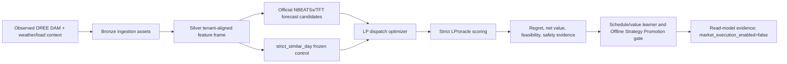
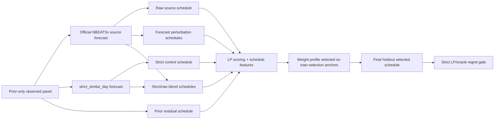
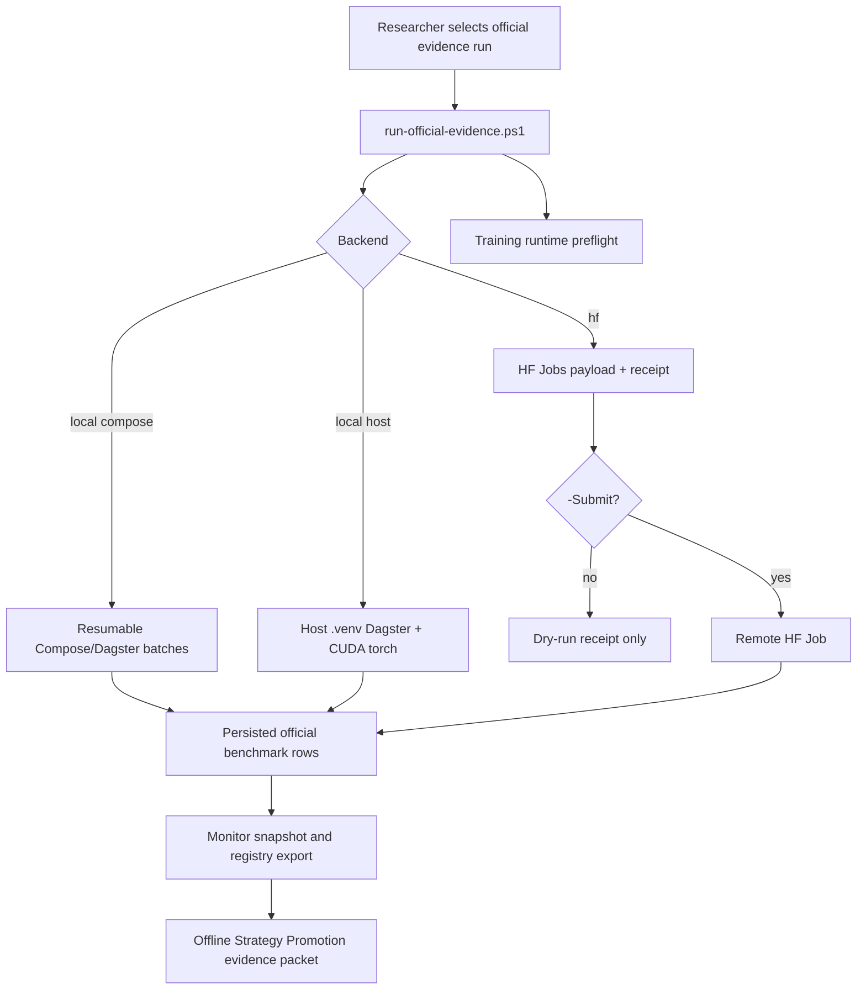

# Розділ 3. Методологія дослідження

## 3.1. Загальна методологічна логіка

Методологія цієї дипломної роботи побудована навколо принципу
`forecast -> optimize -> validate -> compare regret -> promote only if decision value improves`. Такий підхід відрізняє роботу від звичайного прогнозного
benchmark: модель не вважається кращою лише тому, що має нижчий MAE або RMSE.
Для BESS-арбітражу ключовим результатом є економічна якість рішення після
оптимізації, тобто net value, oracle regret, feasibility, throughput,
degradation proxy та дотримання safety constraints.

Базовим контрольним контуром є `strict_similar_day`. Він залишається
замороженим fallback і comparator для всіх ML/DFL-кандидатів. Neural forecast
models, schedule/value learners та DFL-style challengers можуть бути
розглянуті лише як Offline Strategy Promotion evidence: вони можуть
підтримувати offline/read-model strategy evidence, але не означають live market
execution, dashboard/API default switch або deployed Decision Transformer.

## 3.2. Дані та межа доказовості

Основний evidence layer побудований на українських observed OREE DAM цінах,
Open-Meteo/weather контексті та tenant configuration/load context. Дані
вирівнюються на погодинному горизонті, після чого формуються tenant-aligned
features для rolling-origin evaluation.

Синтетичні або demo-oriented rows не можуть використовуватися для thesis-grade
performance claim. Вони можуть існувати для стабільності demo або smoke tests,
але supervisor-facing benchmark має спиратися на provenance flags,
`data_quality_tier=thesis_grade`, `not_market_execution=true` і явні
claim-boundary поля.

Європейські market-coupling джерела, зокрема ENTSO-E, OPSD, Ember, Nord Pool,
PriceFM і THieF, розглядаються як research roadmap та external-validation
context. Вони не змішуються з українським training panel, доки не пройдені
licensing, timezone/DST, currency normalization, market-rule mapping,
publication-time availability та domain-shift gates.

## 3.3. Rolling-origin протокол

Оцінювання виконується як temporal rolling-origin protocol. Для кожного anchor
модель бачить лише інформацію, доступну до decision time. Реалізовані ціни
після anchor можуть використовуватися для oracle evaluation, regret labels і
diagnostics, але не для формування deployable forecast input або prior-only
selector feature.



У цьому протоколі oracle LP є only offline evaluator. Він має доступ до
realized prices лише для обчислення theoretical best value та regret. Oracle не
є deployable strategy і не використовується як live forecast source.

## 3.4. Forecast-to-schedule evaluation

Офіційні NBEATSx/TFT кандидати проходять не окрему forecast-only перевірку, а
той самий strict LP/oracle contour, що й baseline. Прогнозна траєкторія
перетворюється на schedule через LP dispatch optimizer, після чого schedule
оцінюється на realized prices. Це дозволяє порівнювати моделі за тим, що має
економічний сенс для BESS:

- mean і median oracle regret;
- degradation-adjusted net value;
- safety violations;
- throughput і SOC feasibility;
- rolling-window robustness;
- здатність не погіршувати `strict_similar_day` у стабільних режимах.

Schedule/value learner не замінює physical execution layer. Він вибирає
candidate schedule family у offline/read-model evidence stack і завжди
залишається за `strict_similar_day` fallback, доки promotion gate не доводить
стійку перевагу.

## 3.5. Schedule/Value Learner V2 як decision-value selector

Після первинного forecast-to-schedule evaluation у роботі вводиться проміжний
decision-aware шар: Schedule/Value Learner V2. Його методологічна роль полягає
не в тому, щоб безпосередньо навчати новий контролер батареї, а в тому, щоб
порівнювати набір уже feasible LP-scored schedules і вибирати schedule з
найкращим очікуваним decision value за prior-only ознаками. Такий дизайн
відповідає логіці Decision-Focused Learning: оцінюється не ізольована точність
forecast, а вплив forecast-derived schedule на downstream objective, regret і
економічний результат. Це узгоджується з Smart Predict-then-Optimize / SPO+
підходом Elmachtoub and Grigas, DFL survey Mandi et al., storage-specific DFL
роботою Sang et al. та predict-then-bid формулюванням Yi et al.

Методологічно цей шар є обережнішим за повний differentiable controller. Він не
послаблює strict LP/oracle evaluator і не використовує final-holdout realized
prices для вибору правил. Натомість він перетворює прогнозні кандидати на
декілька альтернативних schedule-candidates, кожен із яких проходить той самий
LP contour, SOC feasibility checks, throughput/degradation proxy та UAH-native
value calculation. Після цього selector порівнює ці schedules за ознаками,
доступними до scoring final holdout.

Для official global-panel 365-anchor evidence бібліотека будується окремо для
кожного tenant, source model та anchor. У поточному конфігу розглядаються два
source models: `nbeatsx_official_global_panel_v1` і
`nbeatsx_official_global_panel_horizon_calibrated_v1`. Для кожного такого
source model формується до десяти конкретних schedule-candidates:

| Candidate schedule group | Кількість | Походження | Методологічна функція |
|---|---:|---|---|
| `strict_control` | 1 | `strict_similar_day` forecast + LP dispatch | Frozen comparator і default fallback. |
| `raw_source` | 1 | Raw official NBEATSx forecast + LP dispatch | Перевіряє прямий внесок neural forecast. |
| `forecast_perturbation` | 4 | Детерміновані perturbations: 2 spread scales x 2 mean shifts | Додає локальні schedule alternatives навколо raw forecast без доступу до future actuals. |
| `strict_raw_blend_v2` | 3 | Prior-only blends між strict і raw forecast vectors з weights `0.25`, `0.50`, `0.75` | Дає змогу обрати частковий neural вплив замість all-or-nothing заміни baseline. |
| `strict_prior_residual_v2` | 1 | `strict_similar_day` forecast + prior residual vector після мінімум 14 prior anchors | Додає correction, побудовану лише з минулих anchors. |

Отже, після накопичення достатньої кількості prior anchors selector може
порівнювати до 10 schedule-candidates на кожен tenant/source/anchor. На
найперших train-selection anchors prior-residual candidate ще може бути
недоступним, тому фактична кількість кандидатів там становить 9. На final
holdout у 365-anchor експерименті prior context уже достатній, тому
порівнюється повна бібліотека до 10 candidates. Для двох source models це
означає, що final holdout має 5 tenants x 18 anchors x 10 schedules = 900
schedule-candidates на source model, або 1,800 schedule-candidates у сукупному
порівнянні двох official NBEATSx variants.



Сам Schedule/Value Learner V2 не виконує gradient descent. Він вибирає один із
трьох фіксованих scoring profiles на train-selection anchors і потім застосовує
цей profile до validation/final-holdout anchors. Тому коректне формулювання:
`weight profile selected offline from prior anchors`, а не "weights learned by
gradient descent". У поточній реалізації використовуються три профілі:

| Scoring profile | Основна ідея |
|---|---|
| `prior_regret_value` | Обрати family, яка мала найнижчий prior mean regret. |
| `spread_value` | Додатково винагороджувати прогнозний spread та LP objective value, але штрафувати degradation і throughput. |
| `strict_guarded_prior_value` | Дозволяти non-strict schedule тільки тоді, коли його schedule-value features компенсують явний fallback penalty. |

Ознаки, які використовуються selector-ом, є schedule/value features:
`prior_family_mean_regret_uah`, `forecast_spread_uah_mwh`,
`forecast_objective_value_uah`, `total_degradation_penalty_uah`,
`total_throughput_mwh`, `soc_min_slack_fraction` і deterministic
`candidate_family` tie-break. Вони не включають final-holdout actual prices або
oracle value як input. Realized prices та oracle LP використовуються лише для
labels, diagnostics і final strict scoring. Це підтримує temporal-no-leakage
протокол: минулі anchors можуть впливати на selection rule, але final-holdout
actuals можуть впливати лише на оцінку вже вибраного schedule.

Академічне обґрунтування цієї конструкції складається з кількох частин:

- LP/MILP-література для storage scheduling підтримує використання прозорого
  optimization layer із SOC, efficiency, power та energy constraints як
  контрольного контуру. Тому candidate schedules мають спочатку бути feasible
  LP schedules, а не unconstrained neural actions.
- EPF-література про NBEATSx і TFT обґрунтовує використання neural forecasts
  як source candidates, особливо з exogenous/context features. Водночас EPF
  benchmark literature підкреслює необхідність сильних простих baselines, тому
  `strict_similar_day` не прибирається з порівняння.
- SPO/DFL-література показує, що forecast error не дорівнює decision loss.
  Саме тому selector порівнює schedules за regret/value-facing features, а не
  лише за MAE/RMSE forecast metrics.
- ESS-specific DFL research показує, що storage arbitrage є path-dependent:
  правильність окремої hourly action label недостатня, бо SOC trajectory
  зв'язує рішення між годинами. Тому порівняння повних schedule trajectories є
  методологічно сильнішим за статичну hourly classification.
- Predict-then-bid research для стратегічного energy storage підтримує
  архітектуру, де forecasting, optimization та market/value evaluation
  розглядаються разом. У цій дипломній роботі це реалізовано обережно:
  Schedule/Value Learner V2 є offline/read-model challenger, а не live bidding
  controller.

Таким чином, Schedule/Value Learner V2 у методології роботи займає проміжне
місце між класичним Predict-then-Optimize і повним DFL/Decision Transformer
controller. Він уже оптимізує вибір за downstream decision value, але зберігає
strict LP/oracle evaluator, deterministic fallback і no-market-execution claim
boundary. Це дозволяє академічно коректно стверджувати Offline Strategy
Promotion evidence, не заявляючи live trading або deployed DT control.

## 3.6. Unified execution runner: local vs Hugging Face Jobs

Для довгих official evidence runs використовується єдиний operational
entrypoint:

```powershell
.\scripts\run-official-evidence.ps1 -Backend local
.\scripts\run-official-evidence.ps1 -Backend hf
```

`-Backend local -LocalMode compose` запускає resumable Docker/Dagster batch
runner на локальній машині. Це стабільний evidence path для service parity, але
він використовує GPU лише тоді, коли CUDA доступна всередині Dagster container.

`-Backend local -LocalMode host` запускає `.venv\Scripts\dagster.exe`
безпосередньо з Windows host. Цей режим може використовувати локальний
CUDA-enabled PyTorch і NVIDIA GTX, але перед запуском має бути
зафіксований runtime preflight receipt.

`-Backend hf` будує Hugging Face Jobs payload і dry-run receipt. Реальна платна
submission вимагає явного `-Submit`, pushed branch, `HF_TOKEN`, Jobs-capable
account і writable artifact dataset repo. Token не записується в локальний
receipt; він підставляється лише в момент submission.



Обидва backend-и мають однакову методологічну межу: зміна compute location не
змінює claim boundary. Результати залишаються offline/read-model evidence, а
`market_execution_enabled` має залишатися `false`.

## 3.7. Promotion criteria

Offline Strategy Promotion допускається тільки після проходження strict
LP/oracle gate. Мінімальні умови:

- observed Ukrainian coverage і thesis-grade provenance;
- відсутність train/final leakage;
- zero safety violations;
- latest holdout і rolling robustness;
- mean-regret improvement не менше 5% проти `strict_similar_day`;
- median regret не гірший за frozen control;
- `strict_similar_day` лишається fallback;
- market execution не вмикається.

Якщо candidate не проходить gate, це не вважається failure of implementation.
Це є валідним негативним результатом: система коректно відхиляє слабкий
контролер і зберігає safe baseline.

## 3.8. Відтворюваність і evidence packet

Кожен довгий official run має супроводжуватися run receipt, attempt manifest,
monitor snapshot і registry export. Разом ці артефакти відповідають на ключові
питання перевірки: які anchors запускалися, який backend використовувався,
який generated timestamp був зафіксований, скільки rows persisted, чи можна
resume run, і яка claim boundary застосована.

Фінальний evidence packet містить:

- official attempt manifest;
- monitor snapshot;
- schedule/value promotion registry JSON;
- schedule/value promotion registry Markdown;
- посилання на relevant technical docs;
- явне формулювання `market_execution_enabled=false`.

Така структура дозволяє відокремити engineering success від overclaiming:
показуючи reproducible Offline Strategy Promotion evidence без
твердження, що система вже виконує live trading або deployed DT control.

## 3.9. Джерела методологічного обґрунтування

Методологічна позиція розділу спирається на джерела, зафіксовані у
`docs/thesis/sources/README.md` та розділі 2. Для Schedule/Value Learner V2
особливо релевантні:

1. Park et al. (2017) - LP formulation for short-term ESS scheduling; підтримує
   використання прозорого LP dispatch layer із SOC, efficiency, power-limit та
   energy-limit constraints.
2. Olivares et al. (2023) - NBEATSx для electricity price forecasting with
   exogenous variables; обґрунтовує official NBEATSx як forecast source, але не
   як автоматично promoted strategy.
3. Lim et al. (2021) - Temporal Fusion Transformer; обґрунтовує
   multi-horizon/exogenous-aware forecast lane і майбутню explainability логіку.
4. Elmachtoub and Grigas (2022) - Smart Predict-then-Optimize / SPO+;
   обґрунтовує оцінювання через downstream decision loss і regret.
5. Mandi et al. (2024) - Decision-Focused Learning survey; задає ширшу рамку
   DFL як навчання для constrained-decision quality, а не лише forecast error.
6. Sang et al. (2023) - ESS arbitrage DFL; безпосередньо пов'язує price
   prediction, storage arbitrage value і regret-aware evaluation.
7. Yi et al. (2025) - decision-focused predict-then-bid framework for strategic
   energy storage; підтримує архітектурну траєкторію `forecast -> optimize ->
   bid/value evaluate`, збережену в цій роботі як offline/read-model evidence.
