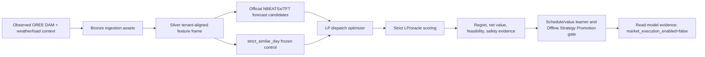
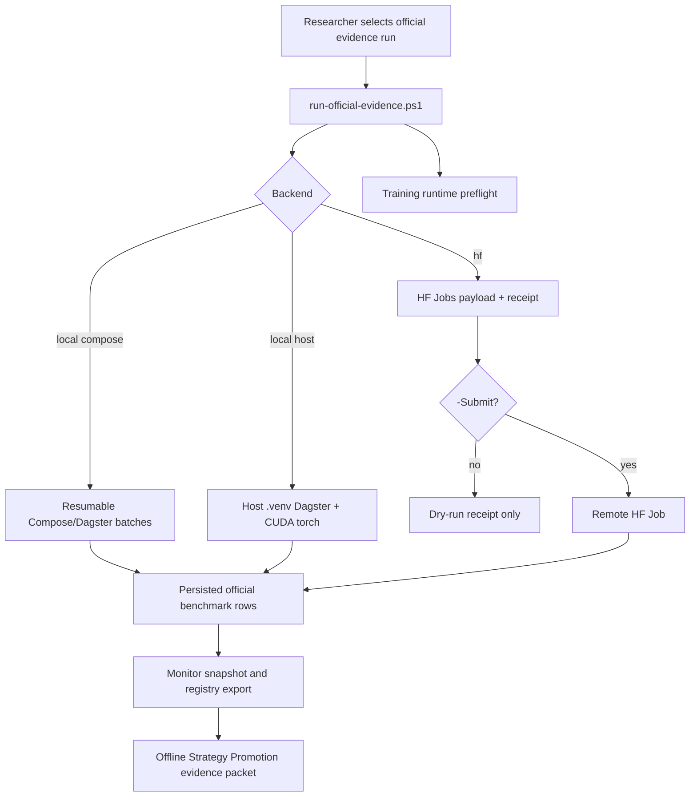

# Розділ 3. Методологія дослідження

## 3.1. Загальна методологічна логіка

Методологія цієї дипломної роботи побудована навколо принципу
`forecast -> optimize -> validate -> compare regret -> promote only if decision
value improves`. Такий підхід відрізняє роботу від звичайного прогнозного
benchmark: модель не вважається кращою лише тому, що має нижчий MAE або RMSE.
Для BESS-арбітражу ключовим результатом є економічна якість рішення після
оптимізації, тобто net value, oracle regret, feasibility, throughput,
degradation proxy та дотримання safety constraints.

Базовим контрольним контуром є `strict_similar_day`. Він залишається
замороженим fallback і comparator для всіх ML/DFL-кандидатів. Neural forecast
models, schedule/value learners та DFL-style challengers можуть бути
розглянуті лише як Offline Strategy Promotion evidence: вони можуть
підтримувати offline/read-model strategy evidence, але не означають live market
execution, dashboard/API default switch або deployed Decision Transformer.

## 3.2. Дані та межа доказовості

Основний evidence layer побудований на українських observed OREE DAM цінах,
Open-Meteo/weather контексті та tenant configuration/load context. Дані
вирівнюються на погодинному горизонті, після чого формуються tenant-aligned
features для rolling-origin evaluation.

Синтетичні або demo-oriented rows не можуть використовуватися для thesis-grade
performance claim. Вони можуть існувати для стабільності demo або smoke tests,
але supervisor-facing benchmark має спиратися на provenance flags,
`data_quality_tier=thesis_grade`, `not_market_execution=true` і явні
claim-boundary поля.

Європейські market-coupling джерела, зокрема ENTSO-E, OPSD, Ember, Nord Pool,
PriceFM і THieF, розглядаються як research roadmap та external-validation
context. Вони не змішуються з українським training panel, доки не пройдені
licensing, timezone/DST, currency normalization, market-rule mapping,
publication-time availability та domain-shift gates.

## 3.3. Rolling-origin протокол

Оцінювання виконується як temporal rolling-origin protocol. Для кожного anchor
модель бачить лише інформацію, доступну до decision time. Реалізовані ціни
після anchor можуть використовуватися для oracle evaluation, regret labels і
diagnostics, але не для формування deployable forecast input або prior-only
selector feature.



У цьому протоколі oracle LP є only offline evaluator. Він має доступ до
realized prices лише для обчислення theoretical best value та regret. Oracle не
є deployable strategy і не використовується як live forecast source.

## 3.4. Forecast-to-schedule evaluation

Офіційні NBEATSx/TFT кандидати проходять не окрему forecast-only перевірку, а
той самий strict LP/oracle contour, що й baseline. Прогнозна траєкторія
перетворюється на schedule через LP dispatch optimizer, після чого schedule
оцінюється на realized prices. Це дозволяє порівнювати моделі за тим, що має
економічний сенс для BESS:

- mean і median oracle regret;
- degradation-adjusted net value;
- safety violations;
- throughput і SOC feasibility;
- rolling-window robustness;
- здатність не погіршувати `strict_similar_day` у стабільних режимах.

Schedule/value learner не замінює physical execution layer. Він вибирає
candidate schedule family у offline/read-model evidence stack і завжди
залишається за `strict_similar_day` fallback, доки promotion gate не доводить
стійку перевагу.

## 3.5. Unified execution runner: local vs Hugging Face Jobs

Для довгих official evidence runs використовується єдиний operational
entrypoint:

```powershell
.\scripts\run-official-evidence.ps1 -Backend local
.\scripts\run-official-evidence.ps1 -Backend hf
```

`-Backend local -LocalMode compose` запускає resumable Docker/Dagster batch
runner на локальній машині. Це стабільний evidence path для service parity, але
він використовує GPU лише тоді, коли CUDA доступна всередині Dagster container.

`-Backend local -LocalMode host` запускає `.venv\Scripts\dagster.exe`
безпосередньо з Windows host. Цей режим може використовувати локальний
CUDA-enabled PyTorch і NVIDIA GTX 1050 Ti, але перед запуском має бути
зафіксований runtime preflight receipt.

`-Backend hf` будує Hugging Face Jobs payload і dry-run receipt. Реальна платна
submission вимагає явного `-Submit`, pushed branch, `HF_TOKEN`, Jobs-capable
account і writable artifact dataset repo. Token не записується в локальний
receipt; він підставляється лише в момент submission.



Обидва backend-и мають однакову методологічну межу: зміна compute location не
змінює claim boundary. Результати залишаються offline/read-model evidence, а
`market_execution_enabled` має залишатися `false`.

## 3.6. Promotion criteria

Offline Strategy Promotion допускається тільки після проходження strict
LP/oracle gate. Мінімальні умови:

- observed Ukrainian coverage і thesis-grade provenance;
- відсутність train/final leakage;
- zero safety violations;
- latest holdout і rolling robustness;
- mean-regret improvement не менше 5% проти `strict_similar_day`;
- median regret не гірший за frozen control;
- `strict_similar_day` лишається fallback;
- market execution не вмикається.

Якщо candidate не проходить gate, це не вважається failure of implementation.
Це є валідним негативним результатом: система коректно відхиляє слабкий
контролер і зберігає safe baseline.

## 3.7. Відтворюваність і evidence packet

Кожен довгий official run має супроводжуватися run receipt, attempt manifest,
monitor snapshot і registry export. Разом ці артефакти відповідають на ключові
питання перевірки: які anchors запускалися, який backend використовувався,
який generated timestamp був зафіксований, скільки rows persisted, чи можна
resume run, і яка claim boundary застосована.

Фінальний evidence packet для supervisor-facing результатів має містити:

- official attempt manifest;
- monitor snapshot;
- schedule/value promotion registry JSON;
- schedule/value promotion registry Markdown;
- посилання на relevant technical docs;
- явне формулювання `market_execution_enabled=false`.

Така структура дозволяє відокремити engineering success від overclaiming:
диплом може показати reproducible Offline Strategy Promotion evidence без
твердження, що система вже виконує live trading або deployed DT control.
