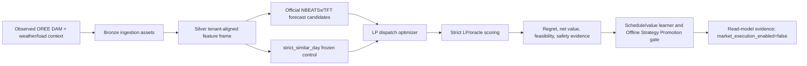
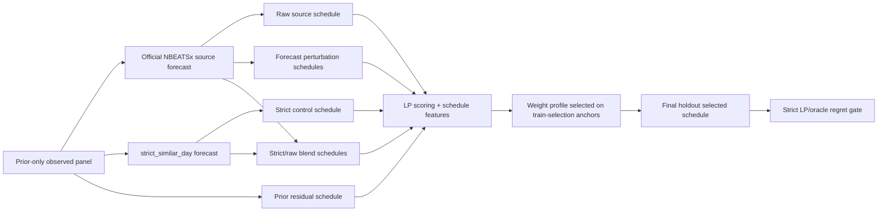
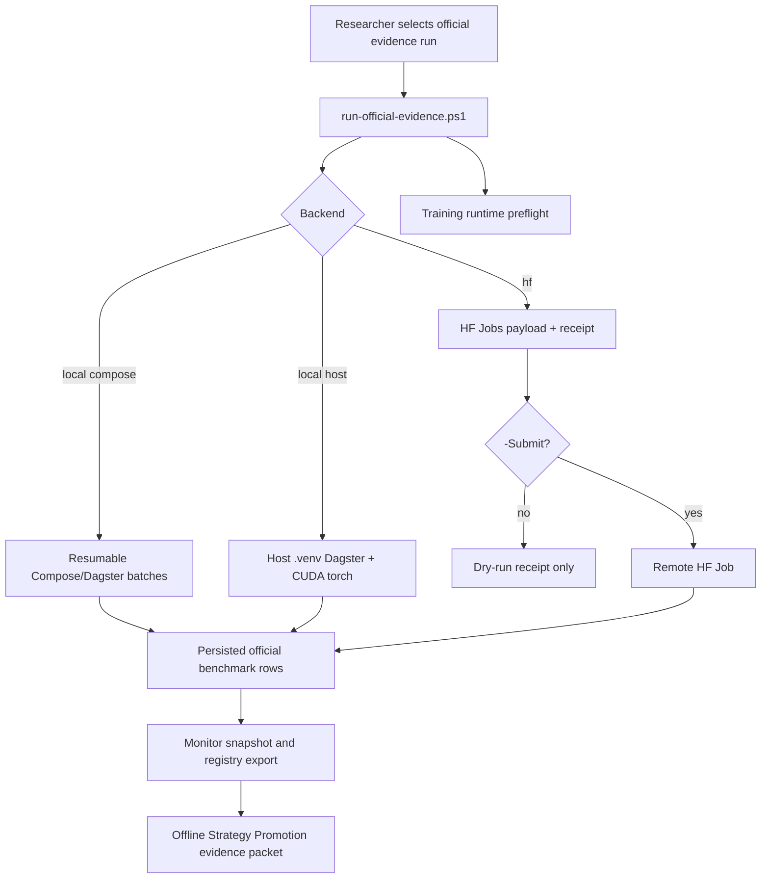

# Розділ 3. Методологія дослідження

## 3.1. Загальна методологічна логіка

Методологія цієї дипломної роботи побудована навколо принципу
`forecast -> optimize -> validate -> compare regret -> promote only if decision value improves`. Такий підхід відрізняє роботу від звичайного прогнозного
benchmark: модель не вважається кращою лише тому, що має нижчий MAE або RMSE.
Для BESS-арбітражу ключовим результатом є економічна якість рішення після
оптимізації, тобто net value, oracle regret, feasibility, throughput,
degradation proxy та дотримання safety constraints.

Базовим контрольним контуром є `strict_similar_day`. Він залишається
замороженим fallback і comparator для всіх ML/DFL-кандидатів. Neural forecast
models, schedule/value learners та DFL-style challengers можуть бути
розглянуті лише як доказова база для Offline Strategy Promotion: вони можуть
підтримувати offline/read-model strategy evidence, але не означають ринкове
виконання в реальному часі, автоматичне перемикання dashboard/API на нову
стратегію або розгорнутий Decision Transformer-контролер.

Для уникнення змішування дослідницьких, демонстраційних і продуктово
орієнтованих тверджень у роботі використовується стисла таблиця методів.
Таблиця 3.1 показує, які дані використовує кожний метод, чи допускає він
майбутню інформацію, яку роль має у decision pipeline та яку межу твердження
дозволяє.

| Метод | Вхідні дані | Чи використовує майбутні дані? | Роль у прийнятті рішення | Основна метрика | Межа твердження |
|---|---|---|---|---|---|
| Bronze/Silver/Gold data pipeline | OREE DAM, Open-Meteo/weather context, tenant configuration/load context, telemetry та guarded external-source candidates | Ні; кожен ряд має відповідати часовій доступності джерела | Формує відтворюваний evidence layer і lineage для всіх наступних експериментів | Повнота даних, provenance, `data_quality_tier`, coverage | Твердження рівня thesis-grade дозволені лише для observed Ukrainian evidence; demo/synthetic rows не підтримують висновки про ефективність. |
| `strict_similar_day` baseline | Історичні ціни та календарний контекст, доступні до anchor | Ні | Заморожений comparator і fallback для всіх ML/DFL-кандидатів | Oracle regret, net value, median regret, rolling robustness | Є контрольним контуром і fallback; не є твердженням про оптимальність у всіх майбутніх ринкових режимах. |
| LP dispatch optimizer | Forecast vector, battery capacity/power limits, SOC, efficiency, degradation proxy | Ні для schedule, який може бути використаний у попередньому плануванні; realized prices використовуються лише в oracle-evaluation режимі | Перетворює forecast на feasible charge/discharge schedule | Feasibility, SOC bounds, throughput, degradation-adjusted value | Детермінований scheduling/preview layer; не створює ринкових заявок і не є фізичним dispatch controller. |
| Official NBEATSx/TFT forecast candidates | Rolling-origin training history, tenant-aligned features, approved prior-only exogenous context | Ні | Дає forecast input для того самого LP/oracle contour, що й baseline | Forecast metrics як допоміжні; основна оцінка через downstream regret/value | Нейронний forecast не promoted сам по собі; він має покращити decision value після LP. |
| Strict LP/oracle evaluation | Вибраний schedule та realized prices після anchor | Так, але лише після факту і лише для оцінювання | Обчислює theoretical best value та regret для offline comparison | Mean/median oracle regret, value gap | Oracle не є стратегією, яку можна застосовувати для виконання ринкових рішень, і не використовується як джерело прогнозу. |
| Schedule/Value Learner V2/V2+ | Feasible LP-scored candidate schedules і prior-only schedule/value features | Ні для selection rule; final-holdout realized values використовуються тільки для scoring | Offline selector між schedule families; поточний найсильніший promotion evidence | Mean-regret improvement, median-not-worse condition, 4-window robustness | Підтримує Offline Strategy Promotion/read-model evidence; не вмикає ринкове виконання. |
| Candidate-Value DFL v3 та DFL/DT challengers | Candidate libraries, train/prior label panels, trajectory/value diagnostics | Train/prior labels можуть містити realized outcomes минулих anchors; final holdout не використовується для selection | Дослідницька перевірка більш decision-focused objective та підготовка до майбутнього DT | Improvement vs V2+, robustness, failure-mode diagnostics | Research-only/diagnostic layer, доки не перевершить V2+ під незмінним strict LP/oracle gate. |
| Pydantic Gatekeeper і governance policies | `ProposedBid`/dispatch contracts, market caps, SOC/physical limits, source-governance flags | Ні | Детермінована валідація safety, market та data-governance constraints | Validation failures, cap/SOC/envelope feasibility, blocked governance status | Safety boundary системи; не є ML-моделлю і не підтверджує автономне ринкове виконання. |
| Evidence packet і run registry | Attempt manifest, monitor snapshot, persisted rows, registry JSON/Markdown, asset checks | Ні | Забезпечує відтворюваність і аудит експерименту | Persisted row count, check status, run receipt consistency | Доказовий пакет для дипломної оцінки; не є журналом фактичної торгівлі. |

Окремо від методів навчання та оцінювання у роботі використовується API-шар.
Його призначення полягає не в тому, щоб змінювати дослідницький результат, а в
тому, щоб публікувати стан pipeline, read-model evidence і operator preview у
стабільних контрактах. Таблиця 3.2 узагальнює групи API-методів на рівні,
достатньому для методологічного розділу; повна endpoint-by-endpoint
специфікація наведена в [Додатку А](../appendices/api-read-model-specification.md).

| Група API-методів | Приклад endpoint-а | Джерело даних | Підтримуваний метод або експеримент | Що повертає | Межа твердження |
|---|---|---|---|---|---|
| Tenant/config methods | `GET /tenants` | Tenant registry і location metadata | Tenant-aware feature alignment і demo configuration | Список tenants, координати, timezone та ідентифікатори | Конфігураційний read model; не є експериментальним результатом. |
| Weather/materialization methods | `POST /weather/run-config`, `POST /weather/materialize` | Open-Meteo config, Dagster `weather_forecast_bronze`, optional DAM price history | Bronze ingestion і location-aware weather experiment setup | Run config, selected assets, resolved location, materialization status | Запускає або готує ingestion/demo materialization; не підтверджує ML superiority. |
| Battery/telemetry methods | `GET /dashboard/battery-state` | MQTT telemetry ingest path, Postgres battery telemetry store, hourly battery snapshots | Battery feasibility context і SOC-aware operator preview | Latest telemetry, hourly snapshot, freshness/fallback reason | Read model фізичного стану; не є dispatch command. |
| Baseline/LP preview methods | `GET /dashboard/baseline-lp-preview`, `POST /dashboard/projected-battery-state` | Tenant defaults, strict-similar-day price history, LP solver, projected battery simulator | Level 1 baseline, SOC feasibility і degradation-aware economics | Forecast, signed MW schedule, projected SOC trace, UAH economics | Preview/recommendation layer; не створює `ProposedBid`, `ClearedTrade` або фізичний dispatch. |
| Forecast evidence methods | `GET /dashboard/future-stack-preview`, `GET /dashboard/forecast-strategy-comparison` | Forecast store, strategy evaluation store, NBEATSx/TFT/strict comparison rows | Forecast-to-schedule evaluation через LP/oracle contour | Forecast series, model status, regret/value comparison, quality boundary | Forecast evidence surface; neural forecast не promoted без downstream regret gate. |
| Benchmark/research methods | `GET /dashboard/real-data-benchmark`, `GET /dashboard/dfl-schedule-value-production-gate` | Postgres strategy/DFL stores, promotion gate rows, persisted benchmark frames | Rolling-origin benchmark, V2/V2+ schedule/value promotion evidence | Regret rows, data-quality tier, promotion flags, `market_execution_enabled=false` | Offline/read-model evidence only; не є ринковим виконанням. |
| DT/policy-preview methods | `GET /dashboard/decision-transformer-trajectories`, `GET /dashboard/decision-policy-preview` | Simulated trade store, offline trajectory/policy-preview rows | Offline DT preparation і policy-preview diagnostics | Trajectory rows, projected actions, safety projection, value gap | Research/preview layer; не є розгорнутим DT-контролером. |
| Operator recommendation methods | `GET /dashboard/operator-recommendation` | Battery state, tenant load/PV context, strategy availability, forecast/read stores, LP preview | Operator-facing aggregation of available evidence | Selected strategy, available strategies, forecast series, value-gap series, feasible schedule | Product read model для operator review; не подає ринкових заявок. |

## 3.2. Дані та межа доказовості

Основний evidence layer побудований на українських observed OREE DAM цінах,
Open-Meteo/weather контексті та tenant configuration/load context. Дані
вирівнюються на погодинному горизонті, після чого формуються tenant-aligned
features для rolling-origin evaluation.

Синтетичні або demo-oriented rows не можуть використовуватися для thesis-grade
performance claim. Вони можуть існувати для стабільності demo або smoke tests,
але benchmark має спиратися на provenance flags,
`data_quality_tier=thesis_grade`, `not_market_execution=true` і явні
claim-boundary поля.

Європейські market-coupling джерела, зокрема ENTSO-E, OPSD, Ember, Nord Pool,
PriceFM і THieF, розглядаються як research roadmap та external-validation
context. Вони не змішуються з українським training panel, доки не пройдені
licensing, timezone/DST, currency normalization, market-rule mapping,
publication-time availability та domain-shift gates.

## 3.3. Rolling-origin протокол

Оцінювання виконується як temporal rolling-origin protocol. Для кожного anchor
модель бачить лише інформацію, доступну до decision time. Реалізовані ціни
після anchor можуть використовуватися для oracle evaluation, regret labels і
diagnostics, але не для формування forecast input для майбутнього виконання
рішення або prior-only ознак selector-а.



У цьому протоколі oracle LP є лише офлайн-оцінювачем. Він має доступ до
realized prices лише для обчислення theoretical best value та regret. Oracle не
є стратегією, яку можна застосовувати для виконання ринкових рішень, і не
використовується як джерело прогнозу.

## 3.4. Forecast-to-schedule evaluation

Офіційні NBEATSx/TFT кандидати проходять не окрему forecast-only перевірку, а
той самий strict LP/oracle contour, що й baseline. Прогнозна траєкторія
перетворюється на schedule через LP dispatch optimizer, після чого schedule
оцінюється на realized prices. Це дозволяє порівнювати моделі за тим, що має
економічний сенс для BESS:

- mean і median oracle regret;
- degradation-adjusted net value;
- safety violations;
- throughput і SOC feasibility;
- rolling-window robustness;
- здатність не погіршувати `strict_similar_day` у стабільних режимах.

Schedule/value learner не замінює фізичний контур виконання. Він вибирає
candidate schedule family у offline/read-model evidence stack і завжди
залишається за `strict_similar_day` fallback, доки promotion gate не доводить
стійку перевагу.

## 3.5. Schedule/Value Learner V2 як decision-value selector

Після первинного forecast-to-schedule evaluation у роботі вводиться проміжний
decision-aware шар: Schedule/Value Learner V2. Його методологічна роль полягає
не в тому, щоб безпосередньо навчати новий контролер батареї, а в тому, щоб
порівнювати набір уже feasible LP-scored schedules і вибирати schedule з
найкращим очікуваним decision value за prior-only ознаками. Такий дизайн
відповідає логіці Decision-Focused Learning: оцінюється не ізольована точність
forecast, а вплив forecast-derived schedule на downstream objective, regret і
економічний результат. Це узгоджується з Smart Predict-then-Optimize / SPO+
підходом Elmachtoub and Grigas, DFL survey Mandi et al., storage-specific DFL
роботою Sang et al. та predict-then-bid формулюванням Yi et al.

Методологічно цей шар є обережнішим за повний differentiable controller. Він не
послаблює strict LP/oracle evaluator і не використовує final-holdout realized
prices для вибору правил. Натомість він перетворює прогнозні кандидати на
декілька альтернативних schedule-candidates, кожен із яких проходить той самий
LP contour, SOC feasibility checks, throughput/degradation proxy та UAH-native
value calculation. Після цього selector порівнює ці schedules за ознаками,
доступними до scoring final holdout.

Для official global-panel 365-anchor evidence бібліотека будується окремо для
кожного tenant, source model та anchor. У поточному конфігу розглядаються два
source models: `nbeatsx_official_global_panel_v1` і
`nbeatsx_official_global_panel_horizon_calibrated_v1`. Для кожного такого
source model формується до десяти конкретних schedule-candidates:

| Candidate schedule group | Кількість | Походження | Методологічна функція |
|---|---:|---|---|
| `strict_control` | 1 | `strict_similar_day` forecast + LP dispatch | Frozen comparator і default fallback. |
| `raw_source` | 1 | Raw official NBEATSx forecast + LP dispatch | Перевіряє прямий внесок neural forecast. |
| `forecast_perturbation` | 4 | Детерміновані perturbations: 2 spread scales x 2 mean shifts | Додає локальні schedule alternatives навколо raw forecast без доступу до future actuals. |
| `strict_raw_blend_v2` | 3 | Prior-only blends між strict і raw forecast vectors з weights `0.25`, `0.50`, `0.75` | Дає змогу обрати частковий neural вплив замість all-or-nothing заміни baseline. |
| `strict_prior_residual_v2` | 1 | `strict_similar_day` forecast + prior residual vector після мінімум 14 prior anchors | Додає correction, побудовану лише з минулих anchors. |

Отже, після накопичення достатньої кількості prior anchors selector може
порівнювати до 10 schedule-candidates на кожен tenant/source/anchor. На
найперших train-selection anchors prior-residual candidate ще може бути
недоступним, тому фактична кількість кандидатів там становить 9. На final
holdout у 365-anchor експерименті prior context уже достатній, тому
порівнюється повна бібліотека до 10 candidates. Для двох source models це
означає, що final holdout має 5 tenants x 18 anchors x 10 schedules = 900
schedule-candidates на source model, або 1,800 schedule-candidates у сукупному
порівнянні двох official NBEATSx variants.



Сам Schedule/Value Learner V2 не виконує gradient descent. Він вибирає один із
трьох фіксованих scoring profiles на train-selection anchors і потім застосовує
цей profile до validation/final-holdout anchors. Тому коректне формулювання:
`weight profile selected offline from prior anchors`, а не "weights learned by
gradient descent". У поточній реалізації використовуються три профілі:

| Scoring profile | Основна ідея |
|---|---|
| `prior_regret_value` | Обрати family, яка мала найнижчий prior mean regret. |
| `spread_value` | Додатково винагороджувати прогнозний spread та LP objective value, але штрафувати degradation і throughput. |
| `strict_guarded_prior_value` | Дозволяти non-strict schedule тільки тоді, коли його schedule-value features компенсують явний fallback penalty. |

Ознаки, які використовуються selector-ом, є schedule/value features:
`prior_family_mean_regret_uah`, `forecast_spread_uah_mwh`,
`forecast_objective_value_uah`, `total_degradation_penalty_uah`,
`total_throughput_mwh`, `soc_min_slack_fraction` і deterministic
`candidate_family` tie-break. Вони не включають final-holdout actual prices або
oracle value як input. Realized prices та oracle LP використовуються лише для
labels, diagnostics і final strict scoring. Це підтримує temporal-no-leakage
протокол: минулі anchors можуть впливати на selection rule, але final-holdout
actuals можуть впливати лише на оцінку вже вибраного schedule.

Академічне обґрунтування цієї конструкції складається з кількох частин:

- LP/MILP-література для storage scheduling підтримує використання прозорого
  optimization layer із SOC, efficiency, power та energy constraints як
  контрольного контуру. Тому candidate schedules мають спочатку бути feasible
  LP schedules, а не unconstrained neural actions.
- EPF-література про NBEATSx і TFT обґрунтовує використання neural forecasts
  як source candidates, особливо з exogenous/context features. Водночас EPF
  benchmark literature підкреслює необхідність сильних простих baselines, тому
  `strict_similar_day` не прибирається з порівняння.
- SPO/DFL-література показує, що forecast error не дорівнює decision loss.
  Саме тому selector порівнює schedules за regret/value-facing features, а не
  лише за MAE/RMSE forecast metrics.
- ESS-specific DFL research показує, що storage arbitrage є path-dependent:
  правильність окремої hourly action label недостатня, бо SOC trajectory
  зв'язує рішення між годинами. Тому порівняння повних schedule trajectories є
  методологічно сильнішим за статичну hourly classification.
- Predict-then-bid research для стратегічного energy storage підтримує
  архітектуру, де forecasting, optimization та market/value evaluation
  розглядаються разом. У цій дипломній роботі це реалізовано обережно:
  Schedule/Value Learner V2 є offline/read-model challenger, а не контролером
  для подання ринкових заявок у реальному часі.

Таким чином, Schedule/Value Learner V2 у методології роботи займає проміжне
місце між класичним Predict-then-Optimize і повним DFL/Decision Transformer
контролером. Він уже оптимізує вибір за downstream decision value, але зберігає
strict LP/oracle evaluator, deterministic fallback і межу твердження про
відсутність ринкового виконання. Це дозволяє академічно коректно стверджувати
Offline Strategy Promotion evidence, не заявляючи ринкову торгівлю в реальному
часі або розгорнутий DT-контролер.

## 3.6. Candidate-Value DFL v3 як schedule-level value scorer

Після фіксації V2+ як headline evidence було перевірено сильніший, але все ще
обережний DFL-напрям: Candidate-Value DFL v3. Його мета - не генерувати raw
hourly BUY/SELL/HOLD дії, а навчитися оцінювати вже feasible LP-scored
candidate schedules. Це відповідає decision-focused логіці: модель має
навчатися на downstream value/regret labels і порівнювати повні траєкторії, а
не лише копіювати одиничні hourly labels.

Candidate-Value DFL v3 складається з трьох методологічних шарів:

1. Розширена candidate library навколо реальних failure modes:
   strict-neighborhood schedules, SOC terminal-target variants, peak/trough
   timing shifts, uncertainty/risk schedules, degradation-price sweeps,
   train-only oracle-neighborhood diagnostics і prior-template schedules.
2. Candidate-value label panel, де `selector_feature_*` колонки є prior-safe
   inputs, а `label_*` колонки є realized regret/value labels. Final-holdout
   labels не використовуються для train-time model selection.
3. `learned_linear_candidate_value_v3`, ridge-style schedule-level scorer,
   який навчає ваги на train/prior candidate rows і прогнозує value/regret для
   кожного candidate schedule.

Цей підхід відрізняється від V2 weight-profile selection. У V2 профіль ваг
обирається offline з фіксованого набору профілів. У Candidate-Value DFL v3
ваги candidate-level scorer справді оцінюються з label panel, але deployment
rule залишається безпечним: якщо prior/train evidence не показує достатнього
покращення проти frozen V2+, selector повертається до V2+. Тому V3 може
пояснювати failure modes і перевіряти більш DFL-подібний objective, не
послаблюючи thesis gate.

Методологічне значення матеріалізованого результату є негативним, але корисним:
V3 пройшов evidence checks і навчив candidate-level scorer, проте strict
LP/oracle gate залишив V2+ як fallback. Failure audit показав, що prior-template
schedules були неконкурентними проти V2+ на більшості final-holdout anchors.
Отже, наступний DFL/DT крок має покращувати feature/context або candidate
generation mechanism, а не повторювати ті самі історичні residual templates.

V4 plateau-breaker методологічно фіксує саме цю проблему перед переходом до DT.
Спочатку він класифікує причину плато між V2+ і V3:
`candidate_not_better`, `candidate_available_but_not_selected` або
`fallback_too_conservative`. Потім окремий data-quality audit перевіряє, чи не
пов'язаний залишковий regret з браком point-in-time context: Ukrainian DAM
coverage, weather/load, calendar/event, publication-time availability та regret
clusters. Лише після цього V4 додає сильніші feasible schedules: quantile/risk,
block peak, terminal SOC reserve, spread-volatility robust,
tenant degradation/throughput sweep та train-only oracle-neighborhood
diagnostics. Усі ці schedules все одно проходять той самий LP/oracle scoring, а
фінальний scorer навчається на train/prior labels і fallback-иться до V2+, якщо
prior evidence не доводить очікуване покращення.

## 3.7. Уніфікований запуск evidence-runs: local vs Hugging Face Jobs

Для довгих official evidence runs використовується єдиний технічний entrypoint:

```powershell
.\scripts\run-official-evidence.ps1 -Backend local
.\scripts\run-official-evidence.ps1 -Backend hf
```

`-Backend local -LocalMode compose` запускає resumable Docker/Dagster batch
runner на локальній машині. Це стабільний evidence path для service parity, але
він використовує GPU лише тоді, коли CUDA доступна всередині Dagster container.

`-Backend local -LocalMode host` запускає `.venv\Scripts\dagster.exe`
безпосередньо з Windows host. Цей режим може використовувати локальний
CUDA-enabled PyTorch і NVIDIA GTX, але перед запуском має бути
зафіксований runtime preflight receipt.

`-Backend hf` будує Hugging Face Jobs payload і dry-run receipt. Реальна платна
submission вимагає явного `-Submit`, pushed branch, `HF_TOKEN`, Jobs-capable
account і writable artifact dataset repo. Token не записується в локальний
receipt; він підставляється лише в момент submission.



Обидва backend-и мають однакову методологічну межу: зміна місця обчислення не
змінює claim boundary. Результати залишаються offline/read-model evidence, а
`market_execution_enabled` має залишатися `false`.

## 3.8. Promotion criteria

Offline Strategy Promotion допускається тільки після проходження strict
LP/oracle gate. Мінімальні умови:

- observed Ukrainian coverage і thesis-grade provenance;
- відсутність train/final leakage;
- zero safety violations;
- latest holdout і rolling robustness;
- mean-regret improvement не менше 5% проти `strict_similar_day`;
- median regret не гірший за frozen control;
- `strict_similar_day` лишається fallback;
- ринкове виконання не вмикається.

Якщо candidate не проходить gate, це не вважається failure of implementation.
Це є валідним негативним результатом: система коректно відхиляє слабкий
контролер і зберігає safe baseline.

## 3.9. Відтворюваність і evidence packet

Кожен довгий official run має супроводжуватися run receipt, attempt manifest,
monitor snapshot і registry export. Разом ці артефакти відповідають на ключові
питання перевірки: які anchors запускалися, який backend використовувався,
який generated timestamp був зафіксований, скільки rows persisted, чи можна
resume run, і яка claim boundary застосована.

Фінальний evidence packet містить:

- official attempt manifest;
- monitor snapshot;
- schedule/value promotion registry JSON;
- schedule/value promotion registry Markdown;
- посилання на relevant technical docs;
- явне формулювання `market_execution_enabled=false`.

Така структура дозволяє відокремити інженерний успіх від завищених тверджень:
вона демонструє відтворювану доказову базу для Offline Strategy Promotion без
твердження, що система вже виконує ринкові операції в реальному часі або має
розгорнутий DT-контролер.

## 3.10. Джерела методологічного обґрунтування

Методологічна позиція розділу спирається на джерела, зафіксовані у
`docs/thesis/sources/README.md` та розділі 2. Для Schedule/Value Learner V2
особливо релевантні:

1. Park et al. (2017) - LP formulation for short-term ESS scheduling; підтримує
   використання прозорого LP dispatch layer із SOC, efficiency, power-limit та
   energy-limit constraints.
2. Olivares et al. (2023) - NBEATSx для electricity price forecasting with
   exogenous variables; обґрунтовує official NBEATSx як forecast source, але не
   як автоматично promoted strategy.
3. Lim et al. (2021) - Temporal Fusion Transformer; обґрунтовує
   multi-horizon/exogenous-aware forecast lane і майбутню explainability логіку.
4. Elmachtoub and Grigas (2022) - Smart Predict-then-Optimize / SPO+;
   обґрунтовує оцінювання через downstream decision loss і regret.
5. Mandi et al. (2024) - Decision-Focused Learning survey; задає ширшу рамку
   DFL як навчання для constrained-decision quality, а не лише forecast error.
6. Sang et al. (2023) - ESS arbitrage DFL; безпосередньо пов'язує price
   prediction, storage arbitrage value і regret-aware evaluation.
7. Yi et al. (2025) - decision-focused predict-then-bid framework for strategic
   energy storage; підтримує архітектурну траєкторію `forecast -> optimize ->
   bid/value evaluate`, збережену в цій роботі як offline/read-model evidence.
