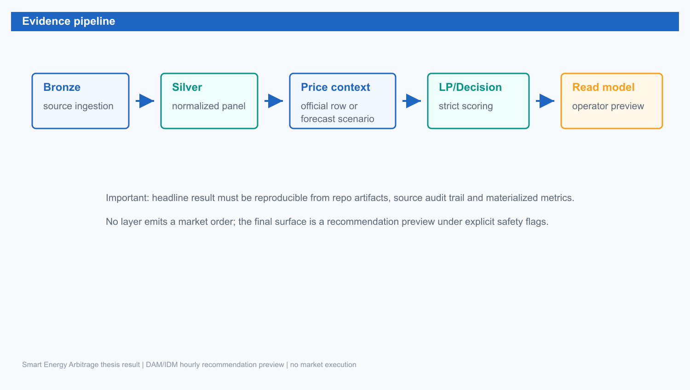
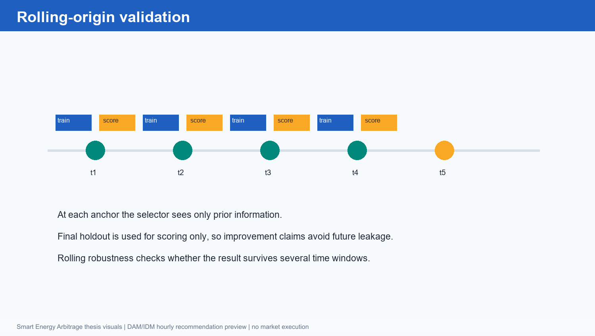
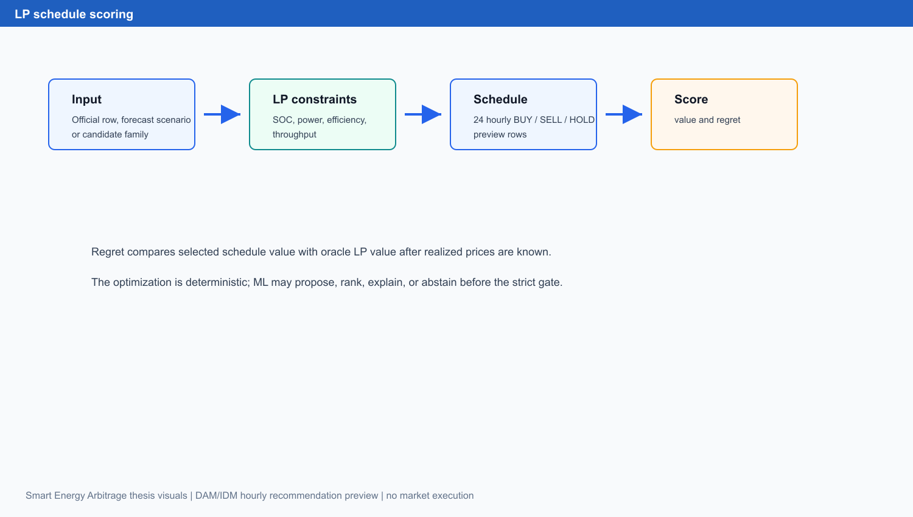
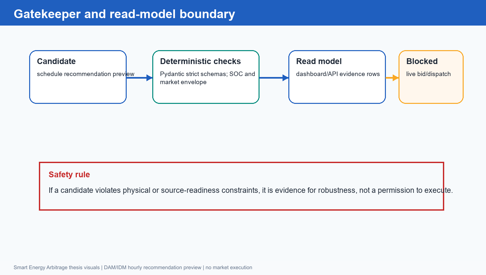
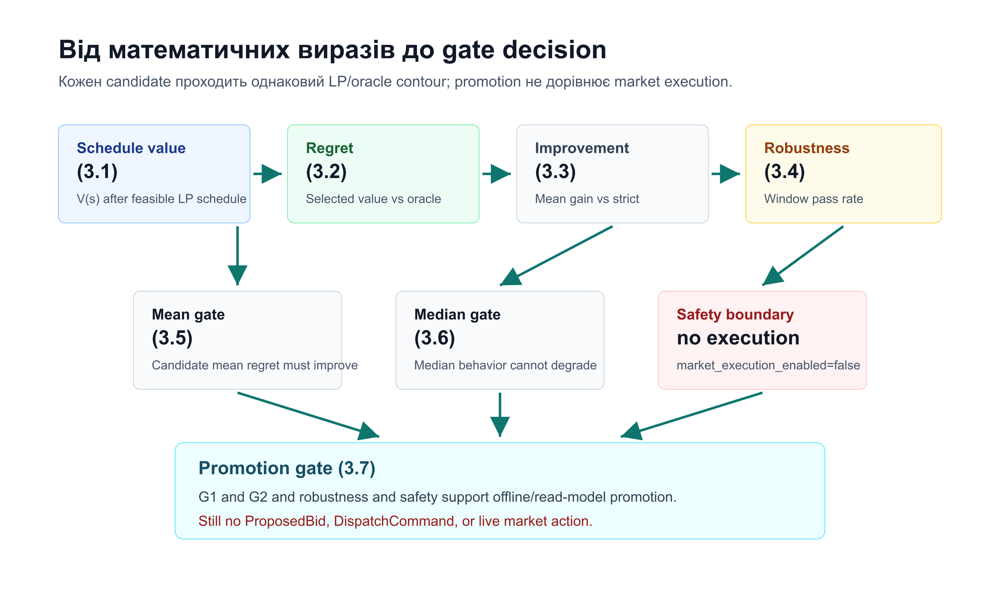

Розділ 3. Методологія та архітектура

3.1. Загальна методологія

Методологія роботи побудована навколо простого принципу: кожне твердження про якість моделі має пройти через однаковий decision contour. Forecast model або selector не оцінюється ізольовано. Він генерує price signal або вибирає candidate family, після чого deterministic LP формує feasible schedule, oracle evaluator обчислює reference value, а regret/value metrics визначають, чи має candidate практичний сенс.

Evidence pipeline наведено на рисунку 3.1.

Рисунок 3.1. Evidence pipeline від source snapshots до read-model preview

Рисунок 3.1 показує послідовність: source snapshots надходять у normalized panel, forecast/candidate layer створює schedule options, strict LP/oracle evaluator оцінює decision quality, а FastAPI/dashboard read model показує operator preview. Жоден крок не створює market order payload; це принципова межа методології.

3.2. Evidence boundaries

Ключові межі доказів наведено в таблиці 3.1.

Таблиця 3.1. Evidence boundaries для інтерпретації результатів

| Шар доказів | Дозволене твердження | Заборонене твердження |
| --- | --- | --- |
| Official OREE row first | Published DAM/IDM hourly row є price source для preview | Переугадувати already published row або називати forecast офіційною ціною |
| Forecast adapter | Модель генерує price signal для LP candidate | Модель сама оптимізує ринковий bid |
| LP/oracle evaluator | Schedule оцінено в однаковому strict contour | Oracle value доступний до рішення |
| V2/V2+ selector | Offline/read-model Strategy Promotion | Автономна торгівля або dispatch |
| TFT / Poland / DT shadow | Research-only diagnostics and future work | Replacement of V2+ без gate |
| V13 acquisition | Source-readiness blockers documented | DT/LAVA ready або market execution ready |

Таблиця 3.1 потрібна для читання всіх наступних результатів. Вона відділяє дозволені offline/read-model claims від заборонених execution claims. Якщо результат проходить offline promotion gate, це означає thesis-facing strategy evidence, але не дозвіл на ринок.

3.3. Rolling-origin protocol

Для часових рядів критично уникати future leakage. У роботі використано rolling-origin validation: на кожному anchor модель або selector має бачити лише prior information, а realized prices final holdout використовуються тільки після рішення для scoring. Схему наведено на рисунку 3.2.

Рисунок 3.2. Rolling-origin validation без future leakage

Рисунок 3.2 пояснює, чому validation не можна замінити випадковим train/test split. Для market data випадкове перемішування руйнує часову доступність ознак. Rolling-origin protocol зберігає причинний порядок і дозволяє чесно оцінити, що було відомо до decision time.

3.3.1. Temporal availability rule для DAM/IDM preview

У deployed/read-model path спочатку визначається publication state для `target_delivery_date`, `market_venue` і конкретних hourly rows. Якщо official OREE DAM або IDM row уже опубліковано для target hour, цей row є price source: LP solver отримує published price vector і будує feasible schedule, а ML stack не переугадує вже відому ціну. Якщо target horizon ще не має published row, наприклад дальший delivery day або незакритий source window, NBEATSx/TFT можуть створити complete forecast scenario vectors. Після цього LP перетворює кожний scenario на candidate schedule, а V2+/AFL/DFL/DT layers можуть ранжувати, пояснювати або abstain. Отже, Transformer у поточній межі не є live model dispatch і не є price authority; він є research/advisor layer над feasible schedules.

3.4. LP schedule and value

Нехай \(t\) (t) позначає погодинний інтервал, \(p_t\) (p_t) - realized або scenario price для вибраного market venue, \(c_t\) (c_t) - charge power, \(d_t\) (d_t) - discharge power, \(\eta_c\) (eta_c) та \(\eta_d\) (eta_d) - efficiency, а \(e_t\) (e_t) - енергія в батареї. Для headline packet market venue є DAM; для IDM preview той самий hourly формалізм є read-model lane без 15-minute bid/submission. Економічну цінність schedule можна записати як:

V(s) = sum_t p_t * (d_t * eta_d - c_t / eta_c) - C_deg(s)    (3.1)

LaTeX: \(V(s)=\sum_t p_t\left(d_t\eta_d-\frac{c_t}{\eta_c}\right)-C_{\mathrm{deg}}(s)\tag{3.1}\)

Regret визначається як різниця між oracle value і value вибраного schedule:

Regret(s) = V_oracle - V(s)    (3.2)

LaTeX: \(\operatorname{Regret}(s)=V_{\mathrm{oracle}}-V(s)\tag{3.2}\)

Mean improvement проти strict baseline записується так:

Improvement = (mean(Regret_strict) - mean(Regret_candidate)) / mean(Regret_strict)    (3.3)

LaTeX: \(\operatorname{Improvement}=\frac{\operatorname{mean}(\operatorname{Regret}_{\mathrm{strict}})-\operatorname{mean}(\operatorname{Regret}_{\mathrm{candidate}})}{\operatorname{mean}(\operatorname{Regret}_{\mathrm{strict}})}\tag{3.3}\)

Rolling robustness вважається пройденою, якщо candidate перемагає baseline у кожному validation window:

Robustness = passed_windows / total_windows    (3.4)

LaTeX: \(\operatorname{Robustness}=\frac{\mathrm{passed\_windows}}{\mathrm{total\_windows}}\tag{3.4}\)

Ці вирази використовуються як decision metrics. У тексті далі посилання робляться за виразами (3.1)-(3.4), без окремого словесного лейблу перед номером.

LP scoring contour наведено на рисунку 3.3.

Рисунок 3.3. LP schedule scoring contour

Рисунок 3.3 показує, що candidate проходить один і той самий optimization path незалежно від того, чи прийшов він від strict rule, NBEATSx, TFT або selector. Це робить порівняння результатів стійким до зміни evaluator.

3.5. Metrics and formula map

Метрики та їхню роль наведено в таблиці 3.2.

Таблиця 3.2. Метрики та нумеровані вирази методології

| Метрика | Вираз | Роль у висновку |
| --- | --- | --- |
| Schedule value | (3.1) | Оцінює економічну цінність hourly schedule |
| Regret | (3.2) | Порівнює schedule з oracle LP |
| Mean improvement | (3.3) | Нормує gain проти strict baseline |
| Rolling robustness | (3.4) | Перевіряє стійкість у validation windows |
| Gate decision | (3.7) | Фіксує, що promotion не дорівнює execution |

Таблиця 3.2 показує, що головна метрика не є forecast-only. Schedule value і regret прив'язують метод до економічної задачі, а rolling robustness не дозволяє просувати результат, який спрацював лише в одному зручному slice.

3.6. Promotion gate

Offline strategy candidate може вважатися thesis-facing promoted тільки тоді, коли він проходить набір умов:

G_1 = mean(Regret_candidate) < mean(Regret_baseline)    (3.5)

LaTeX: \(G_1=\operatorname{mean}(\operatorname{Regret}_{\mathrm{candidate}})<\operatorname{mean}(\operatorname{Regret}_{\mathrm{baseline}})\tag{3.5}\)

G_2 = median(Regret_candidate) <= median(Regret_baseline)    (3.6)

LaTeX: \(G_2=\operatorname{median}(\operatorname{Regret}_{\mathrm{candidate}})\le\operatorname{median}(\operatorname{Regret}_{\mathrm{baseline}})\tag{3.6}\)

Promotion = G_1 and G_2 and Robustness_passed and Safety_passed and market_execution_enabled=false    (3.7)

LaTeX: \(\operatorname{Promotion}=G_1\land G_2\land \mathrm{Robustness}_{\mathrm{passed}}\land \mathrm{Safety}_{\mathrm{passed}}\land(\mathrm{market\_execution\_enabled}=\mathrm{false})\tag{3.7}\)

За виразом (3.7), навіть promoted offline candidate не стає market execution. Прапорець market_execution_enabled=false є частиною gate, а не приміткою після результату. Це дисциплінує claim boundary і прямо відповідає вимозі не описувати поточний MVP як live trading.

3.7. Candidate families

Candidate families, що використовуються або аналізуються в роботі, наведено в таблиці 3.3.

Таблиця 3.3. Candidate families у методології

| Candidate family | Джерело | Чому потрібна |
| --- | --- | --- |
| strict_similar_day | Заморожене історичне правило | Conservative fallback і контроль |
| Official OREE DAM/IDM rows | Published market data | Price source для already published hourly preview |
| Raw NBEATSx | Forecast adapter | Джерело price-scenario candidates для unpublished targets |
| Calibrated NBEATSx | Prior-only horizon calibration | Зменшує regret-relevant bias |
| V2/V2+ | Schedule/value selector | Вибирає candidate за downstream value |
| TFT quantiles | p10/p50/p90 forecast lanes | Schedule diversity and uncertainty diagnostics |
| DT shadow | HF DecisionTransformerModel | Sequence-policy research only |

Таблиця 3.3 фіксує, що V2/V2+ є headline decision layer, тоді як TFT і DT мають інший статус. TFT додає uncertainty/diversity evidence, але не проходить portfolio promotion. DT підтверджує research-shadow feasibility, але не перемагає V2+ і не проходить V13.

3.8. Gatekeeper та read model

Gatekeeper має відокремити preview від execution. Після LP/scoring результат може бути показаний оператору, але він не може бути перетворений на bid або dispatch command без окремих source, legal, market і safety gates. Схему наведено на рисунку 3.4.

Рисунок 3.4. Gatekeeper та read-model boundary

Рисунок 3.4 показує, що deterministic checks не є декоративними. Якщо candidate порушує envelope або source readiness, система має записати це як robustness evidence, а не приховати або виконати дію. Для України така межа особливо важлива, бо реальна участь на ринку потребує верифікованої інфраструктури, а дипломний MVP має залишатися безпечним.

Зв'язок між виразами (3.1)-(3.7) і рішенням promotion gate наведено на рисунку 3.5.

Рисунок 3.5. Як метрики переходять у рішення gate

Рисунок 3.5 показує, що value і regret самі по собі ще не є дозволом на execution. Вони стають частиною рішення лише разом із median check, rolling robustness, safety boundary і прапорцем market_execution_enabled=false.

3.9. Архітектура реалізації

Реалізація організована як практична MLOps evidence system. Dagster відповідає за materialization assets і lineage; Polars використовується для швидкої табличної обробки; Pydantic strict contracts фіксують schema та safety boundaries; FastAPI віддає read-model endpoints; dashboard показує operator-facing preview і shadow diagnostics. Така архітектура не створює зайвої складності заради самої складності: кожен шар потрібний для відтворюваності або для безпечного пояснення рішення.

Bronze layer зберігає source snapshots і audit trail. Silver layer нормалізує timezone, tenants, price rows і candidate features. Gold layer матеріалізує forecasts, LP scores, V2/V2+ selections і diagnostics. Read model не змінює рішення: він тільки показує materialized evidence у формі, придатній для аудиту й демонстрації.

3.10. Висновок до розділу 3

Методологія поєднує rolling-origin validation, LP optimization, regret/value metrics і deterministic gatekeeper. Це дає основу для чесної інтерпретації результатів у розділі 4: кращий candidate має бути кращим не на словах і не за isolated forecast error, а в однаковому strict decision contour.

3.11. Підсумок методологічної частини

Методологія зводить технічну реалізацію до одного перевірного питання: чи дає певний forecast або selector кращий BESS schedule у тому самому strict LP/oracle contour. Тому в розділі не просуваються окремо NBEATSx, TFT або DT як "сильні" моделі за назвою. Кожен кандидат має пройти однакові етапи: prior-only input, feasible schedule, value/regret scoring, rolling robustness і safety/source boundary.

Практичний зміст цієї методології полягає в тому, що оператор бачить не абстрактний прогноз ціни, а рекомендаційний preview із поясненням його меж. Якщо evidence достатня, система може показати selected schedule, regret/value порівняння і gate status. Якщо evidence слабка, коректним результатом є fallback або non-promotion. Саме так negative evidence з TFT, Poland lag24 / prior-only veto, DT або regret-aware selector стає частиною наукового висновку, а не службовою помилкою.

Отже, розділ 4 інтерпретується через три критерії: економічну якість schedule, стійкість у rolling windows і чесну межу застосування. Цей підхід дозволяє говорити про практичну користь для України без переходу до непідтверджених claims про live trading, market submission або deployed autonomous controller.
