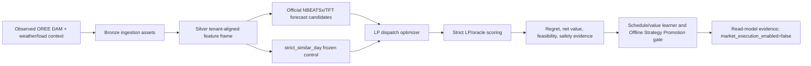
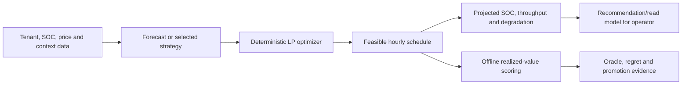
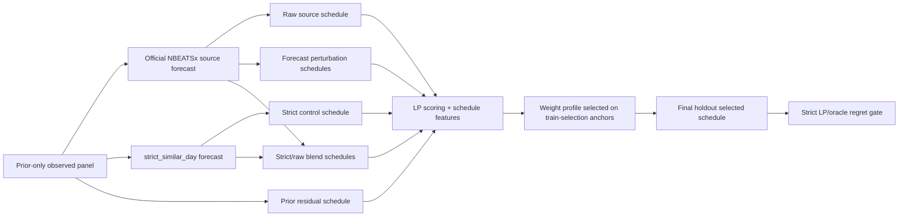
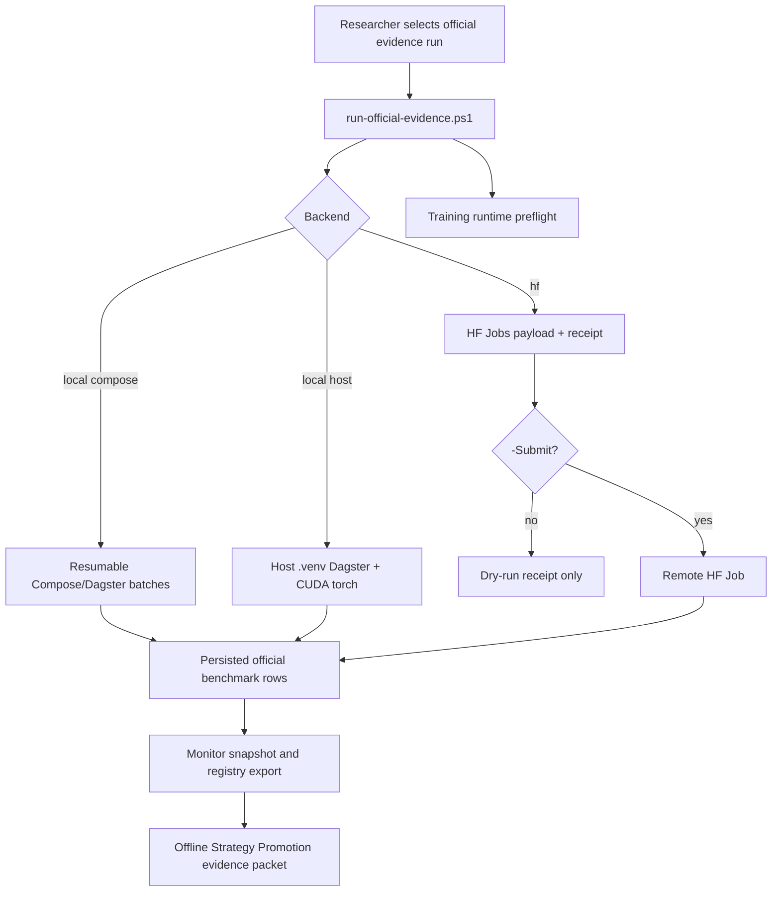

# Розділ 3. Методологія дослідження

## 3.1. Загальна методологічна логіка

Методологія цієї дипломної роботи побудована навколо принципу
`forecast -> optimize -> validate -> compare regret -> promote only if decision value improves`. Такий підхід відрізняє роботу від звичайного прогнозного
benchmark: модель не вважається кращою лише тому, що має нижчий MAE або RMSE.
Для BESS-арбітражу ключовим результатом є економічна якість рішення після
оптимізації, тобто net value, oracle regret, feasibility, throughput,
degradation proxy та дотримання safety constraints.

Базовим контрольним контуром є `strict_similar_day`. Він залишається
замороженим fallback і comparator для всіх ML/DFL-кандидатів. Neural forecast
models, schedule/value learners та DFL-style challengers можуть бути
розглянуті лише як доказова база для Offline Strategy Promotion: вони можуть
підтримувати offline/read-model strategy evidence, але не означають ринкове
виконання в реальному часі, автоматичне перемикання dashboard/API на нову
стратегію або розгорнутий Decision Transformer-контролер.

Для уникнення змішування дослідницьких, демонстраційних і продуктово
орієнтованих тверджень у роботі використовується стисла таблиця методів.
Таблиця 3.1 показує, які дані використовує кожний метод, чи допускає він
майбутню інформацію, яку роль має у decision pipeline та яку межу твердження
дозволяє.

| Метод | Вхідні дані | Чи використовує майбутні дані? | Роль у прийнятті рішення | Основна метрика | Межа твердження |
|---|---|---|---|---|---|
| Bronze/Silver/Gold data pipeline | OREE DAM, Open-Meteo/weather context, tenant configuration/load context, telemetry та guarded external-source candidates | Ні; кожен ряд має відповідати часовій доступності джерела | Формує відтворюваний evidence layer і lineage для всіх наступних експериментів | Повнота даних, provenance, `data_quality_tier`, coverage | Твердження рівня thesis-grade дозволені лише для observed Ukrainian evidence; demo/synthetic rows не підтримують висновки про ефективність. |
| `strict_similar_day` baseline | Історичні ціни та календарний контекст, доступні до anchor | Ні | Заморожений comparator і fallback для всіх ML/DFL-кандидатів | Oracle regret, net value, median regret, rolling robustness | Є контрольним контуром і fallback; не є твердженням про оптимальність у всіх майбутніх ринкових режимах. |
| LP dispatch optimizer | Forecast vector, battery capacity/power limits, SOC, efficiency, degradation proxy | Ні для schedule, який може бути використаний у попередньому плануванні; realized prices використовуються лише в oracle-evaluation режимі | Перетворює forecast на feasible charge/discharge schedule | Feasibility, SOC bounds, throughput, degradation-adjusted value | Детермінований scheduling/preview layer; не створює ринкових заявок і не є фізичним dispatch controller. |
| Official NBEATSx/TFT forecast candidates | Rolling-origin training history, tenant-aligned features, approved prior-only exogenous context | Ні | Дає forecast input для того самого LP/oracle contour, що й baseline | Forecast metrics як допоміжні; основна оцінка через downstream regret/value | Нейронний forecast не promoted сам по собі; він має покращити decision value після LP. |
| Strict LP/oracle evaluation | Вибраний schedule та realized prices після anchor | Так, але лише після факту і лише для оцінювання | Обчислює theoretical best value та regret для offline comparison | Mean/median oracle regret, value gap | Oracle не є стратегією, яку можна застосовувати для виконання ринкових рішень, і не використовується як джерело прогнозу. |
| Schedule/Value Learner V2/V2+ | Feasible LP-scored candidate schedules і prior-only schedule/value features | Ні для selection rule; final-holdout realized values використовуються тільки для scoring | Offline selector між schedule families; поточний найсильніший promotion evidence | Mean-regret improvement, median-not-worse condition, 4-window robustness | Підтримує Offline Strategy Promotion/read-model evidence; не вмикає ринкове виконання. |
| Candidate-Value DFL v3/V4/V5 та DFL/DT challengers | Candidate libraries, train/prior label panels, trajectory/value diagnostics, point-in-time context audit rows | Train/prior labels можуть містити realized outcomes минулих anchors; final holdout не використовується для selection | Дослідницька перевірка більш decision-focused objective, context repair та підготовка до майбутнього DT | Improvement vs V2+, robustness, failure-mode/context diagnostics | Дослідницький/діагностичний шар, доки не перевершить V2+ під незмінним strict LP/oracle gate. |
| Pydantic Gatekeeper і governance policies | `ProposedBid`/dispatch contracts, market caps, SOC/physical limits, source-governance flags | Ні | Детермінована валідація safety, market та data-governance constraints | Validation failures, cap/SOC/envelope feasibility, blocked governance status | Safety boundary системи; не є ML-моделлю і не підтверджує автономне ринкове виконання. |
| Evidence packet і run registry | Attempt manifest, monitor snapshot, persisted rows, registry JSON/Markdown, asset checks | Ні | Забезпечує відтворюваність і аудит експерименту | Persisted row count, check status, run receipt consistency | Доказовий пакет для дипломної оцінки; не є журналом фактичної торгівлі. |

Окремо від методів навчання та оцінювання у роботі використовується API-шар.
Його призначення полягає не в тому, щоб змінювати дослідницький результат, а в
тому, щоб публікувати стан pipeline, read-model evidence і operator preview у
стабільних контрактах. Таблиця 3.2 узагальнює групи API-методів на рівні,
достатньому для методологічного розділу; повна endpoint-by-endpoint
специфікація наведена в [Додатку А](../appendices/api-read-model-specification.md).

| Група API-методів | Приклад endpoint-а | Джерело даних | Підтримуваний метод або експеримент | Що повертає | Межа твердження |
|---|---|---|---|---|---|
| Tenant/config methods | `GET /tenants` | Tenant registry і location metadata | Tenant-aware feature alignment і demo configuration | Список tenants, координати, timezone та ідентифікатори | Конфігураційний read model; не є експериментальним результатом. |
| Weather/materialization methods | `POST /weather/run-config`, `POST /weather/materialize` | Open-Meteo config, Dagster `weather_forecast_bronze`, optional DAM price history | Bronze ingestion і location-aware weather experiment setup | Run config, selected assets, resolved location, materialization status | Запускає або готує ingestion/demo materialization; не підтверджує ML superiority. |
| Battery/telemetry methods | `GET /dashboard/battery-state` | MQTT telemetry ingest path, Postgres battery telemetry store, hourly battery snapshots | Battery feasibility context і SOC-aware operator preview | Latest telemetry, hourly snapshot, freshness/fallback reason | Read model фізичного стану; не є dispatch command. |
| Baseline/LP preview methods | `GET /dashboard/baseline-lp-preview`, `POST /dashboard/projected-battery-state` | Tenant defaults, strict-similar-day price history, LP solver, projected battery simulator | Level 1 baseline, SOC feasibility і degradation-aware economics | Forecast, signed MW schedule, projected SOC trace, UAH economics | Preview/recommendation layer; не створює `ProposedBid`, `ClearedTrade` або фізичний dispatch. |
| Forecast evidence methods | `GET /dashboard/future-stack-preview`, `GET /dashboard/forecast-strategy-comparison` | Forecast store, strategy evaluation store, NBEATSx/TFT/strict comparison rows | Forecast-to-schedule evaluation через LP/oracle contour | Forecast series, model status, regret/value comparison, quality boundary | Forecast evidence surface; neural forecast не promoted без downstream regret gate. |
| Benchmark/research methods | `GET /dashboard/real-data-benchmark`, `GET /dashboard/dfl-schedule-value-production-gate` | Postgres strategy/DFL stores, promotion gate rows, persisted benchmark frames | Rolling-origin benchmark, V2/V2+ schedule/value promotion evidence | Regret rows, data-quality tier, promotion flags, `market_execution_enabled=false` | Offline/read-model evidence only; не є ринковим виконанням. |
| DT/policy-preview methods | `GET /dashboard/decision-transformer-trajectories`, `GET /dashboard/decision-policy-preview` | Simulated trade store, offline trajectory/policy-preview rows | Offline DT preparation і policy-preview diagnostics | Trajectory rows, projected actions, safety projection, value gap | Research/preview layer; не є розгорнутим DT-контролером. |
| Operator recommendation methods | `GET /dashboard/operator-recommendation` | Battery state, tenant load/PV context, strategy availability, forecast/read stores, LP preview | Operator-facing aggregation of available evidence | Selected strategy, available strategies, forecast series, value-gap series, feasible schedule | Продуктовий read model для операторського перегляду; не подає ринкових заявок. |

## 3.2. Дані та межа доказовості

Основний evidence layer побудований на українських observed OREE DAM цінах,
Open-Meteo/weather контексті та tenant configuration/load context. Дані
вирівнюються на погодинному горизонті, після чого формуються tenant-aligned
features для rolling-origin evaluation.

Синтетичні або demo-oriented rows не можуть використовуватися для thesis-grade
тверджень про ефективність. Вони можуть існувати для стабільності demo або smoke tests,
але benchmark має спиратися на provenance flags,
`data_quality_tier=thesis_grade`, `not_market_execution=true` і явні
claim-boundary поля.

Європейські market-coupling джерела, зокрема ENTSO-E, OPSD, Ember, Nord Pool,
PriceFM і THieF, розглядаються як research roadmap та external-validation
context. Вони не змішуються з українським training panel, доки не пройдені
licensing, timezone/DST, currency normalization, market-rule mapping,
publication-time availability та domain-shift gates.

## 3.3. Rolling-origin протокол

Оцінювання виконується як temporal rolling-origin protocol. Для кожного anchor
модель бачить лише інформацію, доступну до decision time. Реалізовані ціни
після anchor можуть використовуватися для oracle evaluation, regret labels і
diagnostics, але не для формування forecast input для майбутнього виконання
рішення або prior-only ознак selector-а.



У цьому протоколі oracle LP є лише офлайн-оцінювачем. Він має доступ до
realized prices лише для обчислення theoretical best value та regret. Oracle не
є стратегією, яку можна застосовувати для виконання ринкових рішень, і не
використовується як джерело прогнозу.

## 3.4. Forecast-to-schedule evaluation

Офіційні NBEATSx/TFT кандидати проходять не окрему forecast-only перевірку, а
той самий strict LP/oracle contour, що й baseline. Прогнозна траєкторія
перетворюється на schedule через LP dispatch optimizer, після чого schedule
оцінюється на realized prices. Це дозволяє порівнювати моделі за тим, що має
економічний сенс для BESS:

- mean і median oracle regret;
- degradation-adjusted net value;
- safety violations;
- throughput і SOC feasibility;
- rolling-window robustness;
- здатність не погіршувати `strict_similar_day` у стабільних режимах.

Schedule/value learner не замінює фізичний контур виконання. Він вибирає
candidate schedule family у offline/read-model evidence stack і завжди
залишається за `strict_similar_day` fallback, доки promotion gate не доводить
стійку перевагу.

## 3.5. Методологічна роль ML, calibration, DFL і DT методів

У методології важливо розділити кілька різних класів методів. NBEATSx і TFT
належать до forecast layer: вони оцінюють майбутні ціни або розподіл можливих
цін. LP optimizer належить до decision layer: він перетворює forecast на
feasible battery schedule. AFL, DFL, Schedule/Value Learner і DT-related
experiments належать до research/evidence layer: вони перевіряють, чи можна
краще вибирати або оцінювати schedules за downstream value/regret. Тому ці
методи не слід описувати як один "ML controller".

Термінологічно в роботі використовуються два окремі поняття: DFL
(Decision-Focused Learning) і DT (Decision Transformer). Якщо у робочих
нотатках зустрічається скорочення на кшталт "DTFL", у фінальному академічному
тексті його краще розкласти на DFL/DT, бо DFL є принципом навчання під
downstream decision loss, а DT є окремою sequence-model архітектурою для
offline policy approximation.

| Метод | Академічна ідея | Реалізація у проєкті | Вихід методу | Межа твердження |
|---|---|---|---|---|
| `strict_similar_day` | Сильний простий temporal baseline для EPF/арбітражу | Бере ціну з подібного попереднього дня і передає її в Level 1 LP | Baseline forecast і feasible LP schedule | Frozen comparator і fallback; не є доказом універсальної оптимальності. |
| NBEATSx | Neural basis expansion з екзогенними змінними для electricity price forecasting | Compact `nbeatsx_silver_v0` і official/global-panel NBEATSx lanes; прогноз проходить через той самий LP/oracle contour | Point forecast, decomposition/context evidence, downstream schedule rows | Forecast source; не просувається без regret/value improvement після LP. |
| TFT | Temporal Fusion Transformer для multi-horizon forecasting, variable selection і quantile forecasts | Compact `tft_silver_v0`, official TFT adapter і global-panel TFT p10/p50/p90 lane | p10/p50/p90 forecasts, feature-weight diagnostics, TFT schedule candidates | Forecast/uncertainty evidence; поточні TFT gates не замінюють V2+ і не вмикають market execution. |
| Horizon/regret-weighted calibration | Prior-only correction, що коригує forecast behavior за horizon і decision-relevant regret | `horizon_regret_weighted_forecast_calibration_benchmark` та calibrated NBEATSx/TFT read models | Calibrated forecast rows і calibrated benchmark evidence | Calibration evidence only; final claims проходять strict LP/oracle scoring. |
| TFT quantile schedule/value gate | Використання p10/p50/p90 як risk-aware schedule sources, а не тільки як графік uncertainty | `tft_official_global_panel_horizon_quantile_calibration_frame`, `dfl_tft_quantile_schedule_candidate_library_frame`, augmented/combined V2+ gates | Quantile-derived feasible schedule candidates і gate result | Additive offline evidence; 36-anchor screen не просунутий, бо TFT не перевершує frozen NBEATSx V2+. |
| AFL Arbitrage-Focused Learning | Forecast-layer діагностика, яка дивиться на decision-relevant помилки, а не тільки MAE/RMSE | `afl_training_panel_frame`, `afl_forecast_error_audit_frame`, forecast forensics | Failure modes: spread-shape, rank/extrema, LP-value, weather/load context | Research diagnostics; labels не стають live features. |
| AFE/governed exogenous features | Контрольоване додавання нових covariates з перевіркою доступності й governance | AFE catalog, semantic grid-event context, market-coupling feature route, ENTSO-E/PriceFM/OPSD/Ember/Nord Pool blockers | Feature registry, source-availability status, blocked/approved route | External features не входять у training, доки не пройдені licensing/timezone/currency/availability gates. |
| DFL forecast decision loss v1 | Навчання forecast correction за downstream decision loss замість лише forecast error | Prior-only horizon-bias correction with relaxed decision loss and strict final scoring | DFL-shaped corrected forecast rows і negative evidence | DFL-readiness evidence; current result stable but not improved over strict gate. |
| Schedule/Value Learner V2/V2+ | Decision-aware selection між already feasible LP-scored schedules | Prior-only selector over candidate schedules; V2+ adds richer candidate families and robustness gate | Selected schedule family, strict/raw/V2/V2+ benchmark rows, mean/median regret | Current strongest offline/read-model evidence; still not live controller. |
| Candidate-Value DFL v3/V4/V5 | Schedule-level value scoring, failure-mode redesign і point-in-time context repair | Ridge-style candidate scorer, plateau/failure audit, stronger candidate libraries, context-conditioned selector features | Candidate value scores, failure labels, context blockers, blocked/pass gate diagnostics | Дослідницький challenger; не замінює V2+, доки не перевершить його під незмінним gate. |
| Decision Transformer | Return-conditioned sequence modeling for offline policy approximation | Offline trajectory dataset, policy-preview rows, V2+-anchored bridge, deterministic projection of raw action | Projected policy-preview actions, value gap, readiness flags | Future/offline policy surface; не є розгорнутим DT-control і не є market execution. |

Ця таблиця також визначає, де саме в дипломі кожен метод повинен з'являтися.
Розділ 2 обґрунтовує методи через літературу: NBEATSx, TFT, EPF benchmarks,
SPO/DFL, storage-specific DFL, differentiable optimization layers і Decision
Transformer. Розділ 3 пояснює, як ці методи застосовані в експерименті та які
дані вони мають право бачити. Розділ 4 уже показує фактичні результати:
наприклад, V2+ проходить як найсильніше offline evidence, тоді як TFT quantile
screen, DFL v1 і V2+-anchored DT bridge є корисними, але blocked/negative
research evidence.

NBEATSx у цій роботі використовується тому, що electricity-price forecasting
часто має трендові, сезонні та екзогенні компоненти. У compact реалізації модель
має trend stack і exogenous stack; в official/global-panel lane вона
розглядається як серйозніший forecast source для кількох tenants. Але у всіх
випадках методологічний критерій однаковий: прогноз NBEATSx має перейти через
LP dispatch, realized-value scoring і oracle-regret benchmark.

TFT використовується як багатогоризонтна transformer-style модель із
інтерпретованими feature weights і quantile виходами. Його p10/p50/p90 не
трактуються автоматично як гарантований confidence interval. У проекті ці
квантилі використовуються обережніше: як альтернативні forecast sources для
schedule/value gate. Це дозволяє перевірити risk-aware поведінку без того, щоб
змішати uncertainty visualization із ринковим виконанням.

DFL у методології означає не "вже розгорнуту нейромережу-контролер", а принцип:
навчати або вибирати модель за якістю downstream рішення. У поточному стані
проєкту це реалізовано через кілька безпечних наближень: AFL labels,
forecast-decision-loss v1, schedule/value selectors, candidate-value scorers і
V2+-anchored DFL/DT bridge. Усі вони мають однаковий academic contract:
train/prior anchors можуть формувати selection rule, final-holdout actuals
використовуються лише для scoring, а strict LP/oracle evaluator залишається
незмінним.

Decision Transformer розглядається як майбутній policy layer, тому що
storage arbitrage є послідовною задачею: рішення в одній годині змінює SOC і
обмежує наступні години. Проте поточний DT у репозиторії є policy-preview
research primitive. Raw DT action не довіряється напряму: вона має проходити
детерміновану projection/feasibility перевірку, порівнюватися з behavior
cloning і V2+, і тільки після цього може претендувати на сильніший offline
evidence claim.

## 3.6. Метрики оцінювання і роль regret

Метрики в роботі поділяються на діагностичні, decision-value та обмежувальні
метрики. Такий поділ потрібний тому, що для BESS-арбітражу якість прогнозу
сама по собі не гарантує кращого рішення. Модель може мати меншу середню
помилку прогнозу, але все одно обрати невдалий час заряджання або розряджання.
Тому головним критерієм є не forecast-only accuracy, а економічний результат
feasible schedule після LP-оптимізації та оцінювання на реалізованих цінах.

| Рівень оцінювання | Метрики | Коли використовується | Методологічна роль |
|---|---|---|---|
| Якість даних | `data_quality_tier`, `observed_coverage_ratio`, provenance/source flags, кількість anchors і tenants | Перед будь-яким benchmark або promotion claim | Визначає, чи можна робити thesis-grade висновок; synthetic/demo rows не підтримують твердження про ефективність. |
| Forecast diagnostics | `mae_uah_mwh`, `rmse_uah_mwh`, `smape`, directional accuracy, spread/rank quality, top-k price recall, pinball loss для quantile forecasts | Після побудови NBEATSx/TFT/strict forecast rows | Пояснює помилки прогнозу, але не визначає переможця самостійно. |
| Decision-value evaluation | `decision_value_uah`, `forecast_objective_value_uah`, `oracle_value_uah`, `regret_uah`, `regret_ratio`, `rank_by_regret` | Після перетворення forecast у LP schedule і появи realized prices для horizon | Є основним контуром порівняння стратегій, бо вимірює втрачений економічний результат. |
| Battery/feasibility guardrails | SOC bounds, `total_throughput_mwh`, `total_degradation_penalty_uah`, `efc_proxy`, safety/governance violations | Паралельно з LP scoring і перед promotion | Перевіряє, що результат не отриманий через фізично або політично неприпустиму поведінку. |
| Promotion/robustness | `mean_regret_uah`, `median_regret_uah`, mean-regret improvement, median-not-worse condition, rolling-window robustness, win rate | На рівні batch/panel після багатьох anchors | Визначає, чи кандидат може бути прийнятий як Offline Strategy Promotion evidence. |

Особливе місце займає regret, тобто втрачена економічна можливість порівняно з
oracle LP. У цій роботі oracle не є моделлю для використання в реальному часі.
Це perfect-foresight evaluator: після завершення horizon він бачить realized
prices і розв'язує той самий LP із тими самими battery constraints, SOC bounds,
efficiency, market caps та degradation proxy. Отже, regret показує не "помилку
прогнозу" у звичайному статистичному сенсі, а скільки гривень стратегія
втратила через гірше рішення відносно теоретично найкращого feasible schedule
для того самого horizon.

Для tenant \(i\), anchor \(t\), forecast/selector strategy \(s\) і горизонту
\(H\) decision value стратегії обчислюється на реалізованих цінах:

\[
V_{i,t}^{(s)} =
\sum_{h=1}^{H}
\left(
p_{i,t,h}^{real} \cdot
P_{i,t,h}^{(s)} \cdot \Delta h
-
C_{deg}(a_{i,t,h}^{(s)})
\right),
\]

де \(p_{i,t,h}^{real}\) - реалізована ціна DAM у грн/МВт·год,
\(P_{i,t,h}^{(s)}\) - signed net power LP schedule: додатне значення означає
розряд/продаж, від'ємне - заряд/купівлю, \(\Delta h\) - тривалість інтервалу
в годинах, а \(C_{deg}\) - деградаційний штраф, пов'язаний із throughput.
У реалізації це відповідає полю `decision_value_uah`: schedule, побудований на
forecast або selector output, повторно оцінюється на фактичних цінах horizon.

Oracle value для того самого tenant-anchor визначається аналогічно, але LP
отримує realized price vector як perfect-foresight forecast:

\[
V_{i,t}^{oracle} =
\max_{a \in \mathcal{A}_{i,t}}
\left[
\sum_{h=1}^{H}
\left(
p_{i,t,h}^{real} \cdot
P_{i,t,h}^{a} \cdot \Delta h
-
C_{deg}(a_{i,t,h})
\right)
\right],
\]

де \(\mathcal{A}_{i,t}\) - множина feasible schedules, дозволених battery
capacity, power, SOC, efficiency та market-cap constraints. Governance і safety
constraints перевіряються окремо як обмежувальні метрики. Тоді regret стратегії:

\[
R_{i,t}^{(s)} =
\max\left(0,\; V_{i,t}^{oracle} - V_{i,t}^{(s)}\right).
\]

Нульовий regret означає, що стратегія досягла oracle-equivalent value під тими
самими constraints. Чим більший regret, тим більше економічної цінності
втрачено. Нормована версія зберігається як `regret_ratio`:

\[
RR_{i,t}^{(s)} =
\frac{R_{i,t}^{(s)}}{\max(|V_{i,t}^{oracle}|,\epsilon)}.
\]

У коді ця логіка реалізована в `evaluate_forecast_candidates_against_oracle`:
для кожного кандидата будується LP schedule, потім `_actual_decision_value_uah`
рахує realized value за фактичними цінами, oracle LP рахує
`oracle_value_uah`, а `regret_uah` визначається як
`max(0.0, oracle_value_uah - decision_value_uah)`. Результат зберігається в
strategy evaluation store з полями `decision_value_uah`, `oracle_value_uah`,
`regret_uah`, `regret_ratio`, `rank_by_regret`,
`total_degradation_penalty_uah`, `total_throughput_mwh` та
`evaluation_payload`. Для demo/MVP baseline аналогічний asset
`oracle_benchmark_metrics` порівнює baseline LP із perfect-foresight LP і
передає regret metrics у `baseline_regret_tracking`.

Після оцінювання окремих tenant-anchor rows regret агрегується на рівні
експерименту:

\[
\overline{R}^{(s)} =
\frac{1}{N}\sum_{(i,t)\in\mathcal{D}} R_{i,t}^{(s)}, \qquad
\widetilde{R}^{(s)} =
\operatorname{median}_{(i,t)\in\mathcal{D}} R_{i,t}^{(s)}.
\]

Mean regret показує середню втрату економічної цінності, а median regret
захищає інтерпретацію від одиничних extreme anchors. У promotion gate кандидата
недостатньо оцінювати лише за найкращим середнім значенням: він має не
погіршувати median regret, проходити rolling-window robustness, не порушувати
safety constraints і залишати `strict_similar_day` fallback. Саме тому
Schedule/Value Learner V2/V2+ порівнюється з `strict_similar_day` за
mean/median regret, а DFL/DT challengers повинні перевершити V2+ під тим самим
strict LP/oracle evaluator, перш ніж їх можна описувати як сильніший evidence
candidate.

## 3.7. Перехід від ML pipeline до рекомендаційного schedule

Кінцевий результат ML/Data pipeline у цій роботі не є безпосередньою командою
для біржі або фізичного інвертора. Його коректно описувати як рекомендаційний
read-model schedule: погодинний план заряджання, розряджання або утримання
батареї на наступний горизонт планування. Для поточного MVP горизонт становить
24 години DAM із погодинним кроком. Такий schedule може пояснювати оператору
очікувану арбітражну логіку, але не є `ProposedBid`, `ClearedTrade` або
`DispatchCommand` для live market execution.

Методологічно кінцевий контур має однакову форму для operator preview і для
offline training/evaluation:



У простішому формулюванні модель не натискає "купити" або "продати"
самостійно. Вона дає прогноз або вибирає candidate schedule family. Далі
детермінований LP-шар перетворює це в фізично допустимий погодинний план із
SOC constraints, power limits, efficiency та degradation penalty. Після цього
read-model шар показує оператору, що саме рекомендується зробити в кожній
годині, який SOC очікується після дії, яка економіка плану і які warnings або
claim boundaries діють.

### Операторський preview-режим

Для operator-facing режиму FastAPI формує рекомендацію у кілька кроків. Спочатку
визначається tenant, його battery metrics, location-aware price history,
поточний або fallback SOC та доступні strategy options. Якщо вибрана official
NBEATSx/TFT strategy має валідні forecast-store rows і ціни не порушують DAM
caps, ці forecast points передаються в той самий Level 1 LP optimizer. Якщо
такої strategy немає або вона неготова, система повертається до
`strict_similar_day` як safe fallback.

LP розв'язує задачу максимізації очікуваної net value:

\[
\max_{P_h^{ch},P_h^{dis},SOC_h}
\sum_{h=1}^{H}
\left(
\hat{p}_h \cdot (P_h^{dis}-P_h^{ch}) \cdot \Delta h
-
c_{deg}\cdot(P_h^{ch}+P_h^{dis})\cdot\Delta h
\right),
\]

за умов:

\[
SOC_{h+1}=SOC_h+
\eta_{ch}P_h^{ch}\Delta h-
\frac{P_h^{dis}\Delta h}{\eta_{dis}},
\]

\[
SOC^{min}\le SOC_h\le SOC^{max}, \qquad
0\le P_h^{ch}\le P^{max}, \qquad
0\le P_h^{dis}\le P^{max}.
\]

Після розв'язання LP формується signed net power:

\[
u_h=P_h^{dis}-P_h^{ch}.
\]

Якщо \(u_h>0\), schedule означає розряд/продаж енергії; якщо \(u_h<0\), він
означає заряд/купівлю; якщо \(u_h\approx 0\), батарея утримується. Для
оператора це відображається як hourly recommendation schedule із forecast
price, signed MW, projected SOC, throughput, degradation penalty і net value.
Додатковий projected-battery-state simulator повторно проходить schedule і
перевіряє, що requested power не виводить батарею за SOC/power bounds. Тому
навіть у preview режимі рекомендація має фізичний feasibility layer.

З погляду бідингу та арбітражу кожний ряд schedule можна інтерпретувати як
кандидатну дію: напрям `BUY/CHARGE`, `SELL/DISCHARGE` або `HOLD`, обсяг
\(|u_h|\Delta h\) у МВт·год і очікуваний net value для цієї години. Однак у
поточній дипломній межі це лише bid recommendation, а не executable bid:
система ще не формує ринковий order payload, не подає заявку на DAM, не отримує
clearing result і не підтверджує фізичний dispatch.

У read model також додаються `available_strategies`, `selected_strategy_id`,
`selection_reason`, `readiness_warnings`, `forecast_model_series`,
`value_gap_series`, load/PV context, projected SOC і value against hold
baseline. Це дає оператору пояснення: чому вибрана саме ця strategy, які інші
strategy доступні, скільки value очікується за горизонтом і де schedule має
найбільший локальний value gap. Водночас ця відповідь не є заявкою на DAM:
у ній немає market-order contract, clearing status, balancing responsibility
або execution confirmation.

### Офлайн-навчання та оцінювання

Під час offline training/evaluation той самий forecast-to-LP механізм
використовується не для рекомендації оператору, а для створення labels,
порівняння стратегій і promotion evidence. Dagster materializes observed DAM
prices, weather/context features, forecast candidates, benchmark frames і
DFL/schedule-value assets. Для кожного rolling-origin anchor модель бачить
лише інформацію, доступну до anchor. На цій основі створюються forecast або
candidate schedules, після чого кожен candidate проходить LP optimizer.

Коли realized prices для horizon уже відомі, offline evaluator перераховує
економіку вибраного schedule на фактичних цінах, будує oracle LP для того
самого tenant-anchor і рахує `decision_value_uah`, `oracle_value_uah`,
`regret_uah` та `regret_ratio`. Ці rows не є live рекомендаціями. Вони є
навчальним і доказовим матеріалом: з них формується schedule candidate
library, train/prior label panel, final-holdout scoring, mean/median regret і
promotion-gate висновок.

Schedule/Value Learner V2/V2+ працює саме на цьому рівні. Він не генерує
сиру команду батареї, а вибирає між already feasible LP-scored schedules за
prior-only schedule/value features. Candidate-Value DFL v3 і DT-related
experiments також залишаються offline: вони можуть навчатися оцінювати або
ранжувати trajectory candidates, але final action усе одно має бути
спроєктована через deterministic feasibility layer і перевірена проти
`strict_similar_day` та V2+ під незмінним strict LP/oracle gate. Отже,
коректне твердження таке: ML pipeline перетворює дані на рекомендаційні
schedules і offline strategy evidence, але ще не перетворює їх на автономне
ринкове виконання.

## 3.8. Schedule/Value Learner V2 як decision-value selector

Після первинного forecast-to-schedule evaluation у роботі вводиться проміжний
decision-aware шар: Schedule/Value Learner V2. Його методологічна роль полягає
не в тому, щоб безпосередньо навчати новий контролер батареї, а в тому, щоб
порівнювати набір уже feasible LP-scored schedules і вибирати schedule з
найкращим очікуваним decision value за prior-only ознаками. Такий дизайн
відповідає логіці Decision-Focused Learning: оцінюється не ізольована точність
forecast, а вплив forecast-derived schedule на downstream objective, regret і
економічний результат. Це узгоджується з Smart Predict-then-Optimize / SPO+
підходом Elmachtoub and Grigas, DFL survey Mandi et al., storage-specific DFL
роботою Sang et al. та predict-then-bid формулюванням Yi et al.

Методологічно цей шар є обережнішим за повний differentiable controller. Він не
послаблює strict LP/oracle evaluator і не використовує final-holdout realized
prices для вибору правил. Натомість він перетворює прогнозні кандидати на
декілька альтернативних schedule-candidates, кожен із яких проходить той самий
LP contour, SOC feasibility checks, throughput/degradation proxy та UAH-native
value calculation. Після цього selector порівнює ці schedules за ознаками,
доступними до scoring final holdout.

Для official global-panel 365-anchor evidence бібліотека будується окремо для
кожного tenant, source model та anchor. У поточному конфігу розглядаються два
source models: `nbeatsx_official_global_panel_v1` і
`nbeatsx_official_global_panel_horizon_calibrated_v1`. Для кожного такого
source model формується до десяти конкретних schedule-candidates:

| Candidate schedule group | Кількість | Походження | Методологічна функція |
|---|---:|---|---|
| `strict_control` | 1 | `strict_similar_day` forecast + LP dispatch | Frozen comparator і default fallback. |
| `raw_source` | 1 | Raw official NBEATSx forecast + LP dispatch | Перевіряє прямий внесок neural forecast. |
| `forecast_perturbation` | 4 | Детерміновані perturbations: 2 spread scales x 2 mean shifts | Додає локальні schedule alternatives навколо raw forecast без доступу до future actuals. |
| `strict_raw_blend_v2` | 3 | Prior-only blends між strict і raw forecast vectors з weights `0.25`, `0.50`, `0.75` | Дає змогу обрати частковий neural вплив замість all-or-nothing заміни baseline. |
| `strict_prior_residual_v2` | 1 | `strict_similar_day` forecast + prior residual vector після мінімум 14 prior anchors | Додає correction, побудовану лише з минулих anchors. |

Отже, після накопичення достатньої кількості prior anchors selector може
порівнювати до 10 schedule-candidates на кожен tenant/source/anchor. На
найперших train-selection anchors prior-residual candidate ще може бути
недоступним, тому фактична кількість кандидатів там становить 9. На final
holdout у 365-anchor експерименті prior context уже достатній, тому
порівнюється повна бібліотека до 10 candidates. Для двох source models це
означає, що final holdout має 5 tenants x 18 anchors x 10 schedules = 900
schedule-candidates на source model, або 1,800 schedule-candidates у сукупному
порівнянні двох official NBEATSx variants.



Сам Schedule/Value Learner V2 не виконує gradient descent. Він вибирає один із
трьох фіксованих scoring profiles на train-selection anchors і потім застосовує
цей profile до validation/final-holdout anchors. Тому коректне формулювання:
`weight profile selected offline from prior anchors`, а не "weights learned by
gradient descent". У поточній реалізації використовуються три профілі:

| Scoring profile | Основна ідея |
|---|---|
| `prior_regret_value` | Обрати family, яка мала найнижчий prior mean regret. |
| `spread_value` | Додатково винагороджувати прогнозний spread та LP objective value, але штрафувати degradation і throughput. |
| `strict_guarded_prior_value` | Дозволяти non-strict schedule тільки тоді, коли його schedule-value features компенсують явний fallback penalty. |

Ознаки, які використовуються selector-ом, є schedule/value features:
`prior_family_mean_regret_uah`, `forecast_spread_uah_mwh`,
`forecast_objective_value_uah`, `total_degradation_penalty_uah`,
`total_throughput_mwh`, `soc_min_slack_fraction` і deterministic
`candidate_family` tie-break. Вони не включають final-holdout actual prices або
oracle value як input. Realized prices та oracle LP використовуються лише для
labels, diagnostics і final strict scoring. Це підтримує temporal-no-leakage
протокол: минулі anchors можуть впливати на selection rule, але final-holdout
actuals можуть впливати лише на оцінку вже вибраного schedule.

Академічне обґрунтування цієї конструкції складається з кількох частин:

- LP/MILP-література для storage scheduling підтримує використання прозорого
  optimization layer із SOC, efficiency, power та energy constraints як
  контрольного контуру. Тому candidate schedules мають спочатку бути feasible
  LP schedules, а не unconstrained neural actions.
- EPF-література про NBEATSx і TFT обґрунтовує використання neural forecasts
  як source candidates, особливо з exogenous/context features. Водночас EPF
  benchmark literature підкреслює необхідність сильних простих baselines, тому
  `strict_similar_day` не прибирається з порівняння.
- SPO/DFL-література показує, що forecast error не дорівнює decision loss.
  Саме тому selector порівнює schedules за regret/value-facing features, а не
  лише за MAE/RMSE forecast metrics.
- ESS-specific DFL research показує, що storage arbitrage є path-dependent:
  правильність окремої hourly action label недостатня, бо SOC trajectory
  зв'язує рішення між годинами. Тому порівняння повних schedule trajectories є
  методологічно сильнішим за статичну hourly classification.
- Predict-then-bid research для стратегічного energy storage підтримує
  архітектуру, де forecasting, optimization та market/value evaluation
  розглядаються разом. У цій дипломній роботі це реалізовано обережно:
  Schedule/Value Learner V2 є offline/read-model challenger, а не контролером
  для подання ринкових заявок у реальному часі.

Таким чином, Schedule/Value Learner V2 у методології роботи займає проміжне
місце між класичним Predict-then-Optimize і повним DFL/Decision Transformer
контролером. Він уже оптимізує вибір за downstream decision value, але зберігає
strict LP/oracle evaluator, deterministic fallback і межу твердження про
відсутність ринкового виконання. Це дозволяє академічно коректно стверджувати
Offline Strategy Promotion evidence, не заявляючи ринкову торгівлю в реальному
часі або розгорнутий DT-контролер.

## 3.9. Candidate-Value DFL v3-V5 як schedule-level value scorer і context repair

Після фіксації V2+ як основного доказового результату було перевірено сильніший, але все ще
обережний DFL-напрям: Candidate-Value DFL v3. Його мета - не генерувати raw
hourly BUY/SELL/HOLD дії, а навчитися оцінювати вже feasible LP-scored
candidate schedules. Це відповідає decision-focused логіці: модель має
навчатися на downstream value/regret labels і порівнювати повні траєкторії, а
не лише копіювати одиничні hourly labels.

Candidate-Value DFL v3 складається з трьох методологічних шарів:

1. Розширена candidate library навколо реальних failure modes:
   strict-neighborhood schedules, SOC terminal-target variants, peak/trough
   timing shifts, uncertainty/risk schedules, degradation-price sweeps,
   train-only oracle-neighborhood diagnostics і prior-template schedules.
2. Candidate-value label panel, де `selector_feature_*` колонки є prior-safe
   inputs, а `label_*` колонки є realized regret/value labels. Final-holdout
   labels не використовуються для train-time model selection.
3. `learned_linear_candidate_value_v3`, ridge-style schedule-level scorer,
   який навчає ваги на train/prior candidate rows і прогнозує value/regret для
   кожного candidate schedule.

Цей підхід відрізняється від V2 weight-profile selection. У V2 профіль ваг
обирається offline з фіксованого набору профілів. У Candidate-Value DFL v3
ваги candidate-level scorer справді оцінюються з label panel, але deployment
rule залишається безпечним: якщо prior/train evidence не показує достатнього
покращення проти frozen V2+, selector повертається до V2+. Тому V3 може
пояснювати failure modes і перевіряти більш DFL-подібний objective, не
послаблюючи thesis gate.

Методологічне значення матеріалізованого результату є негативним, але корисним:
V3 пройшов evidence checks і навчив candidate-level scorer, проте strict
LP/oracle gate залишив V2+ як fallback. Failure audit показав, що prior-template
schedules були неконкурентними проти V2+ на більшості final-holdout anchors.
Отже, наступний DFL/DT крок має покращувати feature/context або candidate
generation mechanism, а не повторювати ті самі історичні residual templates.

V4 plateau-breaker методологічно фіксує саме цю проблему перед переходом до DT.
Спочатку він класифікує причину плато між V2+ і V3:
`candidate_not_better`, `candidate_available_but_not_selected` або
`fallback_too_conservative`. Потім окремий data-quality audit перевіряє, чи не
пов'язаний залишковий regret з браком point-in-time context: Ukrainian DAM
coverage, weather/load, calendar/event, publication-time availability та regret
clusters. Лише після цього V4 додає сильніші feasible schedules: quantile/risk,
block peak, terminal SOC reserve, spread-volatility robust,
tenant degradation/throughput sweep та train-only oracle-neighborhood
diagnostics. Усі ці schedules все одно проходять той самий LP/oracle scoring, а
фінальний scorer навчається на train/prior labels і fallback-иться до V2+, якщо
prior evidence не доводить очікуване покращення.

V5 розширює цей підхід через point-in-time context repair. Його завдання -
перетворити широкі V4 gaps на конкретні tenant/source/anchor blockers:
відсутність weather/load context, calendar/event context, publication-time
evidence або вже доступний, але ще не використаний context. На цьому етапі
context-enriched scorer знову використовує лише prior-safe
`selector_feature_*` inputs, не додає ENTSO-E/European market-coupling rows до
training і не змінює strict LP/oracle gate. Матеріалізований V5 результат
повторив V2+ і не замінив його, тому методологічний висновок такий: поточний
український context layer є корисним для діагностики, але ще недостатньо
повним, щоб покращити V2+ під незмінною доказовою межею.

## 3.10. Уніфікований запуск evidence-runs: local vs Hugging Face Jobs

Для довгих official evidence runs використовується єдиний технічний entrypoint:

```powershell
.\scripts\run-official-evidence.ps1 -Backend local
.\scripts\run-official-evidence.ps1 -Backend hf
```

`-Backend local -LocalMode compose` запускає resumable Docker/Dagster batch
runner на локальній машині. Це стабільний evidence path для service parity, але
він використовує GPU лише тоді, коли CUDA доступна всередині Dagster container.

`-Backend local -LocalMode host` запускає `.venv\Scripts\dagster.exe`
безпосередньо з Windows host. Цей режим може використовувати локальний
CUDA-enabled PyTorch і NVIDIA GTX, але перед запуском має бути
зафіксований runtime preflight receipt.

`-Backend hf` будує Hugging Face Jobs payload і dry-run receipt. Реальна платна
submission вимагає явного `-Submit`, pushed branch, `HF_TOKEN`, Jobs-capable
account і writable artifact dataset repo. Token не записується в локальний
receipt; він підставляється лише в момент submission.



Обидва backend-и мають однакову методологічну межу: зміна місця обчислення не
змінює claim boundary. Результати залишаються offline/read-model evidence, а
`market_execution_enabled` має залишатися `false`.

## 3.11. Promotion criteria

Offline Strategy Promotion допускається тільки після проходження strict
LP/oracle gate. Мінімальні умови:

- observed Ukrainian coverage і thesis-grade provenance;
- відсутність train/final leakage;
- zero safety violations;
- latest holdout і rolling robustness;
- mean-regret improvement не менше 5% проти `strict_similar_day`;
- median regret не гірший за frozen control;
- `strict_similar_day` лишається fallback;
- ринкове виконання не вмикається.

Якщо candidate не проходить gate, це не вважається failure of implementation.
Це є валідним негативним результатом: система коректно відхиляє слабкий
контролер і зберігає safe baseline.

## 3.12. Відтворюваність і evidence packet

Кожен довгий official run має супроводжуватися run receipt, attempt manifest,
monitor snapshot і registry export. Разом ці артефакти відповідають на ключові
питання перевірки: які anchors запускалися, який backend використовувався,
який generated timestamp був зафіксований, скільки rows persisted, чи можна
resume run, і яка claim boundary застосована.

Фінальний evidence packet містить:

- official attempt manifest;
- monitor snapshot;
- schedule/value promotion registry JSON;
- schedule/value promotion registry Markdown;
- посилання на relevant technical docs;
- явне формулювання `market_execution_enabled=false`.

Така структура дозволяє відокремити інженерний успіх від завищених тверджень:
вона демонструє відтворювану доказову базу для Offline Strategy Promotion без
твердження, що система вже виконує ринкові операції в реальному часі або має
розгорнутий DT-контролер.

## 3.13. Джерела методологічного обґрунтування

Методологічна позиція розділу спирається на джерела, зафіксовані у
`docs/thesis/sources/README.md` та розділі 2. Для описаних у методології
forecast, calibration, LP, DFL і DT методів особливо релевантні:

1. Park et al. (2017) - LP formulation for short-term ESS scheduling; підтримує
   використання прозорого LP dispatch layer із SOC, efficiency, power-limit та
   energy-limit constraints.
2. Olivares et al. (2023) - NBEATSx для electricity price forecasting with
   exogenous variables; обґрунтовує official NBEATSx як forecast source, але не
   як автоматично promoted strategy.
3. Lim et al. (2021) - Temporal Fusion Transformer; обґрунтовує
   multi-horizon/exogenous-aware forecast lane і майбутню explainability логіку.
4. Elmachtoub and Grigas (2022) - Smart Predict-then-Optimize / SPO+;
   обґрунтовує оцінювання через downstream decision loss і regret.
5. Mandi et al. (2024) - Decision-Focused Learning survey; задає ширшу рамку
   DFL як навчання для constrained-decision quality, а не лише forecast error.
6. Sang et al. (2023) - ESS arbitrage DFL; безпосередньо пов'язує price
   prediction, storage arbitrage value і regret-aware evaluation.
7. Yi et al. (2025) - decision-focused predict-then-bid framework for strategic
   energy storage; підтримує архітектурну траєкторію `forecast -> optimize ->
   bid/value evaluate`, збережену в цій роботі як offline/read-model evidence.
8. Chen et al. (2021) - Decision Transformer; обґрунтовує майбутній
   return-conditioned offline policy layer, але не є доказом поточного
   live-control deployment.
9. Agrawal et al. (2019) та Amos and Kolter (2017) - differentiable
   optimization layers; підтримують DFL/relaxed-LP roadmap, але final scoring
   у роботі лишається strict LP/oracle.
10. Lago et al. (2021) та Yu et al. (2026) - EPF benchmark/review sources;
    підтримують вимогу порівнювати neural forecasts із сильними baselines і
    не робити value claims без realistic rolling-origin evaluation.
11. Jin et al. (2025) - probabilistic forecasting context; підтримує
    probabilistic/quantile forecast framing. У цій роботі quantiles
    використовуються як schedule candidates і calibration evidence, а не як
    самостійна гарантія trading performance.
