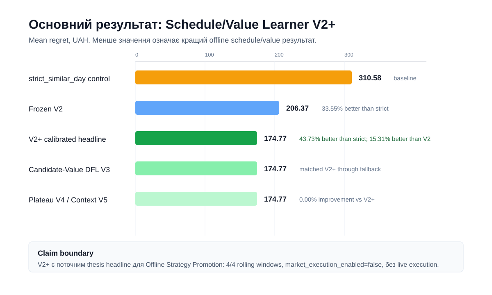
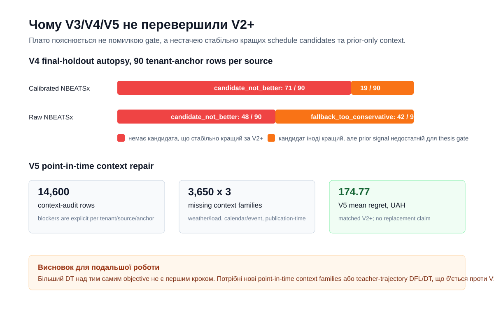
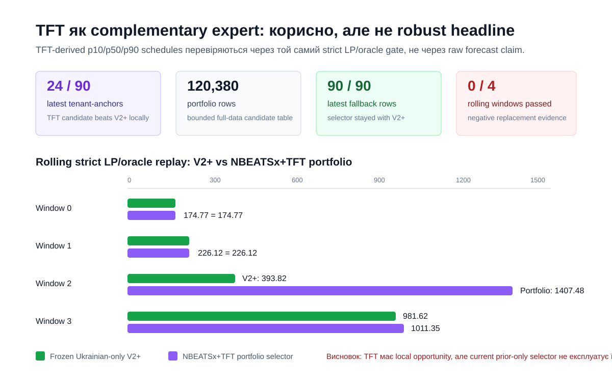

# Розділ 4. Результати експериментів та обговорення

## 4.1. Мета експериментального оцінювання

Експериментальна частина роботи перевіряє не лише якість прогнозу ціни, а
кінцеву якість рішення для BESS-арбітражу. Тому основною метрикою є не MAE або
RMSE, а regret відносно oracle LP, тобто різниця між значенням рішення, яке
можна було б отримати з фактичними цінами, і значенням рішення, прийнятого на
основі доступного перед рішенням прогнозу або селектора.

У всіх експериментах `strict_similar_day` використовується як заморожений
контрольний компаратор. Він не є нейронною моделлю: це leakage-free правило, яке
копіює історично схожий день, після чого schedule оцінюється тим самим strict
LP/oracle evaluator. Таким чином, порівняння з ним є консервативним контрольним
рубежем для Level 1 MVP.

Поточна межа твердження є такою:

- система демонструє offline/read-model Strategy Promotion evidence;
- `market_execution_enabled=false` в усіх evidence packets;
- результат не є ринковою торгівлею в реальному часі, не є розгорнутим
  Decision Transformer-контролером і не є твердженням про повну перевагу raw
  neural forecast;
- зовнішні європейські джерела, зокрема ENTSO-E, OPSD, Ember, Nord Pool,
  PriceFM і THieF, залишаються governance-only і не входять до тренування цього
  результату.

## 4.2. Експериментальна драбина

Експерименти були побудовані як послідовна драбина від простого контролю до
decision-aware schedule selection:

1. `strict_similar_day` - заморожений контрольний компаратор.
2. Raw neural forecasts - компактні та official NBEATSx/TFT прогнози,
   strict-scored через LP/oracle.
3. Horizon-aware regret-weighted calibration - prior-only корекція прогнозів за
   горизонтами, де попередні помилки мали більшу вартість у regret.
4. Feature-aware selectors - prior-only селектори, що враховують price regime,
   spread volatility, rank instability, calendar, weather/load context і
   tenant-level failure clusters.
5. Schedule/Value Learner V2 - decision-value selector, який вибирає один із
   feasible LP-scored schedule candidates, а не оцінює модель лише за помилкою
   forecast.
6. Schedule/Value Learner V2+ - розширення candidate library і prior-only
   fallback rule, яке стало основним підтвердженим результатом.
7. Candidate-Value DFL v3/V4/V5 - діагностичні спроби покращити V2+ через
   candidate-level value labels, failure-mode schedules і point-in-time context.
8. Official global-panel TFT quantile lane - перевірка того, чи можуть
   TFT-derived p10/p50/p90 schedules доповнити NBEATSx V2+ як джерело
   schedule diversity.

Ця драбина показала важливий методологічний висновок: у задачі BESS arbitrage
raw neural forecast може мати корисний сигнал, але цей сигнал стає цінним лише
після перетворення у decision-value вибір schedule.

## 4.3. Дані та область доказів

Головний зафіксований результат побудований на 365-anchor Ukrainian backfill
panel:

| Поле | Значення |
|---|---|
| Джерела | OREE DAM prices, Open-Meteo/weather, tenant load/config context |
| Кількість tenants | 5 canonical tenants |
| Кількість anchors | 365 rolling-origin anchors |
| Final holdout | 18 latest anchors per tenant/source |
| Final validation coverage | 90 tenant-anchors per source model |
| Market venue | DAM |
| Currency | UAH |
| Межа твердження | Лише Offline Strategy Promotion |

Пакет доказів збережений у
`data/research_runs/week3_official_global_panel_365_strategy_promotion/`.
Він містить registry JSON/Markdown, attempt manifest, monitor snapshot,
promotion gate frame і окремий trace summary для Schedule/Value Learner V2.
Поточний сильніший V2+ comparison/robustness packet збережений у
`data/research_runs/week3_official_global_panel_schedule_value_v2_plus_comparison/`
і використовується як головний локальний evidence packet для результату цього
розділу.

Окремий FastAPI-шар використовується лише для подання цих результатів у
read-model формі. У контексті розділу результатів API не розглядається як
самостійний метод оптимізації: він показує вже матеріалізовані benchmark,
forecast і promotion rows, збережені в Postgres/read stores після Dagster
materialization. Детальна специфікація наведена в
[Додатку А](../appendices/api-read-model-specification.md), а в цьому розділі
важливими є лише ті API-групи, які демонструють експериментальні результати.

| Evidence surface | API read model | Що дозволяє перевірити | Межа твердження |
|---|---|---|---|
| Forecast-to-schedule comparison | `/dashboard/forecast-strategy-comparison` | Чи проходили strict, NBEATSx і TFT через однаковий LP/oracle contour; які regret/value показники отримано. | Read-model evidence; не повертає `ProposedBid`, `ClearedTrade` або `DispatchCommand`. |
| Observed-data benchmark | `/dashboard/real-data-benchmark` | Чи має результат observed-data provenance, rolling-origin rows і data-quality tier. | Benchmark evidence; не є ринковим виконанням. |
| V2/V2+ promotion evidence | `/dashboard/dfl-schedule-value-production-gate` | Чи пройдено promotion gate, чи збережено fallback і чи залишається `market_execution_enabled=false`. | Offline/read-model Strategy Promotion only. |
| Forecast/DT preview surfaces | `/dashboard/future-stack-preview`, `/dashboard/decision-policy-preview` | Які forecast або policy-preview rows доступні для пояснення operator/defense сценарію. | Preview/diagnostic layer; не є розгорнутим DT-контролером. |

## 4.4. Raw official NBEATSx як важливий, але недостатній сигнал

Official global-panel NBEATSx був потрібний для чеснішого тесту, ніж компактні
in-repo smoke models. Однак результат не слід інтерпретувати як доведення raw
forecast superiority. У проміжних і ранніх офіційних запусках raw forecasts
програвали `strict_similar_day` за strict LP/oracle regret. Це узгоджується з
методологією decision-focused learning: оптимізація BESS schedule залежить від
рангу екстремумів, spread shape, SOC path і degradation-adjusted value, а не
лише від середньої похибки прогнозу.

Тому офіційний neural forecast у підсумковому evidence packet використовується
як джерело candidate schedules, але не як автоматичний контролер.

## 4.5. Результат Schedule/Value Learner V2

Перший стійкий результат отримано не raw NBEATSx, а Schedule/Value Learner V2
поверх official global-panel schedule candidates. Цей шар вибирає schedule
family на основі prior/train anchors, а final holdout використовується лише для
scoring.

365-anchor registry показав:

| Source model | Strict mean / median regret, UAH | Learner mean / median regret, UAH | Mean improvement vs strict | Rolling strict passes |
|---|---:|---:|---:|---:|
| `nbeatsx_official_global_panel_v1` | 310.583 / 198.386 | 225.437 / 109.692 | 27.41% | 4 / 4 |
| `nbeatsx_official_global_panel_horizon_calibrated_v1` | 310.583 / 198.386 | 206.367 / 96.021 | 33.55% | 4 / 4 |

Обидва source-specific challengers пройшли conservative Offline Strategy
Promotion gate: mean regret покращився більше ніж на 5%, median regret не
погіршився, rolling robustness пройшов 4 з 4 вікон, coverage є thesis-grade, а
`market_execution_enabled=false`.

## 4.6. Traceability Schedule/Value Learner V2

Перед наступним V3/DT експериментом було зафіксовано, які саме weight-profile
selections зробив Schedule/Value Learner V2. Повний trace збережений у
`dfl_schedule_value_learner_v2_trace_summary.md` у 365-anchor evidence packet.

Ключові властивості trace:

- early train anchors мають 9 candidate schedules per anchor;
- після появи residual candidate доступно до 10 candidate schedules per anchor;
- final holdout містить 900 schedules per source model;
- calibrated official NBEATSx вибрав profile `prior_regret_value` для всіх
  п'яти tenants;
- raw official global-panel NBEATSx вибрав різні prior-only profiles:
  `prior_regret_value`, `spread_value` і `strict_guarded_prior_value`.

Final selected family counts показують, що learner не просто копіював strict
control. Для calibrated official NBEATSx він вибрав 16 strict-control, 19
strict-prior-residual і 55 strict-raw-blend schedules. Для raw official
global-panel NBEATSx він вибрав 19 strict-control, 7 strict-prior-residual і 64
strict-raw-blend schedules. Отже, improvement виник з prior-only вибору між
feasible schedule families, а не з підглядання у final holdout.

## 4.7. Результат Schedule/Value Learner V2+

Після фіксації V2 було виконано V2+ експеримент. Він не замінює строгий
LP/oracle evaluator і не вводить зовнішні європейські training rows. Його зміна
обмежена candidate library: додаються prior-safe schedule variants навколо
залишкових failure modes, а selector може перейти з frozen V2 на V2+ лише тоді,
коли prior/train anchors показують non-degrading improvement.

Latest-holdout comparison packet
`week3_official_global_panel_schedule_value_v2_plus_comparison` показав:

| Source model | Strict mean regret, UAH | Frozen V2 mean regret, UAH | V2+ mean regret, UAH | Improvement vs strict | Improvement vs V2 |
|---|---:|---:|---:|---:|---:|
| `nbeatsx_official_global_panel_horizon_calibrated_v1` | 310.58 | 206.37 | 174.77 | 43.73% | 15.31% |
| `nbeatsx_official_global_panel_v1` | 310.58 | 225.44 | 193.36 | 37.74% | 14.23% |

Це покращення має важливу інтерпретацію. V2+ не доводить, що raw neural
forecast сам по собі став кращим за baseline у кожній ситуації. Він доводить,
що decision layer може краще використати forecast/context signal, якщо
перетворити його на ширший набір feasible schedule candidates і вибирати між
ними за prior-only evidence. Для calibrated source mean regret зменшився з
`206.37` UAH у frozen V2 до `174.77` UAH у V2+, тобто на `31.60` UAH або
`15.31%` проти V2. Для raw official global-panel source mean regret зменшився
з `225.44` UAH до `193.36` UAH, тобто на `32.08` UAH або `14.23%` проти V2.

| Компонент | Frozen V2 | V2+ | Чому це покращило результат |
|---|---|---|---|
| Candidate space | Strict, raw, perturbation, strict/raw blend і prior residual schedules | Додає rank-extrema, robust-spread, strict-neighborhood, temporal-block і terminal-SOC schedules | Selector отримує більше feasible альтернатив саме навколо observed failure modes. |
| Selection rule | Profile selected offline from prior anchors | Та сама no-leakage логіка плюс frozen V2 fallback | Нові candidates приймаються лише коли train/prior evidence не прогнозує деградацію. |
| Scoring | Strict LP/oracle regret gate | Не змінюється | V2 і V2+ порівнюються за однаковим UAH-native regret metric. |
| Claim boundary | Offline/read-model evidence only | Не змінюється | Результат не означає live dispatch, market execution або dashboard/API default switch. |

Простою мовою, V2 мав непоганий механізм вибору, але інколи недостатньо
різноманітні маршрути для батареї. V2+ додав нові безпечні маршрути навколо
типових помилок - невірного peak/trough timing, надто ризикового high-spread
schedule, локального timing shift і terminal SOC pressure. Той самий strict
LP/oracle evaluator потім перевірив, що ці маршрути справді зменшують regret.
Саме тому результат є evidence for decision-aware scheduling, а не claim про
самостійну перевагу raw forecast.

Rolling robustness replay over four 18-anchor windows also passed:

| Source model | Rolling windows passed | Interpretation |
|---|---:|---|
| `nbeatsx_official_global_panel_horizon_calibrated_v1` | 4 / 4 | V2+ beats both `strict_similar_day` and frozen V2 |
| `nbeatsx_official_global_panel_v1` | 4 / 4 | V2+ beats both `strict_similar_day` and frozen V2 |

Отже, основним підтвердженим результатом дипломної роботи є Schedule/Value
Learner V2+ на 365-anchor Ukrainian panel. Calibrated official NBEATSx є
основним source row для формулювання результату, оскільки має найнижчий
latest-holdout mean regret. Межа твердження залишається такою: лише Offline
Strategy Promotion, без ринкового виконання в реальному часі, без автоматичного
перемикання dashboard/API на нову стратегію і без твердження, що raw neural
forecasting сам по собі є кращим за `strict_similar_day`.

Рисунок 4.1 узагальнює головний числовий результат: V2+ знижує mean regret
до `174.77` UAH і залишається найсильнішим підтвердженим offline/read-model
результатом. Пізніші V3/V4/V5 експерименти не погіршили результат, але й не
створили нового headline, оскільки активували V2+ fallback.

## 4.8. Інтерпретація результату

Результат підтримує тезу про практичну цінність decision-aware pipeline:
нейронний forecast сам по собі не був достатнім, але schedule/value layer
перетворив прогнозний сигнал у кращий LP-feasible decision. Для розглянутої
архітектури це означає, що фінальний контролер має бути системою з фіксованим
fallback:

- `strict_similar_day` залишається fallback і контрольним comparator;
- Schedule/Value Learner V2+ може прийматися лише в offline/read-model
  evidence stack;
- Pydantic Gatekeeper і strict LP/oracle evaluator залишаються
  deterministic safety layers;
- ринкове виконання не активується цим результатом.

## 4.9. Що не підтверджено поточними експериментами

Поточні експерименти не доводять такі твердження:

- raw NBEATSx або TFT стабільно кращі за `strict_similar_day`;
- Decision Transformer уже є розгорнутим контролером;
- market-coupling exogenous features з ЄС входили у training або пояснюють
  поточний V2+ результат;
- система готова до реального виконання угод на ринку.

Ці обмеження є важливими. Вони не зменшують
цінність отриманого результату, але визначають його точну область застосування:
offline/read-model Strategy Promotion evidence для Ukrainian DAM BESS arbitrage.

## 4.10. Дослідницькі перевірки після V2+

Оскільки V2+ покращив frozen V2 і пройшов rolling robustness, подальша
перевірка була спрямована не на ще один малий selector/ranker experiment, а на
два методологічно відмінні напрями:

- governed market-coupling ablation: додати лише point-in-time approved
  сусідні market features і порівняти Ukrainian-only V2+ з
  Ukrainian-plus-governed-features без послаблення strict LP/oracle gate;
- true DFL/DT bridge: навчити decision-aligned або trajectory model, який
  повинен перевершити V2+ і behavior-cloning/selector baselines, а не просто
  повторити вже знайдений schedule/value rule.

V2+ залишається основним доказовим результатом диплома до появи сильнішого результату
за тим самим conservative gate. Європейські market-coupling sources не входять у
поточний результат і можуть бути використані лише після перевірки publication
time, timezone/DST, currency normalization, licensing, market-rule mapping і
domain-shift ризику.

Після фіксації V2+ додано окремий governed market-coupling ablation path. Його
роль полягає не в тому, щоб заднім числом пояснити V2+ через європейські дані, а
в тому, щоб перевірити нову гіпотезу: чи покращить point-in-time approved
neighbor-market feature український V2+ baseline. Якщо governance неповний, цей
path повинен повертати `blocked_by_governance` і не запускати market-coupled
training variant.

Матеріалізований ablation packet підтвердив саме цей governance outcome:
`blocked_by_governance` для обох official global-panel NBEATSx source paths,
approved external feature columns відсутні, market-coupled B variant не
тренувався, а `market_execution_enabled=false`. Отже, поточний основний результат
залишається українським V2+ evidence, а ENTSO-E/neighbor-market джерела
залишаються тільки governance/readiness шаром до завершення publication-time,
timezone/DST, FX, licensing, market-rule та domain-shift перевірок.

Додатковий Poland-specific governance run уточнив цей висновок. Новий
`entsoe_poland_feature_governance_frame` звів перший external lane до одного
можливого point-in-time feature column:
`entsoe_pl_day_ahead_price_uah_mwh`. Пакет
`week3_dfl_entsoe_poland_feature_ablation_v1` знову показав
`blocked_by_governance`, approved feature columns відсутні, а B-training не
запускався.

Після отримання ENTSO-E token було виконано ще один source-backed smoke run:
`week3_dfl_entsoe_poland_token_source_governance_v3`. Він підтвердив, що token
та джерельний доступ уже працюють: ENTSO-E API повернув 186 source-backed
Poland day-ahead candidate rows, а token value не записувався в evidence
artifacts. Однак route все одно залишився `blocked_by_governance`: approved
feature columns відсутні, B-training не запускався, а
`market_execution_enabled=false`. Тобто source access більше не є головним
blocker; залишаються publication-time evidence, prior-known EUR/UAH FX,
currency normalization, timezone/DST, licensing, market-rule mapping,
domain-shift validation і temporal availability. Це означає, що наступна
робота над market coupling є governance/data-acquisition задачею, а не новим
selector experiment.

Для цієї задачі введено двоступеневу межу. Якщо source access,
publication-time, timezone/DST, FX, licensing, market-rule mapping і temporal
availability готові, але domain-shift ще не перевірено, рядок може отримати
статус `approved_for_experimental_ablation=true`. Це дозволяє побудувати
контрольований Ukrainian-plus-Poland ablation packet, але не дозволяє називати
feature офіційно допущеним до headline training. Лише після проходження
domain-shift/holdout перевірки та порівняння з frozen V2+ route може стати
`approved_for_official_training=true`.

Перший такий кандидат реалізовано як lagged Poland market-regime feature:
`entsoe_pl_lag24_day_ahead_price_uah_mwh`. Для українського timestamp `t` цей
стовпець бере ENTSO-E Poland day-ahead price з `t - 24h` і може конвертувати
EUR/MWh у UAH/MWh лише за наявності prior-known NBU EUR/UAH rate, timestamp і
source label. Також потрібне повне покриття всіх benchmark timestamps; якщо
хоч один timestamp не має source-backed lagged Poland value, feature лишається
заблокованим. Це робить перший market-coupling ablation leak-safe, але не
змінює поточний headline: V2+ залишається українським результатом, а
Poland/ENTSO-E може бути лише контрольованим exogenous ablation candidate.

Матеріалізований run
`week3_dfl_entsoe_poland_lag24_governance_attempt` підтвердив цю межу
емпірично. Evidence check пройшов, але обидва official NBEATSx rows залишилися
`blocked_by_governance`: approved external feature columns відсутні,
B-training не запускався, а `market_execution_enabled=false`. Основні
нерозв'язані blocker-и: currency, domain shift, licensing, market rules,
prior-known EUR/UAH FX, publication time, temporal availability і timezone.
Отже, token/source доступ і lagged interface вже готові як pipeline evidence,
але market-coupled training ще не є допущеним результатом.

Наступний run,
`week3_dfl_entsoe_poland_lag24_nbu_approved_route`, закрив механічні
governance gaps для контрольованого ablation route. ENTSO-E lag-24 panel
покрив `11,638 / 11,638` українських benchmark timestamps; NBU EUR/UAH metadata
покрив `485 / 485` effective dates; `141` невеликий пропуск у ENTSO-E hourly
source series було заповнено детермінованою interpolation з сусідніх ENTSO-E
source prices, без використання українських target actuals. Після цього
`entsoe_pl_lag24_day_ahead_price_uah_mwh` отримав
`approved_for_experimental_ablation=true`, а ablation packet перейшов у
`approved_route_pending_materialization`. Це все ще не є покращенням моделі:
market-coupled B variant не тренувався, official training лишається заблокованим
через `domain_shift`, а `market_execution_enabled=false`. Але тепер наступний
чесний крок визначений точно: матеріалізувати Ukrainian-plus-Poland B variant і
перевірити, чи він перевершує frozen Ukrainian-only V2+ під тим самим strict
LP/oracle gate.

Цей B variant було матеріалізовано у packet
`week3_dfl_entsoe_poland_lag24_b_variant_comparison`. Evidence check пройшов,
а ablation status став `comparison_complete` для обох official global-panel
NBEATSx rows. Проте B не замінив український V2+: для calibrated source mean
regret залишився `174.77` UAH проти `174.77` UAH у Ukrainian-only V2+, а для
raw source - `193.36` UAH проти `193.36` UAH. Rolling robustness лишився
`4 / 4`, бо selector безпечно повернувся до V2+ fallback. Отже, ablation
passed = `false`, blocker = `mean_not_improved`.

Цей результат уточнює висновок: source access, timestamp coverage і prior-known
FX для першої Poland lag-24 feature вже працюють, але сама feature у поточному
prior-only selector не дала додаткової decision value понад український V2+.
Тому ENTSO-E/Poland лишається контрольованим exogenous ablation evidence, а не
новим headline результатом.

Після цього було перевірено багатший prior-safe Poland feature set, щоб
відповісти на питання, чи проблема була лише у занадто простій одиночній
feature. Новий lagged panel додав до
`entsoe_pl_lag24_day_ahead_price_uah_mwh` похідні режими: 1-hour delta,
24-hour delta, daily spread, daily price rank, lagged peak hour і lagged trough
hour. Усі ці змінні обчислюються з ENTSO-E Poland series у момент `t - 24h` і
prior-known NBU EUR/UAH metadata, тобто не використовують final Ukrainian
actuals і не додають європейські training rows.

Матеріалізований packet
`week3_dfl_entsoe_poland_rich_prior_safe_b_variant_comparison` мав Dagster run
`3fe654b3-43e3-471d-9b36-2be5baf16477`. Evidence check пройшов, lagged frame
містив `11,638` source-backed benchmark rows із повним primary lagged coverage,
а selector перевірив prior-only profiles за рівнем, spread, delta і timing
режимами. Проте всі `10 / 10` tenant/source rows активували Ukrainian-only V2+
fallback, бо train/prior evidence показав, що market-coupled candidate choices
погіршують regret. Під strict LP/oracle gate результат залишився нейтральним:
calibrated source `174.77` UAH проти B `174.77` UAH, raw source `193.36` UAH
проти B `193.36` UAH, rolling robustness `4 / 4`, `ablation_passed=false`,
blocker `mean_not_improved`.

Отже, richer Poland spreads/deltas/peak-trough regimes уже технічно доступні як
контрольований exogenous ablation layer, але вони не замінюють український V2+
headline. Науковий висновок тут негативний, але корисний: для поточного
українського 365-anchor panel лагові польські режими не дали додаткового
decision value понад OREE/Open-Meteo/tenant-context V2+ selector.

Окремий наступний крок полягає не в прямому schedule selector, а в перевірці
forecast layer: ті самі prior-safe Poland features додано до експериментальної
official global-panel training frame для NBEATSx і TFT. Вони входять як
known-future covariates (`futr_exog_list` для NBEATSx і
`time_varying_known_reals` для TFT), але отримують окремі research model names:
`nbeatsx_official_global_panel_poland_lag24_experimental_v1` і
`tft_official_global_panel_poland_lag24_experimental_v1`. Це не змінює
headline claim: official training усе ще заблокований domain-shift governance,
а будь-який Poland-enhanced forecast має пройти той самий downstream
schedule/value gate проти frozen Ukrainian-only V2+.
Перший smoke materialization для цього route завершився `RUN_SUCCESS`
(`9ca621e7-9959-4b65-99fe-68ff4a2d7a15`), тобто NBEATSx/TFT adapters технічно
вміють споживати ці ознаки. Однак це ще не є результатом regret improvement.

Наступний downstream schedule/value screen уже перевірив ці experimental
forecast model names під тим самим strict LP/oracle gate. Evidence packet
`week3_poland_lag24_experimental_schedule_value_near_miss` показав, що
Poland-enhanced forecasts не замінюють frozen Ukrainian-only V2+. Для
calibrated headline comparator mean regret лишився `174.77` UAH, тоді як
Poland lag-24 NBEATSx V2+ отримав `184.66` UAH, а Poland lag-24 TFT V2+ -
`218.12` UAH. NBEATSx route є near-miss, бо median regret навіть трохи нижчий
(`65.16` UAH проти `67.30` UAH), але thesis gate приймає результат за mean
regret і rolling-safe comparison, тому blocker лишається
`mean_not_improved_vs_frozen_v2_plus`. Висновок: ENTSO-E Poland features уже
можуть проходити через NBEATSx/TFT adapters, але current lag-24 feature
representation ще не дає достатньої decision value для headline replacement.

Після цього також зафіксовано compact DFL/DT bridge result. У ньому residual
DFL, tiny offline Decision Transformer, behavior cloning і fallback
порівнювалися не лише зі `strict_similar_day`, а з поточним українським V2+
baseline. Результат є негативним, але корисним: compact bridge не перевершив
V2+ за mean regret без погіршення median regret. Тому він не стає основним
результатом і не змінює claim boundary.

Академічна інтерпретація цього результату така: відмова compact bridge не
спростовує DFL/DT як напрям. Вона показує, що старий compact candidate path є
слабшим за official global-panel V2+ schedule/value learner. Тому було додано
official V2+-teacher bridge path, де teacher trajectories формуються з official
V2+ та oracle-style schedule evidence, а final holdout залишається тільки для
scoring.

Цей official bridge також не перевершив V2+. Для calibrated official NBEATSx
V2+ mean regret становив 174.77 UAH, тоді як residual/DT challenger дав 367.70
UAH. Для raw official NBEATSx V2+ mean regret становив 193.36 UAH, тоді як
residual/DT challenger дав 328.51 UAH. Behavior cloning також залишився гіршим
за V2+. Отже, поточний висновок стає сильнішим: V2+ залишається основним
доказовим результатом, а наступний DFL/DT крок потребує кращої trajectory objective або
багатшого teacher/candidate design, а не простого tiny DT поверх наявних
траєкторій.

Додатковий failure audit для official bridge сформував 720 analysis-only rows.
Найбільший клас помилок - `candidate_family_collapse`: 351 rows, або 48.75%.
Це означає, що residual DFL / offline DT / fallback часто вибирали одну й ту
саму schedule-family, переважно `strict_raw_blend_v2`, замість того щоб
навчитися, коли V2+ змінює family/profile. Інші класи: behavior cloning
слабший за V2+ selector (142 rows), weak trajectory objective (135 rows) і
bad teacher target (92 rows), де strict already near-oracle або сильніший за
V2+. Тому наступний академічно чистий DFL v2 напрям - pairwise schedule-value
ranking або return-conditioned schedule-family selector, а не більший DT з тим
самим action-imitation objective.

Цей напрям реалізовано як окремий pairwise schedule-value DFL v2 етап. Він
працює не як розгорнутий Decision Transformer, а як prior-only selector: на
train/prior anchors він порівнює feasible schedule families попарно за
value/regret, вибирає одну family тільки за наявності non-degradation signal
проти frozen V2+, інакше повертається до V2+. Final holdout використовується
лише для strict LP/oracle scoring. Отже, новий експеримент перевіряє саме
гіпотезу з failure audit: чи можна зменшити `candidate_family_collapse` через
кращу schedule-value objective, не послаблюючи V2+ fallback і не роблячи
market-execution claim.

Матеріалізація цього етапу показала важливий негативний результат. Asset check
пройшов, evidence packet було збережено локально у
`data/research_runs/week3_dfl_schedule_value_dfl_v2_comparison/`, але gate
залишився `diagnostic_pass_replacement_blocked`: для calibrated official
NBEATSx DFL v2 повторив V2+ mean regret 174.77 UAH і median regret 67.30 UAH,
тобто improvement проти V2+ дорівнював 0.00%. Для raw official NBEATSx DFL v2
так само повторив V2+ mean regret 193.36 UAH. Отже, поточний DFL v2 objective
є валідним diagnostic evidence, але не замінює V2+ як основний результат диплома.

Наступний експеримент визначено як Candidate-Value DFL v3. На відміну від DFL
v2, він не вибирає одну family для всіх final anchors і не запускає ще один
малий Decision Transformer. Він розширює candidate library навколо реальних
failure modes - strict-neighborhood, SOC terminal target, peak/trough timing,
uncertainty/risk, degradation-price sweeps, train-only oracle-neighborhood
diagnostics, а також дві prior-template сім'ї. `prior_best_family_template_v3`
переносить середній forecast-vector delta між raw forecast і найкращим prior
feasible schedule, а `prior_oracle_residual_template_v3` переносить середній
raw-vs-actual residual з train-selection anchors. На final holdout ці сімейства
використовують тільки prior templates, тоді як actual prices залишаються лише
для strict scoring.

Окремий label panel,
`dfl_official_global_panel_candidate_value_label_panel_v3_frame`, розділяє
`selector_feature_*` prior-safe inputs і `label_*` realized value/regret labels.
На цьому panel тренується `learned_linear_candidate_value_v3`: невеликий
ridge-style candidate-level value scorer, який оцінює повні candidate schedules
за prior family regret, forecast spread, LP objective value, throughput,
degradation penalty, SOC slack і candidate-family intercepts. На відміну від
попередніх fixed profile selectors, тут справді підбираються ваги value scorer
на train/prior rows. Final-holdout labels не використовуються для weights,
profile selection або fallback decision.

Матеріалізований результат Candidate-Value DFL v3 також не замінив V2+. У
Dagster run `2dcdb48d-70b0-44f5-99b8-b8b5d4d58057` label-panel, strict
benchmark і failure-audit checks пройшли, але gate залишився
`diagnostic_pass_replacement_blocked`. Для calibrated official global-panel
NBEATSx V3 повторив V2+ mean regret `174.77` UAH і median regret `67.30` UAH;
для raw official global-panel NBEATSx V3 повторив V2+ mean regret `193.36` UAH
і median regret `68.89` UAH. Отже, candidate-level value scorer підтвердив
силу V2+ fallback, але не знайшов schedule, який надійно покращує V2+ на final
holdout. V2+ залишається основним Offline Strategy Promotion evidence диплома.

Failure audit пояснив, чому нові prior-template schedules не перемогли V2+
достатньо часто. На final holdout `prior_best_family_template_v3` мав mean
regret `605.71` UAH для calibrated NBEATSx і `689.66` UAH для raw NBEATSx;
`prior_oracle_residual_template_v3` мав відповідно `627.08` UAH і `729.69` UAH.
Win rate цих сімейств проти V2+ становив лише `4.44%`, `13.33%`, `5.56%` і
`7.78%` залежно від source row. Тому diagnosis - не нестача кількості
candidate schedules сама по собі, а `template_not_competitive_vs_v2_plus`:
середні історичні residual/delta шаблони іноді допомагають окремим anchors,
але в середньому гірше переносяться між price regimes, ніж уже знайдений
V2+ schedule/value blend.

Додаткова незбережена zero-threshold проба показала, що послаблення
fallback могло б покращити raw NBEATSx source з `193.36` до `185.62` UAH mean
regret. Це не було promoted, тому що результат усе ще гірший за calibrated
V2+ (`174.77` UAH), а train/prior signal є надто слабким для
консервативного thesis gate.

На основі цього результату додано Plateau-Breaker / Candidate-Value DFL v4
етап. Його мета - не одразу запускати більший DT, а спершу розділити причини
плато: відсутність кращого candidate schedule, помилка scorer-а, або надто
консервативний fallback. Далі V4 перевіряє data/context gaps на 365-anchor
панелі та додає сильніші schedule families: quantile/risk, block peak,
terminal SOC reserve, spread-volatility robust, tenant-specific
degradation/throughput sweep і train-only oracle-neighborhood diagnostics.

Матеріалізований V4 run `0c57f795-3b5b-4106-ad9d-0776294a1eb4` пройшов
label-panel і strict-benchmark evidence checks, але також не замінив V2+. У
strict LP/oracle benchmark було `720` rows: для calibrated official NBEATSx V4
повторив V2+ mean regret `174.77` UAH, а для raw official NBEATSx повторив V2+
mean regret `193.36` UAH. Отже, improvement проти V2+ знову дорівнював
`0.00%`.

Новий внесок V4 полягає в кращій діагностиці плато. Autopsy показав, що для
calibrated NBEATSx `71 / 90` final-holdout tenant-anchor rows мають причину
`candidate_not_better`, а `19 / 90` - `fallback_too_conservative`. Для raw
NBEATSx відповідні числа становлять `48 / 90` і `42 / 90`. Pre-fallback raw
candidate scoring міг знизити mean regret до `190.59` UAH проти raw V2+
`193.36` UAH, але цей результат усе ще гірший за calibrated V2+ `174.77` UAH і
не мав достатнього prior/train evidence для promotion. Data-quality audit також
показав, що Ukrainian DAM history і regret-cluster alignment готові, але
weather/load context, calendar/event context і publication-time availability
мають прогалини. Тому V2+ залишається основним результатом диплома, а наступне покращення має
починатися з point-in-time context і нових schedule shapes, не з більшого DT
над тим самим objective.

Після цього реалізовано окремий Point-in-Time Context Repair + Candidate-Value
DFL V5 етап. Його роль полягає не в тому, щоб послабити gate або додати
європейські ряди до навчання, а в тому, щоб перетворити broad V4 gaps на точні
tenant/source/anchor blocker rows. Новий audit розрізняє
`missing_weather_load_context`, `missing_calendar_event_context`,
`missing_publication_time`, `context_available_not_used` і `context_ready`.
На основі цього створюється prior-only context panel, де всі вхідні ознаки для
selector-а мають префікс `selector_feature_*`, а realized outcomes залишаються
тільки в `label_*` або `diagnostic_*` columns.

V5 повторно використовує V4 candidate schedules, але додає context-conditioned
features до candidate-level value scorer. Final holdout actuals залишаються
лише scoring evidence і не використовуються для feature generation, weight
selection або fallback decision. Тому V5 є академічно чистим продовженням
після V4: він може замінити V2+ тільки якщо перевершить
calibrated V2+ mean regret `174.77` UAH, не погіршить median regret, збереже
rolling robustness і залишить `market_execution_enabled=false`. До такого
strict LP/oracle результату V2+ залишається основним Offline Strategy
Promotion evidence.

Матеріалізований V5 run `11a3effb-ffb5-4e1a-97e2-878b00106381` пройшов
evidence check, але не замінив V2+. Було отримано `14,600` context-audit rows,
`3,650` prior-only context-feature rows, `10` learner rows і `720` strict
LP/oracle benchmark rows. Для calibrated official NBEATSx V5 повторив V2+
mean regret `174.77` UAH і median regret `67.30` UAH; для raw official NBEATSx
V5 повторив V2+ mean regret `193.36` UAH і median regret `68.89` UAH. Усі
tenant/source rows активували V2+ fallback, тому improvement проти V2+ дорівнює
`0.00%`.

Цей результат уточнює висновок про плато. Поточний point-in-time context panel
показав `3,650` rows з `missing_weather_load_context`, `3,650` rows з
`missing_calendar_event_context` і `3,650` rows з `missing_publication_time`.
Отже, проблема не вирішується простим додаванням existing context columns до
scorer-а. Для наступного покращення потрібне або source-backed поповнення
українських context families, або teacher-trajectory DFL/DT branch, який
навчається від V2+ та oracle schedules, але все одно порівнюється з V2+ через
той самий strict LP/oracle gate.

Рисунок 4.2 показує, чому подальші candidate-value етапи не слід трактувати
як невдачу всієї DFL ідеї. Вони звузили причину плато: більшість нових
candidate schedules не була стабільно кращою за V2+, а контекстні families
потребують source-backed point-in-time поповнення перед новою promotion
спробою.

## 4.11. Official TFT quantile evidence

Окремо було перевірено, чи може Temporal Fusion Transformer стати не
самостійною заміною V2+, а джерелом комплементарних schedule candidates. Для
цього було виконано official global-panel TFT quantile run на 365-anchor
Ukrainian panel. Методологічно цей експеримент не перевіряє тезу "TFT має
нижчий MAE", а перевіряє downstream питання: чи зменшують p10/p50/p90
TFT-derived schedules regret після того самого strict LP/oracle evaluator.

Повний raw strict-scoring шар на 365 anchors показав, що standalone TFT lane
не є конкурентом V2+: `strict_similar_day` мав mean/median regret
`431.52 / 217.27` UAH, тоді як `tft_official_global_panel_v1` мав
`1520.18 / 1201.58` UAH, p10 lane - `1964.36` UAH mean regret, а p90 lane -
`1714.53` UAH mean regret. Ці числа належать до повного TFT strict-screen
шару і не мають змішуватися з latest-holdout V2+ таблицею.

Після schedule/value augmentation на latest-holdout comparator slice результат
також залишився заблокованим: frozen calibrated NBEATSx V2+ мав
`174.77` UAH mean regret і `67.30` UAH median regret, тоді як найкращий
TFT-derived schedule/value row, calibrated p90 lane, мав `225.47` UAH mean
regret і `121.00` UAH median regret. Отже, TFT не замінив V2+ і не став
підставою для нового promotion claim.

Цей негативний результат є змістовним. Він показує, що в поточному
Ukrainian-only feature space TFT корисний передусім як forecast/uncertainty
research layer і потенційне джерело schedule diversity, але не як
самостійний headline result. Будь-який майбутній NBEATSx+TFT portfolio result
має довести, що TFT schedules зменшують mean regret проти frozen V2+, не
погіршують median regret і проходять rolling robustness без зміни claim
boundary.

Після цього було матеріалізовано NBEATSx+TFT candidate-portfolio gate. Він
підтвердив локальну комплементарність TFT: на latest holdout TFT мав candidate,
який бив V2+ на `24 / 90` tenant-anchor rows. Водночас full-data portfolio
selector не зміг безпечно використати ці можливості: latest strict frame
залишився на V2+ fallback для `90 / 90` rows, а true rolling strict replay
пройшов `0 / 4` windows. Отже, поточний TFT висновок є негативним, але
корисним: TFT додає schedule diversity, проте current prior-only selector
не має достатньо стабільного сигналу, щоб robustly замінити V2+.

Рисунок 4.3 фіксує межу цього результату. Він не заперечує цінність TFT як
uncertainty/research layer, але показує, що headline architecture станом на
поточну ітерацію залишається Ukrainian-only NBEATSx V2+ із `strict_similar_day`
fallback.

## 4.12. Доказові артефакти

Основні доказові артефакти розділу розміщені у технічних evidence packets,
research-run каталогах і документах, які можна відтворити з Dagster/Postgres
rows:

- `data/research_runs/week3_official_global_panel_365_strategy_promotion/` -
  базовий 365-anchor promotion packet для Schedule/Value Learner V2;
- `data/research_runs/week3_official_global_panel_schedule_value_v2_plus_comparison/` -
  latest-holdout comparison packet для V2+;
- `data/research_runs/week3_dfl_entsoe_poland_feature_ablation_v1/` -
  governance-blocked Poland/ENTSO-E feature ablation evidence;
- `data/research_runs/week3_dfl_schedule_value_dfl_v2_comparison/` -
  pairwise schedule-value DFL v2 diagnostic packet;
- `data/research_runs/week3_tft_quantile_365_full_negative_evidence/` -
  official global-panel TFT quantile negative evidence packet;
- `docs/technical/DFL_CANDIDATE_VALUE_DFL_V3.md`,
  `docs/technical/DFL_PLATEAU_BREAKER_V4.md` і
  `docs/technical/DFL_POINT_IN_TIME_CONTEXT_REPAIR.md` - технічні описи V3,
  V4 і V5 з їхніми межами тверджень;
- `docs/thesis/weekly-reports/week4/progress-meeting-2026-05-13/` -
  презентаційний пакет для стислого пояснення результатів керівнику.

Презентаційні матеріали використовуються лише як summary. Машинно
перевірюваним джерелом результатів залишаються persisted evidence rows,
registry JSON/Markdown, attempt manifests, asset checks і strict LP/oracle
benchmark rows.
