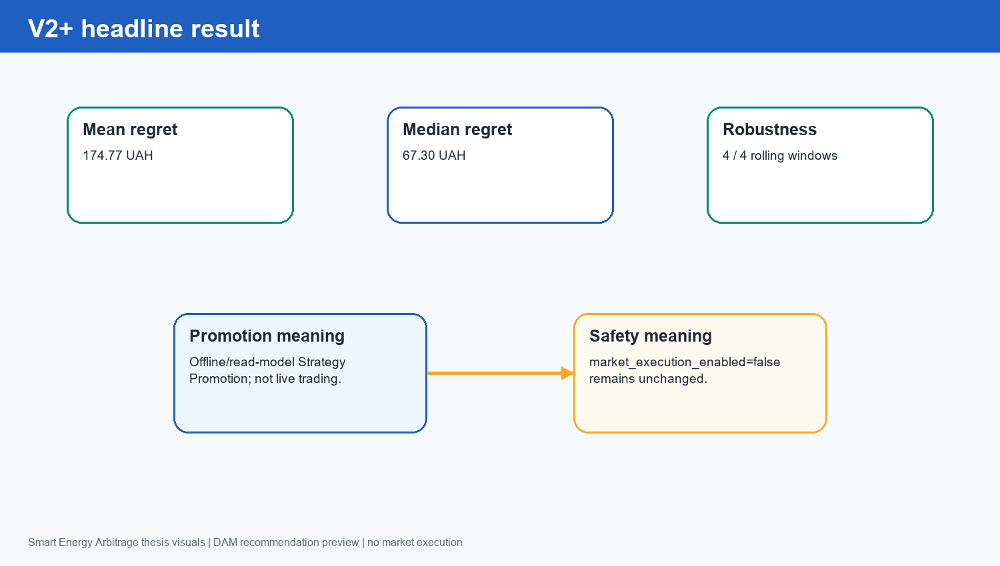
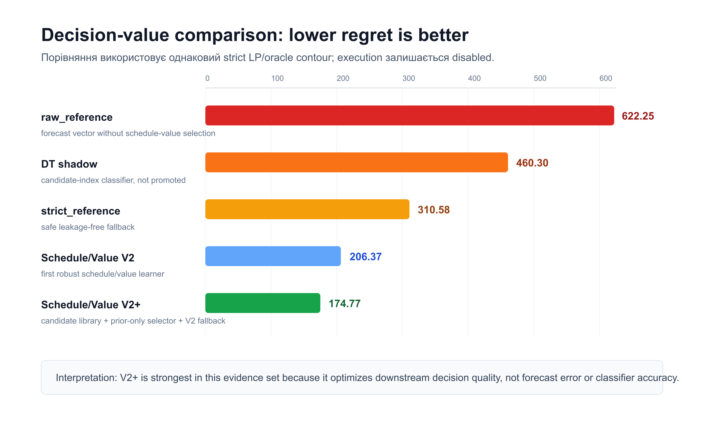
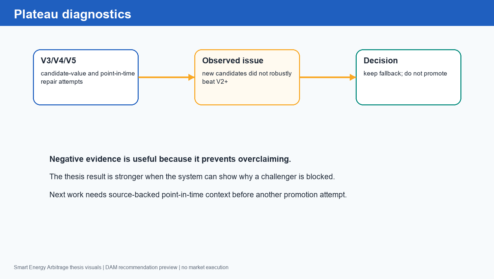
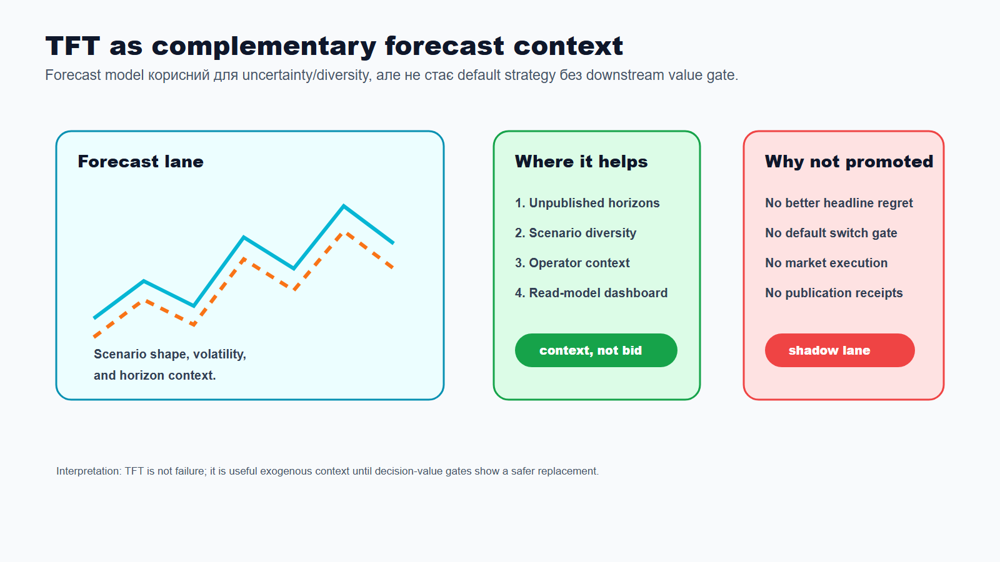
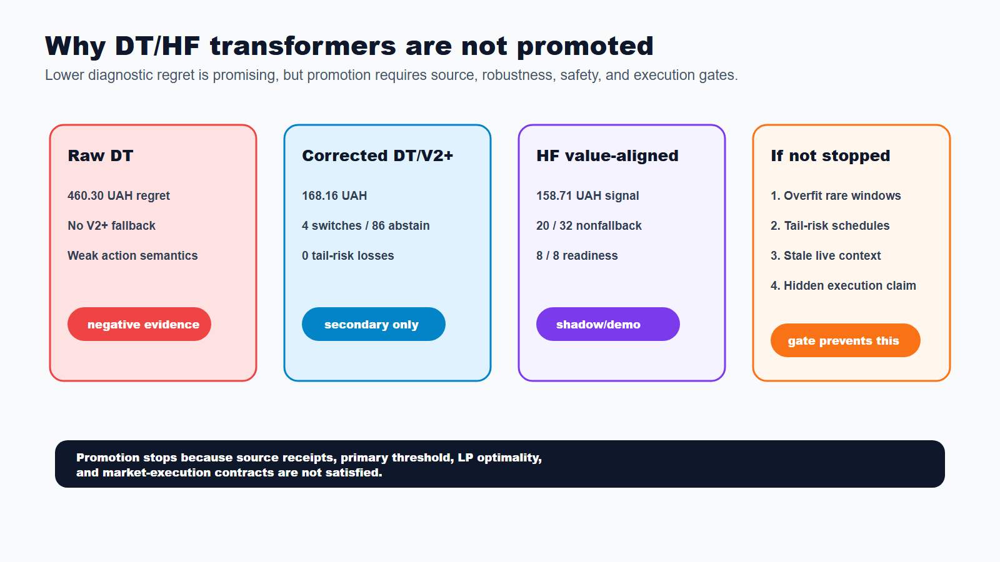
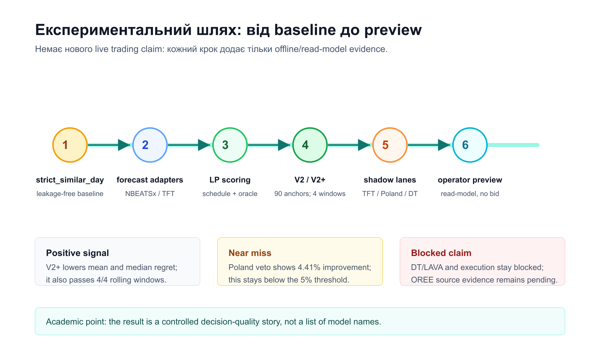
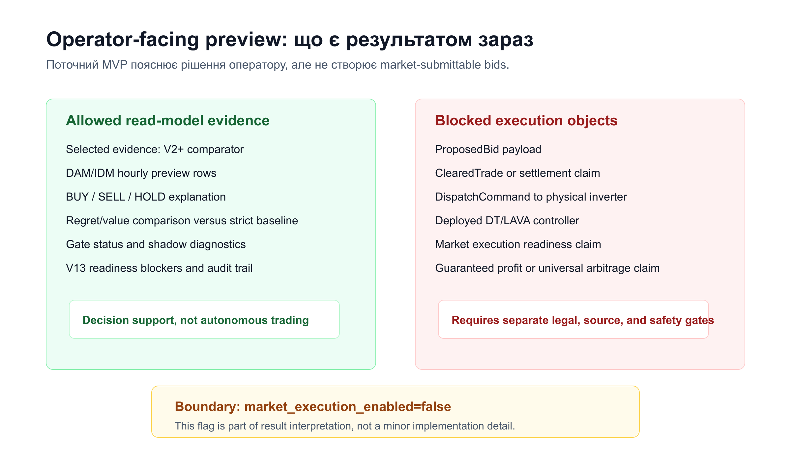

Розділ 4. Результати та обговорення

4.1. Scope результатів

Результати належать до DAM/IDM hourly recommendation preview та offline/read-model evidence. DAM/V2+ лишається primary evaluated packet, а IDM належить до product/read-model preview capability без market execution. Усі числові твердження нижче походять з наявних evidence packets і не є новими експериментами. Межу scope наведено в таблиці 4.1.

Таблиця 4.1. Scope результатів і межі інтерпретації

| Scope item | Поточний статус | Інтерпретація |
| --- | --- | --- |
| Market | DAM/V2+ evaluated packet; DAM/IDM hourly preview capability | Not live IDM bid, settlement або market coupling execution |
| Evidence | Offline/read-model packets | Результати відтворюються з repo artifacts |
| Safety | market_execution_enabled=false | No ProposedBid, ClearedTrade або DispatchCommand |
| V13 | Receipts blocked; safe-switch staged support 20/20 | DT/LAVA training remains blocked |
| HF value-aligned shadow | Manual live shadow preview; candidate-library demo gate passed | Not production/default replacement, not market execution |

Таблиця 4.1 задає рамку для всього розділу. Headline result може бути практично корисним для operator preview, але він не відкриває live market execution. Це особливо важливо для V13, де safe-switch staged support уже може бути достатнім для частини локальної evidence, але explicit OREE DAM/IDM source/publication evidence for preview залишається blocker для DT/LAVA training, а market-submission receipts залишаються окремим execution blocker.

4.2. Headline V2/V2+ результат

Головний результат отримано не raw forecast, а Schedule/Value Learner V2+, який вибирає feasible schedule candidate за downstream value. Порівняння наведено в таблиці 4.2.

Таблиця 4.2. Headline comparison для strict, V2, V2+ та raw reference

| Comparator | Mean regret, UAH | Median regret, UAH | Висновок |
| --- | --- | --- | --- |
| strict_reference | 310.58 | 198.39 | Контрольний leakage-free baseline |
| Schedule/Value Learner V2 | 206.37 | 96.02 | Перший стійкий improvement |
| Schedule/Value Learner V2+ | 174.77 | 67.30 | Headline offline strategy result |
| raw_reference | 622.25 | 290.22 | Raw forecast alone is insufficient |

З таблиці 4.2 видно, що V2+ має mean regret 174.77 UAH і median regret 67.30 UAH. Це краще за strict_reference 310.58 / 198.39 UAH і краще за V2 206.37 / 96.02 UAH. Raw reference у цьому slice має значно гірший mean regret, що підтверджує головну тезу: прогноз сам по собі не є достатнім; потрібний schedule/value decision layer.

Ту саму різницю візуально наведено на рисунку 4.1.

Рисунок 4.1. Драбина mean regret: V2+ і transformer shadow challengers

Рисунок 4.1 робить headline result зрозумілим без довгого переліку проміжних експериментів. Lower regret означає меншу втрату economic value відносно oracle. V2+ знижує mean regret на 43.73% проти strict baseline і на 15.31% проти frozen V2.

Ключову result card наведено на рисунку 4.2.

Рисунок 4.2. V2+ headline result card і shadow boundary

Рисунок 4.2 підкреслює, що result має три частини: lower regret, lower median regret і rolling robustness 4 / 4. Саме поєднання цих критеріїв дозволяє назвати результат offline/read-model Strategy Promotion. Водночас safety boundary залишається незмінною.

4.3. Чому V2+ сильніший за raw forecast

Raw NBEATSx і TFT можуть мати корисні price signals, але BESS schedule залежить від розташування екстремумів, spread shape, SOC path, terminal SOC pressure, throughput і фізичних constraints. Тому прогнозний ряд не є кінцевим рішенням. Він стає корисним лише тоді, коли перетворюється на feasible charge/discharge schedule і оцінюється через regret/value. V2+ працює саме на цьому рівні: він порівнює candidate schedules, а не тільки прогнозні ряди.

Архітектура V2+ є decision stack з чотирьох частин. Перший шар - price-context/source layer: для published preview price source є official OREE row, а horizon-calibrated NBEATSx/TFT використовуються як scenario або historical forecast evidence для unpublished/replay cases. Жоден із цих signals не просувається напряму як ринкова дія. Другий шар - candidate library: поруч із frozen V2 додаються deterministic schedule families, які закривають failure modes попереднього рішення. До них належать perturbation around price extrema, robust spread penalty, small timing shifts around strict_similar_day, temporal block reconciliation і terminal SOC target. Третій шар - prior-only selector: він використовує train/prior anchors, prior family regret, forecast spread, forecast objective value, throughput, degradation proxy, SOC slack і candidate identity, але не бачить final-holdout regret до моменту scoring. Четвертий шар - unchanged strict LP/oracle evaluator: кожний selected schedule оцінюється тим самим contour, що й strict, raw, V2, DFL shadow і DT shadow. Саме ця комбінація дає V2+ перевагу: модель не намагається "вгадати вже опубліковану ціну краще за офіційне джерело", а вибирає той feasible schedule, який має кращу decision-value evidence.

Практично це означає, що V2+ не конкурує з forecast model як ще один forecast. Він стоїть після forecast і перед operator preview. Якщо forecast помиляється у рівні ціни, але зберігає корисний shape, V2+ може вибрати schedule family, яка зменшує regret. Якщо forecast дає привабливий, але ризиковий schedule, selector або fallback залишають V2+/strict contour без просування слабшого challenger. Тому головний результат виникає не з isolated forecast accuracy, а з поєднання candidate diversity, prior-only вибору, V2 fallback і однакового LP/oracle scoring на 5 tenants, 90 tenant-anchors і 4 rolling windows.

Схему архітектурної різниці між підходами наведено на рисунку 4.3.

Рисунок 4.3. Архітектурне порівняння raw, strict, V2+, DT і HF shadow

З рисунку 4.3 випливає, що raw forecast зупиняється на price vector, strict_similar_day дає безпечний, але негнучкий fallback, а V2+ додає schedule-family search і conservative prior-only switching. Decision Transformer та HF value-aligned shadow мають потенційно сильнішу форму навчання, але в поточному evidence set вони лишаються constrained shadow challengers, а не заміною V2+ без окремого promotion/execution gate.

Raw reference програє найчіткіше. Його mean regret становить 622.25 UAH, а median regret - 290.22 UAH, бо price forecast не дорівнює battery decision. Навіть якщо forecast вловлює загальний рівень ціни, LP може отримати неправильний порядок charge/discharge годин, terminal SOC pressure або надмірний throughput. V2+ зменшує цю проблему через schedule-level selection: він оцінює не абстрактну точність ряду, а downstream value після фізичних та економічних constraints.

Strict baseline програє V2+ з іншої причини. Strict_similar_day є leakage-free, простим і стабільним, тому він залишається корисним fallback і comparator. Але його архітектура фіксована: вона не бачить нові feasible schedule families і не використовує prior evidence для вибору між ними. Через це strict_reference має mean regret 310.58 UAH проти 174.77 UAH у V2+. Аналітично це не "провал" strict, а межа deterministic fallback: він добре захищає від overfitting, але не використовує підтверджені можливості schedule/value selection.

DFL-напрям у роботі не відкинуто, але його межу уточнено. Ранні candidate-value DFL v3, residual/DT bridge і regret-aware selector були корисними як negative evidence: вони перевіряли, чи можна навчити prior-only replacement rule поверх V2+. DFL v2 matched V2+ на рівні mean regret 174.77 UAH, але не створив replacement improvement, а перший conservative regret-aware run зробив 0 / 90 non-V2+ switches. Після цього було навчено corrected DT/V2+ safe-switch shadow: замість candidate-index accuracy він оптимізує \(\Delta r_{\mathrm{V2+}}\) (`regret_delta_vs_v2_plus_uah`) і abstains до V2+, якщо predicted improvement слабкий або tail-risk guard не проходить. Після виправлення double-encoded vector parsing цей результат підтверджено canonical 3-seed aggregation: `runs/dt_v2_plus/aggregate.json` має `n_seeds=3`, `mean_test_regret=168.1566`, `pass_level=secondary`, `promotion_gate_passed=false` і `market_execution_enabled=false`. На frozen final-holdout packet цей shadow знизив mean regret до 168.16 UAH проти 174.77 UAH у V2+, median regret до 61.71 UAH проти 67.30 UAH, зробив 4 / 90 non-V2+ switches, відновив 3 / 15 observed safe-switch opportunities і не мав tail-risk losses. Це positive secondary research evidence, але ще не default replacement: mean regret не досягає primary threshold 166.0 UAH, Welch result має zero-variance seed-means caveat, а V2+ залишається fallback.

Decision Transformer у поточному evidence set треба описувати як research lane з двома різними етапами. Негативним був ранній proxy-експеримент: candidate-index / schedule-family classifier з cross-entropy objective оптимізував відтворення teacher labels, а не LP/oracle regret напряму. В apples-to-apples comparison цей raw DT selected mean regret становив 460.30 UAH, бо модель обрала 65 rows schedule_value_learner_v2_reference і 25 rows raw_reference, але 0 rows V2+. Corrected shadow змінив постановку задачі: він навчається на regret/value delta відносно V2+, використовує V2+ як fallback і дозволяє switch лише у рідкісних безпечних випадках. Саме тому новий результат практично кращий за V2+ на цьому packet, але академічна межа лишається консервативною: це manual research diagnostic, не raw BUY/SELL/HOLD controller, не dashboard/API default і не DT/LAVA promotion. Додатково V13 source-readiness не дозволяє описувати DT/LAVA як готовий training або execution contour.

Кількісне порівняння підходів наведено на рисунку 4.4.

Рисунок 4.4. Порівняння mean regret для raw, DT, strict, V2, V2+, DT/V2+ safe-switch і HF value-aligned shadow

Рисунок 4.4 підкреслює головну логіку результату: нижчий regret має не найскладніша модель за назвою, а той підхід, який краще поєднує feasible schedules, fallback, prior-only selection і strict LP/oracle evaluation. V2+ перемагає як confirmed offline comparator, corrected DT/V2+ safe-switch дає secondary regret improvement, а HF value-aligned shadow показує ще нижчий frozen diagnostic signal лише у shadow/demo межі. Отже, графік не доводить production replacement; з нього видно, що constrained decision architecture працює краще за raw forecast або unconstrained sequence output.

У практичній інтерпретації оператор отримує не "сирий прогноз", а пояснення: який schedule обрано, який regret очікується за backtest evidence, чому fallback не гірший і які gates пройдено. Така структура робить dashboard корисним для українського BESS owner, бо він бачить decision evidence, а не лише графік ціни.

4.4. Robustness і negative evidence

Після V2+ були перевірені додаткові candidate-value та plateau-breaking кроки. Їхній підсумок наведено в таблиці 4.3.

Таблиця 4.3. Robustness і plateau diagnostics після V2+

| Challenger | Observed result | Gate status |
| --- | --- | --- |
| V3 candidate-value | Додав value labels, але не дав robust improvement | Not promoted |
| V4 plateau breaker | Діагностував failure-mode candidates | Not promoted |
| V5 point-in-time repair | Покращив protocol clarity, але не замінив V2+ | Not promoted |
| DT/V2+ safe-switch selector | Canonical 3-seed secondary aggregate: 168.16 UAH mean regret; 4 / 90 non-V2+ switches; 3 / 15 safe-switch opportunities recovered | Positive shadow evidence; V2+ remains confirmed offline comparator/evidence |
| HF value-aligned shadow | 32 source-backed DAM days; 20 nonfallback days; switch rate 62.5%; safety failures 0 | Shadow/demo candidate-library gate passed; production market promotion remains false |

З таблиці 4.3 видно, що подальші candidate-value кроки спочатку не дали safe replacement of V2+, але corrected safe-switch shadow знайшов рідкісні безпечні обходи V2+. Це не змінює default strategy автоматично: система демонструє здатність показати positive shadow evidence і водночас зупинити promotion, доки окремий gate не дозволить default switch. Для дипломної роботи важливо показати не лише success path, а й disciplined non-promotion.

Додатковий threshold-sensitivity diagnostic перевірив `min_predicted_improvement_uah` = 0, 5, 10, 20 і 50. Thresholds 0-20 дали однаковий canonical result: 168.16 UAH mean regret, `secondary`, 4 / 90 switches, 86 / 90 abstentions і 3 recovered V2+ opportunities. Threshold 50 лишив той самий mean regret, але скоротив switches до 3 / 90. Це означає, що результат не є випадковим наслідком одного threshold, але improvement дуже вузький і не перетворює shadow selector на primary/promoted strategy.

Пояснення плато наведено на рисунку 4.5.

Рисунок 4.5. Gate-based plateau і non-promotion diagnostics

Рисунок 4.5 фіксує логіку gate-based evidence. Якщо новий selector не має стійкого prior-only сигналу, abstention і fallback до V2+ є правильним рішенням. Якщо corrected selector знаходить невелику кількість safe switches, це можна показувати як research diagnostic, але не як production/default switch. Це зменшує ризик перебільшення claims і формує реалістичний roadmap майбутніх досліджень.

4.5. Shadow evidence і непідтверджені challengers

Після headline V2+ були перевірені додаткові гілки, які могли б пояснити або потенційно покращити результат. Їхній підсумок наведено в таблиці 4.4.

Таблиця 4.4. Shadow evidence, near-miss results і blockers

| Shadow lane | Підтверджений результат | Рішення gate |
| --- | --- | --- |
| TFT quantile | Best TFT V2+ row: 225.47 UAH mean regret і 121.00 UAH median regret | Гірше за frozen V2+ 174.77 / 67.30 UAH; blocked |
| Poland lag24 richer | 177.34 UAH mean regret, 39.46 UAH median regret | Median кращий, але mean гірший за V2+ на 2.58 UAH; not promoted |
| Poland prior-only veto | 167.05 UAH mean regret, 55.97 UAH median regret; 34 challenger rows і 56 fallback rows | Near-miss: improvement 4.41% нижче порогу 5%; not promoted |
| DT/V2+ safe-switch selector | Canonical 3-seed secondary result: 168.16 UAH mean regret проти V2+ 174.77 UAH; 4 / 90 non-V2+ switches; 3 / 15 safe-switch opportunities recovered; 0 tail-risk losses | Positive shadow evidence; V2+ remains confirmed offline comparator/evidence |
| HF value-aligned shadow | Frozen HF mean regret 158.71 UAH проти V2+ baseline 174.77 UAH; 32 source-backed DAM days; value-aligned switch rate 62.5%; mean selected value 1174.29 UAH | Shadow/demo source manually selectable; no production promotion, no market payload |
| DT apples-to-apples | 460.30 UAH mean regret; +285.53 UAH проти V2+ | Research-shadow only; not promoted |
| V13 acquisition | Safe-switch support validated, але explicit OREE DAM/IDM source/publication evidence for preview missing | dt_lava_ready=false; permits_model_training=false |

Таблиця 4.4 важлива не менше за headline. З неї випливає, що система не просуває model family тільки через сучасну назву або локально привабливий сигнал. Poland prior-only veto був near-miss, а DT/V2+ safe-switch selector став першим corrected shadow, який показав невелике regret improvement без tail-risk losses. Водночас він лишається manual diagnostic, бо explicit promotion gate не додано і `promotion_gate_passed=false`. Отже, V2+ не замінюється, але roadmap уже має конкретний напрям: навчати модель шукати рідкісні safe switches, а не копіювати V2+ або raw action labels.

Межу TFT наведено на рисунку 4.6.

Рисунок 4.6. TFT як complementary forecast context

З рисунку 4.6 можна зробити висновок, що TFT не потрібно описувати як провал. Він дає uncertainty/diversity signal і може бути корисним у наступних ітераціях. Однак у поточному evidence set він не перемагає frozen Ukrainian-only V2+, тому його статус - complementary shadow lane.

Межу Decision Transformer наведено на рисунку 4.7.

Рисунок 4.7. DT/HF transformer non-promotion boundary

Рисунок 4.7 відділяє working sequence-policy pipeline від deployed controller. Ранній apples-to-apples DT classifier дав regret 460.30 UAH і тому залишився negative evidence. Corrected DT/V2+ safe-switch shadow уже показав кращий final-holdout regret, ніж V2+ (168.16 проти 174.77 UAH), але тільки як offline/manual research diagnostic. Додатково V13 не дозволяє DT/LAVA training claims, доки explicit OREE DAM/IDM source/publication evidence for preview залишається blocker.

Причини зупинки transformer challengers різні, але логіка однакова. Raw DT не промоутиться, бо його mean regret 460.30 UAH гірший за V2+ і він не має надійного V2+ fallback. Corrected DT/V2+ safe-switch із mean regret 168.16 UAH є позитивним secondary evidence, але не проходить primary threshold 166.0 UAH, має лише 4 / 90 non-V2+ switches, 86 / 90 abstentions і seed-level caveat для порівняння. HF value-aligned shadow має сильний frozen diagnostic signal 158.71 UAH і 20 / 32 nonfallback days, але це candidate-library/demo proof: він ранжує скінченний набір templates, а не розв'язує повний LP/MIP optimization space, і не має V13/source/execution readiness для production. Якщо б ці gates не зупиняли transformer paths, dashboard міг би непомітно замінити V2+, показати overfitted rare switches, допустити tail-risk schedules або змішати read-model preview з market-execution claim. Тому stop/abstain є не слабкістю, а частиною safety case.

4.6. Шлях експериментів

Експериментальний шлях у роботі можна стисло подати як послідовність контрольованих gates. Спочатку strict_similar_day задає leakage-free baseline. Далі raw NBEATSx/TFT forecast adapters створюють price signals, але не вважаються рішенням самі по собі. Потім LP contour перетворює forecast або selector output на feasible schedule, а regret/value scoring порівнює цей schedule з oracle. Технічно це означає, що для кожного price signal або selector candidate один і той самий LP/scoring contour будує графік із SOC, power, efficiency і feasibility constraints, після чого цей графік оцінюється на realized prices; regret є різницею між його value та value oracle schedule, побудованого на фактичних цінах того самого горизонту. Після цього V2 і V2+ перевіряються на 5 tenants, 90 tenant-anchors і 4 rolling windows. Цю послідовність наведено на рисунку 4.8.

Рисунок 4.8. Експериментальний шлях від baseline до live shadow preview

Рисунок 4.8 демонструє, що кожний етап додає не "красивішу модель", а новий рівень доказовості. Raw forecast стає корисним тільки після LP scoring; V2+ стає headline лише після rolling robustness; shadow lanes залишаються diagnostics, якщо не проходять gate.

Цей шлях пояснює, чому результат не зводиться до одного числа. V2 довів корисність schedule/value selection проти strict baseline. V2+ став headline, бо одночасно знизив mean regret, median regret і пройшов rolling robustness. Shadow lanes після цього мали роль challengers: вони могли замінити V2+ лише за умови prior-only evidence, non-degradation і достатнього improvement. Corrected DT/V2+ safe-switch shadow дав таке локальне improvement на frozen packet, але ще не має promotion gate, source-readiness closure і default-switch policy; тому він є candidate for future promotion, а не поточним replacement.

4.7. Що можна впевнено показувати оператору

На поточному етапі оператору можна показувати не market command, а evidence-backed preview. До такого preview належать DAM/IDM hourly recommendation rows, official-row або forecast-scenario context, regret/value comparison, V2+ versus strict/raw comparators, gate status, V13 readiness і shadow diagnostics. Кожний елемент має читатися як пояснення рішення, а не як ProposedBid, ClearedTrade або DispatchCommand.

Склад такого operator-facing preview наведено на рисунку 4.9.

Рисунок 4.9. Operator preview: read-model evidence без execution

Рисунок 4.9 відділяє дозволені read-model елементи від недозволених execution objects. Оператор може бачити schedule preview, regret/value comparison і gate status, але система не формує market-submittable bid або dispatch command.

У показаному materialized packet operator-preview частина має 24 hourly DAM rows, зокрема 1 BUY, 2 SELL і 21 HOLD. Той самий read-model contract підтримує IDM hourly recommendation preview rows, але не live IDM bids. Якщо DAM/IDM row уже published, LP використовує official row first; якщо target ще unpublished, ML forecast scenarios можуть бути лише scenario input до LP. Такий розподіл не є слабкістю: HOLD може бути правильним рішенням, якщо spread, SOC або risk не підтримують charge/discharge. Саме тому dashboard має оцінюватися через regret/value і gate status, а не через кількість активних BUY/SELL action labels.

4.8. Практична інтерпретація для України

Практичний результат полягає не в тому, що система торгує, а в тому, що вона допомагає оператору приймати evidence-informed decisions. Для українського BESS owner це корисно з трьох причин. По-перше, DAM/IDM hourly preview можна демонструвати без regulatory overreach. По-друге, кожний result row має audit trail і може бути пояснений через regret/value. По-третє, система явно показує blockers: source/publication evidence, V13, DT/LAVA і market execution не змішуються з current MVP.

Прапорець market_execution_enabled=false у цьому контексті є частиною safety case. Він означає, що навіть підтверджений offline result не перетворюється автоматично на live market action. Щоб змінити цю межу, потрібні source/publication evidence, operational responsibility, legal review, market integration і monitoring; market-submission receipts залишаються окремими для execution contour. Тому current practical suitability означає operator-facing evidence preview, а не готовність до live trading.

4.9. Обмеження результатів

Головні обмеження результатів залишаються явними. Результат не охоплює live bid submission, settlement reconciliation, balancing market, physical inverter dispatch або повний electrochemical digital twin. LP contour є достатнім для однакового feasibility/value evaluation, але не замінює production asset-management model. External source lanes, зокрема Poland lag24 / prior-only veto і V13, показують потенціал, але не скасовують source-governance blockers.

Ці обмеження не зменшують цінність розділу, бо вони визначають чесну межу claims. V2+ можна описувати як strongest offline/read-model strategy result у наявному evidence set. Його не можна описувати як універсальну гарантію прибутку, market-ready bid engine або deployed DT/DFL controller. Така межа робить результат захищеним академічно й придатним для практичного roadmap.

4.10. HF value-aligned shadow як live operator-preview challenger

Фінальний HF value-aligned shadow packet показує, що transformer-based evidence може бути корисним не як raw controller, а як guarded candidate scorer. У цьому режимі dashboard вручну обирає `hf_live_safe_switch_value_aligned_shadow`, backend бере вибраний tenant, DAM/IDM venue і target delivery date, завантажує source-backed 24-hour price context, генерує LP-free candidate schedules і пропускає їх через HF safe-switch scorer та deterministic gates. Якщо gate проходить, оператор бачить non-HOLD preview; якщо ні, система чесно показує guarded HOLD/V2+ fallback. Live actual regret до delivery невідомий, тому `regret_uah` для live schedule rows лишається nullable.

Простою мовою цей контур працює як контрольований відбір варіантів. Спочатку система бере не абстрактний датасет, а конкретний operational context: tenant, ринок DAM або IDM, target date і 24-годинну price curve. Далі вона не просить transformer одразу "вигадати" charge/discharge schedule. Замість цього створюються чотири основні безпечні сімейства кандидатів: fallback/V2+ HOLD або SOC-maintain, conservative strict/reference, balanced reference і value-aligned/action templates. Для кожного такого candidate обчислюються очікувана цінність, SOC path, throughput, degradation proxy і кількість deterministic safety violations. HF scorer оцінює, наскільки candidate може бути кращим за V2+ fallback і наскільки він ризиковий у tail scenarios. На відміну від LP, який розв'язує optimization problem у feasible constraint space, HF не генерує довільний optimum: він лише ранжує вже створену finite candidate library і може abstain. Gatekeeper після цього приймає просте рішення: якщо value delta проходить guard, tail-risk не перевищує cap, safety violations дорівнюють нулю і SOC path фізично допустимий, schedule можна показати як non-HOLD preview; інакше правильним результатом є HOLD/V2+ fallback. Тому "тільки HOLD" у цьому режимі не обов'язково означає поломку моделі: це може бути коректний guarded abstention.

Схему нового live shadow path наведено на рисунку 4.10.

Рисунок 4.10. HF value-aligned shadow live operator-preview architecture

З рисунку 4.10 видно головну архітектурну різницю. V2+ залишається fallback/comparator, а HF не намагається самостійно розв'язати повну optimization problem. LP будує графік через explicit constraints і може шукати розв'язок у ширшому feasible space; HF працює інакше: він ранжує finite candidate library, тобто fallback/V2+ HOLD або SOC-maintain, strict/reference, balanced reference і value-aligned templates. Feature block містить estimated value, SOC path, throughput, degradation proxy і safety violations. HF scorer прогнозує delta проти V2+ і tail-risk probability, а gatekeeper блокує non-HOLD preview, якщо value guard, tail-risk cap або deterministic safety не виконані.

Карточки рисунка 4.10 розшифровано в таблиці 4.5.

Таблиця 4.5. Архітектурні прийоми HF value-aligned shadow

| Карточка / компонент | Реалізація в системі | Користь для ML-архітектури | Обмеження |
| --- | --- | --- | --- |
| Operator selection | `tenant_id`, `market_venue`, `target_delivery_date` у manual dashboard source | Усі графіки, chips і schedule rows прив'язані до одного selected window | Не є default strategy або автоматичним controller |
| Source-backed price context | Official OREE rows або forecast-store/request fallback з явним source mode | Забороняє synthetic prices і робить preview auditable | Forecast rows не є publication receipts і не відкривають V13 training |
| LP-free candidate generator | Hold/SOC-maintain fallback, strict/reference, balanced і value-aligned templates | Дає HF scorer обмежений фізично зрозумілий простір дій без LP у live path | Не покриває весь LP/MIP optimization space: library є скінченною, задає лише чотири templates і може пропустити допустимі графіки поза цими schedule families. |
| Feature block | Value, SOC path, throughput, degradation proxy, safety violations | Перетворює schedule у decision-aware features, а не raw action labels | Feature quality залежить від source context і candidate design |
| HF safe-switch scorer | Прогнозує delta проти V2+ і tail-risk probability | Модель ранжує candidates і може знаходити safe non-HOLD opportunities | Score не скасовує deterministic gates і не є proof of optimality |
| Deterministic gates | Value guard, tail-risk cap, family-tail guard, safety=0, feasible SOC | Безпечніший failure mode: abstain замість ризикової дії | Блокує частину потенційно прибуткових, але недостатньо доказових candidates |
| Non-HOLD preview | Charge/discharge/hold rows тільки після проходження gates | Робить transformer evidence видимим оператору в live dashboard | Preview не є ProposedBid або market command |
| Guarded abstention | HOLD/V2+ fallback, якщо guards не пройдено | Негативний або слабкий signal стає чесним operator explanation | Може виглядати як "тільки HOLD", якщо не показати diagnostics |
| No-execution boundary | `market_execution_enabled=false`, no market payload, no production promotion | Захищає thesis/demo від overclaiming і legal/operational confusion | Execution потребує окремого bounded context і receipts |

Підсумок HF packets наведено в таблиці 4.6.

Таблиця 4.6. HF value-aligned shadow evidence packets

| Packet | Evidence scope | Result | Boundary |
| --- | --- | --- | --- |
| Candidate-library promotion proof | 2026-05-01..2026-06-01; 32 official OREE DAM days | Shadow gate passed; 20 nonfallback days; switch rate 62.5%; mean selected value 1174.29 UAH; value-gap ratio 0.397; tail-failure delta -16; safety failures 0 | Production market promotion false; no ProposedBid; `market_execution_enabled=false` |
| Frozen HF comparison | Same proof packet plus robustness inputs | HF frozen mean regret 158.71 UAH проти V2+ baseline 174.77 UAH; delta -16.06 UAH | Demo/shadow evidence only; not V13 training |
| Forecast readiness matrix | DAM/IDM x latest/today/tomorrow/day+2; 8 cases | 8 / 8 ready 24-row cases; 0 blocked; 6 cases with non-HOLD rows; source modes: 2 official, 1 same-day refresh, 5 pre-publication forecast | Readiness for dashboard preview, not market submission |
| Demo evidence packet | 4 supervisor/demo cases | 4 / 4 passed; 2 nonfallback cases and 2 guarded abstentions | Manual source only; execution flags false |

Readiness для live preview показано на рисунку 4.11.

Рисунок 4.11. HF value-aligned forecast readiness matrix

З рисунку 4.11 випливає, що live readiness у цій роботі означає не "ринок готовий", а "dashboard може отримати 24 source-backed rows або explicit block для обраного DAM/IDM target". У proof packet всі 8 ручних випадків latest/today/tomorrow/day+2 повернули 24-row preview context, але це не змінює execution boundary: no synthetic prices, no ProposedBid, no market payload і `market_execution_enabled=false`.

Ці числа пояснюють, чому HF value-aligned shadow можна показувати у demo як preferred HF shadow source, але не можна називати replacement of V2+ або LP. Порівняно з раннім raw DT classifier, який мав 460.30 UAH mean regret і не використовував V2+ fallback, нова архітектура працює краще саме через safe-switch framing: модель не зобов'язана діяти завжди, а може abstain. Порівняно з corrected DT/V2+ safe-switch selector, HF value-aligned має сильніший live dashboard path і ширший candidate-library proof, але його evidence все ще є shadow/demo, а не default strategy. Порівняно з V2+, він не замінює headline offline result; він є supervised challenger поверх V2+ fallback. Порівняно з LP, HF shadow є не математично повним optimizer-ом, а scorer-ом скінченної бібліотеки candidate schedules. Це корисно для швидкого live preview, але не є доказом глобальної оптимальності.

Аналітично результат виник не від одного прийому, а від комбінації методів. Value-aligned candidate library збільшила ймовірність, що scorer бачить schedules із реальною економічною цінністю; tail-risk guard зупинив привабливі, але ризикові candidates; deterministic safety projection не дозволив ML score перевищити фізику батареї; source-backed-only policy не дала dashboard намалювати фейкові ціни; browser E2E smoke перевірив саме user-facing data flow: stale chips, wrong date, blank graphs і прихований `/dashboard/operator-recommendation` для HF source. Саме ці інженерні guardrails роблять transformer evidence практично показовим, хоча воно ще не є production optimizer.

4.11. Висновок до розділу 4

Головний результат роботи - V2+ schedule/value selector з mean regret 174.77 UAH, median regret 67.30 UAH, improvement 43.73% проти strict і 15.31% проти V2, а також rolling robustness 4 / 4. Corrected DT/V2+ safe-switch shadow показує практично важливий follow-up: canonical 3-seed mean regret 168.16 UAH, median regret 61.71 UAH, 4 / 90 safe switches, 3 / 15 recovered opportunities і 0 tail-risk losses. HF value-aligned shadow розширює цей follow-up у live dashboard direction: candidate-library demo gate passed на 32 source-backed DAM days, readiness matrix дала 8 / 8 24-row DAM/IDM cases для latest/today/tomorrow/day+2, а live path не викликає LP solver для HF shadow request. Але обидва transformer-based результати лишаються manual shadow evidence: V2+ є confirmed offline schedule-value evidence/comparator, dashboard/API показують DT/HF shadow лише як preview diagnostics, а production market promotion і market execution залишаються false. Підсумкова межа незмінна: DAM/IDM hourly recommendation preview, offline/read-model evidence і no market execution.
