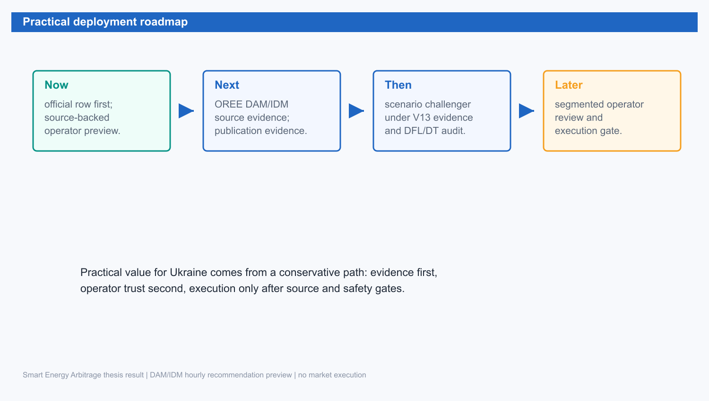

Розділ 5. Висновки та рекомендації

5.1. Підсумок виконаних завдань

У роботі побудовано практичну evidence system для DAM/IDM hourly recommendation preview у задачі BESS-арбітражу. Основна ідея полягала в тому, щоб оцінювати не лише прогноз ціни, а downstream decision value після LP schedule optimization. DAM/V2+ залишається primary evaluated thesis evidence, тоді як read-model capability підтримує DAM і IDM preview під тією самою no-execution межею. Це дозволило перейти від forecast-only порівнянь до regret/value evidence, яка краще відповідає реальній економічній задачі оператора BESS.

Підсумок цілей і результатів наведено в таблиці 5.1.

Таблиця 5.1. Цілі роботи та отримані результати

| Мета | Підсумок | Практичне значення |
| --- | --- | --- |
| Оцінити DAM BESS рішення | Regret/value введено як головний критерій | Рішення оцінюються економічно, не тільки forecast-only |
| Побудувати MVP | Dagster/FastAPI/dashboard read model працює як evidence surface | Оператор бачить preview без live execution |
| Перевірити ML/DFL потенціал | V2+ став confirmed offline comparator/evidence, corrected DT/V2+ safe-switch shadow дав 168.16 UAH mean regret, HF value-aligned shadow пройшов shadow/demo gate на 32 source-backed DAM days | Система показує improvement і live shadow-readiness, але не overclaim-ить promotion |
| Зберегти безпеку | market_execution_enabled=false і V13 blockers явні | Підхід придатний для академічної демонстрації в Україні |

З таблиці 5.1 видно, що основні завдання виконано в межах безпечного scope. Робота не заявляє live market execution, але дає defendable academic MVP: source-backed offline evidence, dashboard/read-model preview, strict LP/oracle scoring і пояснювану межу V13.

5.2. Основні висновки

Перший висновок: у задачі BESS arbitrage головним є не прогноз як такий, а якість рішення після перетворення price signal у feasible schedule. Forecast-only метрики залишаються корисними diagnostics, але вони не відповідають на питання, скільки economic value втрачено відносно oracle LP. Саме тому regret/value, rolling robustness і gate status є центральними метриками роботи. Це зміщує фокус із "яка модель точніше передбачає ціну" на "яка архітектура стабільно створює кращі decision outcomes".

Другий висновок: найкращий підтверджений baseline у роботі - не найскладніша neural model, а V2+ schedule/value selector. Його mean regret 174.77 UAH, median regret 67.30 UAH і rolling robustness 4 / 4 показують, що conservative candidate selection із V2 fallback краще відповідає на ринкову форму українського DAM slice, ніж raw forecast або unconstrained classifier. Це важливий академічний результат: у прикладних energy systems простий, контрольований decision layer може бути сильнішим за модель із більш сучасною назвою.

Третій висновок: DT/HF результати стали корисними лише після переходу від "модель видає action" до "модель ранжує безпечні candidates і може abstain". Raw DT apples-to-apples result із 460.30 UAH mean regret показав, що direct sequence output без правильного fallback і guard не є достатнім. Corrected DT/V2+ safe-switch знизив mean regret до 168.16 UAH як secondary evidence, а HF value-aligned shadow дав 158.71 UAH frozen diagnostic signal і live dashboard readiness. Спільний урок цих експериментів: transformer має бути constrained scorer-ом у safety envelope, а не автономним controller-ом.

Четвертий висновок: найбільш продуктивні архітектурні прийоми - safe-switch framing, value-aligned candidate library, tail-risk guard, deterministic safety projection і source-backed-only policy. Вони працюють разом: candidate library дає моделі економічно змістовні варіанти, scorer шукає improvement проти V2+, tail-risk guard блокує "прибуткові, але небезпечні" schedules, deterministic projection не дозволяє ML score порушити фізику батареї, а source-backed policy забороняє dashboard малювати фейкові ціни. Саме ця комбінація пояснює, чому HF value-aligned shadow став сильнішим demo/challenger path, ніж попередні raw DT або forecast-only alternatives.

П'ятий висновок: для українського DAM/IDM контексту контрольована прозорість цінніша за передчасну автономність. Оператору потрібні 24 hourly rows, source mode, guard diagnostics, schedule/value comparison і зрозуміле пояснення abstention; йому не потрібна прихована market order system у дипломному MVP. Тому `market_execution_enabled=false`, no `ProposedBid`, no market payload і V13/source-readiness blockers є не слабкістю, а частиною науково й інженерно чесного design.

Шостий висновок: майбутній шлях до near-LP neural optimizer проходить не через просту заміну LP на HF. Реалістичний розвиток: розширити candidate library, зібрати teacher LP/MIP schedules, навчити distillation model передбачати schedule/action vectors, додати projection/repair layer і перевіряти результат проти frozen LP oracle на source-ready data. Тільки після цього можна говорити про LP surrogate; у поточній роботі HF value-aligned shadow коректно називати live operator-preview challenger, а не production optimizer.

5.3. Рекомендації для впровадження

Практичний roadmap наведено на рисунку 5.1.

Рисунок 5.1. Roadmap від thesis evidence до supervised execution gate

Рисунок 5.1 окреслює послідовний шлях: спочатку evidence and preview, потім OREE DAM/IDM source/publication evidence і point-in-time context, після цього shadow challengers під strict LP/oracle, і лише значно пізніше supervised execution gate. Такий порядок зменшує ризик overclaiming і робить систему придатною для поступового використання в українському контексті.

V2+ залишається confirmed offline schedule-value evidence/comparator, а TFT/DT/Poland lanes - shadow diagnostics. Operator preview path використовує official OREE row + deterministic LP для default/baseline preview; HF value-aligned shadow окремо показує, що transformer scorer може працювати live як manually selected read-model source без LP у HF request path. Corrected DT/V2+ safe-switch selector є перспективним candidate для майбутнього promotion, бо вже покращив mean regret на 3.78% проти V2+ на frozen packet, але потребує окремого promotion gate, source-readiness closure і повторної validation. HF value-aligned shadow є перспективним demo/challenger path, бо пройшов shadow candidate-library gate, 8-case readiness matrix для DAM/IDM latest/today/tomorrow/day+2 і browser smoke, але також потребує ширшого multi-tenant validation перед будь-якою default/promotion розмовою. Подальша робота зосереджується на explicit OREE DAM/IDM source/publication evidence for preview, richer point-in-time context, перевірці null coverage у зовнішніх features, LP-distillation/repair layer і окремому legal/operational design для market-submittable contours. До цього моменту жодний dashboard або API endpoint не описується як trading console.

5.4. Підсумковий висновок

Робота демонструє практично придатний і академічно чесний шлях від українського DAM price signal до BESS recommendation preview, розширений до DAM/IDM hourly recommendation preview як product/read-model capability. Головна цінність полягає в disciplined evidence: результат є коротшим, зрозумілішим і краще обмеженим, ніж перелік усіх дослідницьких траєкторій. HF value-aligned shadow показує, як advanced sequence-model evidence можна включити в живий dashboard без production overreach: source-backed context, LP-free candidates, HF scoring, deterministic gates і no-execution flags. Claim boundary залишається незмінною: DAM/IDM hourly recommendation preview, offline/read-model evidence, no market execution.

5.5. Обмеження роботи

Основне обмеження полягає в тому, що результат не є market-executable system. У роботі немає live bid submission, settlement reconciliation, physical dispatch integration або юридичного процесу участі на ринку. Це не недолік реалізації, а свідома межа. Для market execution потрібні інші gates, відповідальність, source/publication evidence і market-submission receipts, яких поточний academic MVP не заявляє.

Друге обмеження - спрощення фізики батареї. LP contour враховує основні feasibility constraints, але не є повним electrochemical digital twin. Для практичного preview цього достатньо, а повний production asset management потребує детальнішої SOH/degradation моделі й перевірки на measured telemetry.

Третє обмеження - статус зовнішніх джерел. TFT, Poland lag24 / prior-only veto і V13 acquisition lanes показують потенціал, але не проходять достатні gates для headline promotion. Тому вони залишаються roadmap evidence, а не результатом, який змінює default strategy.

Четверте обмеження - HF value-aligned shadow не є математично повним optimizer. Він ранжує скінченну candidate library, а не розв'язує весь простір допустимих hourly schedules. Тому його не можна називати LP replacement in production. Щоб рухатися в цьому напрямі, потрібні teacher LP/MIP datasets, constraint-aware decoding або projection/repair layer, apples-to-apples validation проти frozen LP oracle і source-readiness closure для training data.

5.6. Напрями подальшого розвитку

Перший напрям - завершення explicit OREE DAM/IDM source/publication evidence lane for preview; market-submission receipts remain separate для execution contour. Це розблокує сильніші source-readiness claims і дозволить безпечніше розглядати DT/LAVA або інші sequence-policy approaches. Другий напрям - винести corrected DT/V2+ safe-switch selector у формальний promotion gate: frozen strict/oracle scoring, повторна final-holdout validation, no-tail-risk condition і explicit default-switch policy. Третій напрям - покращення point-in-time context для candidate-value learners і контрольоване розширення TFT/Poland feature space після repair null coverage і rolling validation. Четвертий напрям - розвивати HF value-aligned shadow у near-optimizer research path: розширити candidate library, зібрати teacher LP/MIP schedules, навчити distillation model передбачати schedule/action vectors, додати deterministic projection/repair і порівнювати результат проти LP на frozen windows без зняття `market_execution_enabled=false`.

Окремий напрям розвитку - operator experience. Dashboard пояснює не тільки що рекомендовано, а й чому рекомендація не є market command. Для практичного використання це може бути важливіше за додавання ще однієї моделі: оператору потрібна довіра, auditability і зрозуміла межа відповідальності.

5.7. Завершальний практичний висновок

Коротка інтерпретація роботи така: система вже корисна як академічний і операторський preview, але ще не є trading system. Саме ця чесність робить результат обґрунтованим. Він показує реальну інженерну придатність для України, не перебільшуючи рівень ринкової готовності.

5.8. Пілотне використання після завершення роботи

Робота може бути основою для controlled pilot. У такому контурі market_execution_enabled=false зберігається, source-readiness та monitoring поступово покращуються, shadow validation виконується на новіших даних без зміни default strategy, а operator decisions порівнюються з preview для оцінки корисності пояснень.

Для такого pilot HF value-aligned shadow можна використовувати як read-only supervised challenger. Оператор може вручну обрати його в dashboard і побачити 24 hourly rows або explicit blocked/abstained reason для DAM/IDM latest/today/tomorrow/day+2. Це корисно для демонстрації й збору feedback, але не створює bid, не викликає market payload і не замінює V2+ default comparator.

Execution integration належить до наступного етапу. Навіть тоді execution залишається окремим bounded context, із власними schema, permissions, audit logs і rollback procedures. Поточна робота корисна саме тим, що не змішує ці етапи.

5.9. Підсумкова академічна позиція

Академічна позиція роботи полягає в контрольованій практичності. Вона не є суто теоретичною, бо має працюючий MVP і реальні evidence artifacts. Вона не є неконтрольованим стартап-прототипом, бо кожний сильний claim має gate і boundary. Вона не є повним research paper про DT або DFL, бо DT/DFL напрями залишені в чесному status research-shadow / future work.

Саме така позиція робить текст придатним для пояснювальної записки: він демонструє розуміння предметної області, інженерних обмежень і академічної відповідальності за claims.

5.10. Відповідь на дослідницьке питання

Дослідницьке питання можна сформулювати так: чи можна побудувати практично придатну, безпечну й evidence-backed систему DAM/IDM hourly recommendation preview для BESS в Україні, де якість оцінюється через decision value? Відповідь роботи - так, у межі offline/read-model evidence. V2+ демонструє кращий regret/value результат для primary DAM evidence, а архітектура показує, як подати оператору DAM або IDM hourly recommendation preview без переходу до market execution.

Друга частина відповіді не менш важлива: не всі advanced AI lanes готові до default promotion. TFT, Poland lag24 / prior-only veto і raw DT classifier є корисними diagnostics; corrected DT/V2+ safe-switch shadow уже дає positive regret evidence, але залишається manual research source до окремого promotion gate. HF value-aligned shadow показує найкращий наразі шлях для live transformer demo: candidate scoring + safe-switch + deterministic gates + source-backed dashboard data flow. V13 source-readiness лишається gate. Тому підсумковий результат не перебільшує AI capability, а показує контрольовану практичну цінність і реалістичний напрям розвитку.
