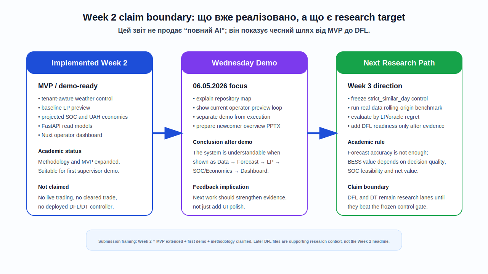

# Щотижневий звіт 2

## 1. Короткий результат тижня

За Week 2 проєкт був просунутий від базового MVP до зрозумілого supervisor-demo package. Основний результат тижня — стабільний operator-facing контур, який можна пояснити керівнику як повний шлях від даних до безпечного preview-рішення:

```text
OREE / Open-Meteo / tenants
  -> Dagster assets
  -> strict_similar_day forecast
  -> LP optimization
  -> projected SOC and UAH economics
  -> FastAPI read models
  -> Nuxt dashboard
```

Поточний claim залишається обмеженим і академічно безпечним: це **recommendation preview system**, а не live trading bot. Система не заявляє real market execution, не формує фактичні cleared trades і не подає фізичні dispatch commands на обладнання. Decision-Focused Learning і Decision Transformer залишаються цільовим research layer, а не вже розгорнутим production control.


## 2. Проєкт у цілому та його місце в дипломній роботі

Дипломний проєкт присвячено автономному енергоарбітражу для BESS на ринку України 2026. Практична мета — побудувати систему, яка бере ринкові та погодні дані, формує прогноз, оптимізує schedule батареї, враховує SOC constraints і degradation-aware economics, а потім показує operator-facing preview.

За типом це інженерний диплом із дослідницькою траєкторією. Інженерна частина вже має MVP-контур: Dagster asset graph, FastAPI read models, Nuxt dashboard, LP baseline і projected battery state preview. Дослідницька частина спрямована на перехід від Predict-then-Optimize до Decision-Focused Learning, де якість моделі оцінюється не лише forecast accuracy, а decision value: regret, net value, SOC feasibility і safety violations.

Поточний батарейний шар коректніше описувати як **feasibility-and-economics preview model**. Він не є повним electrochemical digital twin. У Week 2 він достатній для demo і baseline optimization, бо показує SOC trajectory, power feasibility, throughput і degradation penalty в UAH.

## 3. Що фактично реалізовано або вдосконалено за тиждень

### 3.1. Demo-ready operator MVP

На Week 2 фокус був на тому, щоб зробити MVP зрозумілим для першого demo walkthrough:

- уточнено operator-facing flow: tenant selection, weather control, baseline recommendation preview;
- підготовлено [demo-script.md](./demo-script.md);
- підготовлено [newcomer-overview.pptx](./newcomer-overview.pptx) для demo-day у середу;
- закріплено пояснення, що dashboard показує preview/read models, а не market execution;
- підсилено документацію навколо architecture/data flow.

### 3.2. Backend/API/Dashboard контур

Поточний MVP демонструє зв'язаний шлях:

- FastAPI endpoints у [api/main.py](../../../../api/main.py) віддають operator/read-model контракти;
- dashboard у [dashboard](../../../../dashboard) працює як operator surface, а не як strategy engine;
- projected battery state simulator у [src/smart_arbitrage/optimization/projected_battery_state.py](../../../../src/smart_arbitrage/optimization/projected_battery_state.py) показує feasible MW, SOC trace і UAH economics;
- operator status store у [src/smart_arbitrage/resources/operator_status_store.py](../../../../src/smart_arbitrage/resources/operator_status_store.py) підтримує persisted/in-memory status semantics для demo.

### 3.3. Research/evidence контур

Після підготовки demo стало зрозуміло, що наступний якісний крок — не просто UI polish, а доказова методологія. Тому в Week 2 також було уточнено research direction:

- `strict_similar_day` + LP baseline має бути frozen control comparator;
- forecast models на кшталт NBEATSx/TFT мають оцінюватися через LP/oracle regret, а не тільки через MAE/RMSE;
- DFL/DT слід вводити як research lane після benchmark evidence, а не як необґрунтований production claim;
- літературний розділ і source map мають підтримувати саме цю логіку.

## 4. Висновки після першого демо

Перше демо показало, що керівнику найпростіше сприймати проєкт через зрозумілу лінію:

```text
Data -> Forecast -> Optimize -> Validate -> Preview -> Learn
```

З [newcomer-overview.pptx](./newcomer-overview.pptx) випливає важлива демонстраційна рамка: репозиторій треба пояснювати не як набір скриптів, а як operator-preview pipeline. Демо має починатися з mental model, потім переходити до Dagster assets, LP baseline, battery economics, API contracts і dashboard surface.

Головні висновки після демо:

1. Поточний MVP уже можна показувати як engineering result.
2. `strict_similar_day` + LP baseline є не тимчасовою заглушкою, а контрольним контуром для майбутнього DFL.
3. Dashboard не повинен ставати strategy engine; стратегія має лишатися у backend/Dagster/optimization layer.
4. У всіх матеріалах треба чітко розділяти implemented MVP, demo-stage preview і planned research.
5. Наступний тиждень має сфокусуватися на real-data benchmark і evidence gates.



## 5. Академічне та літературне обґрунтування

Поточна архітектура узгоджується з літературою з time-series forecasting, predict-then-optimize і energy storage arbitrage. Найважливіший принцип: для BESS arbitrage не достатньо довести, що forecast має нижчу помилку. Треба довести, що forecast або learned strategy дає кращу decision quality після оптимізації.

| Джерело                                                                                                           | DOI / ідентифікатор     | Як використано в проєкті                                                                                                                                |
| ------------------------------------------------------------------------------------------------------------------------ | ------------------------------------ | ---------------------------------------------------------------------------------------------------------------------------------------------------------------------------- |
| Olivares et al., "Neural basis expansion analysis with exogenous variables: Forecasting electricity prices with NBEATSx" | `10.1016/j.ijforecast.2022.03.001` | Обґрунтовує NBEATSx як майбутній forecast candidate для electricity price forecasting з exogenous variables.                                       |
| Lim et al., "Temporal Fusion Transformers for interpretable multi-horizon time series forecasting"                       | `10.1016/j.ijforecast.2021.03.012` | Обґрунтовує TFT як інтерпретований multi-horizon forecasting candidate із covariates та attention/feature-selection логікою.          |
| Elmachtoub and Grigas, "Smart Predict, then Optimize"                                                                    | `10.1287/mnsc.2020.3922`           | Дає теоретичну основу для оцінювання моделей через downstream optimization loss, а не лише forecast error.                |
| Sang et al., "Electricity Price Prediction for Energy Storage System Arbitrage: A Decision-focused Approach"             | `10.48550/arXiv.2305.00362`        | Підтримує storage-specific DFL framing: regret і arbitrage value важливіші за саму точність прогнозу.                               |
| Yi et al., "A Decision-Focused Predict-then-Bid Framework for Strategic Energy Storage"                                  | `10.48550/arXiv.2505.01551`        | Пояснює майбутній напрям predict-then-bid, де storage optimization і market-clearing logic входять у decision-focused training.             |
| Hesse et al., "Ageing and Efficiency Aware Battery Dispatch for Arbitrage Markets Using MILP"                            | `10.3390/en12060999`               | Підтримує ідею, що degradation/efficiency мають бути частиною dispatch economics; у Week 2 це реалізовано поки як proxy. |
| Maheshwari et al., "Optimizing the operation of energy storage using a non-linear lithium-ion battery degradation model" | `10.1016/j.apenergy.2019.114360`   | Показує, що глибша degradation model є окремим наступним кроком, а не поточним MVP claim.                                   |

### 5.1. Нові джерела, які пояснюють поточну проблему і план

Окремий блок літератури, зібраний у [docs/thesis/sources](../../sources), прямо пояснює, чому поточний стан проєкту не варто трактувати як "нейромережі вже мають перемогти baseline". Навпаки, ці джерела підтримують обережну траєкторію: спочатку стабільний контрольний baseline і no-leakage benchmark, потім forecast candidates, потім DFL/DT only if decision-value evidence passes.

| Група джерел                                             | Приклади з локального архіву                                                                                                                                              | Що це означає для поточного продукту                                                                                                                                                                                            |
| ------------------------------------------------------------------- | -------------------------------------------------------------------------------------------------------------------------------------------------------------------------------------------------- | -------------------------------------------------------------------------------------------------------------------------------------------------------------------------------------------------------------------------------------------------------------- |
| DFL як навчання на downstream decision quality          | Mandi et al.,`Decision-Focused Learning` survey, DOI `10.1613/jair.1.15320`; Sang et al., ESS arbitrage DFL, arXiv `2305.00362`; Elmachtoub and Grigas, SPO+, DOI `10.1287/mnsc.2020.3922` | Forecast accuracy сама по собі не є достатнім критерієм. Тому наступний benchmark має рахувати LP/oracle regret, net value і feasibility.                                                              |
| Storage arbitrage як multistage/SOC-path задача             | Persak and Anjos, arXiv `2405.14719`; Yi et al., perturbed DFL for storage, arXiv `2406.17085`                                                                                                 | Hourly action labels або незалежна класифікація BUY/SELL/HOLD можуть програвати, бо батарея має intertemporal SOC state. Це підтримує план переходу до trajectory/value evidence. |
| Offline Decision Transformer як research primitive                | Chen et al., Decision Transformer, arXiv `2106.01345`; Bhargava et al., offline RL comparison, arXiv `2305.14550`; Hugging Face Decision Transformer docs                                      | DT є доречним майбутнім offline sequence-modeling напрямом, але тільки після накопичення якісних trajectory/value rows. У Week 2 це не production claim.                                        |
| Forecasting foundation/benchmark guardrails                         | PriceFM, arXiv `2508.04875`; THieF, arXiv `2508.11372`; TSFM leakage evaluation, arXiv `2510.13654`; GIFT-Eval, arXiv `2410.10393`; fev-bench, arXiv `2509.26468`                        | Нові time-series джерела підтримують майбутній forecast layer і вимогу no-leakage temporal evaluation. Вони не замінюють український OREE/Open-Meteo benchmark.                                |
| BESS dispatch value and forecast impact                             | DFKI/NEIS 2025 BESS dispatch forecast-impact source note; Lago et al., EPF benchmark, DOI `10.1016/j.apenergy.2021.116983`                                                                       | Треба перевіряти, як forecast впливає на dispatch profit, а не лише на statistical error. Це прямо описує нашу поточну проблему з NBEATSx/TFT candidates.                                  |
| Український та європейський market context | IEA Ukraine energy security 2024; EU-Ukraine market-coupling policy notes; ENTSO-E, OPSD, Ember, Nord Pool registry entries                                                                        | Європейські джерела корисні для context/future validation, але не мають змішуватися в українське training evidence без timezone, currency, licensing і market-rule normalization.              |

Цей блок джерел уточнює, чому поточний продукт після Week 2 має рухатися не шляхом "додати складнішу модель і назвати це DFL", а шляхом evidence discipline. Якщо NBEATSx/TFT або DT-кандидат не проходить strict LP/oracle gate, це не є провалом архітектури. Це корисний дослідницький результат: модель може бути цікавою, але ще не давати стабільно кращого arbitrage-рішення за простий frozen control.

### 5.2. Як література відображає поточний стан продукту

Поточний продукт знаходиться між двома шарами літератури. Перший шар — класичні LP/MILP та dispatch-economics роботи, які підтримують Week 2 MVP: безпечний schedule, SOC constraints, degradation proxy, operator preview. Другий шар — DFL, SPO+, predict-then-bid і Decision Transformer, які підтримують майбутній research direction. Між ними потрібен доказовий міст: real-data rolling-origin benchmark.

Саме тому Week 2 звіт формулює наступний план обережно:

1. `strict_similar_day` + LP baseline залишається frozen comparator.
2. NBEATSx/TFT розглядаються як forecast candidates, а не як автоматично кращі controllers.
3. DFL/DT розглядаються як future research lanes, а не як поточний deployed strategy.
4. Європейські датасети й foundation models є roadmap/external-validation context, а не training data для українського benchmark у Week 2.
5. Поточна claim boundary лишається: thesis-grade preview/evidence system, not live market execution.

Звідси випливає методологічна позиція Week 2: LP baseline треба спочатку зробити стабільним і відтворюваним control comparator. Лише після цього має сенс доводити перевагу NBEATSx/TFT/DFL через regret-aware benchmark.

## 6. Проблеми, ризики та шляхи розв'язання

| Проблема / ризик                                                       | Чому це важливо                                                                                         | Запланована відповідь                                                                            |
| ----------------------------------------------------------------------------------- | -------------------------------------------------------------------------------------------------------------------- | -------------------------------------------------------------------------------------------------------------------- |
| Ризик переплутати recommendation preview з live execution          | Для диплома небезпечно заявити більше, ніж реально реалізовано | У звіті й демо явно вказано: not live trading, not cleared trade, not physical dispatch        |
| DFL/DT ще не production-ready                                                   | Це цільова research novelty, але не результат Week 2                                          | Тримати DFL/DT як planned research lane до проходження strict evidence gates                   |
| Forecast accuracy може не означати кращий arbitrage result      | Для BESS важливий прибуток і regret, а не тільки MAE/RMSE                               | Наступний benchmark має оцінювати LP/oracle regret, net value і SOC feasibility                |
| Battery model поки спрощений                                           | Повний SOH/path-dependent degradation model не реалізовано                                        | Називати його feasibility-and-economics preview model; deeper digital twin винести в future work |
| Live/source data можуть мати gaps                                         | Для thesis-grade evidence потрібна відтворювана data quality                                  | Наступний тиждень: rolling-origin benchmark, coverage audit, no-leakage checks                       |
| Dashboard може стати занадто важким місцем логіки | Це погіршить тестованість і contract boundary                                                | Лишити strategy logic у backend/Dagster/optimization layer; UI тільки читає read models            |

## 7. План роботи на наступний тиждень

1. **Freeze baseline comparator.** Зафіксувати `strict_similar_day` + LP як контрольну групу, з якою порівнюються всі наступні ML/DFL candidates.
2. **Побудувати real-data benchmark.** Перейти від demo evidence до rolling-origin benchmark на observed OREE DAM + Open-Meteo.
3. **Додати no-leakage discipline.** Гарантувати, що forecast/evaluation не використовують майбутні actual values у train/selection stage.
4. **Оцінювати моделі decision-aware.** Порівнювати raw forecast candidates через LP/oracle regret, net value, median stability і safety constraints.
5. **Оновити thesis chapters.** Підсилити `Вступ` і `Огляд літератури` саме через лінію: baseline -> benchmark -> DFL readiness.
6. **Не розширювати scope передчасно.** Не заявляти IDM/balancing, full digital twin, live trading або deployed DT, доки немає окремих evidence gates.

## 8. Артефакти тижня

### Звіт і демо

- Коротка версія звіту: [supervisor-summary.md](./supervisor-summary.md)
- Сценарій демо: [demo-script.md](./demo-script.md)
- Demo-day презентація: [newcomer-overview.pptx](./newcomer-overview.pptx)
- Marp-версія onboarding presentation: [codebase-onboarding-presentation.marp.md](./codebase-onboarding-presentation.marp.md)

### Інфографіки

- Week 2 MVP evidence flow: [assets/week2-mvp-evidence-flow.svg](./assets/week2-mvp-evidence-flow.svg)
- Week 2 claim boundary and roadmap: [assets/week2-claim-boundary-roadmap.svg](./assets/week2-claim-boundary-roadmap.svg)

### Технічні документи

- Architecture/data-flow overview: [docs/technical/ARCHITECTURE_AND_DATA_FLOW.md](../../../technical/ARCHITECTURE_AND_DATA_FLOW.md)
- API endpoints: [docs/technical/API_ENDPOINTS.md](../../../technical/API_ENDPOINTS.md)
- Operator demo readiness: [docs/technical/OPERATOR_DEMO_READY.md](../../../technical/OPERATOR_DEMO_READY.md)
- Research integration plan: [docs/technical/RESEARCH_INTEGRATION_PLAN.md](../../../technical/RESEARCH_INTEGRATION_PLAN.md)
- Literature source map: [docs/technical/papers/README.md](../../../technical/papers/README.md)

### Код

- FastAPI control plane: [api/main.py](../../../../api/main.py)
- Operator status store: [src/smart_arbitrage/resources/operator_status_store.py](../../../../src/smart_arbitrage/resources/operator_status_store.py)
- Projected battery state: [src/smart_arbitrage/optimization/projected_battery_state.py](../../../../src/smart_arbitrage/optimization/projected_battery_state.py)
- Dashboard surface: [dashboard](../../../../dashboard)
- Focused API tests: [tests/api/test_main.py](../../../../tests/api/test_main.py)

## 9. Короткий висновок

Week 2 завершено з розширеним MVP і підготовленим першим demo package. Найважливіше досягнення тижня — проєкт стало можливо пояснювати як цілісний operator-preview pipeline: дані, forecast, LP optimization, battery feasibility, API read models і dashboard.

Після демо стало очевидно, що наступний сильний крок — не просто додати ще один UI-блок або одразу заявити DFL, а побудувати thesis-grade evidence path. Тому Week 3 має перейти до real-data rolling-origin benchmark, no-leakage validation і regret-aware comparison, де `strict_similar_day` + LP baseline стане чесною контрольної групою для майбутніх NBEATSx/TFT/DFL experiments.
