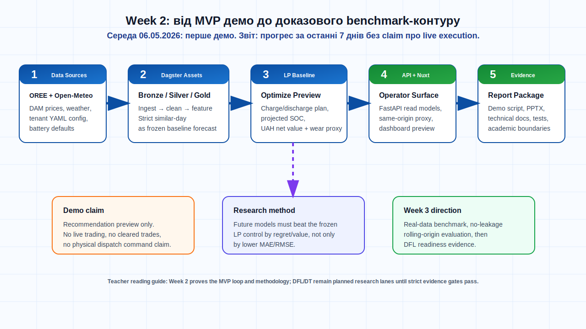

# Week 2: коротка supervisor-facing версія

## 1. Що зроблено за звітний тиждень

За цей тиждень проєкт перейшов від базового MVP до більш зрозумілого supervisor-demo package. Основний результат Week 2 — не повний DFL/DT controller, а стабільний operator-facing контур: tenant-aware weather control, baseline LP recommendation preview, projected SOC, UAH economics і чітка межа між preview та real market execution.

У середу, 06.05.2026, був підготовлений demo-day пакет із newcomer overview presentation, demo script і поясненням архітектури. У звіті я фіксую прогрес саме за Week 2: демо-матеріали вже є в репозиторії, але вони використовуються як артефакти тижня, а не як окремий claim про завершену production-систему.



## 2. Ключовий висновок після демо

Поточну систему найкраще пояснювати як:

```text
Data → Dagster assets → strict_similar_day forecast → LP optimization
     → projected SOC / UAH economics → FastAPI read models → Nuxt dashboard
```

Це вже придатно для першого walkthrough із керівником. Водночас у звіті окремо зафіксовано, що система не виконує live trading, не створює реальні cleared trades і не заявляє deployed Decision Transformer control.

## 3. Академічне обґрунтування

Поточна методологія спирається на такі роботи:

- NBEATSx для electricity price forecasting з exogenous variables: Olivares et al., DOI `10.1016/j.ijforecast.2022.03.001`.
- TFT для interpretable multi-horizon forecasting: Lim et al., DOI `10.1016/j.ijforecast.2021.03.012`.
- Smart Predict-then-Optimize / SPO+: Elmachtoub and Grigas, DOI `10.1287/mnsc.2020.3922`.
- ESS arbitrage DFL: Sang et al., arXiv DOI `10.48550/arXiv.2305.00362`.
- Predict-then-bid framework for strategic energy storage: Yi et al., arXiv DOI `10.48550/arXiv.2505.01551`.

Головний методологічний висновок із цих джерел: для BESS arbitrage недостатньо міряти лише MAE/RMSE прогнозу. Потрібно оцінювати рішення через regret, LP/oracle value, SOC feasibility і degradation-aware net value.

Додаткові джерела з локального архіву `docs/thesis/sources` уточнюють наступний план. DFL survey, ESS arbitrage DFL, multistage DFL, perturbed DFL і Decision Transformer sources показують, що storage arbitrage є intertemporal/SOC-path задачею. Тому наступний крок після Week 2 має бути не "ще один красивий forecast", а no-leakage rolling-origin benchmark і trajectory/value evidence. PriceFM, THieF, TSFM leakage evaluation, GIFT-Eval і fev-bench корисні як майбутній forecast-layer та benchmark context, але не змінюють поточний факт: Week 2 MVP залишається українським OREE/Open-Meteo preview system із frozen LP control.

## 4. Основні ризики

| Ризик | Відповідь |
|---|---|
| Переплутати dashboard preview із real execution | У документах явно зазначено: recommendation preview only |
| Завищити claim про DFL/DT | DFL/DT лишаються research lanes до проходження strict evidence gates |
| Forecast model може виглядати краще за accuracy, але гірше за decision value | Наступні експерименти оцінюються через LP/oracle regret |
| Дані можуть мати coverage gaps | Наступний крок — real-data benchmark і coverage audit |

## 5. План на наступний тиждень

1. Зафіксувати `strict_similar_day` + LP як frozen control comparator.
2. Перейти від demo preview до real-data rolling-origin benchmark.
3. Оцінювати forecast/DFL candidates через regret та net value, а не лише через forecast accuracy.
4. Підготувати Week 3 evidence package для керівника.

## 6. Артефакти

- Повний звіт: [report.md](./report.md)
- Demo script: [demo-script.md](./demo-script.md)
- Demo presentation: [newcomer-overview.pptx](./newcomer-overview.pptx)
- Architecture/data-flow doc: [../../technical/ARCHITECTURE_AND_DATA_FLOW.md](../../../technical/ARCHITECTURE_AND_DATA_FLOW.md)
- Literature source map: [../../technical/papers/README.md](../../../technical/papers/README.md)
