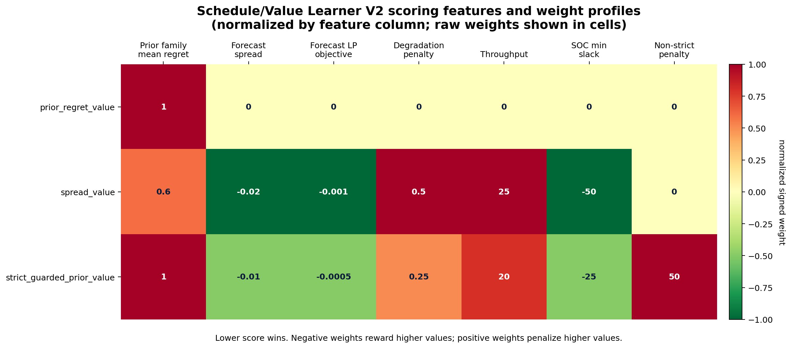
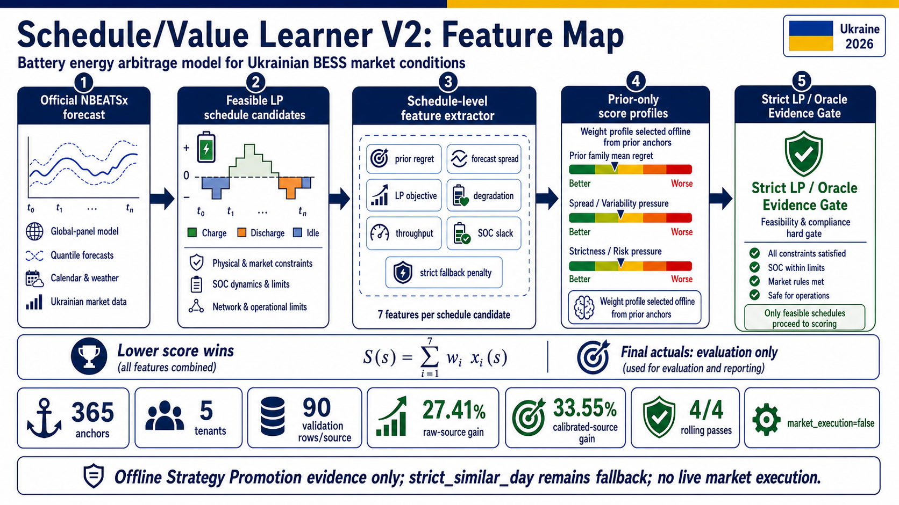

# Schedule/Value Learner V2 Feature Audit

Date: 2026-05-13
Scope: 365-anchor Ukrainian official global-panel Offline Strategy Promotion evidence
Claim boundary: offline/read-model strategy evidence only; `market_execution=false`; `strict_similar_day` remains fallback.

## Evidence Result Being Explained

Source evidence:

- registry: `data/research_runs/week3_official_global_panel_365_strategy_promotion/dfl_schedule_value_production_gate_registry.json`;
- technical doc: `docs/technical/OFFICIAL_GLOBAL_PANEL_NBEATSX.md`;
- selector implementation: `src/smart_arbitrage/dfl/schedule_value_learner.py`;
- candidate-library v2 implementation: `src/smart_arbitrage/dfl/strict_challenger.py`.

365-anchor gate result:

| Source | Strict mean regret UAH | Learner mean regret UAH | Improvement vs strict | Rolling strict passes | Promotion state |
|---|---:|---:|---:|---:|---|
| `nbeatsx_official_global_panel_v1` | 310.583 | 225.437 | 27.41% | 4 / 4 | Offline Strategy Promotion |
| `nbeatsx_official_global_panel_horizon_calibrated_v1` | 310.583 | 206.367 | 33.55% | 4 / 4 | Offline Strategy Promotion |

This is not raw NBEATSx forecast superiority. Raw official forecasts still lost over the 365-anchor panel. The improvement came from the Schedule/Value Learner V2 choosing among feasible LP-scored schedule candidates.

## Direct Scoring Features

The learner scores one candidate schedule per tenant/source/anchor. Lower score wins. The exact scoring formula is implemented in `src/smart_arbitrage/dfl/schedule_value_learner.py`:

```text
score =
  w_prior_regret * prior_family_mean_regret_uah
+ w_spread * forecast_spread_uah_mwh
+ w_objective * forecast_objective_value_uah
+ w_degradation * total_degradation_penalty_uah
+ w_throughput * total_throughput_mwh
+ w_soc_slack * soc_min_slack_fraction
+ non_strict_penalty_uah if candidate_family != strict_control
```

| Feature / signal | Source column or derived signal | What it means in plain language | Used for selection? | Leakage status |
|---|---|---|---|---|
| Prior family regret | `prior_family_mean_regret_uah` | How much this candidate family tended to lose on prior train-selection anchors. | Yes | Prior-only train-selection statistic. |
| Forecast spread | `forecast_spread_uah_mwh` | The predicted arbitrage opportunity between low and high price hours. | Yes | Derived from candidate forecast vector before final scoring. |
| Forecast LP objective | `forecast_objective_value_uah` | The LP objective value implied by the forecasted schedule. | Yes | Forecast-side value, not final actual profit. |
| Degradation penalty | `total_degradation_penalty_uah` | Economic proxy for battery wear induced by the candidate schedule. | Yes | Derived from feasible schedule. |
| Throughput | `total_throughput_mwh` | How much energy the schedule cycles through the battery. | Yes | Derived from feasible schedule. |
| SOC slack | `soc_min_slack_fraction` | How much margin the schedule leaves from SOC bounds. | Yes | Derived from SOC vector, not final actuals. |
| Strict fallback penalty | `non_strict_penalty_uah` when `candidate_family != strict_control` | A guardrail that makes non-strict candidates prove enough value before displacing the strict fallback. | Yes | Deterministic from candidate family. |
| Candidate family tie-break | `candidate_family`, `candidate_model_name` | Deterministic tie-breaking when scores are equal. | Yes, only as tie-break | Not a learned signal. |

## Weight Profiles Considered

The learner does not train a large neural model here. It selects one deterministic scoring profile using train-selection anchors only, then applies that selected profile to final holdout. The candidate profiles are:

| Weight profile | Prior regret | Forecast spread | Forecast LP objective | Degradation | Throughput | SOC slack | Non-strict penalty |
|---|---:|---:|---:|---:|---:|---:|---:|
| `prior_regret_value` | 1.0 | 0.0 | 0.0 | 0.0 | 0.0 | 0.0 | 0.0 |
| `spread_value` | 0.6 | -0.02 | -0.001 | 0.5 | 25.0 | -50.0 | 0.0 |
| `strict_guarded_prior_value` | 1.0 | -0.01 | -0.0005 | 0.25 | 20.0 | -25.0 | 50.0 |

Interpretation:

- Positive weights penalize larger values.
- Negative weights reward larger values because lower score wins.
- `strict_guarded_prior_value` explicitly penalizes non-strict candidates unless their other schedule-value features compensate.

Graph:



## Candidate Families Ranked By These Features

The V2 learner ranked feasible schedules, not raw forecasts. The official 365-anchor path used a candidate library with:

| Candidate family | How it is produced | Why it matters |
|---|---|---|
| `strict_control` | Frozen `strict_similar_day` forecast plus LP dispatch | Default fallback and control comparator. |
| `raw_source` | Raw official global-panel NBEATSx forecast plus LP dispatch | Tests whether the official forecast can create a better schedule. |
| Forecast perturbations | Deterministic spread/shift perturbations of the source forecast | Adds nearby schedule alternatives without using final actuals. |
| `strict_raw_blend_v2` | Prior-only blends between strict and raw forecast vectors | Lets the learner choose partial neural influence instead of all-or-nothing replacement. |
| `strict_prior_residual_v2` | Strict forecast plus prior residual vector after enough prior anchors | Adds learned prior correction without final-holdout leakage. |

## What Was Not A Direct V2 Scoring Feature

These signals existed in the system, but they were not direct Schedule/Value Learner V2 scoring columns:

| Signal | Status |
|---|---|
| Final-holdout actual prices | Used for final strict LP/oracle evaluation only, not for selecting profiles. |
| Oracle value and regret | Used as labels/evaluation metrics; train-selection regret is allowed for profile selection, final regret is not. |
| Weather/load context | Used upstream in official forecast/context layers and audits, but not directly in the V2 schedule score formula. |
| ENTSO-E / OPSD / Ember / Nord Pool / PriceFM / THieF | Not in training or promoted result; governance route only. |
| Decision Transformer state/action tokens | Not used in this result. |

## Important Export Note

The current 365-anchor registry export preserves the gate result, promoted sources, validation counts, rolling passes, and claim boundary. It now also attaches the compact learner trace:

- `data/research_runs/week3_official_global_panel_365_strategy_promotion/dfl_schedule_value_learner_v2_trace_summary.json`;
- `data/research_runs/week3_official_global_panel_365_strategy_promotion/dfl_schedule_value_learner_v2_trace_summary.md`;
- source frame: `dfl_official_global_panel_schedule_value_learner_v2_frame.pkl`.

This trace records the exact selected profile per tenant/source and the final-holdout selected family counts without changing the promotion decision.

## Should This Become Automatic Feature Selection?

Yes, but not by rewriting the current evidence claim. The current V2 result is valuable because it is simple and auditable: fixed weight profiles are selected offline from prior anchors, and final-holdout actuals score decisions only.

The next clean upgrade should be an additive V3 experiment:

1. keep V2 as the frozen interpretable reference;
2. keep exporting the selected learner profile per tenant/source into the evidence packet;
3. expand the candidate profile grid over the same prior-only features;
4. optionally add a small regularized linear ranker over schedule features;
5. use nested rolling windows so feature/weight selection never sees final holdout;
6. promote only if the strict LP/oracle gate still beats `strict_similar_day` by the existing threshold.

This would be closer to automatic feature selection while preserving the no-leakage promotion discipline.

## Presentation Infographic


